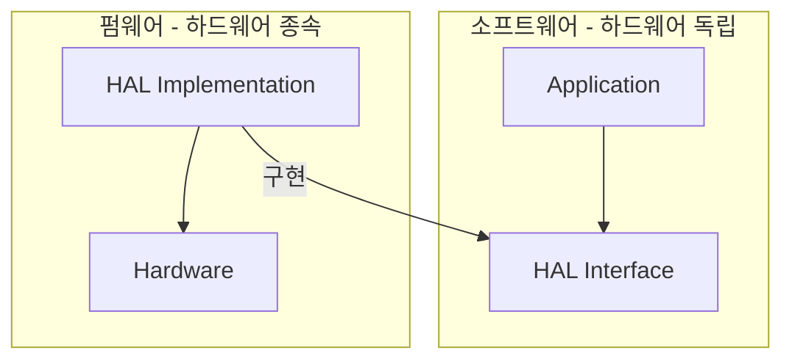

임베디드 소프트웨어는 **하드웨어와 밀접**하다. 그러나 Clean Architecture의 원칙은 임베디드에도 적용된다. 핵심은 **하드웨어에서 소프트웨어를 분리**하는 것이다.

## 임베디드의 특수성

임베디드 소프트웨어는:
- 특정 **하드웨어에 종속**
- **리소스 제약** (메모리, CPU)
- **실시간 요구사항**

하지만 이것이 **나쁜 구조**의 변명이 되어선 안 된다.

## 펌웨어 vs 소프트웨어

| 구분 | 펌웨어 | 소프트웨어 |
|------|--------|-----------|
| 의존성 | 하드웨어에 종속 | 하드웨어 독립 |
| 테스트 | 타겟에서만 가능 | PC에서 테스트 가능 |
| 이식성 | 낮음 | 높음 |

목표: **펌웨어를 최소화**, 소프트웨어를 최대화.

## HAL (Hardware Abstraction Layer)



```c
// HAL 인터페이스
typedef struct {
    void (*led_on)(void);
    void (*led_off)(void);
    bool (*button_pressed)(void);
} HardwareAPI;

// 애플리케이션 - HAL 사용
void app_main(HardwareAPI* hw) {
    if (hw->button_pressed()) {
        hw->led_on();
    }
}
```

## 오프 타겟 테스팅

HAL 덕분에 **PC에서 테스트**:

```c
// 테스트용 HAL 구현
bool test_button_state = false;
bool led_state = false;

void test_led_on() { led_state = true; }
void test_led_off() { led_state = false; }
bool test_button() { return test_button_state; }

void test_app() {
    HardwareAPI hw = { test_led_on, test_led_off, test_button };
    
    test_button_state = true;
    app_main(&hw);
    
    assert(led_state == true);  // PC에서 실행!
}
```

## OSAL (OS Abstraction Layer)

OS도 추상화:

```c
// OSAL 인터페이스
typedef struct {
    void (*delay_ms)(uint32_t ms);
    void (*create_task)(void (*func)(void*), void* arg);
    void (*mutex_lock)(Mutex* m);
} OSAL;
```

## 핵심

> "임베디드 소프트웨어도 Clean Architecture를 적용할 수 있다. HAL과 OSAL로 하드웨어와 OS를 추상화하고, 비즈니스 로직을 독립시켜라."
