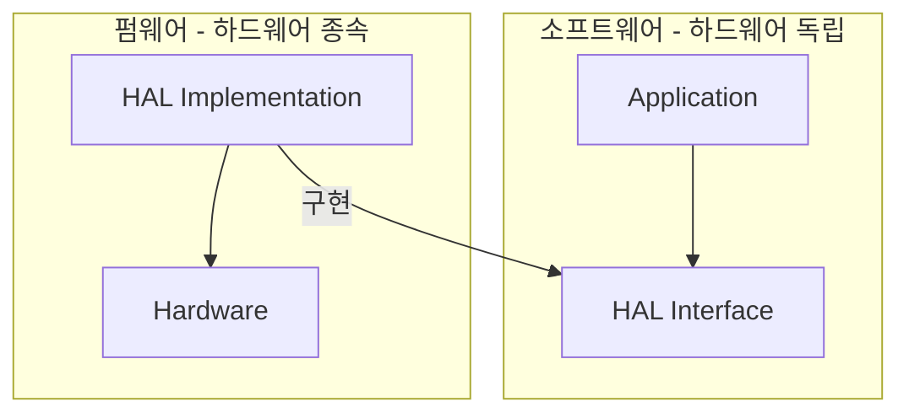

임베디드 소프트웨어는 **하드웨어와 밀접**하다. 그러나 Clean Architecture의 원칙은 임베디드에도 똑같이 적용된다. 핵심은 **하드웨어에서 소프트웨어를 분리**하는 것이다.

> "Although software does not wear out, firmware and hardware become obsolete, thereby requiring software modifications."
> — James Grenning, 『Clean Architecture』(로버트 C. 마틴 편, 2017), 29장

이 장은 마틴이 아니라 임베디드 애자일의 개척자 James Grenning이 초청 필자로 쓴 챕터다. 소프트웨어 자체는 마모되지 않지만, 그 소프트웨어가 특정 하드웨어에 대한 지식과 뒤섞여 있으면 하드웨어가 세대교체될 때마다 소프트웨어까지 함께 폐기해야 한다. 그레닝이 이 장에서 말하는 목표는, 하드웨어가 바뀌어도 살아남을 수 있도록 소프트웨어를 하드웨어 지식으로부터 미리 격리해 두는 것이다.

## 임베디드의 특수성

임베디드 소프트웨어는 일반 애플리케이션과 세 가지 점에서 다르다. 첫째, 특정 하드웨어에 종속된다 — 어떤 마이크로컨트롤러의 레지스터 배치, 어떤 센서의 통신 프로토콜을 직접 다룬다. 둘째, 메모리·CPU 같은 리소스 제약이 훨씬 엄격하다 — PC 애플리케이션이라면 신경 쓰지 않을 바이트 단위의 절약이 필요할 수 있다. 셋째, 정해진 시간 안에 반응해야 하는 실시간 요구사항이 있다. 하지만 이 세 가지 특수성은 코드를 **잘 구조화하지 않아도 되는 이유**가 되지 못한다. 오히려 리소스가 빠듯할수록, 하드웨어 지식이 코드 전체에 흩어져 있을 때 치르는 대가(변경 시 손대야 할 범위, 다른 하드웨어로 이식하는 비용)가 더 커진다.

이 장에서 그레닝이 지적하는 임베디드 개발의 고질적인 문제는 <strong>타겟-하드웨어 병목(Target-Hardware Bottleneck)</strong>이다 — 코드를 검증하려면 실제 타겟 하드웨어(또는 그 하드웨어의 시뮬레이터)가 있어야만 하는 상황이다. 개발 보드가 부족하거나, 하드웨어가 아직 완성되지 않았거나, 하드웨어 한 대에서 여러 개발자가 순서를 기다려야 한다면, 이 병목이 곧바로 개발 속도의 한계가 된다.

## 펌웨어 vs 소프트웨어

그레닝은 이 문제를 풀기 위해 **펌웨어**와 **소프트웨어**를 명확히 구분한다. 여기서 펌웨어란 특정 저장 위치(플래시 메모리 등)에 있는 코드를 뜻하는 것이 아니라, **하드웨어에 얼마나 의존하며 하드웨어가 바뀔 때 얼마나 고치기 어려운가**로 정의되는 코드다.

| 구분 | 펌웨어 | 소프트웨어 |
|------|--------|-----------|
| 의존성 | 하드웨어에 종속 | 하드웨어 독립 |
| 테스트 | 타겟에서만 가능 | PC에서 테스트 가능 |
| 이식성 | 낮음 | 높음 |

목표는 **펌웨어를 최소화**하고 소프트웨어를 최대화하는 것이다. 애플리케이션의 핵심 로직(언제 LED를 켤지, 어떤 조건에서 경보를 울릴지)을 하드웨어와 무관한 소프트웨어로 남겨두고, 실제 레지스터를 건드리는 코드만 얇은 펌웨어 계층으로 좁혀야, 하드웨어가 바뀌어도 펌웨어 계층만 다시 쓰면 된다.

## HAL (Hardware Abstraction Layer)


```mermaid
flowchart TB
    subgraph Software [소프트웨어 - 하드웨어 독립]
        APP[Application]
        HAL_I[HAL Interface]
        APP --> HAL_I
    end
    
    subgraph Firmware [펌웨어 - 하드웨어 종속]
        HAL_IMPL[HAL Implementation]
        HW[Hardware]
        HAL_IMPL --> HW
    end
    
    HAL_IMPL -->|구현| HAL_I
```

HAL(Hardware Abstraction Layer)은 이 분리를 코드로 구현하는 가장 직접적인 방법이다. 애플리케이션은 `HardwareAPI`라는 함수 포인터 구조체(인터페이스 역할)만 알고, 실제로 GPIO 레지스터를 읽고 쓰는 코드는 그 구조체를 채우는 펌웨어 쪽에만 존재한다:

```c
#include <stdbool.h>

// HAL 인터페이스
typedef struct {
    void (*led_on)(void);
    void (*led_off)(void);
    bool (*button_pressed)(void);
} HardwareAPI;

// 애플리케이션 - HAL 사용
void app_main(HardwareAPI* hw) {
    if (hw->button_pressed()) {
        hw->led_on();
    }
}
```

## 오프 타겟 테스팅

`app_main()`은 `HardwareAPI` 구조체의 함수 포인터를 호출할 뿐, 실제 하드웨어 레지스터 이름을 단 한 곳도 알지 못한다. 따라서 실제 보드 대신 메모리 변수 몇 개로 만든 가짜 구현을 넣어주면, 타겟-하드웨어 병목 없이 **PC에서 곧바로 테스트**할 수 있다:

```c
#include <stdbool.h>
#include <assert.h>

// 이 블록만으로도 컴파일되도록 HardwareAPI/app_main을 다시 선언한다(실제 프로젝트에서는 공용 헤더로 분리)
typedef struct {
    void (*led_on)(void);
    void (*led_off)(void);
    bool (*button_pressed)(void);
} HardwareAPI;

void app_main(HardwareAPI* hw) {
    if (hw->button_pressed()) {
        hw->led_on();
    }
}

// 테스트용 HAL 구현
bool test_button_state = false;
bool led_state = false;

void test_led_on(void) { led_state = true; }
void test_led_off(void) { led_state = false; }
bool test_button(void) { return test_button_state; }

void test_app(void) {
    HardwareAPI hw = { test_led_on, test_led_off, test_button };

    test_button_state = true;
    app_main(&hw);

    assert(led_state == true);  // PC에서 실행!
}
```

## OSAL (OS Abstraction Layer)

HAL이 하드웨어를 감춘다면, OSAL(OS Abstraction Layer)은 그 위에서 실행되는 RTOS(실시간 운영체제)를 감춘다. 임베디드 프로젝트는 개발 초기에 FreeRTOS를 쓰다가 나중에 다른 RTOS로 옮기거나, 테스트 환경에서는 아예 OS 없이 실행해야 하는 경우가 흔하다. 애플리케이션 코드가 특정 RTOS의 API(`vTaskDelay`, `xSemaphoreTake` 같은 함수명)를 직접 호출한다면, 그 이식은 애플리케이션 코드 전체를 다시 써야 하는 작업이 된다:

```c
#include <stdint.h>

typedef struct Mutex Mutex;

// OSAL 인터페이스
typedef struct {
    void (*delay_ms)(uint32_t ms);
    void (*create_task)(void (*func)(void*), void* arg);
    void (*mutex_lock)(Mutex* m);
    void (*mutex_unlock)(Mutex* m);
} OSAL;

// 애플리케이션 - OSAL만 알고 특정 RTOS는 모름
void sensor_task(void* arg) {
    OSAL* os = (OSAL*)arg;
    while (1) {
        os->delay_ms(100);
        // 센서 값을 읽고 처리하는 로직(하드웨어 무관)
    }
}
```

`sensor_task()`는 FreeRTOS인지 Zephyr인지, 심지어 OS가 아예 없는 베어메탈 환경인지 알지 못한다. `OSAL` 구조체를 어떤 RTOS로 채워 넣을지는 펌웨어 쪽의 결정일 뿐이다.

## 흔한 오해

"임베디드는 리소스가 부족하니 추상화를 포기해야 한다"는 것이 가장 흔한 오해다. 함수 포인터 구조체(`HardwareAPI`, `OSAL`) 하나를 두는 비용은 몇 바이트의 포인터 배열에 불과하며, 실시간 요구사항을 위협할 만큼의 오버헤드가 아니다. 오히려 하드웨어 지식이 코드 곳곳에 흩어져 있으면, 리소스가 빠듯한 상황에서 최적화나 디버깅을 할 때마다 그 흩어진 지식을 다시 추적해야 하는 비용이 더 크다. 또 다른 오해는 "펌웨어"를 저장 위치(플래시 메모리 등)로 정의하는 것이다. 이 장에서 펌웨어는 위치가 아니라 **하드웨어에 대한 의존도**로 정의된다 — RAM에서 실행되더라도 특정 레지스터 이름을 직접 참조하는 코드라면 여전히 펌웨어다.

## 학습 목표

이 장을 읽은 후 다음을 스스로 점검한다.

- "펌웨어"가 저장 위치가 아니라 하드웨어 의존도로 정의된다는 것을 설명할 수 있는가?
- 타겟-하드웨어 병목이 무엇이며, HAL이 그 병목을 어떻게 우회하게 해주는지 설명할 수 있는가?
- HAL과 OSAL이 각각 무엇을 추상화하는지, 그리고 왜 둘을 분리해야 하는지 설명할 수 있는가?
- `app_main()`이 실제 보드 없이 PC에서 테스트될 수 있는 이유를 `HardwareAPI` 구조체와 연결해 설명할 수 있는가?

## 판단 기준

임베디드 코드를 어느 계층에 둘지 판단할 때 다음을 확인한다.

- 이 코드가 특정 레지스터 주소·핀 번호·통신 프로토콜을 직접 언급하는가? 그렇다면 펌웨어(HAL 뒤)에 둔다.
- 이 코드가 특정 RTOS의 API를 직접 호출하는가? 그렇다면 OSAL 뒤로 감출 후보다.
- 이 로직을 실제 보드 없이 PC에서 테스트할 수 있는가? 없다면 하드웨어 지식이 아직 새어 나오고 있다는 신호다.

## 참고 자료

- James Grenning, 『Clean Architecture』(로버트 C. 마틴 편, 2017), 29장 — 타겟-하드웨어 병목, HAL·OSAL을 통한 하드웨어·OS 분리의 원출처.

## 핵심 요약

| 원칙 | 설명 |
|------|------|
| 목표 | 펌웨어 최소화, 소프트웨어 최대화 |
| HAL | 하드웨어를 추상화하는 인터페이스 |
| OSAL | RTOS를 추상화하는 인터페이스 |
| 이점 | 타겟-하드웨어 병목 없이 PC에서 테스트 가능 |

HAL·OSAL은 결국 [19장: 의존성 역전 원칙](/post/clean-architecture/dip-dependency-inversion-principle/)을 임베디드 환경에 그대로 적용한 것이다 — 애플리케이션은 `HardwareAPI`/`OSAL`이라는 추상 인터페이스에 의존하고, 실제 레지스터를 건드리는 저수준 구현이 그 인터페이스를 구현하는 방향으로 의존성이 역전된다. 오프 타겟 테스팅 역시 [38장: 테스트 경계](/post/clean-architecture/test-boundary-testing-as-system-part/)에서 다룬 "테스트는 시스템에 의존하지만 시스템은 테스트에 의존하지 않는다"는 원칙이 임베디드에서 구체화된 사례다 — `test_app()`은 `HardwareAPI`에 의존하지만, `app_main()`은 그 테스트의 존재를 전혀 모른다.
