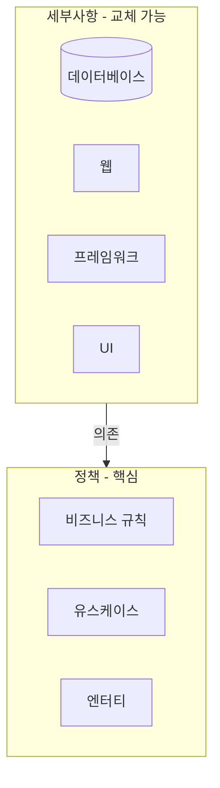
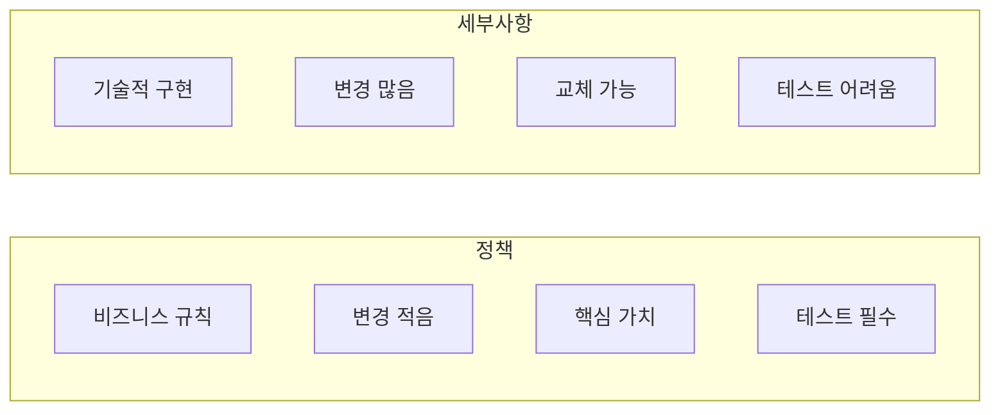
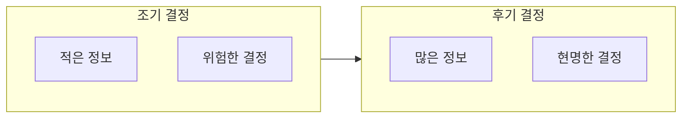
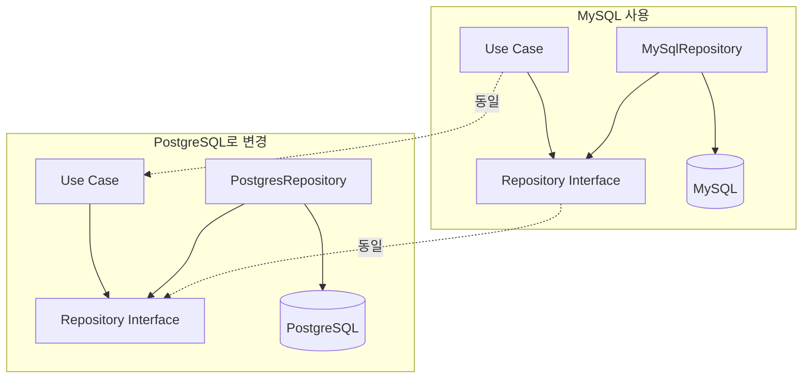
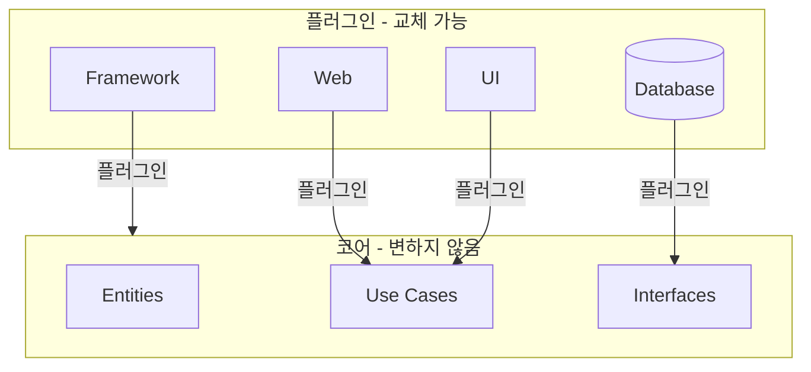
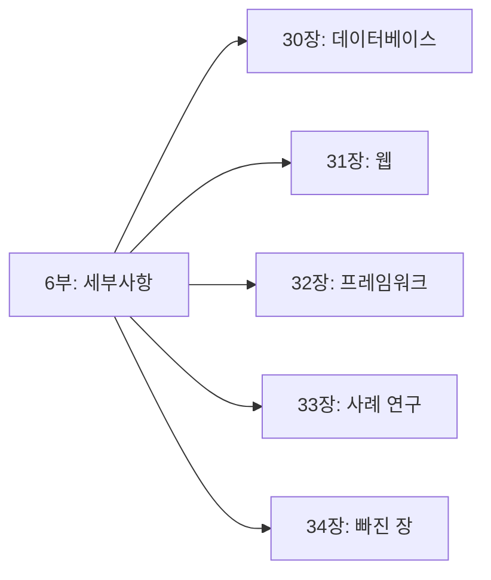
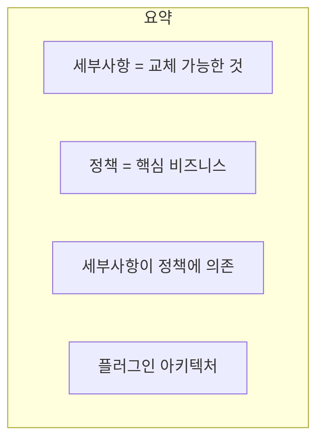

지금까지 아키텍처의 핵심 원칙들을 다루었다. 이제 **세부사항(Details)**을 살펴본다. 세부사항은 아키텍처에서 **교체 가능한** 부분들이다.

## 세부사항이란?

> **"세부사항은 정책(비즈니스 규칙)이 전혀 신경 쓰지 않아도 되는 것들이다."**
> — Robert C. Martin



### 세부사항의 예

| 카테고리 | 세부사항 예시 |
|----------|-------------|
| 데이터베이스 | MySQL, PostgreSQL, MongoDB, Redis |
| 웹 | HTTP, REST, GraphQL, gRPC |
| 프레임워크 | Spring, Django, Rails, Express |
| UI | React, Angular, Vue, Svelte |
| 메시징 | Kafka, RabbitMQ, SQS |
| 인프라 | AWS, GCP, Azure, Docker |

```java
// 세부사항의 예
// 비즈니스 규칙은 이것들을 모름
public class OrderService {
    // MySQL인지 MongoDB인지 모름
    private final OrderRepository repository;
    
    // HTTP인지 gRPC인지 모름
    // React인지 Angular인지 모름
    
    public Order processOrder(OrderRequest request) {
        // 순수한 비즈니스 로직만
        Order order = Order.create(request);
        order.validate();
        return repository.save(order);
    }
}
```

## 정책 vs 세부사항



| 구분 | 정책 | 세부사항 |
|------|------|----------|
| 정의 | 비즈니스 규칙 | 기술적 구현 |
| 변경 빈도 | 적음 | 많음 |
| 가치 | 핵심 | 교체 가능 |
| 테스트 | 필수, 쉬움 | 어려움 |
| 의존성 | 아무것도 의존 안 함 | 정책에 의존 |

### 비즈니스 규칙 예시

```java
// 정책: 할인 규칙 (비즈니스 규칙)
public class DiscountPolicy {
    public BigDecimal calculateDiscount(Order order) {
        // 비즈니스 규칙: 10개 이상 구매 시 10% 할인
        if (order.getItemCount() >= 10) {
            return order.getSubtotal()
                .multiply(new BigDecimal("0.10"));
        }
        return BigDecimal.ZERO;
    }
}

// 이 규칙은:
// - MySQL에서 실행되든 MongoDB에서 실행되든 상관없다
// - 웹에서 호출되든 CLI에서 호출되든 상관없다
// - Spring에서 실행되든 Django에서 실행되든 상관없다
```

## 왜 세부사항을 분리하는가?

### 1. 결정 지연 (Deferring Decisions)

세부사항이 분리되면 **기술 선택을 나중에** 할 수 있다.



```java
// 초기: DB 선택 없이 개발
public interface OrderRepository {
    void save(Order order);
    Optional<Order> findById(Long id);
}

// 개발 중: 인메모리로 테스트
public class InMemoryOrderRepository implements OrderRepository {
    private final Map<Long, Order> storage = new HashMap<>();
    // ...
}

// 나중에: 실제 DB 선택
public class MySqlOrderRepository implements OrderRepository {
    // MySQL 구현
}

// 또는
public class MongoOrderRepository implements OrderRepository {
    // MongoDB 구현
}
```

### 2. 테스트 용이성

```java
// 세부사항(DB) 없이 테스트
@Test
void shouldCalculateOrderTotal() {
    // DB 없음!
    Order order = new Order();
    order.addItem(new Item("상품A", 100, 2));
    order.addItem(new Item("상품B", 200, 1));
    
    assertThat(order.getTotal()).isEqualTo(400);
    // DB 연결 없이 밀리초 만에 테스트 완료!
}

@Test
void shouldApplyDiscountForBulkOrders() {
    // 웹 서버 없음! DB 없음!
    DiscountPolicy policy = new DiscountPolicy();
    Order order = createOrderWithItems(15);  // 15개 아이템
    
    BigDecimal discount = policy.calculateDiscount(order);
    
    assertThat(discount).isGreaterThan(BigDecimal.ZERO);
}
```

### 3. 기술 변경 유연성



비즈니스 규칙(Use Case)은 **그대로**. 구현체만 교체.

## 플러그인 아키텍처

세부사항을 분리하면 **플러그인 아키텍처**가 된다.



```java
// 플러그인처럼 교체 가능한 세부사항
public class Application {
    public static void main(String[] args) {
        // 플러그인 선택
        OrderRepository repo = selectRepository(args);
        PaymentGateway payment = selectPaymentGateway(args);
        NotificationService notification = selectNotification(args);
        
        // 코어에 플러그인 주입
        OrderService service = new OrderService(repo, payment, notification);
        
        // 실행
        new WebServer(service).start();
    }
    
    static OrderRepository selectRepository(String[] args) {
        String type = args[0];
        return switch (type) {
            case "mysql" -> new MySqlOrderRepository();
            case "postgres" -> new PostgresOrderRepository();
            case "mongo" -> new MongoOrderRepository();
            default -> new InMemoryOrderRepository();
        };
    }
}
```

## 이 파트에서 다룰 내용



| 장 | 제목 | 핵심 내용 |
|----|------|----------|
| 30장 | 데이터베이스는 세부사항이다 | 관계형 DB의 역사, 디스크와 RAM |
| 31장 | 웹은 세부사항이다 | GUI의 진자 운동, 클라이언트-서버 |
| 32장 | 프레임워크는 세부사항이다 | 프레임워크와 결혼의 위험 |
| 33장 | 사례 연구 | 비디오 판매 시스템 실제 설계 |
| 34장 | 빠져 있는 장 | 패키지 구조 접근법 |

## 핵심 요약



| 원칙 | 설명 |
|------|------|
| 세부사항의 정의 | 정책이 신경 쓰지 않아도 되는 것 |
| 의존성 방향 | 세부사항 → 정책 |
| 이점 | 결정 지연, 테스트 용이성, 기술 변경 유연성 |
| 결과 | 플러그인 아키텍처 |

> **"세부사항을 분리하면, 정책이 세부사항에 의존하지 않는다. 세부사항이 정책에 의존한다. 이것이 플러그인 아키텍처다."**
> — Robert C. Martin
