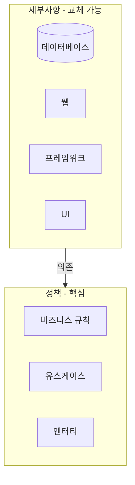
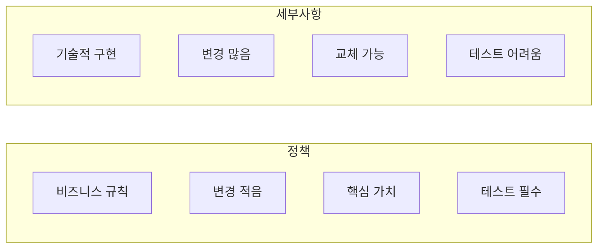
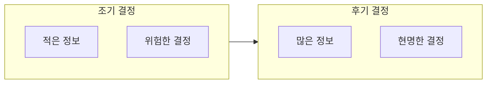
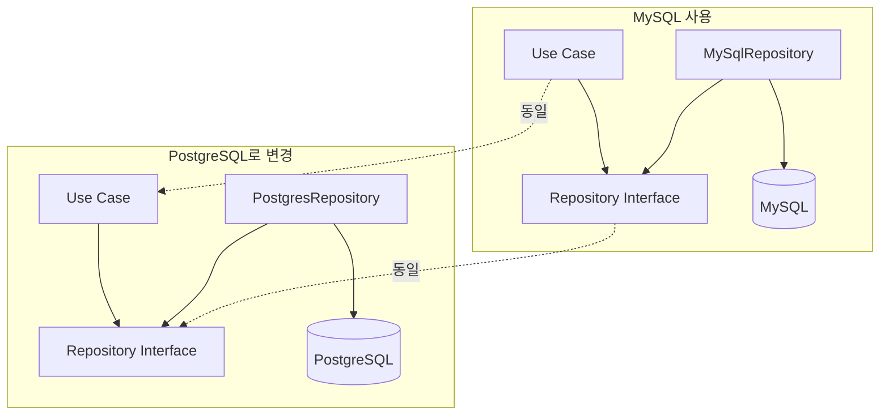
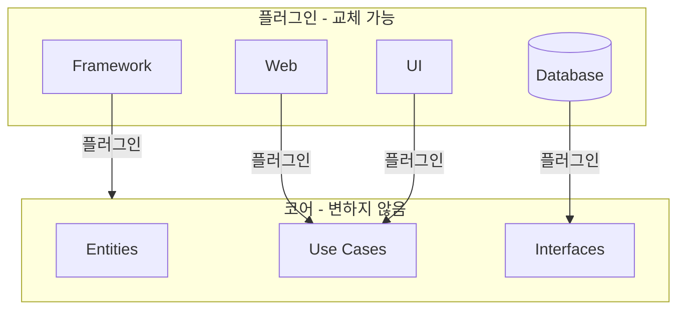
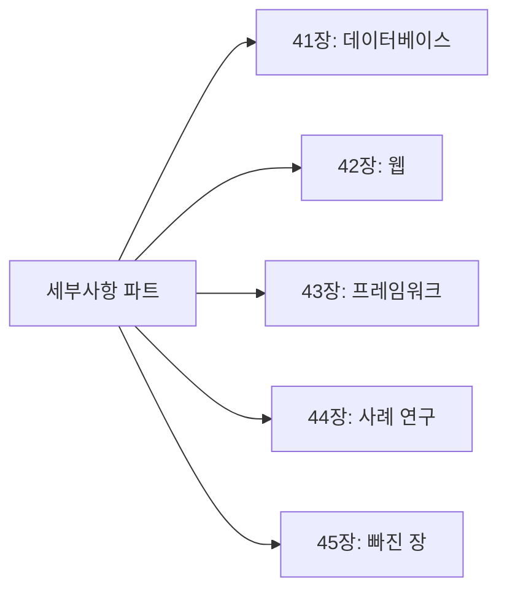
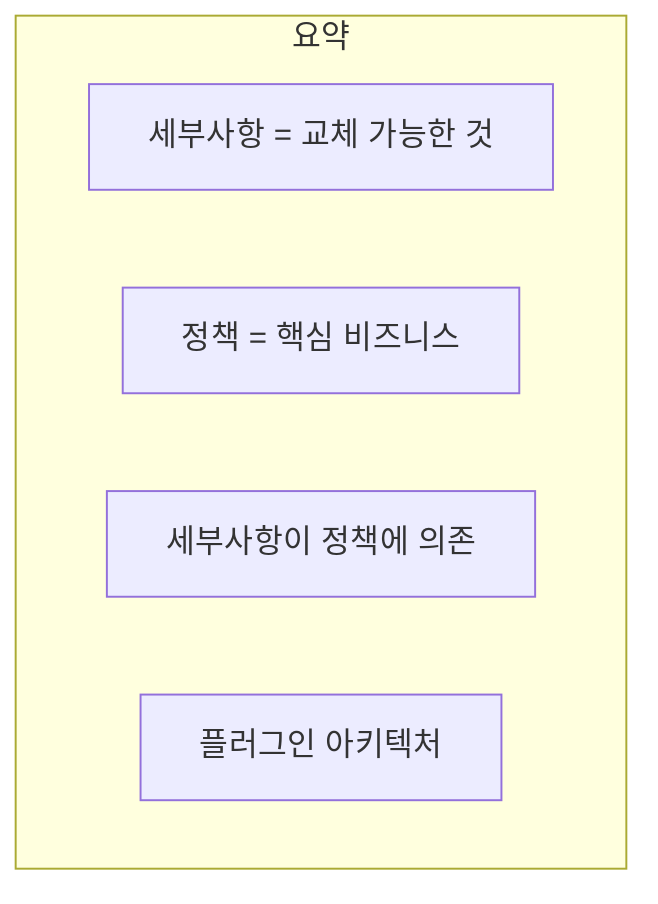

지금까지 아키텍처의 핵심 원칙들을 다루었다. 이제 **세부사항(Details)**을 살펴본다. 세부사항은 아키텍처에서 **교체 가능한** 부분들이다.

## 세부사항이란?

> "Details are the things that are necessary to implement the policy but are otherwise irrelevant to the policy itself: the database, the web server, the delivery mechanism, the framework."
> — Robert C. Martin, 『Clean Architecture』(2017)


```mermaid
flowchart TB
    subgraph Policy [정책 - 핵심]
        BR[비즈니스 규칙]
        UC[유스케이스]
        ENT[엔터티]
    end
    
    subgraph Details [세부사항 - 교체 가능]
        DB[(데이터베이스)]
        WEB[웹]
        FW[프레임워크]
        UI[UI]
    end
    
    Details -->|의존| Policy
```

### 세부사항의 예

| 카테고리 | 세부사항 예시 |
|----------|-------------|
| 데이터베이스 | MySQL, PostgreSQL, MongoDB, Redis |
| 웹 | HTTP, REST, GraphQL, gRPC |
| 프레임워크 | Spring, Django, Rails, Express |
| UI | React, Angular, Vue, Svelte |
| 메시징 | Kafka, RabbitMQ, SQS |
| 인프라 | AWS, GCP, Azure, Docker |

```java
import java.util.List;
import java.util.Optional;

class OrderRequest { List<Item> items; }
class Item { String name; int price; int quantity; }
class Order {
    private final List<Item> items;
    private Order(List<Item> items) { this.items = items; }
    static Order create(OrderRequest request) { return new Order(request.items); }
    void validate() { /* 필수 필드 검증 등 순수 비즈니스 규칙 */ }
}
interface OrderRepository {
    void save(Order order);
    Optional<Order> findById(Long id);
}

// 세부사항의 예
// 비즈니스 규칙은 이것들을 모름
public class OrderService {
    // MySQL인지 MongoDB인지 모름
    private final OrderRepository repository;

    // HTTP인지 gRPC인지 모름
    // React인지 Angular인지 모름

    public OrderService(OrderRepository repository) { this.repository = repository; }

    public Order processOrder(OrderRequest request) {
        // 순수한 비즈니스 로직만
        Order order = Order.create(request);
        order.validate();
        repository.save(order);
        return order;
    }
}
```

## 정책 vs 세부사항


```mermaid
flowchart LR
    subgraph Policy [정책]
        direction TB
        P1[비즈니스 규칙]
        P2[변경 적음]
        P3[핵심 가치]
        P4[테스트 필수]
    end
    
    subgraph Details [세부사항]
        direction TB
        D1[기술적 구현]
        D2[변경 많음]
        D3[교체 가능]
        D4[테스트 어려움]
    end
```

| 구분 | 정책 | 세부사항 |
|------|------|----------|
| 정의 | 비즈니스 규칙 | 기술적 구현 |
| 변경 빈도 | 적음 | 많음 |
| 가치 | 핵심 | 교체 가능 |
| 테스트 | 필수, 쉬움 | 어려움 |
| 의존성 | 아무것도 의존 안 함 | 정책에 의존 |

### 비즈니스 규칙 예시

```java
import java.math.BigDecimal;
import java.util.List;

class Order {
    private final List<Item> items;
    Order(List<Item> items) { this.items = items; }
    int getItemCount() { return items.stream().mapToInt(i -> i.quantity).sum(); }
    BigDecimal getSubtotal() {
        return items.stream()
            .map(i -> BigDecimal.valueOf(i.price).multiply(BigDecimal.valueOf(i.quantity)))
            .reduce(BigDecimal.ZERO, BigDecimal::add);
    }
}
class Item {
    int price; int quantity;
    Item(String name, int price, int quantity) { this.price = price; this.quantity = quantity; }
}

// 정책: 할인 규칙 (비즈니스 규칙)
public class DiscountPolicy {
    public BigDecimal calculateDiscount(Order order) {
        // 비즈니스 규칙: 10개 이상 구매 시 10% 할인
        if (order.getItemCount() >= 10) {
            return order.getSubtotal()
                .multiply(new BigDecimal("0.10"));
        }
        return BigDecimal.ZERO;
    }
}

// 이 규칙은:
// - MySQL에서 실행되든 MongoDB에서 실행되든 상관없다
// - 웹에서 호출되든 CLI에서 호출되든 상관없다
// - Spring에서 실행되든 Django에서 실행되든 상관없다
```

## 왜 세부사항을 분리하는가?

### 1. 결정 지연 (Deferring Decisions)

세부사항이 분리되면 **기술 선택을 나중에** 할 수 있다.


```mermaid
flowchart LR
    subgraph Early [조기 결정]
        E1[적은 정보]
        E2[위험한 결정]
    end
    
    subgraph Late [후기 결정]
        L1[많은 정보]
        L2[현명한 결정]
    end
    
    Early --> Late
```

```java
import java.util.Map;
import java.util.HashMap;
import java.util.Optional;

class Order {}

// 초기: DB 선택 없이 개발
interface OrderRepository {
    void save(Order order);
    Optional<Order> findById(Long id);
}

// 개발 중: 인메모리로 테스트
public class InMemoryOrderRepository implements OrderRepository {
    private final Map<Long, Order> storage = new HashMap<>();
    public void save(Order order) { storage.put(1L, order); }
    public Optional<Order> findById(Long id) { return Optional.ofNullable(storage.get(id)); }
}
```

```java
import java.util.Optional;

class Order {}
interface OrderRepository {
    void save(Order order);
    Optional<Order> findById(Long id);
}

// 나중에: 실제 DB 선택
class MySqlOrderRepository implements OrderRepository {
    // MySQL 구현
    public void save(Order order) { /* JDBC/JPA로 저장 */ }
    public Optional<Order> findById(Long id) { return Optional.empty(); }
}

// 또는
class MongoOrderRepository implements OrderRepository {
    // MongoDB 구현
    public void save(Order order) { /* MongoDB 드라이버로 저장 */ }
    public Optional<Order> findById(Long id) { return Optional.empty(); }
}
```

### 2. 테스트 용이성

```java
import java.math.BigDecimal;
import java.util.ArrayList;
import java.util.List;
import org.junit.jupiter.api.Test;
import static org.assertj.core.api.Assertions.assertThat;

class Item {
    int price; int quantity;
    Item(String name, int price, int quantity) { this.price = price; this.quantity = quantity; }
}
class Order {
    private final List<Item> items = new ArrayList<>();
    void addItem(Item item) { items.add(item); }
    int getItemCount() { return items.stream().mapToInt(i -> i.quantity).sum(); }
    int getTotal() { return items.stream().mapToInt(i -> i.price * i.quantity).sum(); }
    BigDecimal getSubtotal() { return BigDecimal.valueOf(getTotal()); }
}
class DiscountPolicy {
    BigDecimal calculateDiscount(Order order) {
        if (order.getItemCount() >= 10) {
            return order.getSubtotal().multiply(new BigDecimal("0.10"));
        }
        return BigDecimal.ZERO;
    }
}

class DetailFreeTests {
    private Order createOrderWithItems(int count) {
        Order order = new Order();
        for (int i = 0; i < count; i++) {
            order.addItem(new Item("상품" + i, 100, 1));
        }
        return order;
    }

    // 세부사항(DB) 없이 테스트
    @Test
    void shouldCalculateOrderTotal() {
        // DB 없음!
        Order order = new Order();
        order.addItem(new Item("상품A", 100, 2));
        order.addItem(new Item("상품B", 200, 1));

        assertThat(order.getTotal()).isEqualTo(400);
        // DB 연결 없이 밀리초 만에 테스트 완료!
    }

    @Test
    void shouldApplyDiscountForBulkOrders() {
        // 웹 서버 없음! DB 없음!
        DiscountPolicy policy = new DiscountPolicy();
        Order order = createOrderWithItems(15);  // 15개 아이템

        BigDecimal discount = policy.calculateDiscount(order);

        assertThat(discount).isGreaterThan(BigDecimal.ZERO);
    }
}
```

### 3. 기술 변경 유연성


```mermaid
flowchart TB
    subgraph Before [MySQL 사용]
        UC1[Use Case]
        RI1[Repository Interface]
        MYSQL[(MySQL)]
        MYSQL_IMPL[MySqlRepository]
        
        UC1 --> RI1
        MYSQL_IMPL --> RI1
        MYSQL_IMPL --> MYSQL
    end
    
    subgraph After [PostgreSQL로 변경]
        UC2[Use Case]
        RI2[Repository Interface]
        PG[(PostgreSQL)]
        PG_IMPL[PostgresRepository]
        
        UC2 --> RI2
        PG_IMPL --> RI2
        PG_IMPL --> PG
    end
    
    UC1 -.->|동일| UC2
    RI1 -.->|동일| RI2
```

비즈니스 규칙(Use Case)은 **그대로**. 구현체만 교체.

## 플러그인 아키텍처

세부사항을 분리하면 **플러그인 아키텍처**가 된다.


```mermaid
flowchart TB
    subgraph Core [코어 - 변하지 않음]
        ENT[Entities]
        UC[Use Cases]
        INTF[Interfaces]
    end
    
    subgraph Plugins [플러그인 - 교체 가능]
        DB[(Database)]
        WEB[Web]
        UI[UI]
        FW[Framework]
    end
    
    DB -->|플러그인| INTF
    WEB -->|플러그인| UC
    UI -->|플러그인| UC
    FW -->|플러그인| Core
```

```java
class Order {}
interface OrderRepository { void save(Order order); }
interface PaymentGateway {}
interface NotificationService {}
class MySqlOrderRepository implements OrderRepository { public void save(Order order) {} }
class PostgresOrderRepository implements OrderRepository { public void save(Order order) {} }
class MongoOrderRepository implements OrderRepository { public void save(Order order) {} }
class InMemoryOrderRepository implements OrderRepository { public void save(Order order) {} }
class DefaultPaymentGateway implements PaymentGateway {}
class DefaultNotificationService implements NotificationService {}

class OrderService {
    private final OrderRepository repository;
    private final PaymentGateway payment;
    private final NotificationService notification;
    OrderService(OrderRepository repository, PaymentGateway payment, NotificationService notification) {
        this.repository = repository;
        this.payment = payment;
        this.notification = notification;
    }
}
class WebServer {
    private final OrderService service;
    WebServer(OrderService service) { this.service = service; }
    void start() { /* HTTP 서버 기동 */ }
}

// 플러그인처럼 교체 가능한 세부사항
public class Application {
    public static void main(String[] args) {
        // 플러그인 선택
        OrderRepository repo = selectRepository(args);
        PaymentGateway payment = selectPaymentGateway(args);
        NotificationService notification = selectNotification(args);

        // 코어에 플러그인 주입
        OrderService service = new OrderService(repo, payment, notification);

        // 실행
        new WebServer(service).start();
    }

    static OrderRepository selectRepository(String[] args) {
        String type = args[0];
        return switch (type) {
            case "mysql" -> new MySqlOrderRepository();
            case "postgres" -> new PostgresOrderRepository();
            case "mongo" -> new MongoOrderRepository();
            default -> new InMemoryOrderRepository();
        };
    }

    static PaymentGateway selectPaymentGateway(String[] args) { return new DefaultPaymentGateway(); }
    static NotificationService selectNotification(String[] args) { return new DefaultNotificationService(); }
}
```

## 이 파트에서 다룰 내용


```mermaid
flowchart LR
    P6[세부사항 파트] --> C41[41장: 데이터베이스]
    P6 --> C42[42장: 웹]
    P6 --> C43[43장: 프레임워크]
    P6 --> C44[44장: 사례 연구]
    P6 --> C45[45장: 빠진 장]
```

| 장 | 제목 | 핵심 내용 |
|----|------|----------|
| 41장 | 데이터베이스는 세부사항이다 | 관계형 DB의 역사, 디스크와 RAM |
| 42장 | 웹은 세부사항이다 | GUI의 진자 운동, 클라이언트-서버 |
| 43장 | 프레임워크는 세부사항이다 | 프레임워크와 결혼의 위험 |
| 44장 | 사례 연구 | 비디오 판매 시스템 실제 설계 |
| 45장 | 빠져 있는 장 | 패키지 구조 접근법 |

## 흔한 오해

"세부사항"이라는 이름 때문에 "중요하지 않은 것"으로 오해하기 쉽다. 데이터베이스도, 웹 프레임워크도, UI도 실제 시스템에서는 결코 사소하지 않다 — 이들이 없으면 시스템은 아예 동작하지 않는다. 마틴이 말하는 "세부사항"은 중요도가 아니라 **정책과의 관계**를 가리키는 말이다: 비즈니스 규칙이 그 기술의 이름과 API를 알 필요가 없다는 뜻이지, 그 기술이 하찮다는 뜻이 아니다. 또 다른 오해는 세부사항을 분리하면 아예 신경 쓸 필요가 없다고 여기는 것이다. "정책 vs 세부사항" 표에서 보듯 세부사항은 여전히 정책에 **의존**한다 — 방향이 반대일 뿐, 두 계층 모두 시스템이 동작하려면 필요하다.

## 학습 목표

이 장을 읽은 후 다음을 스스로 점검한다.

- "세부사항"이 정책과의 관계로 정의된다는 것을, "중요하지 않다"는 오해와 구분해 설명할 수 있는가?
- 세부사항을 분리했을 때 얻는 세 가지 이점(결정 지연, 테스트 용이성, 기술 변경 유연성)을 각각 예시로 설명할 수 있는가?
- `OrderRepository` 인터페이스가 어떻게 DB 선택을 프로젝트 후반으로 미룰 수 있게 하는지 설명할 수 있는가?
- 세부사항 분리가 왜 "플러그인 아키텍처"라는 결과로 이어지는지 설명할 수 있는가?

## 판단 기준

새 코드가 정책인지 세부사항인지 판단할 때 다음을 확인한다.

- 이 코드가 특정 기술(MySQL, Spring, React 등)의 이름이나 API를 직접 언급하는가? 그렇다면 세부사항이다.
- 이 코드를 실제 DB·웹 서버 없이 밀리초 단위로 테스트할 수 있는가? 그렇다면 정책에 가깝다.
- 이 결정을 지금 당장 내려야 하는가, 아니면 인터페이스 뒤로 미뤄도 되는가? 미룰 수 있다면 세부사항으로 분리할 후보다.

## 참고 자료

- Robert C. Martin, 『Clean Architecture』(2017) — 정책·세부사항 구분과 플러그인 아키텍처의 원출처.

## 핵심 요약


```mermaid
flowchart TB
    subgraph Summary [요약]
        S1[세부사항 = 교체 가능한 것]
        S2[정책 = 핵심 비즈니스]
        S3[세부사항이 정책에 의존]
        S4[플러그인 아키텍처]
    end
```

| 원칙 | 설명 |
|------|------|
| 세부사항의 정의 | 정책이 신경 쓰지 않아도 되는 것 |
| 의존성 방향 | 세부사항 → 정책 |
| 이점 | 결정 지연, 테스트 용이성, 기술 변경 유연성 |
| 결과 | 플러그인 아키텍처 |

> "A good architecture makes it unnecessary to decide on Rails, or Spring, or Hibernate, or Tomcat, or MySQL, until much later in the project. A good architecture makes it easy to change your mind about those decisions, too."
> — Robert C. Martin, 『Clean Architecture』(2017)
