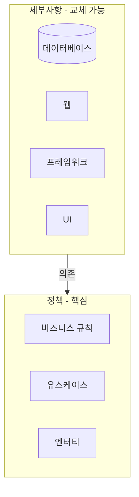
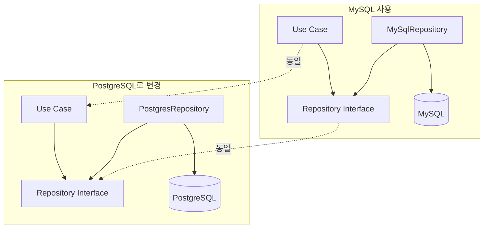
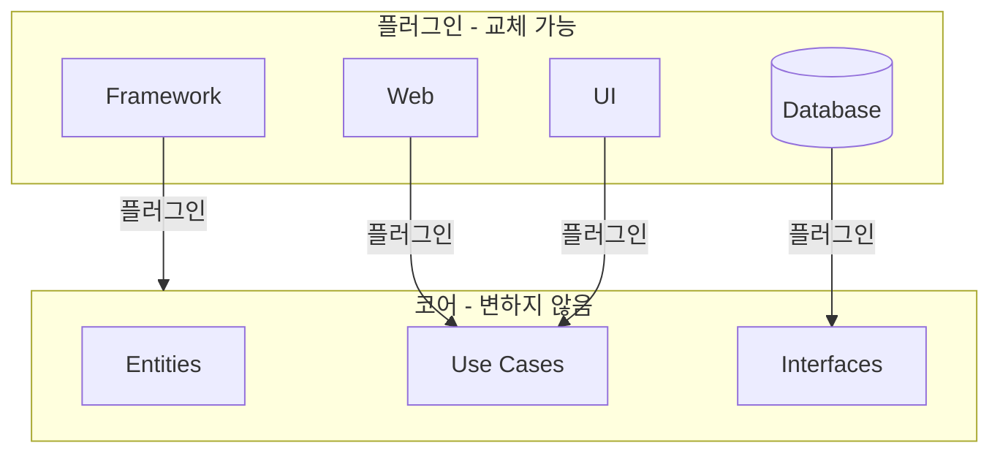

지금까지 아키텍처의 핵심 원칙들을 다루었다. 이제 <strong>세부사항(Details)</strong>을 살펴본다. 세부사항은 아키텍처에서 **교체 가능한** 부분들이다.

## 세부사항이란?

마틴은 세부사항을 이렇게 정의한다: 정책을 실제로 동작시키려면 반드시 필요하지만, 정책 자체의 관점에서는 무엇으로 채워지든 상관없는 것들 — 데이터베이스, 웹 서버, 전달 메커니즘, 프레임워크가 그 예다(Martin, 『Clean Architecture』, 2017). "필요하지만 무엇인지는 상관없다"는 이 이중성이 세부사항 개념의 핵심이다.


```mermaid
flowchart TB
    subgraph Policy [정책 - 핵심]
        BR[비즈니스 규칙]
        UC[유스케이스]
        ENT[엔터티]
    end
    
    subgraph Details [세부사항 - 교체 가능]
        DB[(데이터베이스)]
        WEB[웹]
        FW[프레임워크]
        UI[UI]
    end
    
    Details -->|의존| Policy
```

### 세부사항의 예

아래 표의 각 칸은 서로 자유롭게 교체될 수 있는 후보군이다. 데이터베이스를 MySQL에서 PostgreSQL로 바꾸든, 웹 프레임워크를 Spring에서 Django로 바꾸든, 비즈니스 규칙(할인율 계산, 재고 검증 같은 정책)은 단 한 줄도 바뀔 필요가 없어야 한다. 만약 DB를 바꿨는데 할인 계산 로직까지 손대야 한다면, 그것은 이미 세부사항과 정책이 뒤섞여 있다는 신호다:

| 카테고리 | 세부사항 예시 |
|----------|-------------|
| 데이터베이스 | MySQL, PostgreSQL, MongoDB, Redis |
| 웹 | HTTP, REST, GraphQL, gRPC |
| 프레임워크 | Spring, Django, Rails, Express |
| UI | React, Angular, Vue, Svelte |
| 메시징 | Kafka, RabbitMQ, SQS |
| 인프라 | AWS, GCP, Azure, Docker |

아래 `OrderService`는 이 원칙을 코드로 보여준다. 클래스 안 어디에도 `mysql`이나 `spring` 같은 문자열이 등장하지 않는다 — `OrderRepository`라는 인터페이스 뒤에 실제 저장소가 무엇인지 완전히 숨겨져 있기 때문이다:

```java
import java.util.List;
import java.util.Optional;

class OrderRequest { List<Item> items; }
class Item { String name; int price; int quantity; }
class Order {
    private final List<Item> items;
    private Order(List<Item> items) { this.items = items; }
    static Order create(OrderRequest request) { return new Order(request.items); }
    void validate() { /* 필수 필드 검증 등 순수 비즈니스 규칙 */ }
}
interface OrderRepository {
    void save(Order order);
    Optional<Order> findById(Long id);
}

// 세부사항의 예
// 비즈니스 규칙은 이것들을 모름
public class OrderService {
    // MySQL인지 MongoDB인지 모름
    private final OrderRepository repository;

    // HTTP인지 gRPC인지 모름
    // React인지 Angular인지 모름

    public OrderService(OrderRepository repository) { this.repository = repository; }

    public Order processOrder(OrderRequest request) {
        // 순수한 비즈니스 로직만
        Order order = Order.create(request);
        order.validate();
        repository.save(order);
        return order;
    }
}
```

## 정책 vs 세부사항

정책과 세부사항을 가르는 기준은 다섯 가지로 요약된다. 정책은 "10개 이상 구매 시 10% 할인"처럼 비즈니스 규칙 그 자체이며, 사업이 유지되는 한 좀처럼 바뀌지 않는다. 반면 세부사항은 그 규칙을 실행하기 위한 기술적 수단일 뿐이라 훨씬 자주 바뀐다. 이 차이는 곧바로 의존성 방향으로 이어진다 — 정책은 아무것도 의존하지 않아야 하고, 세부사항이 정책에 의존해야 한다. 정책이 세부사항에 의존하는 순간, 그 세부사항이 바뀔 때마다 정책까지 흔들리게 된다:

| 구분 | 정책 | 세부사항 |
|------|------|----------|
| 정의 | 비즈니스 규칙 | 기술적 구현 |
| 변경 빈도 | 적음 | 많음 |
| 가치 | 핵심 | 교체 가능 |
| 테스트 | 필수, 쉬움 | 어려움 |
| 의존성 | 아무것도 의존 안 함 | 정책에 의존 |

### 비즈니스 규칙 예시

아래 `DiscountPolicy`는 "정책" 쪽의 전형적인 예다. `BigDecimal`이나 `List` 같은 언어 표준 라이브러리 외에는 아무 기술도 알지 못하며, DB 연결이나 HTTP 요청 없이도 완전히 검증할 수 있다:

```java
import java.math.BigDecimal;
import java.util.List;

class Order {
    private final List<Item> items;
    Order(List<Item> items) { this.items = items; }
    int getItemCount() { return items.stream().mapToInt(i -> i.quantity).sum(); }
    BigDecimal getSubtotal() {
        return items.stream()
            .map(i -> BigDecimal.valueOf(i.price).multiply(BigDecimal.valueOf(i.quantity)))
            .reduce(BigDecimal.ZERO, BigDecimal::add);
    }
}
class Item {
    int price; int quantity;
    Item(String name, int price, int quantity) { this.price = price; this.quantity = quantity; }
}

// 정책: 할인 규칙 (비즈니스 규칙)
public class DiscountPolicy {
    public BigDecimal calculateDiscount(Order order) {
        // 비즈니스 규칙: 10개 이상 구매 시 10% 할인
        if (order.getItemCount() >= 10) {
            return order.getSubtotal()
                .multiply(new BigDecimal("0.10"));
        }
        return BigDecimal.ZERO;
    }
}

// 이 규칙은:
// - MySQL에서 실행되든 MongoDB에서 실행되든 상관없다
// - 웹에서 호출되든 CLI에서 호출되든 상관없다
// - Spring에서 실행되든 Django에서 실행되든 상관없다
```

## 왜 세부사항을 분리하는가?

세부사항 분리가 주는 이점은 크게 세 가지다: 기술 선택을 나중으로 미룰 수 있고, DB·웹 서버 없이도 비즈니스 규칙을 테스트할 수 있고, 나중에 기술을 바꿔도 비즈니스 규칙 코드는 그대로 둘 수 있다. 아래에서 각각을 실제 코드로 살펴본다.

### 1. 결정 지연 (Deferring Decisions)

세부사항이 분리되면 **기술 선택을 나중에** 할 수 있다. 프로젝트 초반에는 요구사항이 아직 불확실하고, 트래픽 규모나 데이터 접근 패턴에 대한 정보도 부족하다. 이 시점에 "MySQL이냐 MongoDB냐"를 성급하게 결정하면, 나중에 실제 사용 패턴을 알게 됐을 때 그 결정을 뒤집는 비용이 크다. 반대로 `OrderRepository` 같은 인터페이스만 먼저 정하고 구현은 미뤄두면, 정보가 쌓인 뒤 가장 적합한 기술을 고를 수 있다:


```mermaid
flowchart LR
    subgraph Early [조기 결정]
        E1[적은 정보]
        E2[위험한 결정]
    end
    
    subgraph Late [후기 결정]
        L1[많은 정보]
        L2[현명한 결정]
    end
    
    Early --> Late
```

아래 코드는 이 지연을 구체적으로 보여준다. 개발 초기에는 `InMemoryOrderRepository`로 DB 없이 빠르게 개발·테스트하고, 실제 운영 요구사항이 명확해진 뒤에야 MySQL이나 MongoDB 구현을 추가한다:

```java
import java.util.Map;
import java.util.HashMap;
import java.util.Optional;

class Order {}

// 초기: DB 선택 없이 개발
interface OrderRepository {
    void save(Order order);
    Optional<Order> findById(Long id);
}

// 개발 중: 인메모리로 테스트
public class InMemoryOrderRepository implements OrderRepository {
    private final Map<Long, Order> storage = new HashMap<>();
    public void save(Order order) { storage.put(1L, order); }
    public Optional<Order> findById(Long id) { return Optional.ofNullable(storage.get(id)); }
}
```

`OrderRepository` 인터페이스를 소비하는 코드(예: `OrderService`)는 이 시점부터 단 한 줄도 바뀌지 않는다. 나중에 실제 데이터베이스를 고를 때는 아래처럼 구현체만 추가하면 된다:

```java
import java.util.Optional;

class Order {}
interface OrderRepository {
    void save(Order order);
    Optional<Order> findById(Long id);
}

// 나중에: 실제 DB 선택
class MySqlOrderRepository implements OrderRepository {
    // MySQL 구현
    public void save(Order order) { /* JDBC/JPA로 저장 */ }
    public Optional<Order> findById(Long id) { return Optional.empty(); }
}

// 또는
class MongoOrderRepository implements OrderRepository {
    // MongoDB 구현
    public void save(Order order) { /* MongoDB 드라이버로 저장 */ }
    public Optional<Order> findById(Long id) { return Optional.empty(); }
}
```

### 2. 테스트 용이성

세부사항이 분리되어 있으면, 비즈니스 규칙을 검증하기 위해 DB나 웹 서버를 띄울 필요가 없다. 아래 두 테스트는 각각 "총액 계산"과 "대량 구매 할인"이라는 정책만 검증하며, `Order`와 `DiscountPolicy` 객체를 메모리에서 직접 생성해 밀리초 단위로 끝난다:

먼저 테스트 대상이 되는 정책 코드(`Order`, `DiscountPolicy`)는 앞서 본 것과 동일하다 — 여기서도 DB나 프레임워크에 대한 참조가 전혀 없다는 점을 다시 확인할 수 있다:

```java
import java.math.BigDecimal;
import java.util.ArrayList;
import java.util.List;
import org.junit.jupiter.api.Test;
import static org.assertj.core.api.Assertions.assertThat;

class Item {
    int price; int quantity;
    Item(String name, int price, int quantity) { this.price = price; this.quantity = quantity; }
}
class Order {
    private final List<Item> items = new ArrayList<>();
    void addItem(Item item) { items.add(item); }
    int getItemCount() { return items.stream().mapToInt(i -> i.quantity).sum(); }
    int getTotal() { return items.stream().mapToInt(i -> i.price * i.quantity).sum(); }
    BigDecimal getSubtotal() { return BigDecimal.valueOf(getTotal()); }
}
class DiscountPolicy {
    BigDecimal calculateDiscount(Order order) {
        if (order.getItemCount() >= 10) {
            return order.getSubtotal().multiply(new BigDecimal("0.10"));
        }
        return BigDecimal.ZERO;
    }
}
```

이 정책 코드를 검증하는 테스트는 다음과 같다(위 블록의 import를 그대로 이어 사용한다). `@BeforeEach`도, 목(mock) 라이브러리도 필요 없다 — 순수 자바 객체를 만들고 메서드를 호출한 뒤 결과를 확인하는 것이 전부다:

```java
class DetailFreeTests {
    private Order createOrderWithItems(int count) {
        Order order = new Order();
        for (int i = 0; i < count; i++) {
            order.addItem(new Item("상품" + i, 100, 1));
        }
        return order;
    }

    // 세부사항(DB) 없이 테스트
    @Test
    void shouldCalculateOrderTotal() {
        // DB 없음!
        Order order = new Order();
        order.addItem(new Item("상품A", 100, 2));
        order.addItem(new Item("상품B", 200, 1));

        assertThat(order.getTotal()).isEqualTo(400);
        // DB 연결 없이 밀리초 만에 테스트 완료!
    }

    @Test
    void shouldApplyDiscountForBulkOrders() {
        // 웹 서버 없음! DB 없음!
        DiscountPolicy policy = new DiscountPolicy();
        Order order = createOrderWithItems(15);  // 15개 아이템

        BigDecimal discount = policy.calculateDiscount(order);

        assertThat(discount).isGreaterThan(BigDecimal.ZERO);
    }
}
```

두 테스트 모두 실행 시간이 데이터베이스 왕복 시간이 아니라 순수 연산 시간에만 좌우된다는 점이 핵심이다. 세부사항이 섞여 있었다면 이 테스트들은 DB 픽스처를 준비하고 정리하는 코드로 몇 배는 더 길어졌을 것이다.

### 3. 기술 변경 유연성

세부사항이 정책에 의존하는 방향으로 설계되면, 기술 자체를 나중에 바꾸는 것도 훨씬 쉬워진다. 아래 다이어그램은 같은 유스케이스와 리포지토리 인터페이스를 두고, 그 뒤의 구현체만 MySQL에서 PostgreSQL로 교체하는 상황을 보여준다. `MySqlRepository`가 `PostgresRepository`로 바뀌어도 `Use Case`와 `Repository Interface`는 완전히 동일하게 남는다:


```mermaid
flowchart TB
    subgraph Before [MySQL 사용]
        UC1[Use Case]
        RI1[Repository Interface]
        MYSQL[(MySQL)]
        MYSQL_IMPL[MySqlRepository]
        
        UC1 --> RI1
        MYSQL_IMPL --> RI1
        MYSQL_IMPL --> MYSQL
    end
    
    subgraph After [PostgreSQL로 변경]
        UC2[Use Case]
        RI2[Repository Interface]
        PG[(PostgreSQL)]
        PG_IMPL[PostgresRepository]
        
        UC2 --> RI2
        PG_IMPL --> RI2
        PG_IMPL --> PG
    end
    
    UC1 -.->|동일| UC2
    RI1 -.->|동일| RI2
```

비즈니스 규칙(Use Case)은 **그대로**. 구현체만 교체.

## 플러그인 아키텍처

세부사항을 분리하면 **플러그인 아키텍처**가 된다. 코어(엔터티·유스케이스·인터페이스)는 시스템의 정체성을 이루는 부분으로 거의 바뀌지 않고, 그 주위를 둘러싼 DB·웹·UI·프레임워크는 마치 USB 포트에 꽂는 주변기기처럼 코어를 건드리지 않고 갈아 끼울 수 있다. 의존성 화살표가 항상 플러그인에서 코어를 향한다는 점이 이 구조의 핵심이다 — 코어는 어떤 플러그인이 꽂혀 있는지조차 모른다:


```mermaid
flowchart TB
    subgraph Core [코어 - 변하지 않음]
        ENT[Entities]
        UC[Use Cases]
        INTF[Interfaces]
    end
    
    subgraph Plugins [플러그인 - 교체 가능]
        DB[(Database)]
        WEB[Web]
        UI[UI]
        FW[Framework]
    end
    
    DB -->|플러그인| INTF
    WEB -->|플러그인| UC
    UI -->|플러그인| UC
    FW -->|플러그인| Core
```

이 그림을 실제 코드로 옮기면 아래와 같다. 먼저 코어(`OrderService`, `WebServer`)와 플러그인 후보들(각 DB 구현체, 기본 결제·알림 구현체)을 정의한다. `OrderService`는 세 인터페이스에만 의존할 뿐, 그 뒤에 어떤 구현체가 올지는 전혀 모른다:

```java
class Order {}
interface OrderRepository { void save(Order order); }
interface PaymentGateway {}
interface NotificationService {}
class MySqlOrderRepository implements OrderRepository { public void save(Order order) {} }
class PostgresOrderRepository implements OrderRepository { public void save(Order order) {} }
class MongoOrderRepository implements OrderRepository { public void save(Order order) {} }
class InMemoryOrderRepository implements OrderRepository { public void save(Order order) {} }
class DefaultPaymentGateway implements PaymentGateway {}
class DefaultNotificationService implements NotificationService {}

class OrderService {
    private final OrderRepository repository;
    private final PaymentGateway payment;
    private final NotificationService notification;
    OrderService(OrderRepository repository, PaymentGateway payment, NotificationService notification) {
        this.repository = repository;
        this.payment = payment;
        this.notification = notification;
    }
}
class WebServer {
    private final OrderService service;
    WebServer(OrderService service) { this.service = service; }
    void start() { /* HTTP 서버 기동 */ }
}
```

`Application.main()`이 명령줄 인자에 따라 어떤 DB 구현체를 꽂을지 런타임에 결정한다는 점에 주목한다 — 이것이 바로 [36장: 메인 컴포넌트](/post/clean-architecture/main-component-lowest-level-policy/)에서 다룬 "Main은 구체 클래스를 알고 조립하는 유일한 곳"이라는 원칙이 세부사항 분리와 만나는 지점이다:

```java
// 플러그인처럼 교체 가능한 세부사항
public class Application {
    public static void main(String[] args) {
        // 플러그인 선택
        OrderRepository repo = selectRepository(args);
        PaymentGateway payment = selectPaymentGateway(args);
        NotificationService notification = selectNotification(args);

        // 코어에 플러그인 주입
        OrderService service = new OrderService(repo, payment, notification);

        // 실행
        new WebServer(service).start();
    }

    static OrderRepository selectRepository(String[] args) {
        String type = args[0];
        return switch (type) {
            case "mysql" -> new MySqlOrderRepository();
            case "postgres" -> new PostgresOrderRepository();
            case "mongo" -> new MongoOrderRepository();
            default -> new InMemoryOrderRepository();
        };
    }

    static PaymentGateway selectPaymentGateway(String[] args) { return new DefaultPaymentGateway(); }
    static NotificationService selectNotification(String[] args) { return new DefaultNotificationService(); }
}
```

`selectRepository()`가 하는 일은 딱 하나, "문자열을 보고 구체 클래스를 고르는 것"뿐이다. 이 스위치문 자체가 세부사항에 대한 지식을 한곳에 모아두는 역할을 하며, 새 DB를 추가하고 싶으면 이 메서드에 `case` 하나만 추가하면 된다 — `OrderService`나 `WebServer` 코드는 전혀 건드릴 필요가 없다.

## 이 파트에서 다룰 내용

| 장 | 제목 | 핵심 내용 |
|----|------|----------|
| 41장 | 데이터베이스는 세부사항이다 | 관계형 DB의 역사, 디스크와 RAM |
| 42장 | 웹은 세부사항이다 | GUI의 진자 운동, 클라이언트-서버 |
| 43장 | 프레임워크는 세부사항이다 | 프레임워크와 결혼의 위험 |
| 44장 | 사례 연구 | 비디오 판매 시스템 실제 설계 |
| 45장 | 빠져 있는 장 | 패키지 구조 접근법 |

## 흔한 오해

"세부사항"이라는 이름 때문에 "중요하지 않은 것"으로 오해하기 쉽다. 데이터베이스도, 웹 프레임워크도, UI도 실제 시스템에서는 결코 사소하지 않다 — 이들이 없으면 시스템은 아예 동작하지 않는다. 마틴이 말하는 "세부사항"은 중요도가 아니라 **정책과의 관계**를 가리키는 말이다: 비즈니스 규칙이 그 기술의 이름과 API를 알 필요가 없다는 뜻이지, 그 기술이 하찮다는 뜻이 아니다. 또 다른 오해는 세부사항을 분리하면 아예 신경 쓸 필요가 없다고 여기는 것이다. "정책 vs 세부사항" 표에서 보듯 세부사항은 여전히 정책에 **의존**한다 — 방향이 반대일 뿐, 두 계층 모두 시스템이 동작하려면 필요하다.

이 장의 예제들이 보여주는 인터페이스·구현체 분리에는 비용이 따른다는 점도 짚어야 한다. `OrderRepository` 인터페이스 하나를 두기 위해 `InMemoryOrderRepository`·`MySqlOrderRepository`·`MongoOrderRepository` 세 벌의 코드를 유지해야 했듯이, 이 장에서 보여준 것처럼 여러 구현체를 처음부터 준비하는 것이 항상 이득은 아니다. 데이터베이스를 절대 바꿀 계획이 없는 소규모 내부 도구라면, 지금 당장 필요하지도 않은 두세 번째 구현체까지 미리 준비하는 것은 [34장: 부분적 경계](/post/clean-architecture/partial-boundaries-cost-benefit-balance/)에서 다룬 YAGNI 원칙에 어긋나는 과잉 설계가 될 수 있다. 이 장의 요지는 "항상 모든 것을 인터페이스로 감싸라"가 아니라, **바뀔 가능성이 있는 세부사항일수록 정책과의 결합을 늦게, 얕게 유지하라**는 것이다.

## 학습 목표

이 장을 읽은 후 다음을 스스로 점검한다.

- "세부사항"이 정책과의 관계로 정의된다는 것을, "중요하지 않다"는 오해와 구분해 설명할 수 있는가?
- 세부사항을 분리했을 때 얻는 세 가지 이점(결정 지연, 테스트 용이성, 기술 변경 유연성)을 각각 예시로 설명할 수 있는가?
- `OrderRepository` 인터페이스가 어떻게 DB 선택을 프로젝트 후반으로 미룰 수 있게 하는지 설명할 수 있는가?
- 세부사항 분리가 왜 "플러그인 아키텍처"라는 결과로 이어지는지 설명할 수 있는가?

## 판단 기준

새 코드가 정책인지 세부사항인지 판단할 때 다음을 확인한다.

- 이 코드가 특정 기술(MySQL, Spring, React 등)의 이름이나 API를 직접 언급하는가? 그렇다면 세부사항이다.
- 이 코드를 실제 DB·웹 서버 없이 밀리초 단위로 테스트할 수 있는가? 그렇다면 정책에 가깝다.
- 이 결정을 지금 당장 내려야 하는가, 아니면 인터페이스 뒤로 미뤄도 되는가? 미룰 수 있다면 세부사항으로 분리할 후보다.

## 참고 자료

- Robert C. Martin, 『Clean Architecture』(2017) — 정책·세부사항 구분과 플러그인 아키텍처의 원출처.

## 핵심 요약

| 원칙 | 설명 |
|------|------|
| 세부사항의 정의 | 정책이 신경 쓰지 않아도 되는 것 |
| 의존성 방향 | 세부사항 → 정책 |
| 이점 | 결정 지연, 테스트 용이성, 기술 변경 유연성 |
| 결과 | 플러그인 아키텍처 |

> "A good architecture makes it unnecessary to decide on Rails, or Spring, or Hibernate, or Tomcat or MySql, until much later in the project. A good architecture makes it easy to change your mind about those decisions too."
> — Robert C. Martin, "Screaming Architecture", Clean Coder Blog (2011); 『Clean Architecture』(2017)
