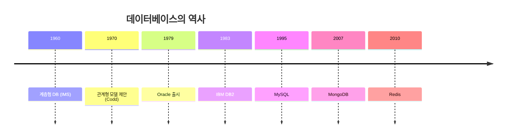
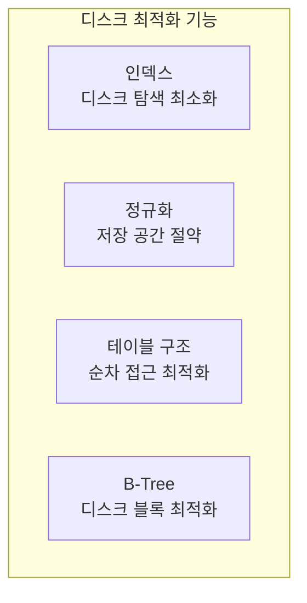
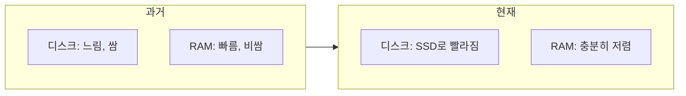
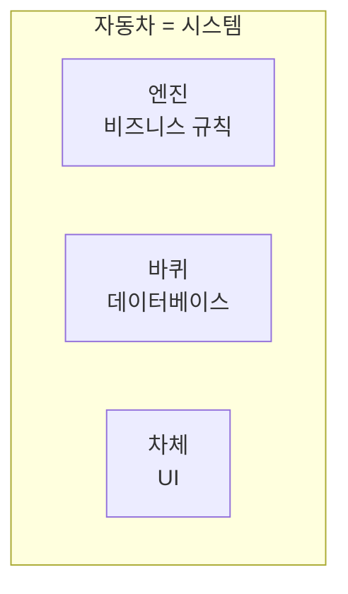
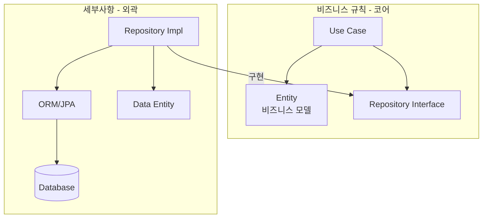
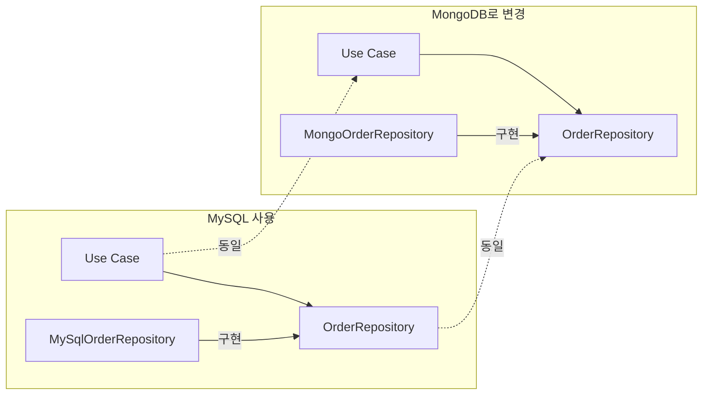
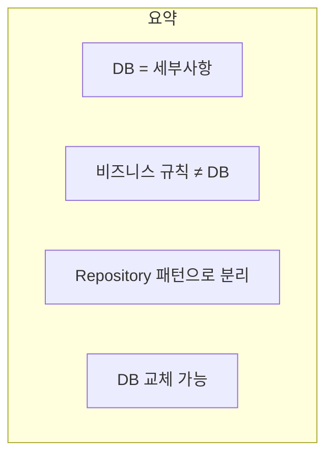

데이터베이스는 아키텍처에서 **세부사항**이다. 비즈니스 규칙은 데이터베이스가 관계형인지, NoSQL인지, 파일 시스템인지 **신경 쓰지 않아야** 한다.

## 관계형 데이터베이스의 역사

### 1970년: Edgar Codd의 제안

**에드가 코드(Edgar Codd)**가 IBM에서 **관계형 모델**을 제안했다. 이후 50년간 관계형 데이터베이스가 데이터 저장의 지배적인 방식이 되었다.



### 관계형 DB의 목적

하지만 관계형 DB는 **기술적 편의**일 뿐, 비즈니스의 본질이 아니다.

```sql
-- 관계형 DB의 기술적 특성
CREATE TABLE orders (
    id INT PRIMARY KEY,
    customer_id INT REFERENCES customers(id),
    total DECIMAL(10,2),
    created_at TIMESTAMP
);

CREATE INDEX idx_orders_customer ON orders(customer_id);
```

이 구조는 **비즈니스 규칙**인가? 아니다. **저장 최적화**일 뿐이다.

## 디스크를 위한 최적화

관계형 DB의 많은 기능은 **느린 디스크**를 위한 것이다:



| 기능 | 목적 | 디스크 관점 |
|------|------|-----------|
| 인덱스 | 빠른 검색 | 디스크 탐색 최소화 |
| 정규화 | 중복 제거 | 저장 공간 절약 |
| B-Tree | 균형 탐색 | 디스크 블록 최적화 |
| 버퍼 풀 | 캐싱 | 디스크 I/O 감소 |

## RAM 시대의 변화

오늘날 상황은 많이 달라졌다:



| 변화 | 영향 |
|------|------|
| RAM 가격 하락 | 데이터를 메모리에 유지 가능 |
| SSD 보급 | 디스크 속도 향상 |
| 인메모리 DB | Redis, Memcached 등 부상 |

```java
// 현대: 인메모리 캐싱이 일반적
@Service
public class ProductService {
    private final ProductRepository repository;
    private final Cache cache;
    
    public Product getProduct(Long id) {
        // 먼저 메모리에서 확인
        Product cached = cache.get(id);
        if (cached != null) return cached;
        
        // 없으면 DB에서 조회
        Product product = repository.findById(id);
        cache.put(id, product);
        return product;
    }
}
```

## 데이터베이스는 바퀴

마틴은 데이터베이스를 **바퀴**에 비유한다:



- 자동차에 바퀴는 **필수**
- 하지만 자동차 **전체가 바퀴는 아님**
- 비즈니스 규칙이 자동차, DB는 바퀴

> "데이터베이스 없이 비즈니스는 돌아가지 않는다. 하지만 비즈니스가 데이터베이스인 것은 아니다."

## 데이터 모델 vs 비즈니스 모델

```java
// 테이블 구조 (데이터 모델)
@Entity
@Table(name = "orders")
public class OrderEntity {
    @Id
    @GeneratedValue
    private Long id;
    
    @Column(name = "customer_id")
    private Long customerId;
    
    @Column(name = "total")
    private BigDecimal total;
    
    @Column(name = "status")
    private String status;
}

// 비즈니스 모델 (도메인 모델)
public class Order {
    private final OrderId id;
    private final Customer customer;
    private final List<OrderItem> items;
    private OrderStatus status;
    
    public void cancel() {
        if (status == OrderStatus.SHIPPED) {
            throw new CannotCancelShippedOrderException();
        }
        status = OrderStatus.CANCELLED;
    }
    
    public Money calculateTotal() {
        return items.stream()
            .map(OrderItem::getSubtotal)
            .reduce(Money.ZERO, Money::add);
    }
}
```

| 구분 | 데이터 모델 | 비즈니스 모델 |
|------|-----------|-------------|
| 초점 | 저장 구조 | 비즈니스 규칙 |
| 메서드 | getter/setter | 비즈니스 로직 |
| 관계 | 외래 키 | 객체 참조 |
| 검증 | 제약 조건 | 비즈니스 규칙 |

## 아키텍처에서의 위치



### Repository 패턴

```java
// 인터페이스: 코어에 위치 (비즈니스 규칙이 알고 있음)
public interface OrderRepository {
    void save(Order order);
    Optional<Order> findById(OrderId id);
    List<Order> findByCustomer(CustomerId customerId);
    void delete(OrderId id);
}

// 구현체: 세부사항에 위치 (DB 기술에 의존)
public class JpaOrderRepository implements OrderRepository {
    private final JpaOrderEntityRepository jpaRepo;
    private final OrderMapper mapper;
    
    @Override
    public void save(Order order) {
        OrderEntity entity = mapper.toEntity(order);
        jpaRepo.save(entity);
    }
    
    @Override
    public Optional<Order> findById(OrderId id) {
        return jpaRepo.findById(id.getValue())
            .map(mapper::toDomain);
    }
}
```

### 매퍼의 역할

```java
// 데이터 모델 ↔ 비즈니스 모델 변환
@Component
public class OrderMapper {
    
    public Order toDomain(OrderEntity entity) {
        return new Order(
            new OrderId(entity.getId()),
            new CustomerId(entity.getCustomerId()),
            toOrderItems(entity.getItems()),
            OrderStatus.valueOf(entity.getStatus())
        );
    }
    
    public OrderEntity toEntity(Order order) {
        OrderEntity entity = new OrderEntity();
        entity.setId(order.getId().getValue());
        entity.setCustomerId(order.getCustomer().getId().getValue());
        entity.setItems(toItemEntities(order.getItems()));
        entity.setStatus(order.getStatus().name());
        return entity;
    }
}
```

## DB 교체 시나리오



```java
// MongoDB 구현체 (새로 추가)
public class MongoOrderRepository implements OrderRepository {
    private final MongoTemplate mongo;
    
    @Override
    public void save(Order order) {
        OrderDocument doc = toDocument(order);
        mongo.save(doc, "orders");
    }
    
    @Override
    public Optional<Order> findById(OrderId id) {
        OrderDocument doc = mongo.findById(id.getValue(), 
            OrderDocument.class, "orders");
        return Optional.ofNullable(doc).map(this::toDomain);
    }
}

// Use Case는 변경 없음!
public class PlaceOrderUseCase {
    private final OrderRepository repository;  // 인터페이스
    
    public Order execute(OrderRequest request) {
        Order order = Order.create(request);
        repository.save(order);  // MySQL이든 MongoDB든 상관없음
        return order;
    }
}
```

## 핵심 요약



| 원칙 | 설명 |
|------|------|
| DB는 세부사항 | 비즈니스 규칙이 알 필요 없음 |
| 저장 방법 ≠ 비즈니스 | 테이블 구조는 비즈니스 규칙이 아님 |
| Repository 패턴 | 인터페이스로 분리 |
| 교체 가능성 | MySQL → MongoDB도 가능 |

> **"데이터베이스는 데이터를 저장하는 방법일 뿐이다. 비즈니스 규칙은 데이터가 어떻게 저장되는지 알 필요 없다."**
> — Robert C. Martin
