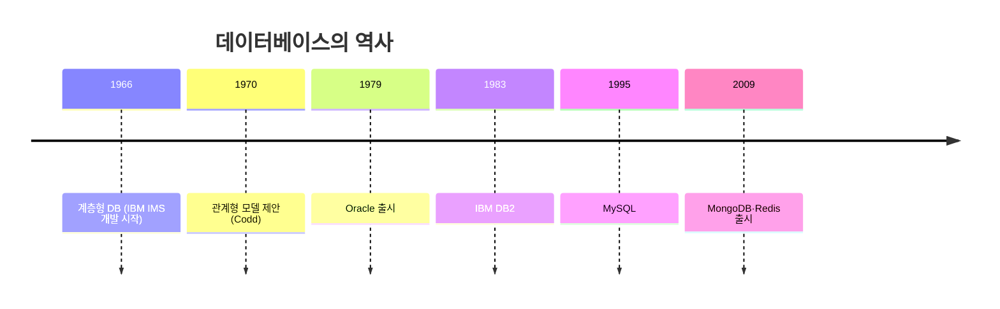
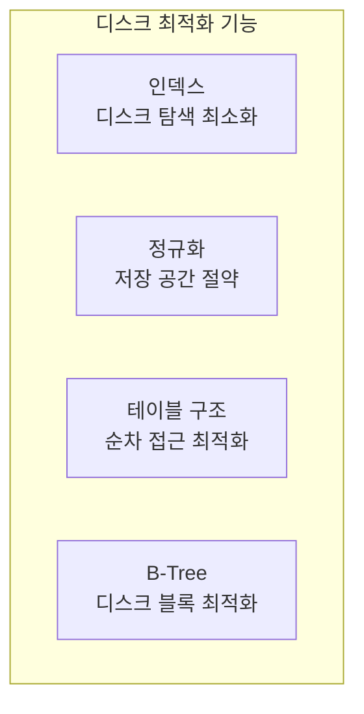
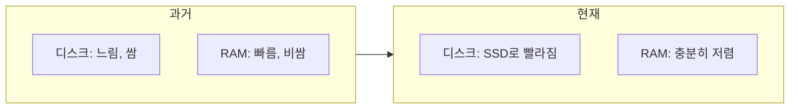
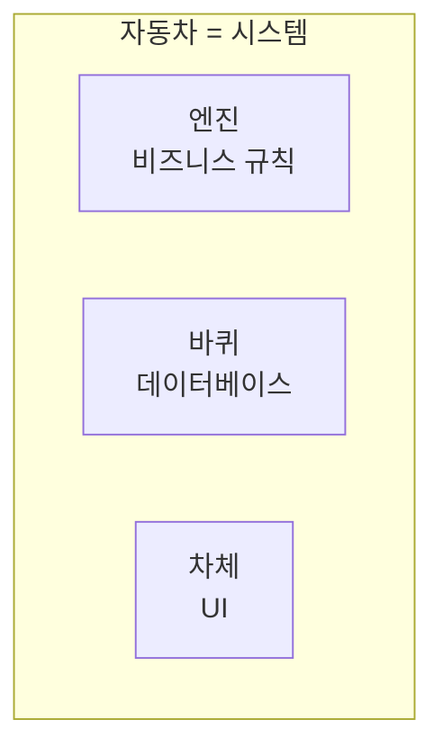
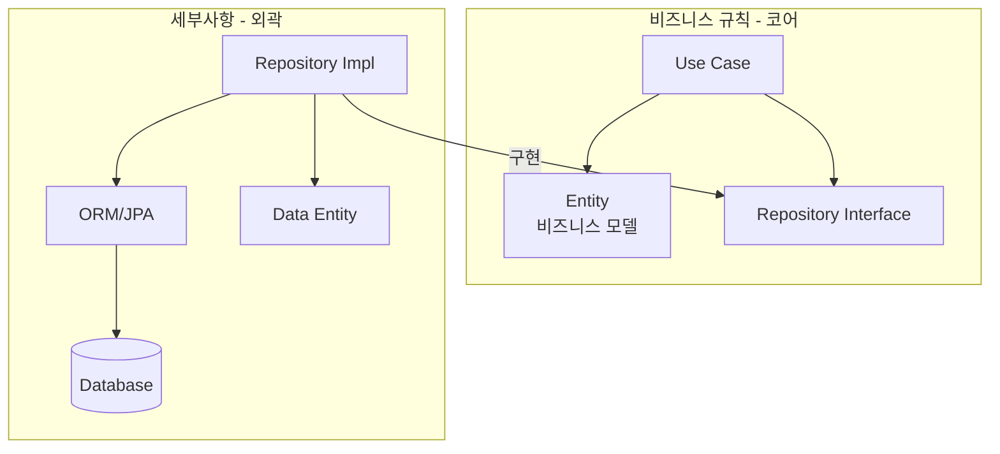
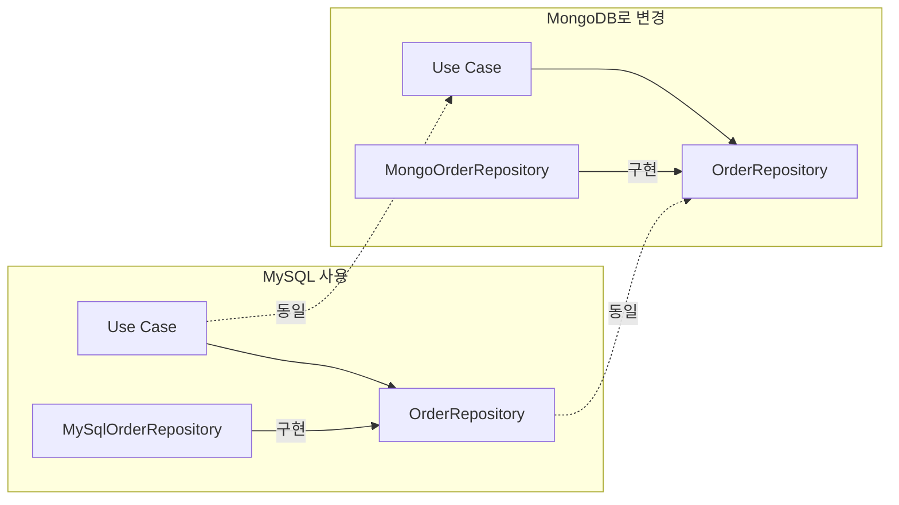

[40장: 세부사항 서론](/post/clean-architecture/details-introduction-interchangeable-parts/)에서 세부사항이 정책과의 관계로 정의된다는 것을 보았다. 이 장은 그 원칙을 가장 먼저 접하는 세부사항, 즉 데이터베이스에 적용한다. 데이터베이스는 아키텍처에서 **세부사항**이다. 비즈니스 규칙은 데이터베이스가 관계형인지, NoSQL인지, 파일 시스템인지 **신경 쓰지 않아야** 한다. 이 원칙을 실제 코드로 어떻게 지키는지는 [30장: 비즈니스 규칙과 엔티티](/post/clean-architecture/business-rules-entities-usecases/)에서 정의한 엔티티·유스케이스 구조를 데이터 접근 계층과 어떻게 분리하는지로 이어진다.

## 관계형 데이터베이스의 역사

### 1970년: Edgar Codd의 제안

**에드가 코드(Edgar Codd)**가 IBM에서 **관계형 모델**을 제안했다. 이후 50년간 관계형 데이터베이스가 데이터 저장의 지배적인 방식이 되었다.


```mermaid
timeline
    title 데이터베이스의 역사
    1966 : 계층형 DB (IBM IMS 개발 시작)
    1970 : 관계형 모델 제안 (Codd)
    1979 : Oracle 출시
    1983 : IBM DB2
    1995 : MySQL
    2009 : MongoDB·Redis 출시
```

### 관계형 DB의 목적

하지만 관계형 DB는 **기술적 편의**일 뿐, 비즈니스의 본질이 아니다.

```sql
-- 관계형 DB의 기술적 특성
CREATE TABLE orders (
    id INT PRIMARY KEY,
    customer_id INT REFERENCES customers(id),
    total DECIMAL(10,2),
    created_at TIMESTAMP
);

CREATE INDEX idx_orders_customer ON orders(customer_id);
```

이 구조는 **비즈니스 규칙**인가? 아니다. **저장 최적화**일 뿐이다.

## 디스크를 위한 최적화

관계형 DB의 많은 기능은 **느린 디스크**를 위한 것이다:


```mermaid
flowchart TB
    subgraph DiskOptimization [디스크 최적화 기능]
        INDEX[인덱스<br/>디스크 탐색 최소화]
        NORM[정규화<br/>저장 공간 절약]
        TABLE[테이블 구조<br/>순차 접근 최적화]
        BTREE[B-Tree<br/>디스크 블록 최적화]
    end
```

| 기능 | 목적 | 디스크 관점 |
|------|------|-----------|
| 인덱스 | 빠른 검색 | 디스크 탐색 최소화 |
| 정규화 | 중복 제거 | 저장 공간 절약 |
| B-Tree | 균형 탐색 | 디스크 블록 최적화 |
| 버퍼 풀 | 캐싱 | 디스크 I/O 감소 |

B-Tree가 디스크 I/O를 줄이는 원리는 **노드당 자식 수를 디스크 블록 크기에 맞춰 크게 잡는 것**이다. 한 노드가 수백 개의 키를 담으면, 트리 높이가 2~4단계만 되어도 수백만 행을 탐색할 수 있다. 디스크 탐색(seek) 한 번의 지연 시간이 메모리 접근보다 수만 배 크므로, 트리 높이를 낮춰 "디스크에 접근하는 횟수" 자체를 줄이는 것이 B-Tree 인덱스의 핵심 목적이다. 버퍼 풀은 최근 읽거나 쓴 디스크 블록을 RAM에 캐싱해, 같은 블록을 다시 읽을 때 디스크 접근을 아예 건너뛴다 — 인덱스가 "찾아가는 경로"를 줄인다면, 버퍼 풀은 "찾아갈 필요 자체"를 없앤다.

## RAM 시대의 변화

오늘날 상황은 많이 달라졌다:


```mermaid
flowchart LR
    subgraph Past [과거]
        DISK1[디스크: 느림, 쌈]
        RAM1[RAM: 빠름, 비쌈]
    end
    
    subgraph Present [현재]
        DISK2[디스크: SSD로 빨라짐]
        RAM2[RAM: 충분히 저렴]
    end
    
    Past --> Present
```

| 변화 | 영향 |
|------|------|
| RAM 가격 하락 | 데이터를 메모리에 유지 가능 |
| SSD 보급 | 디스크 속도 향상 |
| 인메모리 DB | Redis, Memcached 등 부상 |

```java
import org.springframework.stereotype.Service;

class Product {}
interface ProductRepository { Product findById(Long id); }
interface Cache {
    Product get(Long id);
    void put(Long id, Product product);
}

// 현대: 인메모리 캐싱이 일반적
@Service
public class ProductService {
    private final ProductRepository repository;
    private final Cache cache;

    public ProductService(ProductRepository repository, Cache cache) {
        this.repository = repository;
        this.cache = cache;
    }

    public Product getProduct(Long id) {
        // 먼저 메모리에서 확인
        Product cached = cache.get(id);
        if (cached != null) return cached;

        // 없으면 DB에서 조회
        Product product = repository.findById(id);
        cache.put(id, product);
        return product;
    }
}
```

## 데이터베이스는 바퀴

마틴은 데이터베이스를 **바퀴**에 비유한다:


```mermaid
flowchart TB
    subgraph Car [자동차 = 시스템]
        ENGINE[엔진<br/>비즈니스 규칙]
        WHEEL[바퀴<br/>데이터베이스]
        BODY[차체<br/>UI]
    end
```

- 자동차에 바퀴는 **필수**
- 하지만 자동차 **전체가 바퀴는 아님**
- 비즈니스 규칙이 자동차, DB는 바퀴

마틴이 강조하는 것은 데이터베이스와 **데이터 모델**을 혼동하지 말라는 점이다. 데이터(고객이 무엇을 주문했는지, 얼마를 지불했는지)는 비즈니스에서 매우 중요하지만, 그 데이터를 테이블로 저장할지 문서로 저장할지 키-값으로 저장할지는 순전히 구현 수단의 문제다(Martin, 『Clean Architecture』, 2017, 30장). 데이터베이스는 데이터를 담는 소프트웨어일 뿐, 데이터 모델 그 자체가 아니다.

## 데이터 모델 vs 비즈니스 모델

다음 예제는 같은 "주문"이라는 개념을 두 가지 서로 다른 관점으로 표현한 것을 보여준다. `OrderEntity`는 JPA 애노테이션이 붙은 **데이터 모델**로, 관계형 테이블의 컬럼 구조를 그대로 반영한다. 반면 `Order`는 **비즈니스 모델**로, `cancel()`이나 `calculateTotal()` 같은 도메인 규칙을 직접 담는다. 두 클래스는 이름은 비슷하지만 목적이 완전히 다르다 — 하나는 저장을 위한 것이고, 다른 하나는 정책을 위한 것이다.

```java
import jakarta.persistence.*;
import java.math.BigDecimal;

// 테이블 구조 (데이터 모델)
@Entity
@Table(name = "orders")
public class OrderEntity {
    @Id
    @GeneratedValue
    private Long id;

    @Column(name = "customer_id")
    private Long customerId;

    @Column(name = "total")
    private BigDecimal total;

    @Column(name = "status")
    private String status;
}
```

```java
import java.math.BigDecimal;
import java.util.List;

class OrderId { private final Long value; OrderId(Long value) { this.value = value; } Long getValue() { return value; } }
class CustomerId { private final Long value; CustomerId(Long value) { this.value = value; } Long getValue() { return value; } }
class Customer {
    private final CustomerId id;
    Customer(CustomerId id) { this.id = id; }
    CustomerId getId() { return id; }
}
class Money {
    static final Money ZERO = new Money(BigDecimal.ZERO);
    private final BigDecimal amount;
    Money(BigDecimal amount) { this.amount = amount; }
    Money add(Money other) { return new Money(amount.add(other.amount)); }
}
class OrderItem {
    private final Money subtotal;
    OrderItem(Money subtotal) { this.subtotal = subtotal; }
    Money getSubtotal() { return subtotal; }
}
enum OrderStatus { CREATED, SHIPPED, CANCELLED }
class CannotCancelShippedOrderException extends RuntimeException {}

// 비즈니스 모델 (도메인 모델)
public class Order {
    private final OrderId id;
    private final Customer customer;
    private final List<OrderItem> items;
    private OrderStatus status;

    public Order(OrderId id, Customer customer, List<OrderItem> items, OrderStatus status) {
        this.id = id;
        this.customer = customer;
        this.items = items;
        this.status = status;
    }

    public void cancel() {
        if (status == OrderStatus.SHIPPED) {
            throw new CannotCancelShippedOrderException();
        }
        status = OrderStatus.CANCELLED;
    }

    public Money calculateTotal() {
        return items.stream()
            .map(OrderItem::getSubtotal)
            .reduce(Money.ZERO, Money::add);
    }

    public OrderId getId() { return id; }
    public Customer getCustomer() { return customer; }
    public List<OrderItem> getItems() { return items; }
    public OrderStatus getStatus() { return status; }
}
```

| 구분 | 데이터 모델 | 비즈니스 모델 |
|------|-----------|-------------|
| 초점 | 저장 구조 | 비즈니스 규칙 |
| 메서드 | getter/setter | 비즈니스 로직 |
| 관계 | 외래 키 | 객체 참조 |
| 검증 | 제약 조건 | 비즈니스 규칙 |

## 아키텍처에서의 위치

앞서 구분한 데이터 모델과 비즈니스 모델은 아키텍처 안에서 각기 다른 위치를 차지한다. `Order`·`Use Case`·`Repository Interface`는 의존성 규칙에 따라 안쪽(코어)에 머무르며 다른 어떤 세부사항도 알지 못한다. 반면 실제 DB에 접근하는 `Repository Impl`, ORM, `Data Entity`는 바깥쪽(세부사항)에 위치해 코어가 정의한 인터페이스를 구현하는 방향으로만 의존한다.


```mermaid
flowchart TB
    subgraph Core [비즈니스 규칙 - 코어]
        ENT[Entity<br/>비즈니스 모델]
        UC[Use Case]
        RI[Repository Interface]
        
        UC --> ENT
        UC --> RI
    end
    
    subgraph Details [세부사항 - 외곽]
        DB[(Database)]
        REPO[Repository Impl]
        ORM[ORM/JPA]
        DE[Data Entity]
        
        REPO --> ORM --> DB
        REPO --> DE
    end
    
    REPO -->|구현| RI
```

### Repository 패턴

`OrderRepository` 인터페이스는 코어에 위치하며, "주문을 저장하고 조회할 수 있다"는 **능력**만 선언한다. 이 인터페이스 자체는 MySQL도, MongoDB도, 심지어 파일 시스템도 언급하지 않는다 — 비즈니스 규칙이 알아야 할 것은 오직 이 계약뿐이다.

이 인터페이스를 어디에 둘지는 설계에서 가장 자주 틀리는 지점이다. `OrderRepository`를 인프라 패키지(`infrastructure.repository`)가 아니라 유스케이스 패키지 옆에 두어야 코어가 세부사항을 참조하지 않는다는 의존성 규칙이 코드 배치로도 드러난다. 인터페이스의 메서드 이름도 "저장소가 무엇을 하는지"가 아니라 "비즈니스가 무엇을 필요로 하는지"를 기준으로 짓는다 — `executeQuery(String sql)`이 아니라 `findByCustomer(CustomerId customerId)`인 이유다.

```java
import java.util.List;
import java.util.Optional;

class OrderId { private final Long value; OrderId(Long value) { this.value = value; } Long getValue() { return value; } }
class CustomerId { private final Long value; CustomerId(Long value) { this.value = value; } Long getValue() { return value; } }
class Order { OrderId getId() { return null; } }

// 인터페이스: 코어에 위치 (비즈니스 규칙이 알고 있음)
public interface OrderRepository {
    void save(Order order);
    Optional<Order> findById(OrderId id);
    List<Order> findByCustomer(CustomerId customerId);
    void delete(OrderId id);
}
```

```java
import java.util.Optional;
import java.util.List;
import org.springframework.data.jpa.repository.JpaRepository;

class OrderId { private final Long value; OrderId(Long value) { this.value = value; } Long getValue() { return value; } }
class CustomerId { private final Long value; CustomerId(Long value) { this.value = value; } Long getValue() { return value; } }
class Order { OrderId getId() { return null; } }
interface OrderRepository {
    void save(Order order);
    Optional<Order> findById(OrderId id);
    List<Order> findByCustomer(CustomerId customerId);
    void delete(OrderId id);
}
class OrderEntity {}
class OrderMapper {
    OrderEntity toEntity(Order order) { return new OrderEntity(); }
    Order toDomain(OrderEntity entity) { return new Order(); }
}
interface JpaOrderEntityRepository extends JpaRepository<OrderEntity, Long> {}

// 구현체: 세부사항에 위치 (DB 기술에 의존)
public class JpaOrderRepository implements OrderRepository {
    private final JpaOrderEntityRepository jpaRepo;
    private final OrderMapper mapper;

    public JpaOrderRepository(JpaOrderEntityRepository jpaRepo, OrderMapper mapper) {
        this.jpaRepo = jpaRepo;
        this.mapper = mapper;
    }

    @Override
    public void save(Order order) {
        OrderEntity entity = mapper.toEntity(order);
        jpaRepo.save(entity);
    }

    @Override
    public Optional<Order> findById(OrderId id) {
        return jpaRepo.findById(id.getValue())
            .map(mapper::toDomain);
    }

    @Override
    public java.util.List<Order> findByCustomer(CustomerId customerId) {
        // 실제로는 jpaRepo.findByCustomerId(customerId.getValue())처럼 파생 쿼리로 구현한다.
        // 이 예제의 범위는 save/findById 경로의 매핑 로직 검증까지로 한정한다.
        return java.util.List.of();
    }

    @Override
    public void delete(OrderId id) { jpaRepo.deleteById(id.getValue()); }
}
```

### 매퍼의 역할

`JpaOrderRepository`가 `OrderEntity`(데이터 모델)와 `Order`(비즈니스 모델) 사이를 직접 변환하면, Repository 구현체 하나가 두 가지 책임(영속성 접근 + 모델 변환)을 동시에 지게 된다. `OrderMapper`는 이 변환 책임만 따로 떼어내, 두 모델이 서로의 존재를 몰라도 되게 만든다.

매퍼를 별도 클래스로 분리하는 이득은 테스트에서 가장 뚜렷하게 드러난다. `toDomain()`·`toEntity()` 변환 로직에 버그가 있는지 확인하려고 실제 DB 커넥션이나 Spring 컨텍스트를 띄울 필요가 없다 — `OrderMapper`는 순수 Java 객체 두 개를 받아 다른 순수 Java 객체를 반환하는 함수이므로, 밀리초 단위의 단위 테스트로 검증할 수 있다. 반대로 매핑 로직이 Repository 구현체 안에 흩어져 있었다면, 그 로직 하나를 검증하기 위해서도 JPA 전체를 부트스트랩해야 했을 것이다.

```java
import java.math.BigDecimal;
import java.util.List;
import org.springframework.stereotype.Component;

class OrderId { private final Long value; OrderId(Long value) { this.value = value; } Long getValue() { return value; } }
class CustomerId { private final Long value; CustomerId(Long value) { this.value = value; } Long getValue() { return value; } }
class Customer {
    private final CustomerId id;
    Customer(CustomerId id) { this.id = id; }
    CustomerId getId() { return id; }
}
class Money {
    static final Money ZERO = new Money(BigDecimal.ZERO);
    private final BigDecimal amount;
    Money(BigDecimal amount) { this.amount = amount; }
    Money add(Money other) { return new Money(amount.add(other.amount)); }
    BigDecimal getAmount() { return amount; }
}
class OrderItem {
    private final Money subtotal;
    OrderItem(Money subtotal) { this.subtotal = subtotal; }
    Money getSubtotal() { return subtotal; }
}
enum OrderStatus { CREATED, SHIPPED, CANCELLED }
class Order {
    private final OrderId id;
    private final Customer customer;
    private final List<OrderItem> items;
    private OrderStatus status;
    Order(OrderId id, Customer customer, List<OrderItem> items, OrderStatus status) {
        this.id = id; this.customer = customer; this.items = items; this.status = status;
    }
    OrderId getId() { return id; }
    Customer getCustomer() { return customer; }
    List<OrderItem> getItems() { return items; }
    OrderStatus getStatus() { return status; }
}

class OrderItemEntity { BigDecimal amount; }
class OrderEntity {
    private Long id;
    private Long customerId;
    private List<OrderItemEntity> items;
    private String status;
    Long getId() { return id; }
    void setId(Long id) { this.id = id; }
    Long getCustomerId() { return customerId; }
    void setCustomerId(Long customerId) { this.customerId = customerId; }
    List<OrderItemEntity> getItems() { return items; }
    void setItems(List<OrderItemEntity> items) { this.items = items; }
    String getStatus() { return status; }
    void setStatus(String status) { this.status = status; }
}

// 데이터 모델 ↔ 비즈니스 모델 변환
@Component
public class OrderMapper {

    public Order toDomain(OrderEntity entity) {
        return new Order(
            new OrderId(entity.getId()),
            new Customer(new CustomerId(entity.getCustomerId())),
            toOrderItems(entity.getItems()),
            OrderStatus.valueOf(entity.getStatus())
        );
    }

    public OrderEntity toEntity(Order order) {
        OrderEntity entity = new OrderEntity();
        entity.setId(order.getId().getValue());
        entity.setCustomerId(order.getCustomer().getId().getValue());
        entity.setItems(toItemEntities(order.getItems()));
        entity.setStatus(order.getStatus().name());
        return entity;
    }

    private List<OrderItem> toOrderItems(List<OrderItemEntity> entities) {
        return entities.stream().map(e -> new OrderItem(new Money(e.amount))).toList();
    }

    private List<OrderItemEntity> toItemEntities(List<OrderItem> items) {
        return items.stream().map(i -> {
            OrderItemEntity e = new OrderItemEntity();
            e.amount = i.getSubtotal().getAmount();
            return e;
        }).toList();
    }
}
```

## DB 교체 시나리오

지금까지 설계한 구조가 실제로 "교체 가능"한지 확인하는 가장 확실한 방법은, 실제로 DB를 바꿔보는 것이다. 아래는 MySQL에서 MongoDB로 저장소를 옮기는 상황을 가정한다 — `OrderRepository` 인터페이스와 이를 사용하는 Use Case는 단 한 줄도 바뀌지 않고, 새 구현체(`MongoOrderRepository`)만 추가된다.

다만 이 교체가 "공짜"는 아니라는 점을 짚어야 한다. 관계형 DB의 트랜잭션·외래 키 제약과 MongoDB의 문서 단위 원자성은 보장 범위가 다르므로, `save()` 메서드 하나의 시그니처는 같아도 그 안에서 지켜지는 일관성 수준은 달라질 수 있다. Repository 패턴이 없애는 것은 "Use Case 코드를 다시 쓰는 비용"이지, "각 저장소 기술의 특성을 이해하고 검증하는 비용"이 아니다.


```mermaid
flowchart LR
    subgraph Before [MySQL 사용]
        UC1[Use Case]
        RI1[OrderRepository]
        MYSQL[MySqlOrderRepository]
        
        UC1 --> RI1
        MYSQL -->|구현| RI1
    end
    
    subgraph After [MongoDB로 변경]
        UC2[Use Case]
        RI2[OrderRepository]
        MONGO[MongoOrderRepository]
        
        UC2 --> RI2
        MONGO -->|구현| RI2
    end
    
    UC1 -.->|동일| UC2
    RI1 -.->|동일| RI2
```

```java
import java.util.Optional;
import java.util.List;
import org.springframework.data.mongodb.core.MongoTemplate;

class OrderId { private final Long value; OrderId(Long value) { this.value = value; } Long getValue() { return value; } }
class CustomerId { private final Long value; CustomerId(Long value) { this.value = value; } Long getValue() { return value; } }
class Customer { private final CustomerId id; Customer(CustomerId id) { this.id = id; } CustomerId getId() { return id; } }
enum OrderStatus { CREATED, SHIPPED, CANCELLED }
class Order {
    private final OrderId id;
    private final Customer customer;
    private OrderStatus status;
    Order(OrderId id, Customer customer, OrderStatus status) {
        this.id = id; this.customer = customer; this.status = status;
    }
    OrderId getId() { return id; }
    Customer getCustomer() { return customer; }
    OrderStatus getStatus() { return status; }
}
interface OrderRepository {
    void save(Order order);
    Optional<Order> findById(OrderId id);
    List<Order> findByCustomer(CustomerId customerId);
    void delete(OrderId id);
}
class OrderDocument { Long id; Long customerId; String status; }

// MongoDB 구현체 (새로 추가)
public class MongoOrderRepository implements OrderRepository {
    private final MongoTemplate mongo;

    public MongoOrderRepository(MongoTemplate mongo) { this.mongo = mongo; }

    @Override
    public void save(Order order) {
        OrderDocument doc = toDocument(order);
        mongo.save(doc, "orders");
    }

    @Override
    public Optional<Order> findById(OrderId id) {
        OrderDocument doc = mongo.findById(id.getValue(),
            OrderDocument.class, "orders");
        return Optional.ofNullable(doc).map(this::toDomain);
    }

    @Override
    public List<Order> findByCustomer(CustomerId customerId) {
        // 실제로는 mongo.find(query(where("customerId").is(customerId.getValue())), ...) 로 조회한다.
        // 이 예제의 범위는 save/findById 경로의 매핑 로직 검증까지로 한정한다.
        return List.of();
    }

    @Override
    public void delete(OrderId id) { mongo.remove(new OrderId(id.getValue()), "orders"); }

    private OrderDocument toDocument(Order order) {
        OrderDocument doc = new OrderDocument();
        doc.id = order.getId().getValue();
        doc.customerId = order.getCustomer().getId().getValue();
        doc.status = order.getStatus().name();
        return doc;
    }

    private Order toDomain(OrderDocument doc) {
        return new Order(new OrderId(doc.id), new Customer(new CustomerId(doc.customerId)), OrderStatus.valueOf(doc.status));
    }
}
```

```java
class OrderId {}
class Order {
    static Order create(OrderRequest request) { return new Order(); }
}
class OrderRequest {}
interface OrderRepository { void save(Order order); }

// Use Case는 변경 없음!
public class PlaceOrderUseCase {
    private final OrderRepository repository;  // 인터페이스

    public PlaceOrderUseCase(OrderRepository repository) { this.repository = repository; }

    public Order execute(OrderRequest request) {
        Order order = Order.create(request);
        repository.save(order);  // MySQL이든 MongoDB든 상관없음
        return order;
    }
}
```

## 흔한 오해

"데이터베이스는 세부사항이다"라는 말을 "데이터베이스는 중요하지 않다"로 오해하기 쉽다. 실제로는 정반대에 가깝다 — 데이터 무결성, 트랜잭션, 백업, 성능 튜닝은 실무에서 결코 사소하지 않은 과제다. 마틴이 강조하는 것은 데이터베이스의 중요도가 아니라, 비즈니스 규칙이 특정 데이터베이스 제품의 이름·API·테이블 구조를 알 필요가 없다는 **의존 방향**이다. `OrderRepository` 인터페이스가 존재해도 그 뒤의 MySQL 서버는 여전히 신중하게 설계·운영해야 한다.

또 다른 오해는 Repository 패턴을 적용하면 DB 교체가 공짜라고 믿는 것이다. 이 장의 `MongoOrderRepository` 예제가 보여주듯, 인터페이스 뒤에서도 매핑 로직·트랜잭션 경계·조회 성능 특성은 기술마다 다시 설계해야 한다. Repository 패턴이 없애는 것은 "비즈니스 로직을 다시 작성해야 하는 비용"이지, "새 데이터베이스에 맞춰 영속성 계층을 다시 구현하는 비용" 전체가 아니다.

## 학습 목표

이 장을 읽은 후 다음을 스스로 점검한다.

- "데이터베이스는 세부사항이다"라는 명제가 "데이터베이스가 중요하지 않다"는 뜻이 아니라 의존 방향에 대한 명제임을 설명할 수 있는가?
- 데이터 모델(엔티티, 비즈니스 규칙)과 데이터베이스 모델(테이블, 컬럼)을 분리해야 하는 이유를 예시로 설명할 수 있는가?
- `OrderRepository` 인터페이스가 어떻게 비즈니스 로직을 특정 DB 기술로부터 격리하는지 코드로 보여줄 수 있는가?
- Repository 패턴을 적용해도 DB 교체 시 여전히 다시 작성해야 하는 부분이 무엇인지 설명할 수 있는가?

## 판단 기준

새 코드가 비즈니스 규칙인지 영속성 세부사항인지 판단할 때 다음을 확인한다.

- 이 코드가 SQL, JPA 애노테이션, 특정 DB 드라이버를 직접 언급하는가? 그렇다면 영속성 세부사항이다.
- 이 코드를 실제 데이터베이스 연결 없이 메모리 내 객체만으로 테스트할 수 있는가? 그렇다면 비즈니스 규칙에 가깝다.
- `Order`, `Money`처럼 도메인을 표현하는 타입이 JPA·MongoDB 등 특정 저장소 API에 의존하는가? 의존한다면 데이터 모델과 도메인 모델이 뒤섞인 것이다.

## 참고 자료

- Robert C. Martin, 『Clean Architecture』(2017), 30장 — 데이터베이스는 세부사항이라는 원칙의 원출처.
- Robert C. Martin, ["The Clean Architecture"](https://blog.cleancoder.com/uncle-bob/2012/08/13/the-clean-architecture.html), The Clean Code Blog (2012) — "The database is a detail" 문장의 출처.

## 핵심 요약

| 원칙 | 설명 |
|------|------|
| DB는 세부사항 | 비즈니스 규칙이 알 필요 없음 |
| 저장 방법 ≠ 비즈니스 | 테이블 구조는 비즈니스 규칙이 아님 |
| Repository 패턴 | 인터페이스로 분리 |
| 교체 가능성 | MySQL → MongoDB도 가능하나 매핑 로직은 재작성 필요 |

> "The Web is a detail. The database is a detail. We keep these things on the outside where they can do little harm. ... You can swap out Oracle or SQL Server, for Mongo, BigTable, CouchDB, or something else. Your business rules are not bound to the database."
> — Robert C. Martin, "The Clean Architecture", The Clean Code Blog (2012); 『Clean Architecture』(2017)
