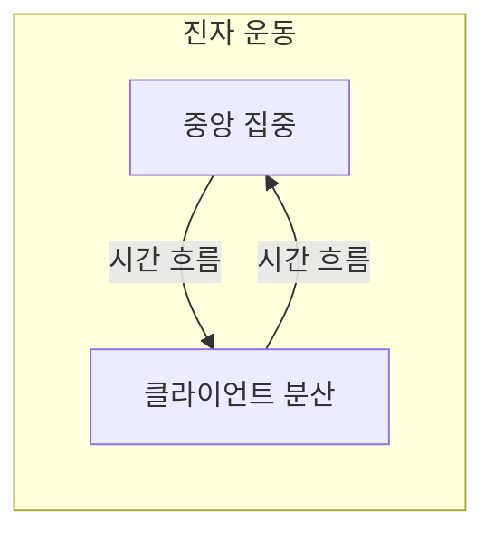
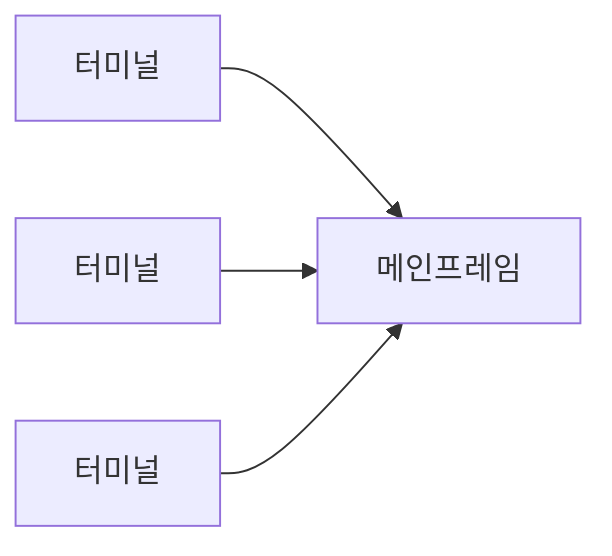
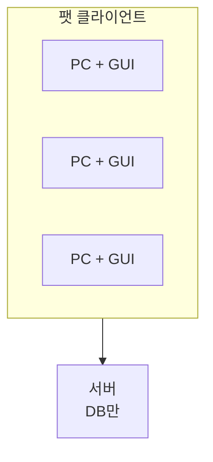
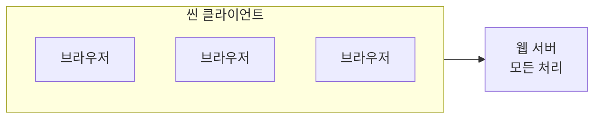
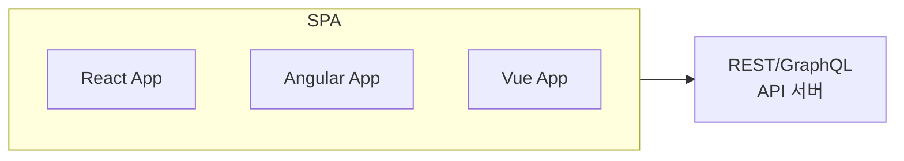
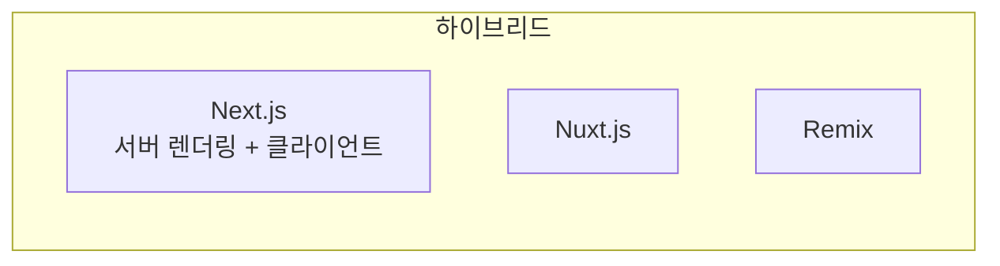
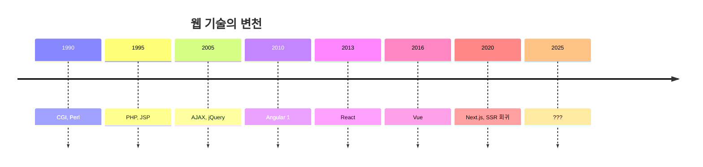
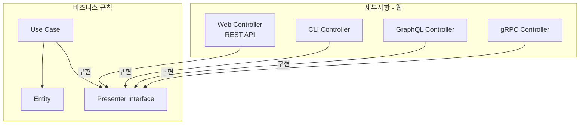
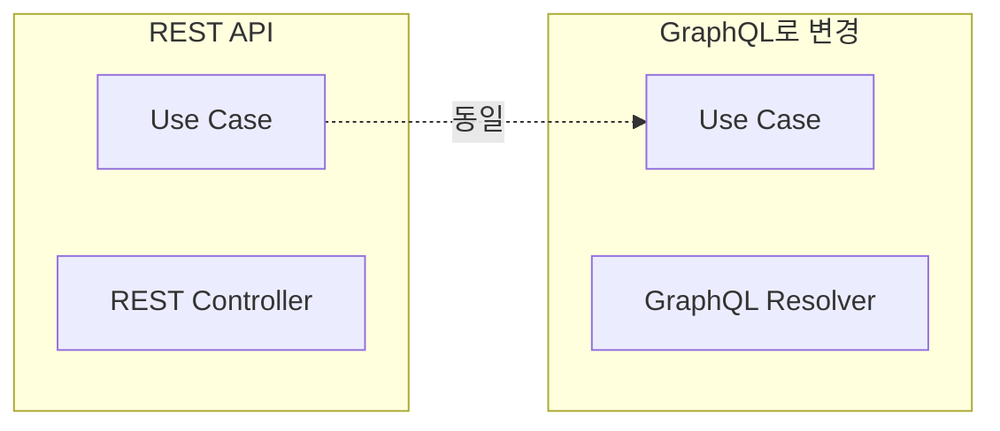
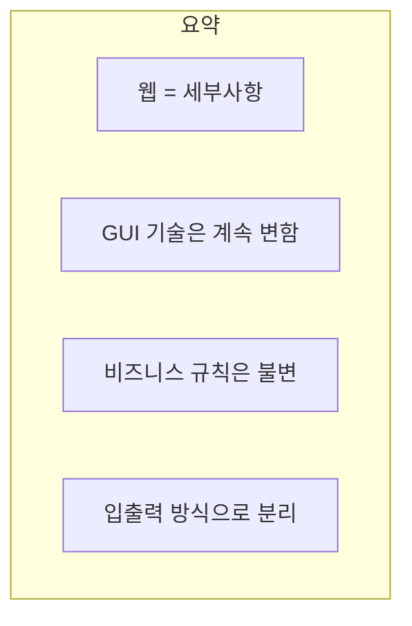

웹은 아키텍처에서 **세부사항**이다. 비즈니스 규칙은 데이터가 웹으로 전달되는지, 콘솔로 전달되는지 **신경 쓰지 않아야** 한다.

## GUI의 진자 운동

마틴은 GUI 역사를 **진자 운동(Pendulum)**에 비유한다. 컴퓨팅 파워가 중앙과 클라이언트 사이를 **왔다 갔다** 한다.



### 1960-70년대: 중앙 집중



| 특징 | 설명 |
|------|------|
| 클라이언트 | 덤 터미널 (글자만 표시) |
| 처리 | 모두 메인프레임에서 |
| 네트워크 | 느린 시리얼 연결 |

```
// 터미널 화면
MAIN MENU
==========
1. VIEW ORDERS
2. PLACE ORDER
3. EXIT

ENTER CHOICE: _
```

### 1980-90년대: 클라이언트로 분산



| 특징 | 설명 |
|------|------|
| 클라이언트 | 팻 클라이언트 (많은 로직) |
| 처리 | 대부분 클라이언트에서 |
| 기술 | Visual Basic, Delphi |

```vb
' Visual Basic 클라이언트 코드
Private Sub btnOrder_Click()
    ' 클라이언트에서 비즈니스 로직 실행!
    If ValidateOrder() Then
        CalculateTotal
        ApplyDiscount
        ' 서버로 결과만 전송
        SendToServer
    End If
End Sub
```

### 2000년대: 다시 중앙 집중 (웹 1.0)



| 특징 | 설명 |
|------|------|
| 클라이언트 | 씬 클라이언트 (HTML만 표시) |
| 처리 | 서버 사이드 렌더링 |
| 기술 | PHP, JSP, ASP |

```php
<!-- PHP: 서버에서 HTML 생성 -->
<?php
$orders = $db->query("SELECT * FROM orders");
?>
<table>
<?php foreach ($orders as $order): ?>
    <tr>
        <td><?= $order['id'] ?></td>
        <td><?= $order['total'] ?></td>
    </tr>
<?php endforeach; ?>
</table>
```

### 2010년대: 다시 클라이언트로 (SPA)



| 특징 | 설명 |
|------|------|
| 클라이언트 | 많은 JavaScript 로직 |
| 처리 | 클라이언트에서 렌더링 |
| 기술 | React, Angular, Vue |

```javascript
// React: 클라이언트에서 렌더링
function OrderList() {
    const [orders, setOrders] = useState([]);
    
    useEffect(() => {
        // API에서 데이터만 가져옴
        fetch('/api/orders')
            .then(res => res.json())
            .then(data => setOrders(data));
    }, []);
    
    // 클라이언트에서 HTML 생성
    return (
        <table>
            {orders.map(order => (
                <tr key={order.id}>
                    <td>{order.id}</td>
                    <td>{order.total}</td>
                </tr>
            ))}
        </table>
    );
}
```

### 2020년대: 또 서버로? (SSR/SSG)



| 특징 | 설명 |
|------|------|
| 렌더링 | 서버 + 클라이언트 혼합 |
| 기술 | Next.js, Nuxt.js, Remix |
| 목표 | SEO + 인터랙티브 |

## 웹은 또 바뀔 것이다

진자는 계속 흔들린다:



| 트렌드 | 예측 불가 |
|--------|----------|
| 서버 렌더링 → 클라이언트 렌더링 | 또 바뀔 것 |
| REST → GraphQL | → ??? |
| React → Next.js | → ??? |

> "웹 기술은 계속 변한다. 비즈니스 규칙은 이 변화에 **영향받지 않아야** 한다."

## 아키텍처에서의 위치



### 코드 예시

```java
// 인터페이스: 코어에 위치
public interface OrderPresenter {
    void presentOrder(Order order);
    void presentError(String message);
}

// 웹 구현체: 세부사항
@RestController
public class WebOrderController implements OrderPresenter {
    
    @GetMapping("/orders/{id}")
    public ResponseEntity<?> getOrder(@PathVariable Long id) {
        getOrderUseCase.execute(id, this);
        return response;
    }
    
    @Override
    public void presentOrder(Order order) {
        response = ResponseEntity.ok(OrderDTO.from(order));
    }
    
    @Override
    public void presentError(String message) {
        response = ResponseEntity.badRequest().body(message);
    }
}

// CLI 구현체: 또 다른 세부사항
public class CliOrderController implements OrderPresenter {
    
    public void showOrder(Long id) {
        getOrderUseCase.execute(id, this);
    }
    
    @Override
    public void presentOrder(Order order) {
        System.out.println("Order: " + order.getId());
        System.out.println("Total: " + order.getTotal());
    }
    
    @Override
    public void presentError(String message) {
        System.err.println("Error: " + message);
    }
}
```

### Use Case는 동일

```java
// Use Case: 웹이든 CLI든 동일
public class GetOrderUseCase {
    private final OrderRepository repository;
    
    public void execute(Long id, OrderPresenter presenter) {
        try {
            Order order = repository.findById(id)
                .orElseThrow(() -> new OrderNotFoundException(id));
            
            // 비즈니스 규칙 적용
            order.checkExpiration();
            
            // 프레젠터에게 결과 전달
            presenter.presentOrder(order);
        } catch (Exception e) {
            presenter.presentError(e.getMessage());
        }
    }
}
```

## 웹 기술 교체 시나리오



```java
// GraphQL 구현체 추가 (Use Case 변경 없음!)
@DgsComponent
public class GraphQLOrderResolver implements OrderPresenter {
    
    @DgsQuery
    public Order order(@InputArgument Long id) {
        getOrderUseCase.execute(id, this);
        return result;
    }
    
    @Override
    public void presentOrder(Order order) {
        this.result = order;
    }
}
```

## 핵심 요약



| 원칙 | 설명 |
|------|------|
| 웹은 세부사항 | 입출력 장치일 뿐 |
| 진자 운동 | 기술은 계속 변함 |
| 비즈니스 분리 | 웹 변화에 영향 없음 |
| 교체 가능성 | REST → GraphQL도 가능 |

> **"웹은 입출력 장치일 뿐이다. 비즈니스 규칙은 데이터가 어떻게 전달되는지 알 필요 없다."**
> — Robert C. Martin
