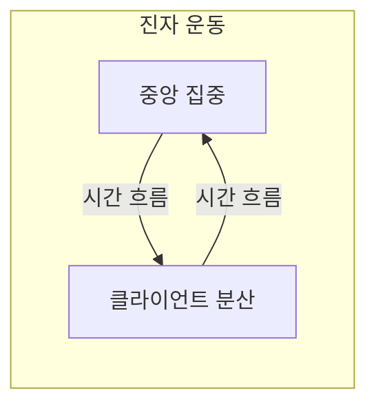
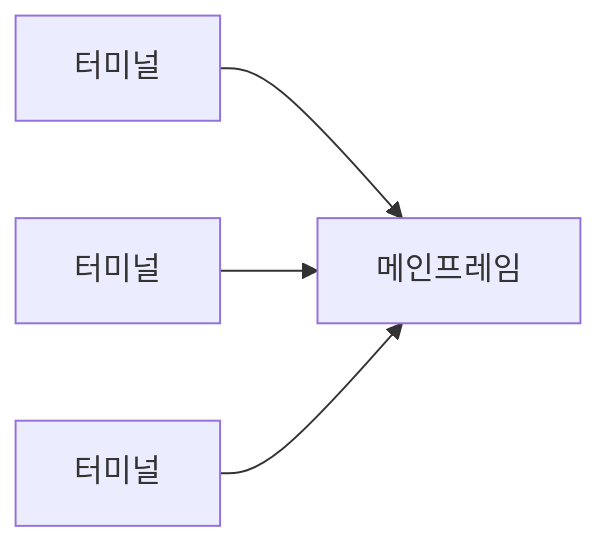
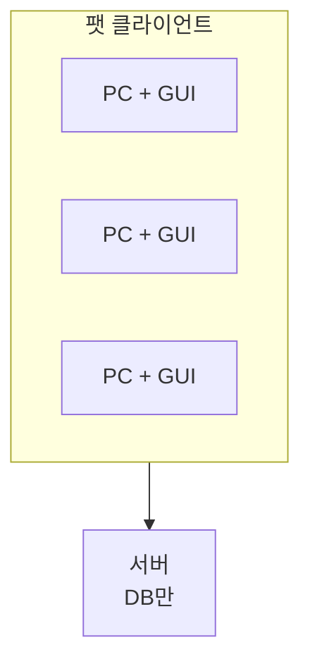
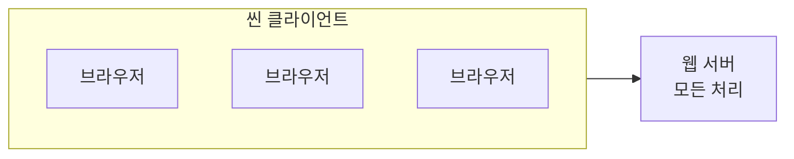
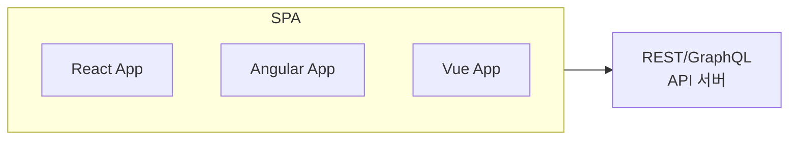
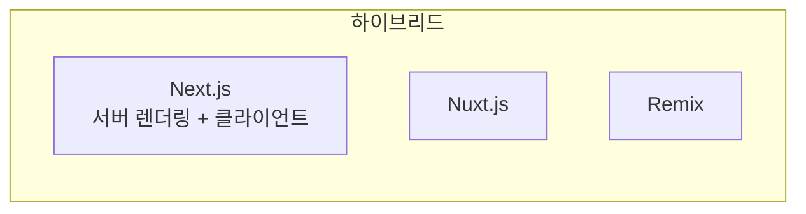
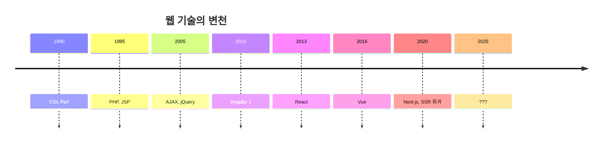
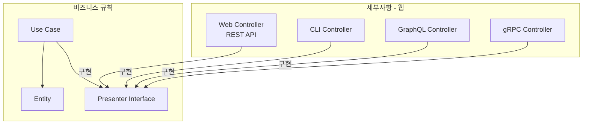
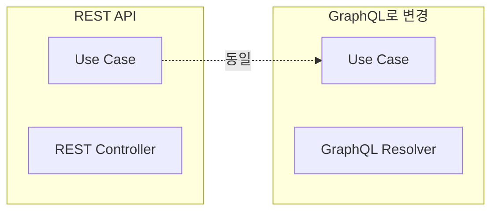

[41장: 데이터베이스는 세부사항이다](/post/clean-architecture/database-is-detail-persistence/)에서 데이터 접근 기술을 Repository 인터페이스로 분리하는 원칙을 보았다. 이 장은 같은 원칙을 입출력 경로, 즉 웹에 적용한다. 웹은 아키텍처에서 **세부사항**이다. 비즈니스 규칙은 데이터가 웹으로 전달되는지, 콘솔로 전달되는지 **신경 쓰지 않아야** 한다.

## GUI의 진자 운동

마틴은 GUI 역사를 **진자 운동(Pendulum)**에 비유한다. 컴퓨팅 파워가 중앙과 클라이언트 사이를 **왔다 갔다** 한다.


```mermaid
flowchart LR
    subgraph Pendulum [진자 운동]
        CENTER[중앙 집중]
        CLIENT[클라이언트 분산]
        
        CENTER -->|시간 흐름| CLIENT
        CLIENT -->|시간 흐름| CENTER
    end
```

### 1960-70년대: 중앙 집중


```mermaid
flowchart LR
    T1[터미널]
    T2[터미널]
    T3[터미널]
    MF[메인프레임]
    
    T1 --> MF
    T2 --> MF
    T3 --> MF
```

| 특징 | 설명 |
|------|------|
| 클라이언트 | 덤 터미널 (글자만 표시) |
| 처리 | 모두 메인프레임에서 |
| 네트워크 | 느린 시리얼 연결 |

```
// 터미널 화면
MAIN MENU
==========
1. VIEW ORDERS
2. PLACE ORDER
3. EXIT

ENTER CHOICE: _
```

### 1980-90년대: 클라이언트로 분산


```mermaid
flowchart TB
    subgraph Clients [팻 클라이언트]
        PC1[PC + GUI]
        PC2[PC + GUI]
        PC3[PC + GUI]
    end
    
    SERVER[서버<br/>DB만]
    
    Clients --> SERVER
```

| 특징 | 설명 |
|------|------|
| 클라이언트 | 팻 클라이언트 (많은 로직) |
| 처리 | 대부분 클라이언트에서 |
| 기술 | Visual Basic, Delphi |

```vb
' Visual Basic 클라이언트 코드
Private Sub btnOrder_Click()
    ' 클라이언트에서 비즈니스 로직 실행!
    If ValidateOrder() Then
        CalculateTotal
        ApplyDiscount
        ' 서버로 결과만 전송
        SendToServer
    End If
End Sub
```

### 2000년대: 다시 중앙 집중 (웹 1.0)


```mermaid
flowchart LR
    subgraph Clients [씬 클라이언트]
        B1[브라우저]
        B2[브라우저]
        B3[브라우저]
    end
    
    SERVER[웹 서버<br/>모든 처리]
    
    Clients --> SERVER
```

| 특징 | 설명 |
|------|------|
| 클라이언트 | 씬 클라이언트 (HTML만 표시) |
| 처리 | 서버 사이드 렌더링 |
| 기술 | PHP, JSP, ASP |

```php
<!-- PHP: 서버에서 HTML 생성 -->
<?php
$orders = $db->query("SELECT * FROM orders");
?>
<table>
<?php foreach ($orders as $order): ?>
    <tr>
        <td><?= $order['id'] ?></td>
        <td><?= $order['total'] ?></td>
    </tr>
<?php endforeach; ?>
</table>
```

### 2010년대: 다시 클라이언트로 (SPA)


```mermaid
flowchart LR
    subgraph Clients [SPA]
        R1[React App]
        R2[Angular App]
        R3[Vue App]
    end
    
    API[REST/GraphQL<br/>API 서버]
    
    Clients --> API
```

| 특징 | 설명 |
|------|------|
| 클라이언트 | 많은 JavaScript 로직 |
| 처리 | 클라이언트에서 렌더링 |
| 기술 | React, Angular, Vue |

```javascript
// React: 클라이언트에서 렌더링
function OrderList() {
    const [orders, setOrders] = useState([]);
    
    useEffect(() => {
        // API에서 데이터만 가져옴
        fetch('/api/orders')
            .then(res => res.json())
            .then(data => setOrders(data));
    }, []);
    
    // 클라이언트에서 HTML 생성
    return (
        <table>
            {orders.map(order => (
                <tr key={order.id}>
                    <td>{order.id}</td>
                    <td>{order.total}</td>
                </tr>
            ))}
        </table>
    );
}
```

### 2020년대: 또 서버로? (SSR/SSG)


```mermaid
flowchart LR
    subgraph Hybrid [하이브리드]
        NEXT[Next.js<br/>서버 렌더링 + 클라이언트]
        NUXT[Nuxt.js]
        REMIX[Remix]
    end
```

| 특징 | 설명 |
|------|------|
| 렌더링 | 서버 + 클라이언트 혼합 |
| 기술 | Next.js, Nuxt.js, Remix |
| 목표 | SEO + 인터랙티브 |

## 웹은 또 바뀔 것이다

진자는 계속 흔들린다:


```mermaid
timeline
    title 웹 기술의 변천
    1990 : CGI, Perl
    1995 : PHP, JSP
    2005 : AJAX, jQuery
    2010 : Angular 1
    2013 : React
    2016 : Vue
    2020 : Next.js, SSR 회귀
    2025 : ???
```

| 트렌드 | 예측 불가 |
|--------|----------|
| 서버 렌더링 → 클라이언트 렌더링 | 또 바뀔 것 |
| REST → GraphQL | → ??? |
| React → Next.js | → ??? |

> "웹 기술은 계속 변한다. 비즈니스 규칙은 이 변화에 **영향받지 않아야** 한다."

## 아키텍처에서의 위치


```mermaid
flowchart TB
    subgraph Core [비즈니스 규칙]
        UC[Use Case]
        ENT[Entity]
        PI[Presenter Interface]
        
        UC --> ENT
        UC --> PI
    end
    
    subgraph Details [세부사항 - 웹]
        WEB[Web Controller<br/>REST API]
        CLI[CLI Controller]
        GQL[GraphQL Controller]
        GRPC[gRPC Controller]
    end
    
    WEB -->|구현| PI
    CLI -->|구현| PI
    GQL -->|구현| PI
    GRPC -->|구현| PI
```

### 코드 예시

`OrderPresenter` 인터페이스는 코어(비즈니스 규칙)에 위치하며, Use Case가 결과를 어떤 방식으로 표현할지는 이 인터페이스의 구현체에 위임한다. 다음은 그 인터페이스 정의다.

```java
class Order { Long getId() { return 1L; } java.math.BigDecimal getTotal() { return java.math.BigDecimal.ZERO; } }

// 인터페이스: 코어에 위치
public interface OrderPresenter {
    void presentOrder(Order order);
    void presentError(String message);
}
```

동일한 인터페이스를 웹 컨트롤러가 구현하면 REST API로, CLI 클래스가 구현하면 콘솔 출력으로 결과가 나타난다. 두 구현체 모두 `getOrderUseCase`를 호출하는 방식은 같고, 결과를 사용자에게 보여주는 방식만 다르다.

```java
import org.springframework.web.bind.annotation.RestController;
import org.springframework.web.bind.annotation.GetMapping;
import org.springframework.web.bind.annotation.PathVariable;
import org.springframework.http.ResponseEntity;

class Order { Long getId() { return 1L; } java.math.BigDecimal getTotal() { return java.math.BigDecimal.ZERO; } }
interface OrderPresenter { void presentOrder(Order order); void presentError(String message); }
class GetOrderUseCase { void execute(Long id, OrderPresenter presenter) {} }
class OrderDTO { static OrderDTO from(Order order) { return new OrderDTO(); } }

// 웹 구현체: 세부사항
@RestController
public class WebOrderController implements OrderPresenter {
    private final GetOrderUseCase getOrderUseCase;
    private ResponseEntity<?> response;

    public WebOrderController(GetOrderUseCase getOrderUseCase) {
        this.getOrderUseCase = getOrderUseCase;
    }

    @GetMapping("/orders/{id}")
    public ResponseEntity<?> getOrder(@PathVariable Long id) {
        getOrderUseCase.execute(id, this);
        return response;
    }

    @Override
    public void presentOrder(Order order) {
        response = ResponseEntity.ok(OrderDTO.from(order));
    }

    @Override
    public void presentError(String message) {
        response = ResponseEntity.badRequest().body(message);
    }
}
```

```java
class Order { Long getId() { return 1L; } java.math.BigDecimal getTotal() { return java.math.BigDecimal.ZERO; } }
interface OrderPresenter { void presentOrder(Order order); void presentError(String message); }
class GetOrderUseCase { void execute(Long id, OrderPresenter presenter) {} }

// CLI 구현체: 또 다른 세부사항
public class CliOrderController implements OrderPresenter {
    private final GetOrderUseCase getOrderUseCase;

    public CliOrderController(GetOrderUseCase getOrderUseCase) {
        this.getOrderUseCase = getOrderUseCase;
    }

    public void showOrder(Long id) {
        getOrderUseCase.execute(id, this);
    }

    @Override
    public void presentOrder(Order order) {
        System.out.println("Order: " + order.getId());
        System.out.println("Total: " + order.getTotal());
    }

    @Override
    public void presentError(String message) {
        System.err.println("Error: " + message);
    }
}
```

### Use Case는 동일

`WebOrderController`와 `CliOrderController`가 각자 다른 방식으로 결과를 표시해도, 그 결과를 만들어내는 `GetOrderUseCase`는 동일하다. Use Case는 `OrderPresenter` 인터페이스만 알 뿐, 그 뒤에 웹 컨트롤러가 있는지 CLI가 있는지 전혀 알지 못한다.

```java
import java.util.Optional;

class Order {
    void checkExpiration() {}
    Long getId() { return 1L; }
    java.math.BigDecimal getTotal() { return java.math.BigDecimal.ZERO; }
}
interface OrderPresenter { void presentOrder(Order order); void presentError(String message); }
interface OrderRepository { Optional<Order> findById(Long id); }
class OrderNotFoundException extends RuntimeException {
    OrderNotFoundException(Long id) { super("Order not found: " + id); }
}

// Use Case: 웹이든 CLI든 동일
public class GetOrderUseCase {
    private final OrderRepository repository;

    public GetOrderUseCase(OrderRepository repository) {
        this.repository = repository;
    }

    public void execute(Long id, OrderPresenter presenter) {
        try {
            Order order = repository.findById(id)
                .orElseThrow(() -> new OrderNotFoundException(id));

            // 비즈니스 규칙 적용
            order.checkExpiration();

            // 프레젠터에게 결과 전달
            presenter.presentOrder(order);
        } catch (Exception e) {
            presenter.presentError(e.getMessage());
        }
    }
}
```

## 웹 기술 교체 시나리오


```mermaid
flowchart LR
    subgraph Before [REST API]
        UC1[Use Case]
        REST[REST Controller]
    end
    
    subgraph After [GraphQL로 변경]
        UC2[Use Case]
        GQL[GraphQL Resolver]
    end
    
    UC1 -.->|동일| UC2
```

```java
import com.netflix.graphql.dgs.DgsComponent;
import com.netflix.graphql.dgs.DgsQuery;
import com.netflix.graphql.dgs.InputArgument;

class Order {}
interface OrderPresenter { void presentOrder(Order order); void presentError(String message); }
class GetOrderUseCase { void execute(Long id, OrderPresenter presenter) {} }

// GraphQL 구현체 추가 (Use Case 변경 없음!)
@DgsComponent
public class GraphQLOrderResolver implements OrderPresenter {
    private final GetOrderUseCase getOrderUseCase;
    private Order result;

    public GraphQLOrderResolver(GetOrderUseCase getOrderUseCase) {
        this.getOrderUseCase = getOrderUseCase;
    }

    @DgsQuery
    public Order order(@InputArgument Long id) {
        getOrderUseCase.execute(id, this);
        return result;
    }

    @Override
    public void presentOrder(Order order) {
        this.result = order;
    }

    @Override
    public void presentError(String message) {}
}
```

## 흔한 오해

"웹은 세부사항이다"라는 말은 웹 기술을 소홀히 다뤄도 된다는 뜻이 아니다. 사용자 경험, 접근성, 브라우저 호환성은 실무에서 여전히 중요한 과제다. 마틴이 강조하는 것은 웹의 중요도가 아니라, 비즈니스 규칙이 HTTP 요청 형식이나 특정 프론트엔드 프레임워크의 존재를 알 필요가 없다는 **의존 방향**이다. `OrderPresenter` 인터페이스가 있어도 `WebOrderController`는 여전히 신중하게 설계해야 한다.

또 다른 오해는 GUI의 진자 운동(중앙 집중 ↔ 클라이언트 분산)이 "결국 다시 원점으로 돌아온다"는 뜻이라고 해석하는 것이다. 실제로는 매번 이전 세대보다 더 나은 도구(정적 타입, 컴포넌트 모델, 서버 컴포넌트)를 갖고 돌아온다 — 반복이 아니라 나선형 발전에 가깝다. 이 장의 요지는 "웹 기술을 예측하지 말라"가 아니라, **어떤 기술이 승리하든 비즈니스 규칙 코드는 한 줄도 바뀌지 않아야 한다**는 것이다.

## 학습 목표

이 장을 읽은 후 다음을 스스로 점검한다.

- "웹은 세부사항이다"라는 명제가 웹이 중요하지 않다는 뜻이 아니라 의존 방향에 대한 명제임을 설명할 수 있는가?
- GUI 역사의 진자 운동(중앙 집중 ↔ 클라이언트 분산)을 최소 세 시기의 구체적 기술로 설명할 수 있는가?
- `OrderPresenter` 인터페이스가 어떻게 Use Case를 웹·CLI·GraphQL로부터 격리하는지 코드로 보여줄 수 있는가?
- 같은 `GetOrderUseCase`가 서로 다른 프레젠터 구현체와 함께 동작하는 이유를 설명할 수 있는가?

## 판단 기준

새 코드가 비즈니스 규칙인지 웹 세부사항인지 판단할 때 다음을 확인한다.

- 이 코드가 HTTP, REST, GraphQL, 특정 프론트엔드 프레임워크의 API를 직접 언급하는가? 그렇다면 웹 세부사항이다.
- 이 코드를 실제 브라우저나 HTTP 서버 없이 단위 테스트할 수 있는가? 그렇다면 비즈니스 규칙에 가깝다.
- 이 로직을 CLI나 배치 작업으로 옮겨도 그대로 재사용할 수 있는가? 재사용할 수 있다면 이미 웹으로부터 잘 분리된 것이다.

## 참고 자료

- Robert C. Martin, 『Clean Architecture』(2017), 31장 — "The web is a detail" 원칙의 원출처.
- Robert C. Martin, ["The Clean Architecture"](https://blog.cleancoder.com/uncle-bob/2012/08/13/the-clean-architecture.html), The Clean Code Blog (2012) — "The Web is a detail" 문장의 출처.

## 핵심 요약

| 원칙 | 설명 |
|------|------|
| 웹은 세부사항 | 입출력 장치일 뿐 |
| 진자 운동 | 기술은 계속 변함 |
| 비즈니스 분리 | 웹 변화에 영향 없음 |
| 교체 가능성 | REST → GraphQL도 가능 |

> "The GUI is a detail and the web is a GUI. ... The web is nothing more than an IO device and hence we should try to isolate it from our business logic."
> — Robert C. Martin, 『Clean Architecture』(2017), 31장
