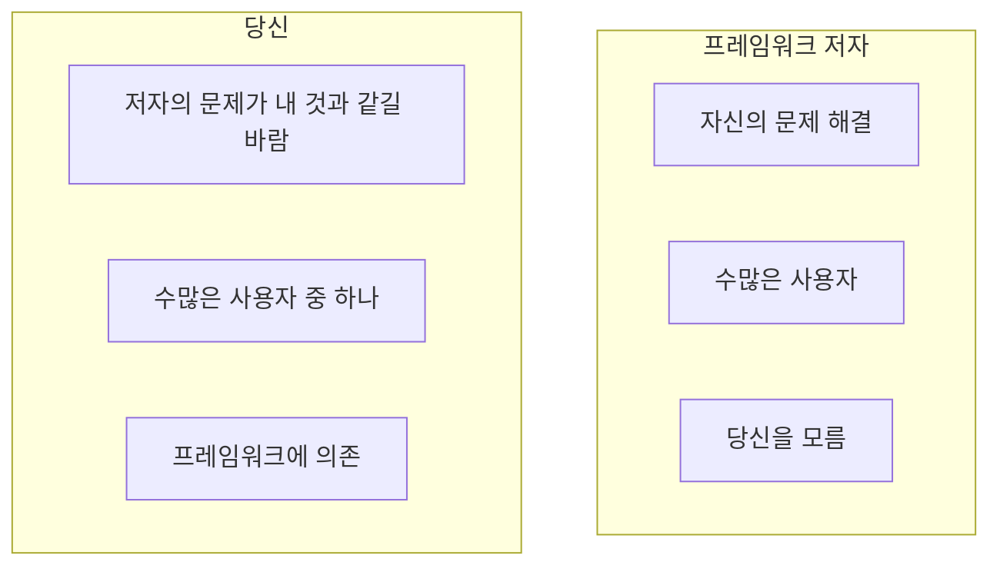
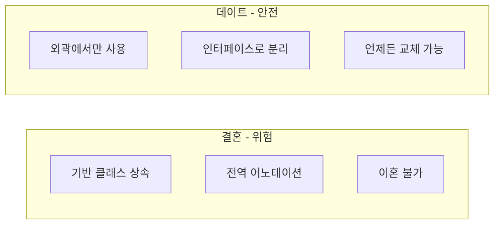
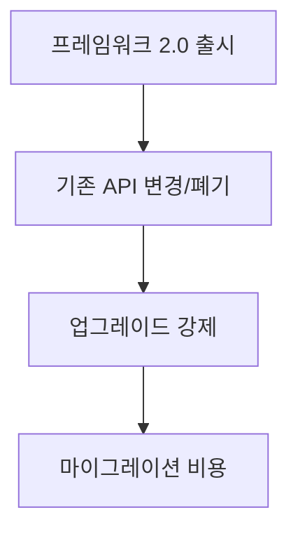
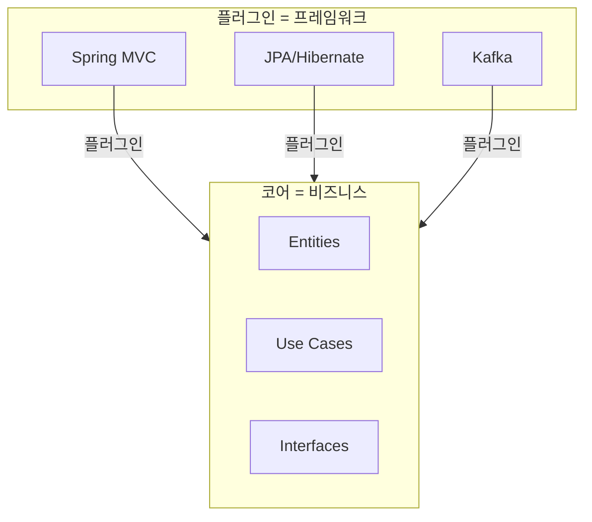
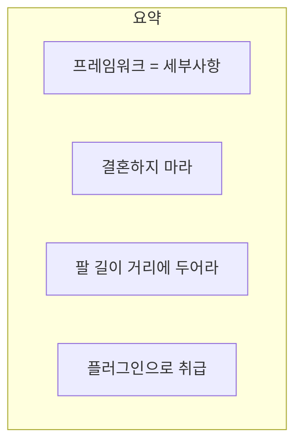

프레임워크는 아키텍처에서 **세부사항**이다. 프레임워크와 **결혼하지 마라**. 프레임워크를 **팔 길이 거리**에 두어라.

## 프레임워크와의 관계

### 비대칭적 관계

프레임워크 저자와 당신의 관계는 **비대칭적**이다.



> "프레임워크 저자는 **자신의 문제**를 해결하기 위해 프레임워크를 만들었다. 당신의 문제를 위해 만들지 않았다."

| 프레임워크 저자 | 사용자 (당신) |
|---------------|--------------|
| 자신의 문제 해결 | 저자의 문제가 내 문제와 같길 바람 |
| 수많은 사용자 | 사용자 중 하나일 뿐 |
| 당신에게 관심 없음 | 프레임워크에 의존 |

### 결혼 vs 데이트



## 프레임워크와 결혼의 위험

프레임워크와 결혼하면 다음과 같은 문제가 발생한다:

### 1. 기반 클래스 상속

```java
// 위험: 프레임워크 기반 클래스 상속
public class OrderController extends SpringMvcController {
    // 이제 Spring MVC 없이는 존재할 수 없음
    // 이혼 불가!
}

// 위험: 프레임워크 인터페이스 구현
public class OrderService implements ApplicationContextAware {
    private ApplicationContext context;
    
    @Override
    public void setApplicationContext(ApplicationContext ctx) {
        this.context = ctx;
    }
    // Spring 없이는 테스트 불가!
}
```

### 2. 어노테이션 범람

```java
// 위험: 비즈니스 객체에 프레임워크 어노테이션
@Entity
@Table(name = "orders")
public class Order {
    @Id
    @GeneratedValue(strategy = GenerationType.IDENTITY)
    private Long id;
    
    @Column(nullable = false)
    @Enumerated(EnumType.STRING)
    private OrderStatus status;
    
    @OneToMany(cascade = CascadeType.ALL, orphanRemoval = true)
    @JoinColumn(name = "order_id")
    private List<OrderItem> items;
    
    // 비즈니스 로직이 JPA에 종속됨
    // JPA 없이 테스트 불가!
}
```

### 3. 업그레이드 강제



| 상황 | 영향 |
|------|------|
| Spring 4 → 5 | XML 설정 방식 변경 |
| Angular 1 → 2+ | 완전히 다른 프레임워크 |
| React 클래스 → 훅 | 대규모 리팩토링 |

### 4. 프레임워크 방향 전환

```java
// 프레임워크가 방향을 바꾸면?
// 예: Struts → Spring MVC → WebFlux

// 모든 컨트롤러를 다시 작성해야 함!
// 비즈니스 로직까지 영향받음!
```

## 해결: 팔 길이 거리에 두기

프레임워크를 **팔 길이 거리(arm's length)**에 두어라.

```mermaid
flowchart TB
    subgraph Core [코어 - 프레임워크 없음]
        ENT[Entity<br/>순수 Java]
        UC[Use Case<br/>순수 Java]
    end
    
    subgraph Infrastructure [인프라 - 프레임워크 사용]
        CTRL[@Controller]
        REPO[@Repository]
        JPA[@Entity]
    end
    
    Infrastructure --> Core
```

### 도메인 객체 분리

```java
// 코어 도메인 - 프레임워크 무관
public class Order {
    private final OrderId id;
    private final CustomerId customerId;
    private final List<OrderItem> items;
    private OrderStatus status;
    
    public void submit() {
        if (items.isEmpty()) {
            throw new EmptyOrderException();
        }
        if (status != OrderStatus.DRAFT) {
            throw new InvalidOrderStateException();
        }
        status = OrderStatus.SUBMITTED;
    }
    
    public Money calculateTotal() {
        return items.stream()
            .map(OrderItem::getSubtotal)
            .reduce(Money.ZERO, Money::add);
    }
}

// 인프라 - 프레임워크 사용
@Entity
@Table(name = "orders")
public class OrderEntity {
    @Id
    @GeneratedValue
    private Long id;
    
    @Column(name = "customer_id")
    private Long customerId;
    
    @OneToMany(cascade = CascadeType.ALL)
    private List<OrderItemEntity> items;
    
    @Column
    @Enumerated(EnumType.STRING)
    private String status;
    
    // 변환 메서드
    public static OrderEntity from(Order order) {
        OrderEntity entity = new OrderEntity();
        entity.id = order.getId().getValue();
        entity.customerId = order.getCustomerId().getValue();
        entity.items = order.getItems().stream()
            .map(OrderItemEntity::from)
            .collect(Collectors.toList());
        entity.status = order.getStatus().name();
        return entity;
    }
    
    public Order toDomain() {
        return new Order(
            new OrderId(id),
            new CustomerId(customerId),
            items.stream()
                .map(OrderItemEntity::toDomain)
                .collect(Collectors.toList()),
            OrderStatus.valueOf(status)
        );
    }
}
```

### Use Case 분리

```java
// 코어 유스케이스 - 프레임워크 무관
public class PlaceOrderUseCase {
    private final OrderRepository repository;  // 인터페이스
    private final PaymentGateway payment;      // 인터페이스
    
    public OrderResult execute(PlaceOrderRequest request) {
        Order order = Order.create(request);
        order.submit();
        
        PaymentResult paymentResult = payment.charge(order.calculateTotal());
        if (paymentResult.isDeclined()) {
            return OrderResult.paymentFailed(paymentResult.getReason());
        }
        
        repository.save(order);
        return OrderResult.success(order);
    }
}

// 인프라 - Spring 사용
@RestController
@RequestMapping("/api/orders")
public class OrderController {
    private final PlaceOrderUseCase placeOrder;  // 주입
    
    @PostMapping
    public ResponseEntity<OrderResponse> create(
            @RequestBody PlaceOrderRequest request) {
        
        OrderResult result = placeOrder.execute(request);
        
        if (result.isSuccess()) {
            return ResponseEntity.ok(OrderResponse.from(result.getOrder()));
        } else {
            return ResponseEntity.badRequest()
                .body(OrderResponse.error(result.getError()));
        }
    }
}
```

## 프레임워크 사용 원칙

| 하지 말 것 | 해야 할 것 |
|-----------|-----------|
| 비즈니스 엔터티에 어노테이션 | 별도 매핑 클래스 사용 |
| 프레임워크 클래스 상속 | 구성(Composition) 사용 |
| 전역적 프레임워크 의존 | 경계에서만 사용 |
| 비즈니스 로직에 프레임워크 API | 순수 Java/언어 기능만 |

### 프레임워크를 플러그인으로



## 프레임워크를 떠날 수 있는가?

테스트해 보라:

```java
// 질문: 프레임워크 없이 비즈니스 로직을 테스트할 수 있는가?

@Test
void shouldCalculateOrderTotal() {
    // Spring 없이 테스트
    Order order = new Order();
    order.addItem(new OrderItem("상품A", 100, 2));
    order.addItem(new OrderItem("상품B", 50, 1));
    
    assertThat(order.calculateTotal()).isEqualTo(250);
}

@Test
void shouldRejectEmptyOrder() {
    // JPA 없이 테스트
    Order order = new Order();
    
    assertThrows(EmptyOrderException.class, order::submit);
}
```

**테스트가 프레임워크를 요구한다면** → 프레임워크와 결혼한 것!

## 핵심 요약



| 원칙 | 설명 |
|------|------|
| 프레임워크 = 도구 | 아키텍처가 아님 |
| 비대칭 관계 | 저자는 당신을 모름 |
| 결혼의 위험 | 종속, 업그레이드 비용 |
| 팔 길이 거리 | 경계에서만 사용 |
| 플러그인화 | 교체 가능하게 |

> **"프레임워크를 사용하되, 결혼하지 마라. 프레임워크는 도구일 뿐, 아키텍처가 아니다."**
> — Robert C. Martin
