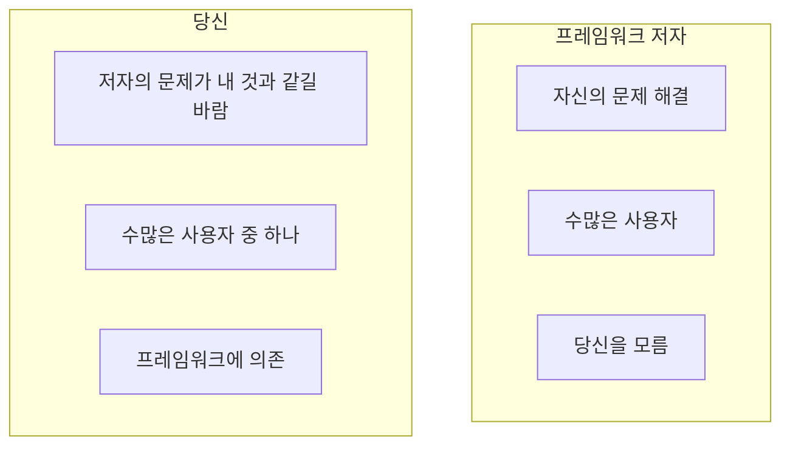
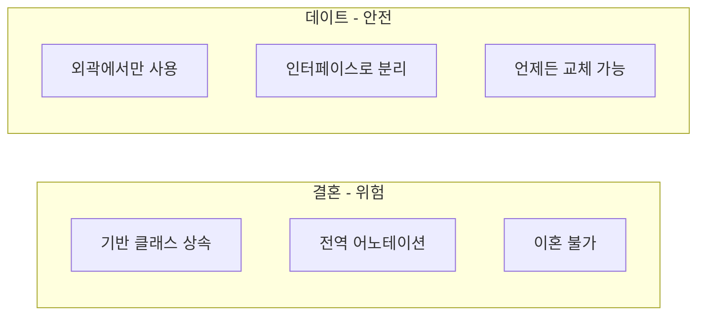
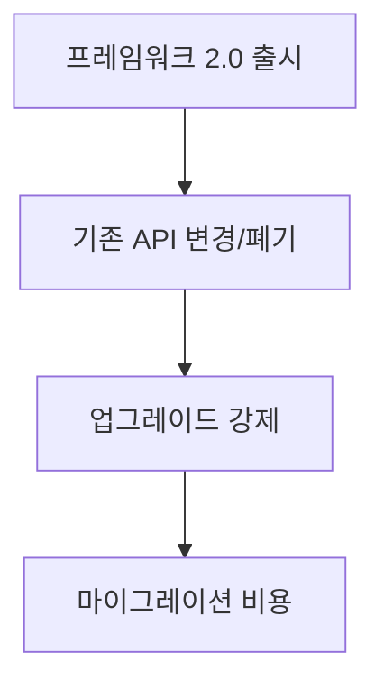
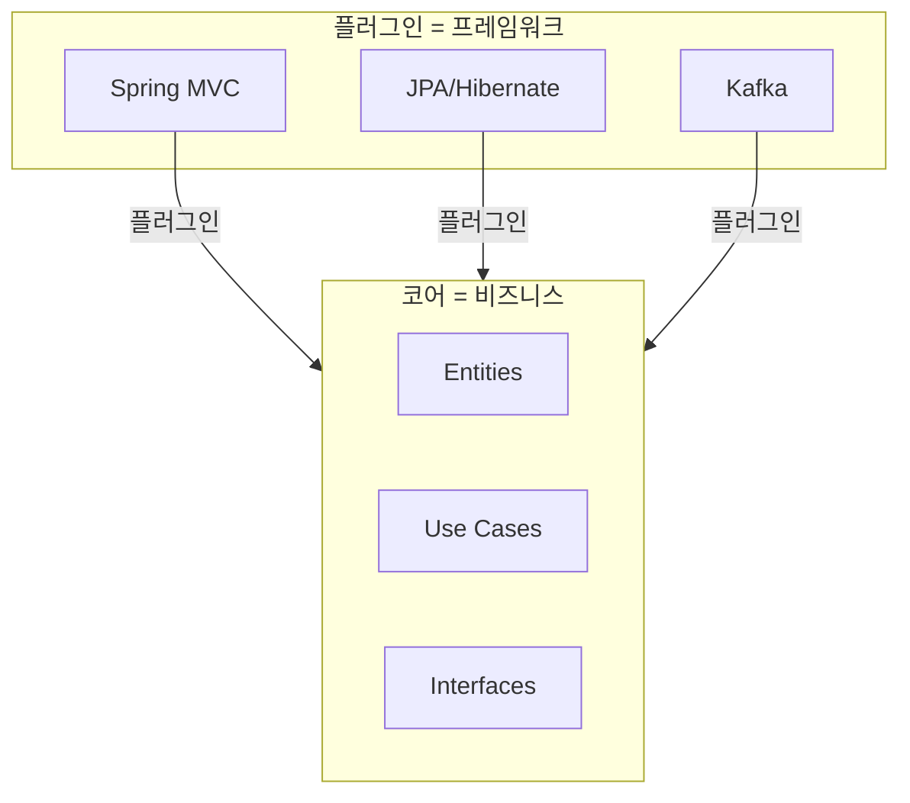

[42장: 웹은 세부사항이다](/post/clean-architecture/web-is-detail-gui-history/)에서 웹이라는 입출력 경로를 비즈니스 규칙으로부터 분리했다. 이 장은 그 입출력을 실제로 구현하는 도구, 즉 프레임워크 자체를 다룬다. 프레임워크는 아키텍처에서 **세부사항**이다. 프레임워크와 **결혼하지 마라**. 프레임워크를 **팔 길이 거리**에 두어라.

## 프레임워크와의 관계

### 비대칭적 관계

프레임워크 저자와 당신의 관계는 **비대칭적**이다.


```mermaid
flowchart TB
    subgraph Author [프레임워크 저자]
        A1[자신의 문제 해결]
        A2[수많은 사용자]
        A3[당신을 모름]
    end
    
    subgraph You [당신]
        Y1[저자의 문제가 내 것과 같길 바람]
        Y2[수많은 사용자 중 하나]
        Y3[프레임워크에 의존]
    end
```

> "프레임워크 저자는 **자신의 문제**를 해결하기 위해 프레임워크를 만들었다. 당신의 문제를 위해 만들지 않았다."

| 프레임워크 저자 | 사용자 (당신) |
|---------------|--------------|
| 자신의 문제 해결 | 저자의 문제가 내 문제와 같길 바람 |
| 수많은 사용자 | 사용자 중 하나일 뿐 |
| 당신에게 관심 없음 | 프레임워크에 의존 |

### 결혼 vs 데이트


```mermaid
flowchart LR
    subgraph Marriage [결혼 - 위험]
        M1[기반 클래스 상속]
        M2[전역 어노테이션]
        M3[이혼 불가]
    end
    
    subgraph Dating [데이트 - 안전]
        D1[외곽에서만 사용]
        D2[인터페이스로 분리]
        D3[언제든 교체 가능]
    end
```

## 프레임워크와 결혼의 위험

프레임워크와 결혼하면 다음과 같은 문제가 발생한다:

### 1. 기반 클래스 상속

프레임워크가 제공하는 기반 클래스를 상속하면, 그 순간부터 클래스는 프레임워크 없이는 존재할 수 없다. 아래 두 예제 모두 비즈니스 코드가 Spring의 타입 계층에 직접 얽혀 있다 — `OrderController`는 `SpringMvcController`를 상속해 Spring 없이는 컴파일조차 되지 않고, `OrderService`는 `ApplicationContextAware`를 구현해 Spring 없이는 단위 테스트를 실행할 수 없다.

```java
import org.springframework.web.servlet.mvc.Controller;

abstract class SpringMvcController implements Controller {}

// 위험: 프레임워크 기반 클래스 상속
public class OrderController extends SpringMvcController {
    // 이제 Spring MVC 없이는 존재할 수 없음
    // 이혼 불가!
}
```

```java
import org.springframework.context.ApplicationContext;
import org.springframework.context.ApplicationContextAware;

// 위험: 프레임워크 인터페이스 구현
public class OrderService implements ApplicationContextAware {
    private ApplicationContext context;

    @Override
    public void setApplicationContext(ApplicationContext ctx) {
        this.context = ctx;
    }
    // Spring 없이는 테스트 불가!
}
```

### 2. 어노테이션 범람

어노테이션 상속을 피했더라도, 비즈니스 엔터티에 프레임워크 어노테이션을 직접 붙이면 결합은 똑같이 발생한다. 아래 `Order`는 순수한 비즈니스 규칙을 담아야 할 클래스지만, JPA 어노테이션이 클래스 전체에 스며들어 있어 JPA 없이는 이 클래스를 로드하는 것조차 검증할 수 없다.

```java
import jakarta.persistence.*;
import java.util.List;

class OrderItem {}
enum OrderStatus { DRAFT, SUBMITTED }

// 위험: 비즈니스 객체에 프레임워크 어노테이션
@Entity
@Table(name = "orders")
public class Order {
    @Id
    @GeneratedValue(strategy = GenerationType.IDENTITY)
    private Long id;

    @Column(nullable = false)
    @Enumerated(EnumType.STRING)
    private OrderStatus status;

    @OneToMany(cascade = CascadeType.ALL, orphanRemoval = true)
    @JoinColumn(name = "order_id")
    private List<OrderItem> items;

    // 비즈니스 로직이 JPA에 종속됨
    // JPA 없이 테스트 불가!
}
```

### 3. 업그레이드 강제


```mermaid
flowchart TB
    FW[프레임워크 2.0 출시]
    
    BREAK[기존 API 변경/폐기]
    FORCE[업그레이드 강제]
    COST[마이그레이션 비용]
    
    FW --> BREAK --> FORCE --> COST
```

| 상황 | 영향 |
|------|------|
| Spring 4 → 5 | XML 설정 방식 변경 |
| Angular 1 → 2+ | 완전히 다른 프레임워크 |
| React 클래스 → 훅 | 대규모 리팩토링 |

### 4. 프레임워크 방향 전환

프레임워크는 버전이 올라가는 것만이 아니라, 아예 다른 프레임워크로 대체되기도 한다. Java 웹 생태계는 Struts에서 Spring MVC로, 다시 리액티브 방식의 WebFlux로 주류가 옮겨갔다. 컨트롤러가 특정 프레임워크의 기반 클래스를 상속하고 있었다면, 이런 전환이 있을 때마다 모든 컨트롤러를 처음부터 다시 작성해야 한다. 앞서 "1. 기반 클래스 상속" 예제의 `OrderController`가 바로 이런 상황에 처하는 코드다 — 그리고 컨트롤러 안에 비즈니스 로직까지 섞여 있었다면, 프레임워크 전환이 비즈니스 규칙 자체를 다시 검증해야 하는 위험으로 번진다.

## 해결: 팔 길이 거리에 두기

프레임워크를 **팔 길이 거리(arm's length)**에 두어라.

```mermaid
flowchart TB
    subgraph Core [코어 - 프레임워크 없음]
        ENT[Entity<br/>순수 Java]
        UC[Use Case<br/>순수 Java]
    end
    
    subgraph Infrastructure [인프라 - 프레임워크 사용]
        CTRL[@Controller]
        REPO[@Repository]
        JPA[@Entity]
    end
    
    Infrastructure --> Core
```

### 도메인 객체 분리

```java
import java.util.List;

class OrderId { private final Long value; OrderId(Long value) { this.value = value; } Long getValue() { return value; } }
class CustomerId { private final Long value; CustomerId(Long value) { this.value = value; } Long getValue() { return value; } }
class Money {
    static final Money ZERO = new Money(0);
    private final long amount;
    Money(long amount) { this.amount = amount; }
    Money add(Money other) { return new Money(amount + other.amount); }
}
class OrderItem { Money getSubtotal() { return Money.ZERO; } }
enum OrderStatus { DRAFT, SUBMITTED }
class EmptyOrderException extends RuntimeException {}
class InvalidOrderStateException extends RuntimeException {}

// 코어 도메인 - 프레임워크 무관
public class Order {
    private final OrderId id;
    private final CustomerId customerId;
    private final List<OrderItem> items;
    private OrderStatus status;

    public Order(OrderId id, CustomerId customerId, List<OrderItem> items, OrderStatus status) {
        this.id = id;
        this.customerId = customerId;
        this.items = items;
        this.status = status;
    }

    public void submit() {
        if (items.isEmpty()) {
            throw new EmptyOrderException();
        }
        if (status != OrderStatus.DRAFT) {
            throw new InvalidOrderStateException();
        }
        status = OrderStatus.SUBMITTED;
    }

    public Money calculateTotal() {
        return items.stream()
            .map(OrderItem::getSubtotal)
            .reduce(Money.ZERO, Money::add);
    }

    public OrderId getId() { return id; }
    public CustomerId getCustomerId() { return customerId; }
    public List<OrderItem> getItems() { return items; }
    public OrderStatus getStatus() { return status; }
}
```

이 `Order`는 어떤 import 문에도 `org.springframework`나 `jakarta.persistence`가 없다 — 순수 Java만으로 비즈니스 규칙(빈 주문 거부, 상태 전이 검증, 합계 계산)을 표현한다. 이 클래스를 실제로 저장하려면 별도의 데이터 모델이 필요한데, 그 역할을 하는 것이 `OrderEntity`다.

```java
import jakarta.persistence.*;
import java.util.List;
import java.util.stream.Collectors;

class OrderId { private final Long value; OrderId(Long value) { this.value = value; } Long getValue() { return value; } }
class CustomerId { private final Long value; CustomerId(Long value) { this.value = value; } Long getValue() { return value; } }
class OrderItem {}
enum OrderStatus { DRAFT, SUBMITTED }
class Order {
    Order(OrderId id, CustomerId customerId, List<OrderItem> items, OrderStatus status) {}
    OrderId getId() { return null; }
    CustomerId getCustomerId() { return null; }
    List<OrderItem> getItems() { return List.of(); }
    OrderStatus getStatus() { return OrderStatus.DRAFT; }
}
class OrderItemEntity {
    static OrderItemEntity from(OrderItem item) { return new OrderItemEntity(); }
    OrderItem toDomain() { return new OrderItem(); }
}

// 인프라 - 프레임워크 사용
@Entity
@Table(name = "orders")
public class OrderEntity {
    @Id
    @GeneratedValue
    private Long id;

    @Column(name = "customer_id")
    private Long customerId;

    @OneToMany(cascade = CascadeType.ALL)
    private List<OrderItemEntity> items;

    @Column
    @Enumerated(EnumType.STRING)
    private String status;

    // 변환 메서드
    public static OrderEntity from(Order order) {
        OrderEntity entity = new OrderEntity();
        entity.id = order.getId().getValue();
        entity.customerId = order.getCustomerId().getValue();
        entity.items = order.getItems().stream()
            .map(OrderItemEntity::from)
            .collect(Collectors.toList());
        entity.status = order.getStatus().name();
        return entity;
    }

    public Order toDomain() {
        return new Order(
            new OrderId(id),
            new CustomerId(customerId),
            items.stream()
                .map(OrderItemEntity::toDomain)
                .collect(Collectors.toList()),
            OrderStatus.valueOf(status)
        );
    }
}
```

### Use Case 분리

동일한 원칙이 Use Case와 컨트롤러 사이에도 적용된다. `PlaceOrderUseCase`는 주문 접수라는 비즈니스 절차를 표현할 뿐, HTTP나 JSON을 전혀 언급하지 않는다. 이 절차를 웹 요청으로 노출하는 책임은 `OrderController`가 별도로 진다.

```java
class Money {}
class Order { void submit() {} Money calculateTotal() { return new Money(); } }
interface OrderRepository { void save(Order order); }
class PaymentResult {
    boolean isDeclined() { return false; }
    String getReason() { return ""; }
}
interface PaymentGateway { PaymentResult charge(Money amount); }
class PlaceOrderRequest {}
class OrderResult {
    static OrderResult paymentFailed(String reason) { return new OrderResult(); }
    static OrderResult success(Order order) { return new OrderResult(); }
    boolean isSuccess() { return true; }
    Order getOrder() { return new Order(); }
    String getError() { return ""; }
}

// 코어 유스케이스 - 프레임워크 무관
public class PlaceOrderUseCase {
    private final OrderRepository repository;  // 인터페이스
    private final PaymentGateway payment;      // 인터페이스

    public PlaceOrderUseCase(OrderRepository repository, PaymentGateway payment) {
        this.repository = repository;
        this.payment = payment;
    }

    public OrderResult execute(PlaceOrderRequest request) {
        Order order = new Order();
        order.submit();

        PaymentResult paymentResult = payment.charge(order.calculateTotal());
        if (paymentResult.isDeclined()) {
            return OrderResult.paymentFailed(paymentResult.getReason());
        }

        repository.save(order);
        return OrderResult.success(order);
    }
}
```

```java
import org.springframework.web.bind.annotation.*;
import org.springframework.http.ResponseEntity;

class Order { Money calculateTotal() { return new Money(); } }
class Money {}
class PlaceOrderRequest {}
class OrderResponse {
    static OrderResponse from(Order order) { return new OrderResponse(); }
    static OrderResponse error(String error) { return new OrderResponse(); }
}
class OrderResult {
    boolean isSuccess() { return true; }
    Order getOrder() { return new Order(); }
    String getError() { return ""; }
}
class PlaceOrderUseCase { OrderResult execute(PlaceOrderRequest request) { return new OrderResult(); } }

// 인프라 - Spring 사용
@RestController
@RequestMapping("/api/orders")
public class OrderController {
    private final PlaceOrderUseCase placeOrder;  // 주입

    public OrderController(PlaceOrderUseCase placeOrder) {
        this.placeOrder = placeOrder;
    }

    @PostMapping
    public ResponseEntity<OrderResponse> create(
            @RequestBody PlaceOrderRequest request) {

        OrderResult result = placeOrder.execute(request);

        if (result.isSuccess()) {
            return ResponseEntity.ok(OrderResponse.from(result.getOrder()));
        } else {
            return ResponseEntity.badRequest()
                .body(OrderResponse.error(result.getError()));
        }
    }
}
```

## 프레임워크 사용 원칙

| 하지 말 것 | 해야 할 것 |
|-----------|-----------|
| 비즈니스 엔터티에 어노테이션 | 별도 매핑 클래스 사용 |
| 프레임워크 클래스 상속 | 구성(Composition) 사용 |
| 전역적 프레임워크 의존 | 경계에서만 사용 |
| 비즈니스 로직에 프레임워크 API | 순수 Java/언어 기능만 |

### 프레임워크를 플러그인으로


```mermaid
flowchart TB
    subgraph Core [코어 = 비즈니스]
        ENT[Entities]
        UC[Use Cases]
        INTF[Interfaces]
    end
    
    subgraph Plugins [플러그인 = 프레임워크]
        SPRING[Spring MVC]
        JPA[JPA/Hibernate]
        KAFKA[Kafka]
    end
    
    SPRING -->|플러그인| Core
    JPA -->|플러그인| Core
    KAFKA -->|플러그인| Core
```

## 프레임워크를 떠날 수 있는가?

테스트해 보라:

```java
import org.junit.jupiter.api.Test;
import static org.assertj.core.api.Assertions.assertThat;
import static org.junit.jupiter.api.Assertions.assertThrows;
import java.util.ArrayList;
import java.util.List;

class OrderItem {
    private final int unitPrice;
    private final int quantity;
    OrderItem(String name, int unitPrice, int quantity) {
        this.unitPrice = unitPrice;
        this.quantity = quantity;
    }
    int getSubtotal() { return unitPrice * quantity; }
}
class EmptyOrderException extends RuntimeException {}
class Order {
    private final List<OrderItem> items = new ArrayList<>();
    void addItem(OrderItem item) { items.add(item); }
    int calculateTotal() { return items.stream().mapToInt(OrderItem::getSubtotal).sum(); }
    void submit() {
        if (items.isEmpty()) throw new EmptyOrderException();
    }
}

// 질문: 프레임워크 없이 비즈니스 로직을 테스트할 수 있는가?
public class OrderTest {

    @Test
    void shouldCalculateOrderTotal() {
        // Spring 없이 테스트
        Order order = new Order();
        order.addItem(new OrderItem("상품A", 100, 2));
        order.addItem(new OrderItem("상품B", 50, 1));

        assertThat(order.calculateTotal()).isEqualTo(250);
    }

    @Test
    void shouldRejectEmptyOrder() {
        // JPA 없이 테스트
        Order order = new Order();

        assertThrows(EmptyOrderException.class, order::submit);
    }
}
```

**테스트가 프레임워크를 요구한다면** → 프레임워크와 결혼한 것!

## 흔한 오해

"프레임워크와 결혼하지 마라"를 "프레임워크를 쓰지 마라"로 오해하기 쉽다. 마틴 자신도 예외를 인정한다 — C++이라면 STL과, Java라면 표준 라이브러리와는 사실상 결혼할 수밖에 없다. 핵심은 프레임워크 사용 자체를 피하는 것이 아니라, **비즈니스 규칙이 프레임워크의 기반 클래스·API를 몰라도 되게** 만드는 것이다. Spring이나 JPA를 쓰지 말라는 뜻이 아니라, `Order`가 `@Entity`를 몰라도 되게 하라는 뜻이다.

또 다른 오해는 "팔 길이 거리"를 지키면 프레임워크 업그레이드 비용이 아예 사라진다고 믿는 것이다. 이 장의 `OrderEntity`·`OrderController` 예제처럼 인프라 계층을 분리해도, 그 인프라 코드 자체는 여전히 프레임워크 API 변경의 영향을 받는다. 팔 길이 거리가 없애는 것은 "프레임워크 전환이 비즈니스 규칙까지 오염시키는 것"이지, "인프라 코드를 다시 써야 하는 비용" 전체가 아니다.

## 학습 목표

이 장을 읽은 후 다음을 스스로 점검한다.

- 프레임워크 저자와 사용자의 관계가 왜 "비대칭적"인지 설명할 수 있는가?
- "기반 클래스 상속"과 "인터페이스 구현"이 왜 비즈니스 코드를 프레임워크에 결합시키는지 코드로 보여줄 수 있는가?
- `Order`(도메인)와 `OrderEntity`(데이터 모델)를 분리하면 무엇을 얻고 무엇을 잃는지 설명할 수 있는가?
- "테스트가 프레임워크를 요구하는가?"라는 질문이 왜 결합도를 가늠하는 실용적인 리트머스 시험지가 되는지 설명할 수 있는가?

## 판단 기준

새 코드가 비즈니스 규칙인지 프레임워크 결합인지 판단할 때 다음을 확인한다.

- 이 클래스가 프레임워크의 기반 클래스를 상속하거나 프레임워크 인터페이스를 구현하는가? 그렇다면 프레임워크와 결혼한 것이다.
- 이 클래스에 프레임워크 어노테이션(`@Entity`, `@Controller` 등)이 붙어 있는가? 붙어 있다면 별도 매핑 클래스로 분리할 후보다.
- 이 코드를 프레임워크의 테스트 러너나 컨테이너 없이 순수 단위 테스트로 검증할 수 있는가? 검증할 수 없다면 이미 결합된 것이다.

## 참고 자료

- Robert C. Martin, 『Clean Architecture』(2017), 32장 — 프레임워크와 결혼하지 말라는 원칙의 원출처.
- [serodriguez68/clean-architecture — Chapter 32: Frameworks are Details](https://github.com/serodriguez68/clean-architecture/blob/master/part-6-details.md) — 인용문 대조에 사용한 책 요약본.

## 핵심 요약

| 원칙 | 설명 |
|------|------|
| 프레임워크 = 도구 | 아키텍처가 아님 |
| 비대칭 관계 | 저자는 당신을 모름 |
| 결혼의 위험 | 종속, 업그레이드 비용 |
| 팔 길이 거리 | 경계에서만 사용 |
| 플러그인화 | 교체 가능하게 |

> "Use frameworks but try not to marry them. ... Your relationships with frameworks is asymmetric in nature: as engineers we make an enormous commitment to them by coupling our business logic to the framework. But, the framework maintainers don't know us and probably won't steer the framework to solve our problems if problems happen."
> — Robert C. Martin, 『Clean Architecture』(2017), 32장
