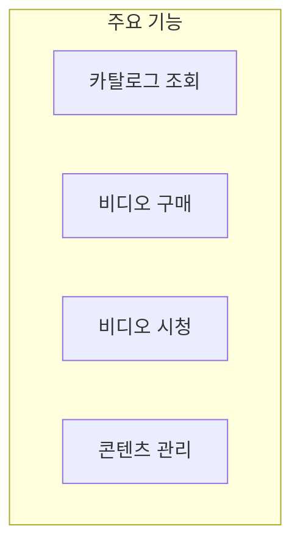
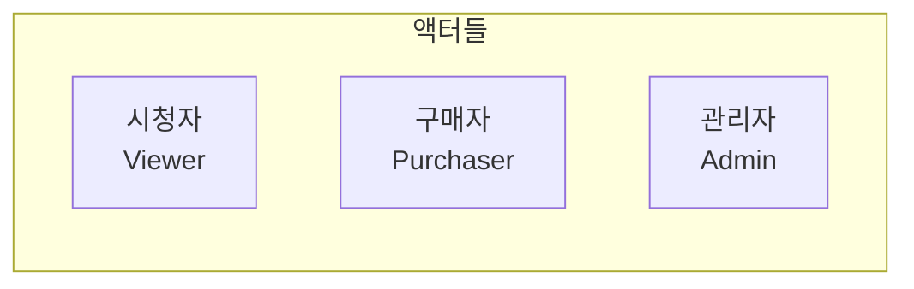
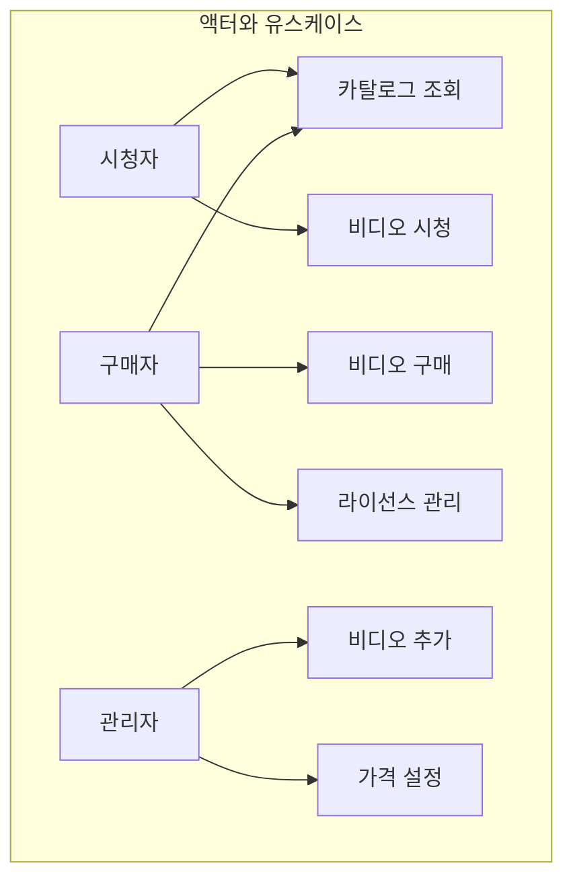
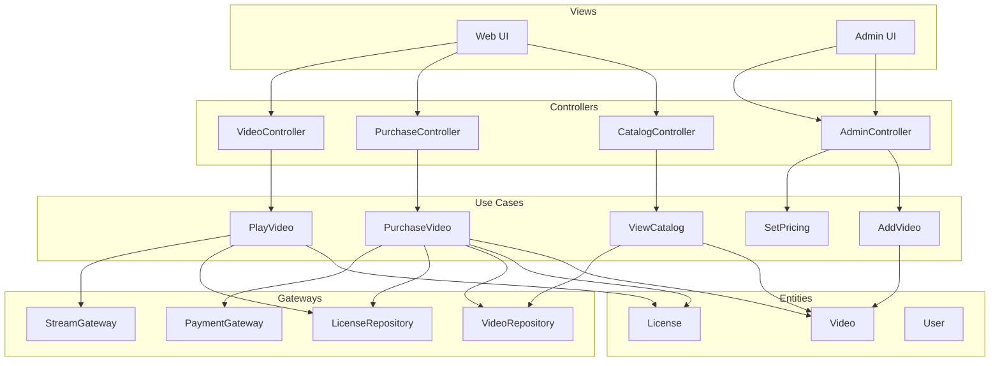
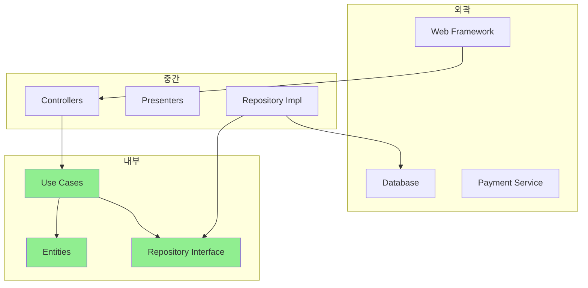
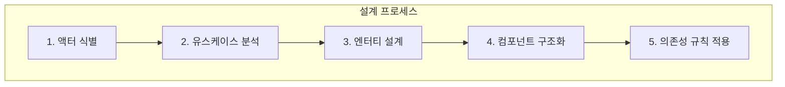

이 장에서는 **비디오 판매 시스템**을 예제로 Clean Architecture 설계 과정을 살펴본다.

## 제품 요구사항

온라인 비디오 판매 웹사이트를 설계한다.

### 기능 요구사항

| 기능 | 설명 |
|------|------|
| 비디오 카탈로그 | 판매 가능한 비디오 목록 제공 |
| 라이선스 판매 | 개인/기업 라이선스 구분 |
| 콘텐츠 전달 | 스트리밍/다운로드 지원 |
| 사용자 관리 | 고객 계정, 관리자 계정 |



## 액터 식별

시스템과 상호작용하는 **액터(Actor)**를 식별한다.



| 액터 | 역할 | 주요 활동 |
|------|------|----------|
| 시청자 | 비디오 시청 | 카탈로그 조회, 비디오 시청 |
| 구매자 | 비디오 구매 | 라이선스 구매, 결제 |
| 관리자 | 콘텐츠 관리 | 비디오 추가, 가격 설정 |

### 액터와 유스케이스의 관계



## 유스케이스 분석

각 액터별로 유스케이스를 정의한다.

### 시청자 유스케이스

```java
// 카탈로그 조회
public class ViewCatalogUseCase {
    private final VideoRepository videoRepository;
    private final CatalogPresenter presenter;
    
    public void execute(ViewCatalogRequest request) {
        List<Video> videos = videoRepository.findAllPublished();
        List<VideoSummary> summaries = videos.stream()
            .map(this::toSummary)
            .collect(Collectors.toList());
        presenter.present(summaries);
    }
}

// 비디오 시청
public class PlayVideoUseCase {
    private final LicenseRepository licenseRepository;
    private final VideoStreamGateway streamGateway;
    
    public void execute(PlayVideoRequest request) {
        License license = licenseRepository.findByUserAndVideo(
            request.getUserId(), 
            request.getVideoId()
        );
        
        if (license == null || license.isExpired()) {
            throw new NoValidLicenseException();
        }
        
        StreamUrl url = streamGateway.generateStreamUrl(
            request.getVideoId(),
            license.getType()
        );
        presenter.presentStreamUrl(url);
    }
}
```

### 구매자 유스케이스

```java
// 비디오 구매
public class PurchaseVideoUseCase {
    private final VideoRepository videoRepository;
    private final PaymentGateway paymentGateway;
    private final LicenseRepository licenseRepository;
    
    public void execute(PurchaseRequest request) {
        // 1. 비디오 확인
        Video video = videoRepository.findById(request.getVideoId())
            .orElseThrow(() -> new VideoNotFoundException());
        
        // 2. 가격 계산
        Price price = video.getPriceFor(request.getLicenseType());
        
        // 3. 결제 처리
        PaymentResult result = paymentGateway.charge(
            request.getPaymentInfo(),
            price
        );
        
        if (result.isDeclined()) {
            presenter.presentPaymentFailed(result.getReason());
            return;
        }
        
        // 4. 라이선스 생성
        License license = License.create(
            request.getUserId(),
            request.getVideoId(),
            request.getLicenseType()
        );
        licenseRepository.save(license);
        
        // 5. 결과 전달
        presenter.presentPurchaseSuccess(license);
    }
}
```

### 관리자 유스케이스

```java
// 비디오 추가
public class AddVideoUseCase {
    private final VideoRepository videoRepository;
    private final VideoEncoder encoder;
    
    public void execute(AddVideoRequest request) {
        // 1. 비디오 엔터티 생성
        Video video = Video.create(
            request.getTitle(),
            request.getDescription(),
            request.getCategory()
        );
        
        // 2. 인코딩 작업 시작
        encoder.encode(request.getRawVideoFile(), video.getId());
        
        // 3. 저장
        videoRepository.save(video);
        
        presenter.presentVideoAdded(video);
    }
}

// 가격 설정
public class SetPricingUseCase {
    private final VideoRepository videoRepository;
    
    public void execute(SetPricingRequest request) {
        Video video = videoRepository.findById(request.getVideoId())
            .orElseThrow(() -> new VideoNotFoundException());
        
        video.setPricing(
            request.getPersonalPrice(),
            request.getBusinessPrice()
        );
        
        videoRepository.save(video);
        presenter.presentPricingUpdated(video);
    }
}
```

## 컴포넌트 아키텍처

### 전체 구조



### 패키지 구조

```
com.videosales/
├── catalog/
│   ├── ViewCatalogUseCase.java
│   ├── CatalogPresenter.java
│   ├── CatalogController.java
│   └── CatalogViewModel.java
├── viewing/
│   ├── PlayVideoUseCase.java
│   ├── StreamPresenter.java
│   ├── VideoController.java
│   └── StreamViewModel.java
├── purchase/
│   ├── PurchaseVideoUseCase.java
│   ├── PurchasePresenter.java
│   ├── PurchaseController.java
│   └── PurchaseViewModel.java
├── admin/
│   ├── AddVideoUseCase.java
│   ├── SetPricingUseCase.java
│   ├── AdminPresenter.java
│   └── AdminController.java
├── entities/
│   ├── Video.java
│   ├── License.java
│   ├── User.java
│   └── Price.java
└── gateways/
    ├── VideoRepository.java
    ├── LicenseRepository.java
    ├── PaymentGateway.java
    └── StreamGateway.java
```

### 계층별 분리

```
[Views / Web UI]
       ↓
[Controllers] ← [Presenters]
       ↓              ↑
[Use Cases / Interactors]
       ↓
[Entities]
       ↓
[Gateways / Interfaces]
       ↓
[Frameworks / Infrastructure]
```

## 의존성 규칙 적용



### 의존성 방향

| 레이어 | 의존 대상 | 의존 금지 |
|--------|----------|----------|
| Entities | 없음 | 모든 것 |
| Use Cases | Entities | Controllers, DB |
| Controllers | Use Cases | DB, 외부 서비스 |
| Infrastructure | 모든 것 | (최외곽) |

## 엔터티 설계

```java
// Video 엔터티
public class Video {
    private final VideoId id;
    private String title;
    private String description;
    private Category category;
    private VideoStatus status;
    private Pricing pricing;
    
    public Price getPriceFor(LicenseType type) {
        return pricing.getPrice(type);
    }
    
    public boolean isAvailable() {
        return status == VideoStatus.PUBLISHED;
    }
    
    public void publish() {
        if (pricing == null) {
            throw new PricingNotSetException();
        }
        status = VideoStatus.PUBLISHED;
    }
}

// License 엔터티
public class License {
    private final LicenseId id;
    private final UserId userId;
    private final VideoId videoId;
    private final LicenseType type;
    private final LocalDateTime expiresAt;
    
    public boolean isExpired() {
        return LocalDateTime.now().isAfter(expiresAt);
    }
    
    public boolean isValid() {
        return !isExpired();
    }
    
    public static License create(UserId user, VideoId video, LicenseType type) {
        LocalDateTime expiry = calculateExpiry(type);
        return new License(
            LicenseId.generate(),
            user,
            video,
            type,
            expiry
        );
    }
}
```

## 테스트 전략

```java
// 유스케이스 단위 테스트
class PurchaseVideoUseCaseTest {
    
    @Test
    void shouldCreateLicenseOnSuccessfulPurchase() {
        // Given
        VideoRepository videoRepo = new InMemoryVideoRepository();
        LicenseRepository licenseRepo = new InMemoryLicenseRepository();
        PaymentGateway payment = new MockPaymentGateway(PaymentResult.success());
        
        Video video = createVideo(100);
        videoRepo.save(video);
        
        PurchaseVideoUseCase useCase = new PurchaseVideoUseCase(
            videoRepo, payment, licenseRepo
        );
        
        // When
        useCase.execute(new PurchaseRequest(
            userId, video.getId(), LicenseType.PERSONAL, paymentInfo
        ));
        
        // Then
        License license = licenseRepo.findByUserAndVideo(userId, video.getId());
        assertThat(license).isNotNull();
        assertThat(license.getType()).isEqualTo(LicenseType.PERSONAL);
    }
    
    @Test
    void shouldNotCreateLicenseOnPaymentFailure() {
        // Given
        PaymentGateway payment = new MockPaymentGateway(
            PaymentResult.declined("Insufficient funds")
        );
        
        // When & Then
        // ...
    }
}
```

## 핵심 요약



| 단계 | 활동 |
|------|------|
| 액터 식별 | 시청자, 구매자, 관리자 |
| 유스케이스 분석 | 각 액터별 기능 정의 |
| 엔터티 설계 | Video, License, User |
| 컴포넌트 구조화 | 유스케이스별 패키지 |
| 의존성 규칙 | 안쪽으로만 의존 |

> **"실제 시스템도 같은 원칙을 적용한다. 액터를 찾고, 유스케이스를 분석하고, 의존성 규칙을 지키면서 컴포넌트를 설계한다."**
> — Robert C. Martin
