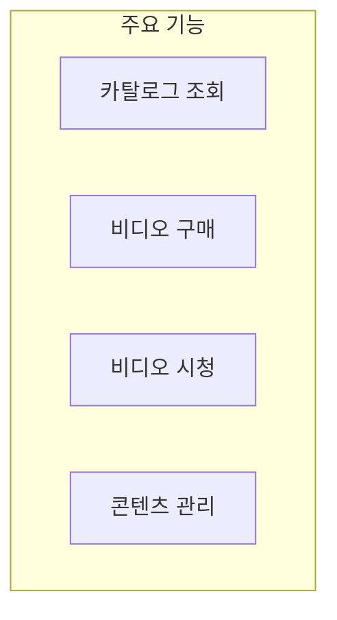
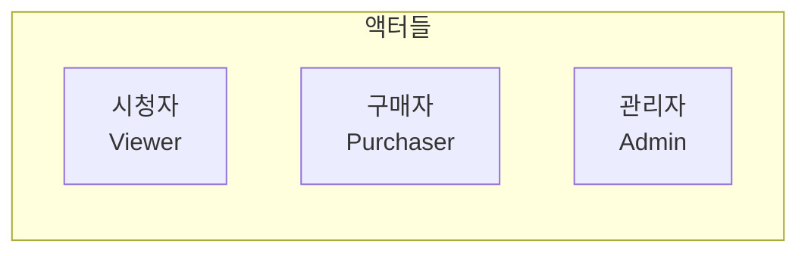
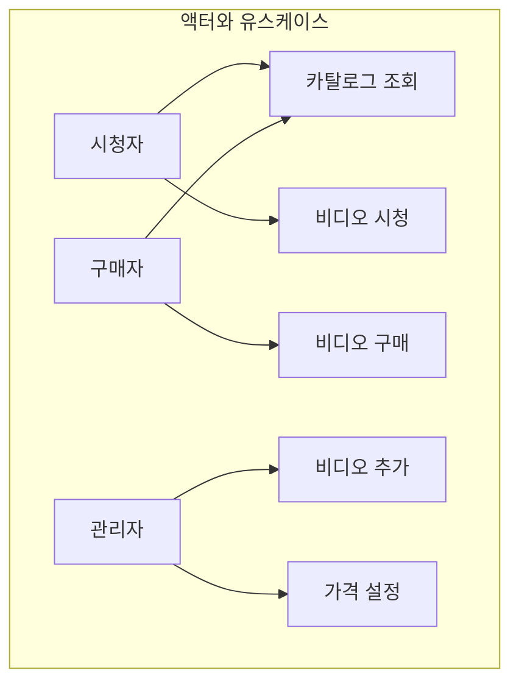
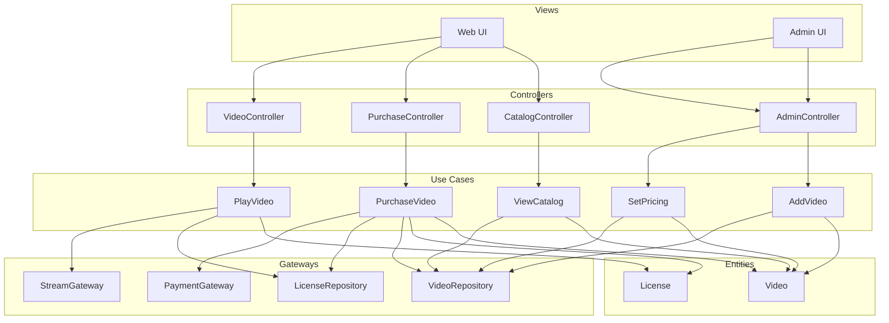
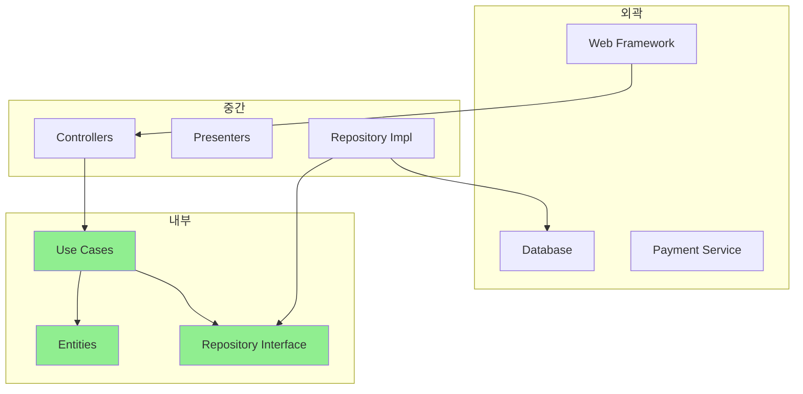

지금까지 데이터베이스([41장](/post/clean-architecture/database-is-detail-persistence/))·웹([42장](/post/clean-architecture/web-is-detail-gui-history/))·프레임워크([43장](/post/clean-architecture/framework-is-detail-coupling-risk/))가 각각 왜 세부사항인지 개별적으로 다뤘다. 이 장에서는 그 원칙들을 하나의 시스템에 함께 적용해본다 — **비디오 판매 시스템**을 예제로 Clean Architecture 설계 과정을 살펴본다.

## 제품 요구사항

온라인 비디오 판매 웹사이트를 설계한다.

### 기능 요구사항

| 기능 | 설명 |
|------|------|
| 비디오 카탈로그 | 판매 가능한 비디오 목록 제공 |
| 라이선스 판매 | 개인/기업 라이선스 구분 |
| 콘텐츠 전달 | 스트리밍/다운로드 지원 |
| 사용자 관리 | 고객 계정, 관리자 계정 |


```mermaid
flowchart TB
    subgraph Features [주요 기능]
        CAT[카탈로그 조회]
        PUR[비디오 구매]
        VIEW[비디오 시청]
        ADMIN[콘텐츠 관리]
    end
```

## 액터 식별

시스템과 상호작용하는 <strong>액터(Actor)</strong>를 식별한다.


```mermaid
flowchart LR
    subgraph Actors [액터들]
        VIEWER[시청자<br/>Viewer]
        PURCHASER[구매자<br/>Purchaser]
        ADMIN[관리자<br/>Admin]
    end
```

| 액터 | 역할 | 주요 활동 |
|------|------|----------|
| 시청자 | 비디오 시청 | 카탈로그 조회, 비디오 시청 |
| 구매자 | 비디오 구매 | 라이선스 구매, 결제 |
| 관리자 | 콘텐츠 관리 | 비디오 추가, 가격 설정 |

### 액터와 유스케이스의 관계


```mermaid
flowchart TB
    subgraph ActorsUseCases [액터와 유스케이스]
        V[시청자]
        P[구매자]
        A[관리자]
        
        UC1[카탈로그 조회]
        UC2[비디오 시청]
        UC3[비디오 구매]
        UC5[비디오 추가]
        UC6[가격 설정]
    end
    
    V --> UC1
    V --> UC2
    P --> UC1
    P --> UC3
    A --> UC5
    A --> UC6
```

이 장은 다섯 유스케이스만 구현까지 다룬다. 실제 제품이라면 "구매한 라이선스 목록 조회", "라이선스 환불" 같은 관리 기능도 필요하지만, 이들은 `PurchaseVideoUseCase`와 같은 패턴(Repository 조회 → 검증 → Presenter 전달)을 반복할 뿐이므로 이 장의 범위에서는 제외한다.

## 유스케이스 분석

각 액터별로 유스케이스를 정의한다.

### 시청자 유스케이스

시청자는 카탈로그를 조회하고 이미 구매한 비디오를 시청한다. 두 유스케이스 모두 "시청자가 무엇을 할 수 있는가"라는 하나의 관심사에서 나왔지만, 서로 다른 Repository와 외부 게이트웨이에 의존하므로 별도 클래스로 분리한다.

```java
import java.util.List;
import java.util.stream.Collectors;

class Video {}
class VideoSummary {}
class ViewCatalogRequest {}
interface VideoRepository { List<Video> findAllPublished(); }
interface CatalogPresenter { void present(List<VideoSummary> summaries); }

// 카탈로그 조회
public class ViewCatalogUseCase {
    private final VideoRepository videoRepository;
    private final CatalogPresenter presenter;

    public ViewCatalogUseCase(VideoRepository videoRepository, CatalogPresenter presenter) {
        this.videoRepository = videoRepository;
        this.presenter = presenter;
    }

    public void execute(ViewCatalogRequest request) {
        List<Video> videos = videoRepository.findAllPublished();
        List<VideoSummary> summaries = videos.stream()
            .map(this::toSummary)
            .collect(Collectors.toList());
        presenter.present(summaries);
    }

    private VideoSummary toSummary(Video video) { return new VideoSummary(); }
}
```

비디오 시청은 다르다 — 결제 여부가 아니라 **유효한 라이선스 보유 여부**가 핵심 규칙이며, 스트리밍 URL을 발급하는 별도 게이트웨이가 필요하다.

```java
class License {
    boolean isExpired() { return false; }
    String getType() { return "PERSONAL"; }
}
class PlayVideoRequest {
    String getUserId() { return ""; }
    String getVideoId() { return ""; }
}
class StreamUrl {}
class NoValidLicenseException extends RuntimeException {}
interface LicenseRepository { License findByUserAndVideo(String userId, String videoId); }
interface VideoStreamGateway { StreamUrl generateStreamUrl(String videoId, String licenseType); }
interface StreamPresenter { void presentStreamUrl(StreamUrl url); }

// 비디오 시청
public class PlayVideoUseCase {
    private final LicenseRepository licenseRepository;
    private final VideoStreamGateway streamGateway;
    private final StreamPresenter presenter;

    public PlayVideoUseCase(LicenseRepository licenseRepository, VideoStreamGateway streamGateway, StreamPresenter presenter) {
        this.licenseRepository = licenseRepository;
        this.streamGateway = streamGateway;
        this.presenter = presenter;
    }

    public void execute(PlayVideoRequest request) {
        License license = licenseRepository.findByUserAndVideo(
            request.getUserId(),
            request.getVideoId()
        );

        if (license == null || license.isExpired()) {
            throw new NoValidLicenseException();
        }

        StreamUrl url = streamGateway.generateStreamUrl(
            request.getVideoId(),
            license.getType()
        );
        presenter.presentStreamUrl(url);
    }
}
```

`ViewCatalogUseCase`와 `PlayVideoUseCase`를 하나로 합치지 않고 분리한 이유가 이 코드에서 드러난다 — 전자는 `VideoRepository`·`CatalogPresenter`에, 후자는 `LicenseRepository`·`VideoStreamGateway`·`StreamPresenter`에 의존한다. 만약 두 유스케이스를 하나의 클래스로 합쳤다면, 카탈로그 조회 로직을 바꿀 때마다 스트리밍 게이트웨이와 무관한 코드까지 재컴파일·재테스트해야 했을 것이다.

### 구매자 유스케이스

구매 유스케이스는 이 시스템에서 가장 많은 단계를 거친다 — 비디오 확인, 가격 계산, 결제, 라이선스 발급까지 네 단계가 순서대로 실행되며, 각 단계는 실패할 수 있는 지점이다. 이 절차 자체가 비즈니스 규칙이므로, 결제 게이트웨이나 저장 방식이 바뀌어도 이 순서와 실패 처리 로직은 그대로 유지되어야 한다.

```java
import java.util.Optional;

class Video {
    Price getPriceFor(String licenseType) { return new Price(); }
}
class Price {}
class PaymentInfo {}
class PurchaseRequest {
    String getVideoId() { return ""; }
    String getLicenseType() { return "PERSONAL"; }
    PaymentInfo getPaymentInfo() { return new PaymentInfo(); }
    String getUserId() { return ""; }
}
class VideoNotFoundException extends RuntimeException {}
class PaymentResult {
    boolean isDeclined() { return false; }
    String getReason() { return ""; }
}
class License {
    static License create(String userId, String videoId, String licenseType) { return new License(); }
}
interface VideoRepository { Optional<Video> findById(String videoId); }
interface PaymentGateway { PaymentResult charge(PaymentInfo info, Price price); }
interface LicenseRepository { void save(License license); }
interface PurchasePresenter {
    void presentPaymentFailed(String reason);
    void presentPurchaseSuccess(License license);
}

// 비디오 구매
public class PurchaseVideoUseCase {
    private final VideoRepository videoRepository;
    private final PaymentGateway paymentGateway;
    private final LicenseRepository licenseRepository;
    private final PurchasePresenter presenter;

    public PurchaseVideoUseCase(VideoRepository videoRepository, PaymentGateway paymentGateway,
                                 LicenseRepository licenseRepository, PurchasePresenter presenter) {
        this.videoRepository = videoRepository;
        this.paymentGateway = paymentGateway;
        this.licenseRepository = licenseRepository;
        this.presenter = presenter;
    }

    public void execute(PurchaseRequest request) {
        // 1. 비디오 확인
        Video video = videoRepository.findById(request.getVideoId())
            .orElseThrow(() -> new VideoNotFoundException());

        // 2. 가격 계산
        Price price = video.getPriceFor(request.getLicenseType());

        // 3. 결제 처리
        PaymentResult result = paymentGateway.charge(
            request.getPaymentInfo(),
            price
        );

        if (result.isDeclined()) {
            presenter.presentPaymentFailed(result.getReason());
            return;
        }

        // 4. 라이선스 생성
        License license = License.create(
            request.getUserId(),
            request.getVideoId(),
            request.getLicenseType()
        );
        licenseRepository.save(license);

        // 5. 결과 전달
        presenter.presentPurchaseSuccess(license);
    }
}
```

이 코드에서 눈여겨볼 점은 실패 처리가 예외가 아니라 **반환값**(`presenter.presentPaymentFailed(...)` 후 `return`)으로 이루어진다는 것이다. 결제 거절은 시스템 오류가 아니라 정상적인 비즈니스 흐름의 일부이므로, `PaymentDeclinedException` 같은 예외를 던지는 대신 실패도 하나의 결과로 다뤄 호출자가 흐름을 예측 가능하게 만든다.

### 관리자 유스케이스

관리자 유스케이스는 시청자·구매자와는 아예 다른 관심사(콘텐츠 운영)에서 나온다. 단일 책임 원칙에 따라 이 둘을 시청자·구매자 유스케이스와 같은 클래스에 두지 않고 별도로 분리한다.

```java
class Video {
    static Video create(String title, String description, String category) { return new Video(); }
    String getId() { return ""; }
}
class AddVideoRequest {
    String getTitle() { return ""; }
    String getDescription() { return ""; }
    String getCategory() { return ""; }
    byte[] getRawVideoFile() { return new byte[0]; }
}
interface VideoRepository { void save(Video video); }
interface VideoEncoder { void encode(byte[] rawVideoFile, String videoId); }
interface AdminPresenter { void presentVideoAdded(Video video); }

// 비디오 추가
public class AddVideoUseCase {
    private final VideoRepository videoRepository;
    private final VideoEncoder encoder;
    private final AdminPresenter presenter;

    public AddVideoUseCase(VideoRepository videoRepository, VideoEncoder encoder, AdminPresenter presenter) {
        this.videoRepository = videoRepository;
        this.encoder = encoder;
        this.presenter = presenter;
    }

    public void execute(AddVideoRequest request) {
        // 1. 비디오 엔터티 생성
        Video video = Video.create(
            request.getTitle(),
            request.getDescription(),
            request.getCategory()
        );

        // 2. 인코딩 작업 시작
        encoder.encode(request.getRawVideoFile(), video.getId());

        // 3. 저장
        videoRepository.save(video);

        presenter.presentVideoAdded(video);
    }
}
```

가격 설정은 이미 존재하는 비디오를 조회해 수정하는 흐름이므로, 새 비디오를 만드는 `AddVideoUseCase`와는 다른 저장소 접근 패턴(조회 후 갱신)을 사용한다.

```java
import java.util.Optional;

class Video {
    void setPricing(Price personalPrice, Price businessPrice) {}
}
class Price {}
class SetPricingRequest {
    String getVideoId() { return ""; }
    Price getPersonalPrice() { return new Price(); }
    Price getBusinessPrice() { return new Price(); }
}
class VideoNotFoundException extends RuntimeException {}
interface VideoRepository {
    Optional<Video> findById(String videoId);
    void save(Video video);
}
interface AdminPresenter { void presentPricingUpdated(Video video); }

// 가격 설정
public class SetPricingUseCase {
    private final VideoRepository videoRepository;
    private final AdminPresenter presenter;

    public SetPricingUseCase(VideoRepository videoRepository, AdminPresenter presenter) {
        this.videoRepository = videoRepository;
        this.presenter = presenter;
    }

    public void execute(SetPricingRequest request) {
        Video video = videoRepository.findById(request.getVideoId())
            .orElseThrow(() -> new VideoNotFoundException());

        video.setPricing(
            request.getPersonalPrice(),
            request.getBusinessPrice()
        );

        videoRepository.save(video);
        presenter.presentPricingUpdated(video);
    }
}
```

여기까지 다섯 유스케이스를 살펴봤다. 눈에 띄는 공통 패턴은 모든 유스케이스가 정확히 같은 형태(`Request` 객체를 받아 → Repository·Gateway로 필요한 데이터를 모으고 → 규칙을 적용한 뒤 → `Presenter`에 결과를 넘긴다)를 따른다는 것이다. 이 반복이 우연이 아니라 Clean Architecture가 유스케이스에 요구하는 구조 자체이며, 다음 절에서 이 유스케이스들이 실제로 어떤 컴포넌트로 묶이는지 살펴본다.

## 컴포넌트 아키텍처

### 전체 구조


```mermaid
flowchart TB
    subgraph View [Views]
        WEB[Web UI]
        ADMIN_UI[Admin UI]
    end
    
    subgraph Controllers [Controllers]
        CAT_CTRL[CatalogController]
        PUR_CTRL[PurchaseController]
        VID_CTRL[VideoController]
        ADM_CTRL[AdminController]
    end
    
    subgraph UseCases [Use Cases]
        VIEW_CAT[ViewCatalog]
        PLAY[PlayVideo]
        PURCHASE[PurchaseVideo]
        ADD_VID[AddVideo]
        SET_PRICE[SetPricing]
    end
    
    subgraph Entities [Entities]
        VIDEO[Video]
        LICENSE[License]
    end
    
    subgraph Gateways [Gateways]
        VID_REPO[VideoRepository]
        LIC_REPO[LicenseRepository]
        PAY_GW[PaymentGateway]
        STREAM_GW[StreamGateway]
    end
    
    WEB --> CAT_CTRL --> VIEW_CAT
    WEB --> PUR_CTRL --> PURCHASE
    WEB --> VID_CTRL --> PLAY
    ADMIN_UI --> ADM_CTRL --> ADD_VID
    ADMIN_UI --> ADM_CTRL --> SET_PRICE
    
    VIEW_CAT --> VIDEO
    PLAY --> LICENSE
    PURCHASE --> VIDEO
    PURCHASE --> LICENSE
    ADD_VID --> VIDEO
    SET_PRICE --> VIDEO
    
    VIEW_CAT --> VID_REPO
    PLAY --> LIC_REPO
    PLAY --> STREAM_GW
    PURCHASE --> VID_REPO
    PURCHASE --> LIC_REPO
    PURCHASE --> PAY_GW
    ADD_VID --> VID_REPO
    SET_PRICE --> VID_REPO
```

이 다이어그램은 앞서 구현한 코드와 정확히 대응한다 — `AddVideoUseCase`가 `videoRepository.save(video)`를 호출하고 `SetPricingUseCase`가 `videoRepository.findById(...)`·`save(...)`와 `video.setPricing(...)`을 호출하는 것이 각각 `ADD_VID --> VID_REPO`, `SET_PRICE --> VID_REPO`, `SET_PRICE --> VIDEO` 화살표로 나타난다. 다이어그램의 화살표 하나하나가 실제 코드의 메서드 호출과 짝을 이루지 않으면, 다이어그램은 설계 문서가 아니라 그림이 되어버린다.

### 패키지 구조

```
com.videosales/
├── catalog/
│   ├── ViewCatalogUseCase.java
│   ├── CatalogPresenter.java
│   ├── CatalogController.java
│   └── CatalogViewModel.java
├── viewing/
│   ├── PlayVideoUseCase.java
│   ├── StreamPresenter.java
│   ├── VideoController.java
│   └── StreamViewModel.java
├── purchase/
│   ├── PurchaseVideoUseCase.java
│   ├── PurchasePresenter.java
│   ├── PurchaseController.java
│   └── PurchaseViewModel.java
├── admin/
│   ├── AddVideoUseCase.java
│   ├── SetPricingUseCase.java
│   ├── AdminPresenter.java
│   └── AdminController.java
├── entities/
│   ├── Video.java
│   ├── License.java
│   └── Price.java
└── gateways/
    ├── VideoRepository.java
    ├── LicenseRepository.java
    ├── PaymentGateway.java
    └── StreamGateway.java
```

이 패키지 구조는 앞서 액터별로 나눴던 유스케이스 그룹(시청자→`catalog`/`viewing`, 구매자→`purchase`, 관리자→`admin`)을 그대로 최상위 패키지로 옮긴 것이다 — [45장에서 다룰 "기능별 패키지(Package by Feature)"](/post/clean-architecture/missing-chapter-package-structure/)에 해당하며, `entities`·`gateways`만 별도로 분리해 액터를 가로지르는 공유 자산임을 드러낸다.

### 계층별 분리

```
[Views / Web UI]
       ↓
[Controllers] ← [Presenters]
       ↓              ↑
[Use Cases / Interactors]
       ↓
[Entities]
       ↓
[Gateways / Interfaces]
       ↓
[Frameworks / Infrastructure]
```

이 흐름은 41–43장에서 각각 데이터베이스·웹·프레임워크를 "세부사항"으로 분리했던 원칙을 하나의 그림으로 합친 것이다 — 화살표가 아래로 갈수록 정책에서 세부사항으로 이동하며, `Gateways`와 `Frameworks`는 언제든 교체 가능한 반면 `Entities`와 `Use Cases`는 어떤 기술 변화에도 흔들리지 않는다.

## 의존성 규칙 적용


```mermaid
flowchart TB
    subgraph Outer [외곽]
        WEB[Web Framework]
        DB[Database]
        PAY[Payment Service]
    end
    
    subgraph Middle [중간]
        CTRL[Controllers]
        PRES[Presenters]
        REPO_IMPL[Repository Impl]
    end
    
    subgraph Inner [내부]
        UC[Use Cases]
        ENT[Entities]
        REPO_INTF[Repository Interface]
    end
    
    WEB --> CTRL
    CTRL --> UC
    UC --> ENT
    UC --> REPO_INTF
    REPO_IMPL --> REPO_INTF
    REPO_IMPL --> DB
    
    style ENT fill:#90EE90
    style UC fill:#90EE90
    style REPO_INTF fill:#90EE90
```

### 의존성 방향

| 레이어 | 의존 대상 | 의존 금지 |
|--------|----------|----------|
| Entities | 없음 | 모든 것 |
| Use Cases | Entities | Controllers, DB |
| Controllers | Use Cases | DB, 외부 서비스 |
| Infrastructure | 모든 것 | (최외곽) |

## 엔터티 설계

앞서 유스케이스 코드에서 스텁으로만 다뤘던 `Video`와 `License`를 이제 실제 엔터티로 설계한다. 엔터티는 유스케이스 여러 개에서 공유되는 핵심 비즈니스 규칙을 담는다 — `Video.publish()`가 가격이 설정되지 않은 비디오의 공개를 막는 것, `License.isExpired()`가 만료 여부를 스스로 판단하는 것이 그 예다. 이 규칙들은 어떤 유스케이스가 호출하든 항상 동일하게 적용되어야 하므로, 유스케이스가 아니라 엔터티 안에 둔다.

```java
enum VideoStatus { DRAFT, PUBLISHED }
class VideoId { static VideoId generate() { return new VideoId(); } }
class Category {}
class LicenseType {}
class Price {}
class Pricing {
    Price getPrice(LicenseType type) { return new Price(); }
}
class PricingNotSetException extends RuntimeException {}

// Video 엔터티
public class Video {
    private final VideoId id;
    private String title;
    private String description;
    private Category category;
    private VideoStatus status;
    private Pricing pricing;

    public Video(VideoId id, String title, String description, Category category) {
        this.id = id;
        this.title = title;
        this.description = description;
        this.category = category;
        this.status = VideoStatus.DRAFT;
    }

    public Price getPriceFor(LicenseType type) {
        return pricing.getPrice(type);
    }

    public boolean isAvailable() {
        return status == VideoStatus.PUBLISHED;
    }

    public void publish() {
        if (pricing == null) {
            throw new PricingNotSetException();
        }
        status = VideoStatus.PUBLISHED;
    }

    public VideoId getId() { return id; }
}
```

`License`는 `Video`와 독립적인 라이프사이클을 갖는다. 비디오는 한 번 발행되면 오래 유지되지만, 라이선스는 구매 시점마다 새로 생성되고 유형에 따라 만료 시점이 다르다 — 이 둘을 하나의 엔터티로 합치면 "비디오 정보 수정"과 "라이선스 발급"이라는 서로 무관한 두 가지 변경 이유가 한 클래스에 섞이게 된다.

```java
import java.time.LocalDateTime;

class LicenseId { static LicenseId generate() { return new LicenseId(); } }
class UserId {}
class VideoId {}
class LicenseType {}

// License 엔터티
public class License {
    private final LicenseId id;
    private final UserId userId;
    private final VideoId videoId;
    private final LicenseType type;
    private final LocalDateTime expiresAt;

    private License(LicenseId id, UserId userId, VideoId videoId, LicenseType type, LocalDateTime expiresAt) {
        this.id = id;
        this.userId = userId;
        this.videoId = videoId;
        this.type = type;
        this.expiresAt = expiresAt;
    }

    public boolean isExpired() {
        return LocalDateTime.now().isAfter(expiresAt);
    }

    public boolean isValid() {
        return !isExpired();
    }

    public static License create(UserId user, VideoId video, LicenseType type) {
        LocalDateTime expiry = calculateExpiry(type);
        return new License(
            LicenseId.generate(),
            user,
            video,
            type,
            expiry
        );
    }

    private static LocalDateTime calculateExpiry(LicenseType type) {
        return LocalDateTime.now().plusYears(1);
    }
}
```

`License`가 생성자를 `private`으로 감추고 정적 팩토리(`License.create()`)만 공개하는 이유는, 만료 시점 계산처럼 "라이선스가 생성되는 순간 반드시 지켜야 하는 규칙"을 생성자 밖에서 실수로 건너뛸 수 없게 만들기 위함이다. `Video`는 상태 전이 규칙(`publish()`)이 생성 시점이 아니라 생성 이후에 적용되므로 public 생성자로도 충분하다 — 두 엔터티가 서로 다른 방식을 택한 것은 "규칙을 언제 강제해야 하는가"가 다르기 때문이지, 설계 원칙이 일관되지 않아서가 아니다.

## 테스트 전략

앞서 강조했듯, `PurchaseVideoUseCase`는 프레임워크·DB·결제 게이트웨이를 전혀 언급하지 않는 순수 클래스다. 이 덕분에 각 인터페이스(`VideoRepository`, `LicenseRepository`, `PaymentGateway`)를 인메모리·목(mock) 구현체로 갈아 끼우면, 실제 DB나 결제 서비스 없이도 "결제 성공 시 라이선스가 생성되는가", "결제 실패 시 생성되지 않는가"라는 비즈니스 규칙을 밀리초 단위로 검증할 수 있다. 아래 테스트는 이 장 전체를 하나의 예제로 압축하기 위해 `LicenseId`·`UserId` 같은 값 객체 대신 문자열을 직접 사용하는 단순화된 `License`·`Video` 스텁을 로컬로 재정의한다 — "엔터티 설계" 절의 실제 값 객체 기반 설계와는 별개로, 유스케이스 테스트 작성 패턴 자체를 보여주는 데 집중한다.

```java
import java.util.HashMap;
import java.util.Map;
import java.util.Optional;
import org.junit.jupiter.api.Test;
import static org.assertj.core.api.Assertions.assertThat;

class Video {
    private final String id;
    Video(String id) { this.id = id; }
    String getId() { return id; }
    Price getPriceFor(String licenseType) { return new Price(); }
}
class Price {}
class PaymentInfo {}
class License {
    private final String userId;
    private final String videoId;
    private final String type;
    License(String userId, String videoId, String type) {
        this.userId = userId; this.videoId = videoId; this.type = type;
    }
    String getType() { return type; }
}
class PurchaseRequest {
    private final String userId; private final String videoId; private final String licenseType; private final PaymentInfo paymentInfo;
    PurchaseRequest(String userId, String videoId, String licenseType, PaymentInfo paymentInfo) {
        this.userId = userId; this.videoId = videoId; this.licenseType = licenseType; this.paymentInfo = paymentInfo;
    }
    String getUserId() { return userId; }
    String getVideoId() { return videoId; }
    String getLicenseType() { return licenseType; }
    PaymentInfo getPaymentInfo() { return paymentInfo; }
}
class VideoNotFoundException extends RuntimeException {}
class PaymentResult {
    private final boolean declined; private final String reason;
    private PaymentResult(boolean declined, String reason) { this.declined = declined; this.reason = reason; }
    static PaymentResult success() { return new PaymentResult(false, null); }
    static PaymentResult declined(String reason) { return new PaymentResult(true, reason); }
    boolean isDeclined() { return declined; }
    String getReason() { return reason; }
}
interface VideoRepository { Optional<Video> findById(String videoId); void save(Video video); }
interface LicenseRepository { void save(License license); License findByUserAndVideo(String userId, String videoId); }
interface PaymentGateway { PaymentResult charge(PaymentInfo info, Price price); }
interface PurchasePresenter {
    void presentPaymentFailed(String reason);
    void presentPurchaseSuccess(License license);
}
class InMemoryVideoRepository implements VideoRepository {
    private final Map<String, Video> store = new HashMap<>();
    public Optional<Video> findById(String videoId) { return Optional.ofNullable(store.get(videoId)); }
    public void save(Video video) { store.put(video.getId(), video); }
}
class InMemoryLicenseRepository implements LicenseRepository {
    private final Map<String, License> store = new HashMap<>();
    public void save(License license) { store.put("key", license); }
    public License findByUserAndVideo(String userId, String videoId) { return store.get("key"); }
}
class MockPaymentGateway implements PaymentGateway {
    private final PaymentResult result;
    MockPaymentGateway(PaymentResult result) { this.result = result; }
    public PaymentResult charge(PaymentInfo info, Price price) { return result; }
}
class FakePurchasePresenter implements PurchasePresenter {
    public void presentPaymentFailed(String reason) {}
    public void presentPurchaseSuccess(License license) {}
}
class PurchaseVideoUseCase {
    private final VideoRepository videoRepository;
    private final PaymentGateway paymentGateway;
    private final LicenseRepository licenseRepository;
    private final PurchasePresenter presenter;

    PurchaseVideoUseCase(VideoRepository videoRepository, PaymentGateway paymentGateway,
                          LicenseRepository licenseRepository, PurchasePresenter presenter) {
        this.videoRepository = videoRepository;
        this.paymentGateway = paymentGateway;
        this.licenseRepository = licenseRepository;
        this.presenter = presenter;
    }

    void execute(PurchaseRequest request) {
        Video video = videoRepository.findById(request.getVideoId())
            .orElseThrow(() -> new VideoNotFoundException());
        Price price = video.getPriceFor(request.getLicenseType());
        PaymentResult result = paymentGateway.charge(request.getPaymentInfo(), price);
        if (result.isDeclined()) {
            presenter.presentPaymentFailed(result.getReason());
            return;
        }
        License license = new License(request.getUserId(), request.getVideoId(), request.getLicenseType());
        licenseRepository.save(license);
        presenter.presentPurchaseSuccess(license);
    }
}

// 유스케이스 단위 테스트
public class PurchaseVideoUseCaseTest {

    @Test
    void shouldCreateLicenseOnSuccessfulPurchase() {
        // Given
        VideoRepository videoRepo = new InMemoryVideoRepository();
        LicenseRepository licenseRepo = new InMemoryLicenseRepository();
        PaymentGateway payment = new MockPaymentGateway(PaymentResult.success());

        Video video = new Video("video-1");
        videoRepo.save(video);

        PurchaseVideoUseCase useCase = new PurchaseVideoUseCase(
            videoRepo, payment, licenseRepo, new FakePurchasePresenter()
        );

        // When
        useCase.execute(new PurchaseRequest(
            "user-1", video.getId(), "PERSONAL", new PaymentInfo()
        ));

        // Then
        License license = licenseRepo.findByUserAndVideo("user-1", video.getId());
        assertThat(license).isNotNull();
        assertThat(license.getType()).isEqualTo("PERSONAL");
    }

    @Test
    void shouldNotCreateLicenseOnPaymentFailure() {
        // Given
        VideoRepository videoRepo = new InMemoryVideoRepository();
        LicenseRepository licenseRepo = new InMemoryLicenseRepository();
        PaymentGateway payment = new MockPaymentGateway(
            PaymentResult.declined("Insufficient funds")
        );
        Video video = new Video("video-2");
        videoRepo.save(video);
        PurchaseVideoUseCase useCase = new PurchaseVideoUseCase(
            videoRepo, payment, licenseRepo, new FakePurchasePresenter()
        );

        // When
        useCase.execute(new PurchaseRequest("user-2", video.getId(), "PERSONAL", new PaymentInfo()));

        // Then
        assertThat(licenseRepo.findByUserAndVideo("user-2", video.getId())).isNull();
    }
}
```

이 테스트가 검증하는 것은 "결제 성공/실패에 따라 라이선스가 생성되는가"라는 비즈니스 규칙이지, "인메모리 저장소가 실제 DB처럼 동작하는가"가 아니다. `InMemoryVideoRepository`·`InMemoryLicenseRepository`는 실제 트랜잭션·동시성·영속성을 전혀 흉내 내지 않으므로, 이 테스트가 통과했다고 해서 실제 JPA 구현체나 결제 게이트웨이 연동까지 검증된 것은 아니다. 그 부분은 별도의 통합 테스트([38장: 테스트 경계](/post/clean-architecture/test-boundary-testing-as-system-part/) 참고)가 담당할 몫이다.

## 흔한 오해

이 사례 연구를 "설계는 항상 액터 식별 → 유스케이스 분석 → 엔터티 설계 → 컴포넌트 구조화 → 의존성 규칙 적용의 5단계를 순서대로 밟아야 한다"는 고정된 절차로 오해하기 쉽다. 실제로는 각 단계를 오가며 반복한다 — 엔터티를 설계하다가 빠뜨린 유스케이스를 발견하기도 하고, 컴포넌트 구조를 잡다가 액터 하나가 두 그룹으로 나뉘어야 한다는 것을 뒤늦게 깨닫기도 한다. 이 장의 순서는 "설명하기 좋은 순서"이지, "반드시 지켜야 하는 순서"가 아니다.

또 다른 오해는 `ViewCatalogUseCase`·`PlayVideoUseCase`처럼 유스케이스를 잘게 쪼개면 무조건 좋은 설계라고 믿는 것이다. 이 장에서 시청자의 두 유스케이스를 분리한 이유는 단순히 "기능이 다르다"가 아니라, 서로 다른 Repository·게이트웨이에 의존하고 서로 다른 이유로 변경되기 때문이다(단일 책임 원칙). 변경 이유가 같다면 오히려 하나의 유스케이스로 묶는 것이 과도한 클래스 분할을 피하는 길이다.

## 학습 목표

이 장을 읽은 후 다음을 스스로 점검한다.

- 액터를 식별할 때 "역할"이 아니라 "변경 이유"를 기준으로 삼아야 하는 이유를 설명할 수 있는가?
- `PurchaseVideoUseCase`처럼 여러 단계로 구성된 유스케이스에서, 각 단계의 실패를 어떻게 처리하는지 코드로 보여줄 수 있는가?
- `Video`와 `License`를 하나의 엔터티로 합치지 않고 분리한 이유를 라이프사이클 차이로 설명할 수 있는가?
- 유스케이스 단위 테스트가 왜 실제 DB·결제 게이트웨이 없이도 비즈니스 규칙을 검증할 수 있는지 설명할 수 있는가?

## 판단 기준

새 기능을 설계할 때 이 장의 접근을 적용하려면 다음을 확인한다.

- 이 기능을 요청하는 사용자 그룹이 다른 그룹과 다른 이유로 변경 요청을 할 가능성이 있는가? 그렇다면 별도 액터로 식별할 후보다.
- 이 유스케이스가 여러 단계를 거치는가? 그렇다면 각 단계의 실패 지점과 그때 무엇을 반환할지 먼저 정의한다.
- 이 로직을 검증하는 테스트가 실제 인프라(DB, 외부 API) 없이 작성 가능한가? 불가능하다면 아직 프레임워크와 결합되어 있다는 신호다.

## 참고 자료

- Robert C. Martin, 『Clean Architecture』(2017), 33장 — 액터 식별부터 컴포넌트 구조화까지 사례 연구의 원출처.
- [serodriguez68/clean-architecture — Chapter 33: Case Study: Video Sales](https://github.com/serodriguez68/clean-architecture/blob/master/part-6-details.md) — 인용문 대조에 사용한 책 요약본.

## 핵심 요약

| 단계 | 활동 |
|------|------|
| 액터 식별 | 시청자, 구매자, 관리자 |
| 유스케이스 분석 | 각 액터별 기능 정의 |
| 엔터티 설계 | Video, License |
| 컴포넌트 구조화 | 유스케이스별 패키지 |
| 의존성 규칙 | 안쪽으로만 의존 |

> "Make sure your preliminary design follows the Dependency Rule: Arrows point towards the higher-level components. All arrows cross boundaries in the same direction."
> — Robert C. Martin, 『Clean Architecture』(2017), 33장
