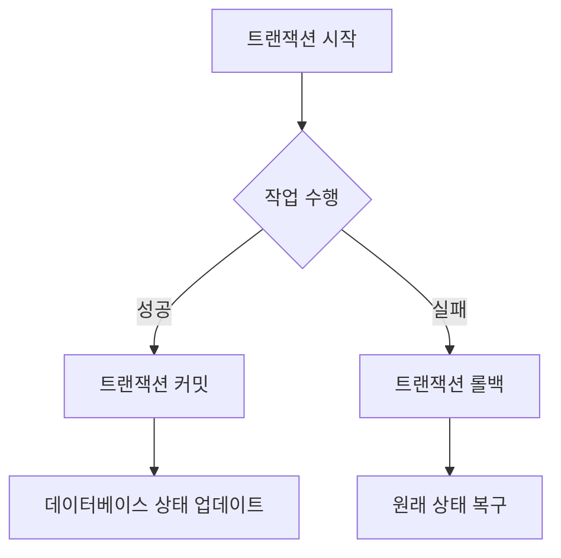
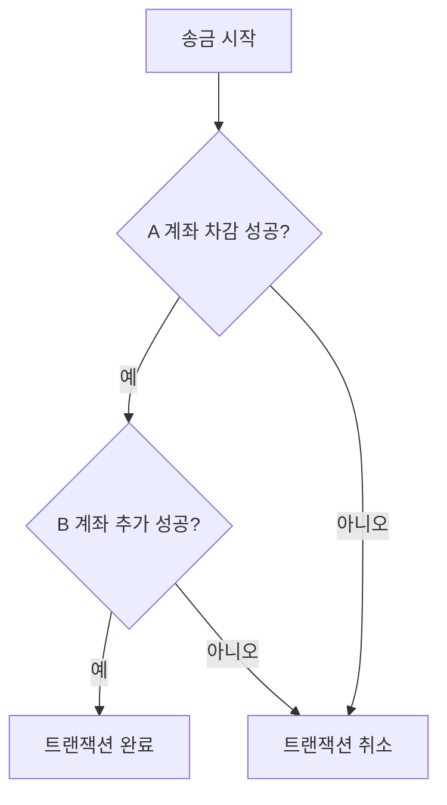
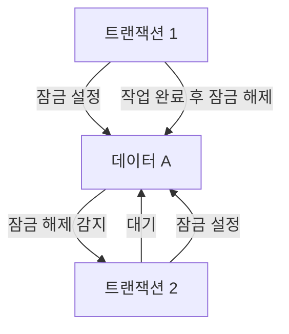
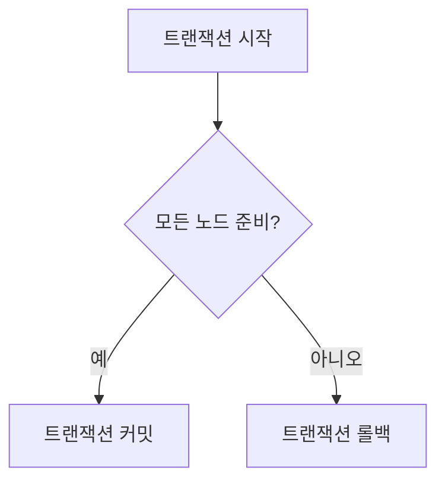

## 이 장을 읽기 전에

이 챕터는 데이터베이스 갈래의 첫 챕터로, 별도의 선행 챕터를 전제하지 않는다. "여러 작업을 하나의 단위로 묶어 처리한다"는 트랜잭션의 기본 개념만 알면 충분하다.

## 트랜잭션과 ACID: 왜 네 가지 속성이 함께 필요한가

**트랜잭션(Transaction)**은 데이터베이스에서 수행되는 여러 작업을 하나의 논리적 단위로 묶은 것이다. 은행 계좌 간 송금을 생각해보자 — A 계좌에서 금액을 차감하고 B 계좌에 금액을 추가하는 두 작업이 모두 성공해야 송금이 완료된 것이지, 하나만 성공하면 돈이 허공으로 사라지거나 복제된다. **ACID**는 이런 트랜잭션이 안전하게 동작하기 위해 갖춰야 할 네 가지 속성 — 원자성(Atomicity), 일관성(Consistency), 고립성(Isolation), 영구성(Durability) — 의 약자다.



## ACID 네 가지 속성

**원자성(Atomicity)**은 트랜잭션 내의 모든 작업이 전부 성공하거나 전부 취소되어야 한다는 속성이다. A 계좌에서 100원을 차감하는 작업은 성공했는데 B 계좌에 추가하는 작업이 실패한다면, 원자성에 따라 A 계좌의 차감도 함께 취소되어야 한다.



**일관성(Consistency)**은 트랜잭션이 완료된 뒤에도 데이터베이스가 정의된 규칙(제약 조건)을 계속 만족해야 한다는 속성이다. 예를 들어 "성적은 100점을 초과할 수 없다"는 제약이 있는 테이블에서 110점으로 갱신하려는 트랜잭션은 실패해야 하며, 데이터베이스는 이전 상태를 유지해야 한다.

**고립성(Isolation)**은 동시에 실행되는 트랜잭션들이 서로의 중간 상태를 보지 못하게 막는 속성이다. 두 트랜잭션이 같은 데이터를 동시에 수정하려 할 때, 고립성이 없으면 한쪽의 변경이 다른 쪽에 반영되지 않고 덮어써지는 **갱신 손실(Lost Update)** 같은 문제가 생긴다. 데이터베이스는 잠금이나 MVCC로 이를 방지한다. 고립성을 얼마나 엄격하게 적용할지는 데이터베이스마다 조정 가능한 값이며, 그 구체적인 4단계(Read Committed, Repeatable Read, Serializable 등)는 [트랜잭션 격리 수준](/post/computerterms/transaction-isolation-levels/)에서 다룬다.

**영구성(Durability)**은 트랜잭션이 커밋된 후에는 시스템 장애가 발생해도 그 결과가 손실되지 않아야 한다는 속성이다. 데이터베이스는 변경 사항을 로그 파일에 먼저 기록해두고(write-ahead logging), 장애 후 재시작 시 이 로그를 재생해 커밋된 트랜잭션을 복구한다. 이 로그 기반 복구 메커니즘은 [파일 시스템](/post/computerterms/file-systems/)의 저널링과 원리가 같다.

네 속성은 서로 독립된 체크리스트가 아니라 얽혀 있다. 고립성이 깨지면(다른 트랜잭션의 커밋 전 상태를 봄) 일관성 규칙 위반으로 이어질 수 있고, 원자성이 없으면 영구성이 "일부만 완료된 상태"를 영구히 저장해버리는 문제로 번진다.

## 구현 방법: 잠금, MVCC, 그리고 분산 트랜잭션

고립성을 실제로 구현하는 방법은 크게 두 가지다. **잠금(Locking)**은 트랜잭션이 데이터에 접근할 때 그 데이터를 잠가 다른 트랜잭션의 동시 접근을 막는 방식이다. 구현이 직관적이지만, 두 트랜잭션이 서로 상대가 쥔 잠금을 기다리는 **교착 상태(Deadlock)**가 발생할 수 있다.



**MVCC(Multiversion Concurrency Control)**는 데이터를 잠그는 대신 여러 버전을 동시에 유지해, 각 트랜잭션이 자신이 시작된 시점의 버전을 읽게 한다. 이 방식은 읽기가 쓰기를 기다릴 필요가 없어 잠금 방식보다 동시성이 높다. MVCC가 실제로 어떻게 버전을 관리하는지는 [MVCC](/post/computerterms/mvcc/) 챕터에서 PostgreSQL의 구현을 예로 자세히 다룬다.

여러 데이터베이스(또는 서버)에 걸쳐 실행되는 **분산 트랜잭션**은 한쪽만 커밋되고 다른 쪽은 실패하는 상황을 막기 위해 별도의 프로토콜이 필요하다. **2단계 커밋(Two-Phase Commit)**이 대표적이다 — 먼저 모든 참여 노드에게 "커밋할 수 있는가"를 묻는 준비 단계를 거치고, 전원이 동의해야만 실제 커밋 단계로 넘어간다. 한 노드라도 준비에 실패하면 전체가 롤백된다.



## 트레이드오프: 신뢰성과 성능·확장성

ACID 속성은 공짜가 아니다. 잠금이나 로그 기록 같은 메커니즘 자체가 오버헤드이므로, ACID를 엄격히 지키는 시스템은 그렇지 않은 시스템보다 처리량이 낮아지는 경향이 있다. 또한 전통적으로 ACID를 완전히 지원하는 데이터베이스는 여러 서버로 데이터를 나누기(샤딩) 어려운 구조가 많아, 대규모 분산 환경에서 확장성 제약으로 이어지기도 한다. 이 트레이드오프 때문에 일부 시스템은 ACID 대신 **BASE(Basically Available, Soft state, Eventually consistent)** 모델을 택해 일관성을 즉시가 아니라 "결국에는" 보장하는 쪽으로 성능·가용성을 확보한다.

## NoSQL 데이터베이스의 ACID 지원

NoSQL 데이터베이스는 전통적으로 BASE 모델을 택해 왔지만, 이것이 "NoSQL은 ACID를 아예 지원하지 않는다"는 뜻은 아니다. MongoDB는 4.0 버전부터 여러 문서에 걸친 트랜잭션을 지원한다.

```javascript
const { MongoClient } = require("mongodb");

async function transferData(uri) {
    const client = new MongoClient(uri);
    await client.connect();

    const session = client.startSession();
    session.startTransaction();

    try {
        const collection1 = client.db("test").collection("collection1");
        const collection2 = client.db("test").collection("collection2");

        await collection1.insertOne({ name: "Alice" }, { session });
        await collection2.insertOne({ name: "Bob" }, { session });

        await session.commitTransaction();
    } catch (error) {
        await session.abortTransaction();
        throw error;
    } finally {
        await session.endSession();
        await client.close();
    }
}
```

`MongoClient`로 연결을 맺고 `startSession()`으로 세션을 연 뒤, `startTransaction()`으로 트랜잭션을 시작한다. 두 컬렉션에 대한 삽입이 모두 성공해야 `commitTransaction()`이 실행되고, 도중 오류가 나면 `catch` 블록에서 `abortTransaction()`으로 되돌린다. Google Cloud Spanner나 Amazon DynamoDB의 트랜잭션 API도 같은 원리로 NoSQL 데이터베이스에 ACID를 부분적으로 들여온 사례다.

## 실제 사례: 금융 거래와 Delta Lake

금융 거래는 ACID가 가장 엄격하게 요구되는 분야다. 송금 트랜잭션에서 두 계좌의 잔액이 원자적으로 갱신되지 않으면 돈이 사라지거나 복제되므로, 은행 시스템은 위에서 다룬 네 속성을 모두 엄격히 지킨다.

전통적으로 ACID는 관계형 데이터베이스의 영역이었지만, 빅데이터 처리 영역에도 확장되고 있다. **Delta Lake**는 Apache Spark와 통합되는 오픈소스 스토리지 레이어로, 대규모 데이터 레이크에 ACID 트랜잭션을 도입한다 — 스냅샷 기반으로 일관성을 관리하고, 변경 로그를 기록해 영구성을 보장한다. 대용량 배치 처리에서도 트랜잭션 안전성이 필요할 수 있다는 것을 보여주는 사례다.

## 흔한 오개념

**"NoSQL 데이터베이스는 ACID를 지원하지 않는다"** — 위에서 다뤘듯 MongoDB 4.0+의 다중 문서 트랜잭션, Google Cloud Spanner, Amazon DynamoDB의 트랜잭션 API처럼 많은 NoSQL 데이터베이스가 ACID 속성을 부분적으로 또는 완전히 지원한다. "NoSQL = ACID 포기"라는 이분법은 2010년대 초반 NoSQL 초창기의 설계 경향이었을 뿐, 현재는 각 데이터베이스가 ACID와 BASE 사이 스펙트럼의 어느 지점을 택할지 개별적으로 결정한다.

**"ACID 속성 4개는 서로 독립적이다"** — 앞서 다룬 것처럼(위 "네 속성 사이의 관계" 참고) 실제로는 서로 얽혀 있다. 원자성이 없는 상태에서 커밋 전 데이터를 다른 트랜잭션이 읽어버리면, 그 자체가 고립성 위반인 동시에 나중에 롤백되면서 이미 그 값을 읽고 계산에 반영한 다른 트랜잭션까지 잘못된 결과를 영구히 저장하는 연쇄적인 문제로 번질 수 있다. 4가지를 독립된 체크리스트 항목으로만 보면, 한 속성을 지키기 위한 구현(잠금, 로그)이 다른 속성에 미치는 영향을 놓치기 쉽다.

## 다른 개념과의 연결

이 챕터에서 다룬 고립성(Isolation)은 [트랜잭션 격리 수준](/post/computerterms/transaction-isolation-levels/)에서 Read Committed·Repeatable Read·Serializable 4단계로, MVCC는 [MVCC](/post/computerterms/mvcc/)에서 더 구체적으로 다룬다. 영구성을 보장하는 로그 기반 복구 메커니즘은 [파일 시스템](/post/computerterms/file-systems/)의 저널링과 원리가 같다. 여러 데이터베이스·서버에 걸친 트랜잭션(2단계 커밋)은 [샤딩과 복제](/post/computerterms/sharding-and-replication/), [CAP 정리와 합의 알고리즘](/post/computerterms/cap-theorem-and-consensus/)에서 분산 시스템 규모로 확장해서 다룬다.

## 평가 기준

이 챕터를 읽은 후에는 다음을 할 수 있어야 한다. ACID 네 속성이 각각 트랜잭션의 어떤 실패 시나리오를 막는지 예시와 함께 설명할 수 있다. 잠금과 MVCC가 고립성을 구현하는 방식의 차이와 각각의 대가(교착 상태 vs 저장 공간)를 구분할 수 있다. NoSQL 데이터베이스가 ACID를 "아예 지원하지 않는다"는 통념이 왜 부정확한지 구체적 사례로 반박할 수 있다.

## 참고 자료

> Gray, J. (1981). "The Transaction Concept: Virtues and Limitations". *Proceedings of the 7th VLDB Conference*, 144–154.

- [Wikipedia: ACID](https://en.wikipedia.org/wiki/ACID) — ACID 4속성의 표준 정의와 역사
- [MongoDB: ACID Transactions](https://www.mongodb.com/resources/basics/databases/acid-transactions) — 문서 지향 데이터베이스에서의 ACID 지원 범위
