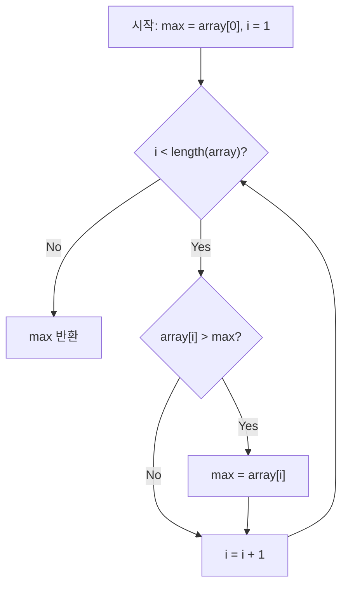

## 이 장을 읽기 전에

이 챕터는 이 컬렉션의 "알고리즘" 갈래 첫 챕터로, 별도의 사전 지식을 요구하지 않는다. 다만 이후 챕터들([알고리즘 효율성](/post/computerterms/algorithm-efficiency/), [알고리즘 분류](/post/computerterms/algorithm-classification/), [시간 복잡도](/post/computerterms/time-complexity/))이 이 챕터에서 정의하는 "알고리즘"과 "의사코드" 개념을 전제로 하므로, 순서대로 읽는 것을 권한다.

## 알고리즘이란 무엇인가

**알고리즘(Algorithm)**은 문제를 해결하기 위한 일련의 순서적인 계산·풀이 절차다. 입력값을 받아 명확한 규칙에 따라 유한한 단계를 거쳐 원하는 출력을 만들어내는 방법이며, 컴퓨터 프로그램—잘 정의된 명령어들의 집합—을 작성하는 기초가 된다. "요구되는 해로 이끄는 일련의 단계"라는 정의만으로는 일상적인 요리 레시피나 조립 설명서와 구분되지 않으므로, 아래에서 다룰 몇 가지 엄격한 특성을 만족해야 비로소 알고리즘이라 부를 수 있다. 궁극적인 목적은 문제 해결 과정을 기계(컴퓨터)로 실행 가능하게 만드는 것이다.

**어원**도 이 절차성을 뒷받침한다. Algorithm은 9세기경 바그다드에서 활동한 페르시아계 수학자 알콰리즈미(al-Khwārizmī)의 이름이 라틴어로 옮겨지는 과정에서 유래했다. 그는 십진법을 이용해 덧셈·뺄셈·곱셈·나눗셈·제곱근을 구하는 절차적 방법을 아랍어로 체계화했고, 이 저작이 유럽에 전해지며 "algorism"이라는 용어가 "체계적인 계산 절차"를 가리키게 되었다.

## 알고리즘의 필수 특징

모든 절차가 알고리즘인 것은 아니다. 도널드 커누스(Donald Knuth)는 *The Art of Computer Programming*에서 알고리즘이 반드시 만족해야 할 다섯 가지 특성을 제시했다.

| 특성 | 요구 사항 | 위반 시 결과 |
|---|---|---|
| 입력(Input) | 0개 이상의 입력을 받는다 | — |
| 출력(Output) | 반드시 1개 이상의 출력을 생성한다 | 출력이 없으면 "문제를 풀었다"고 할 수 없다 |
| 명확성(Definiteness) | 각 단계는 모호하지 않고 단순 명확해야 한다 | "적당히 큰 수를 고른다" 같은 표현은 알고리즘이 아니다 |
| 유한성(Finiteness) | 한정된 수의 단계 후 반드시 종료해야 한다 | 무한 루프에 빠지는 절차는 알고리즘이 아니다 |
| 유효성(Effectiveness) | 모든 명령은 실행 가능해야 한다 | "정확한 값을 직관으로 안다" 같은 비현실적 단계는 제외된다 |

Knuth는 TAOCP에서 이 다섯 가지에 더해 세 가지 성질—**결정성(Determinism)**, **일반성(Generality)**, **효율성(Efficiency)**—도 함께 논의한다. 결정성은 매 단계가 입력과 바로 전 단계의 결과에 따라 유일하게 결정되어야 한다는 것이고, 일반성은 특정 입력값 하나가 아니라 요구되는 모든 입력 범위에 적용 가능해야 한다는 것이며, 효율성은 가능한 한 적은 시간·공간 자원으로 동작해야 한다는 것이다. 효율성을 어떻게 측정하는지는 [알고리즘 효율성](/post/computerterms/algorithm-efficiency/)에서 자세히 다룬다.

다만 이 세 성질, 특히 결정성과 유효성은 절대적인 경계선이 아니다. 앞서 다룬 결정 알고리즘(Deterministic Algorithm)과 달리, 몬테카를로·라스베가스 같은 **확률 알고리즘(Probabilistic Algorithm)**은 실행 중 일부 결정을 난수에 맡기므로 같은 입력에도 매번 다른 실행 경로를 탄다 — 결정성을 의도적으로 완화한 것이다. 또한 최적해가 아니라 "충분히 좋은" 해를 반환하는 근사 알고리즘(Approximation Algorithm)은 유효성·정확성의 기준 자체를 "항상 정답"에서 "일정 오차 범위 내"로 낮춘다. 즉 Knuth의 다섯 특성은 알고리즘의 최소 자격 요건이지만, 결정성·완전한 정확성처럼 그 위의 성질들은 문제의 성격에 따라 의도적으로 포기되기도 한다는 점에서 절대 규범이 아니라 설계 선택에 가깝다.

## 알고리즘을 어떻게 표현하는가

문제를 해결하는 절차를 기술하는 수단으로는 일상 언어, 흐름도(순서도), 의사코드(Pseudocode), 실제 프로그래밍 언어(C, Python 등)를 모두 사용할 수 있다. 이 중 알고리즘 교육과 문헌에서 가장 널리 쓰이는 것은 **의사코드**다. 의사코드는 자연 언어도, 특정 프로그래밍 언어도 아닌 그 중간 단계의 표기법으로, 형식적이고 명확한 문장·제어 구조(조건문, 반복문, 함수 호출)는 갖추되 변수 선언 방식이나 메모리 관리 같은 구현 세부사항에는 신경 쓰지 않는다. 예를 들어 "배열에서 최댓값 찾기"를 의사코드로 쓰면 다음과 같다.

```text
find_max(array):
    max = array[0]
    for i from 1 to length(array) - 1:
        if array[i] > max:
            max = array[i]
    return max
```

이 의사코드는 어떤 언어로도 거의 그대로 옮길 수 있다. 다음은 같은 절차를 그대로 옮긴 C 구현이다.

```c
#include <stdio.h>

int find_max(const int array[], int length) {
    int max = array[0];
    for (int i = 1; i < length; i++) {
        if (array[i] > max) {
            max = array[i];
        }
    }
    return max;
}

int main(void) {
    int array[] = {3, 7, 2, 9, 4};
    int length = sizeof(array) / sizeof(array[0]);
    printf("max = %d\n", find_max(array, length));   /* 9 */
    return 0;
}
```

`gcc -std=c11 -Wall find_max.c -o find_max`로 컴파일·실행하면 의사코드의 `for i from 1 to length(array) - 1` 루프가 C의 `for (int i = 1; i < length; i++)`로, `if array[i] > max`가 그대로 `if (array[i] > max)`로 옮겨졌음을 확인할 수 있다. 같은 절차를 Python으로 옮기면 루프 구조만 파이썬 문법에 맞게 바뀔 뿐 로직은 동일하다. 이것이 "알고리즘은 언어에 무관하다"는 원칙을 보여주는 구체적 예시다.

같은 절차를 앞서 언급한 또 다른 표현 수단인 흐름도(순서도)로 그리면, 반복 구조와 선택 구조가 어떻게 맞물리는지가 더 직관적으로 드러난다.



이 흐름도의 마름모(◇)가 바로 다음 절에서 다룰 **선택 구조**이고, 화살표가 B로 되돌아가는 경로가 **반복 구조**다.

## 알고리즘을 분석하는 두 축: 효율성과 정확성

알고리즘을 만들었다고 끝이 아니다. 두 가지 축에서 분석이 필요하다. **효율성(Efficiency) 분석**은 계산 시간(시간 복잡도)과 소요 메모리(공간 복잡도)가 입력 크기 증가에 따라 얼마나 늘어나는지를 측정한다. 컴퓨팅 자원은 항상 한정되어 있으므로, 같은 문제를 푸는 여러 알고리즘 중 어느 것이 더 적은 자원으로 동작하는지 비교할 척도가 필요하다. 이 분석 방법은 [알고리즘 효율성](/post/computerterms/algorithm-efficiency/)에서 점근적 표기법(O, Ω, Θ)과 함께 자세히 다룬다. **정확성(Correctness) 분석**은 이와 별개로, 알고리즘이 모든 유효한 입력에 대해 항상 기대한 결과를 내는지를 수학적으로 증명하는 것이다. 아무리 빨라도 틀린 답을 내는 알고리즘은 쓸모가 없으므로, 효율성 분석에 앞서 정확성이 먼저 보장되어야 한다.

## 알고리즘의 제어 구조

알고리즘의 논리를 표현하고 처리 흐름을 제어하는 기본 구조는 **순차 구조**(명령을 순서대로 실행), **선택 구조**(조건에 따라 분기), **반복 구조**(조건이 만족되는 동안 반복) 세 가지로 압축된다. 앞서 그린 흐름도가 이 세 구조를 그대로 보여준다. 여기에 자기 자신을 호출하는 **재귀(Recursion)**를 더하면 네 번째 제어 방식이 된다 — 재귀는 반복 구조와 같은 문제(같은 작업의 반복)를 풀지만, 상태를 변수 갱신 대신 함수 호출 스택에 쌓아 표현한다는 점이 다르다. 어떤 복잡한 알고리즘도 결국 이 네 가지 구조의 조합으로 표현된다.

## 알고리즘을 어떻게 분류하는가

알고리즘은 다루는 문제의 종류나 설계 기법에 따라 여러 갈래로 나뉘는데, 이 챕터에서는 이후 챕터들이 각각 무엇을 다루는지 미리 짚고 넘어간다. 문제 종류를 기준으로 하면 리스트에서 값을 찾는 **탐색(Searching)**, 자료를 순서대로 재배열하는 **정렬(Sorting)**, 정점과 간선으로 이뤄진 **그래프(Graph)** 구조에서 경로나 연결 관계를 다루는 그래프 알고리즘이 대표적인 갈래다. 설계 기법을 기준으로 하면, 문제를 서로 독립적인 작은 조각으로 나눠 재귀적으로 푸는 **분할정복(Divide and Conquer)**, 부분 문제가 반복해서 겹칠 때 그 결과를 저장해 재사용하는 **동적 계획법(Dynamic Programming)**, 매 단계 그 순간 가장 좋아 보이는 선택을 하는 **탐욕(Greedy) 알고리즘** 등이 있다. 이 두 축—무엇을 푸는가, 어떤 전략으로 푸는가—과 그 밖의 분류 기준(결정적/확률적 여부)은 서로 독립적이며, 그 전체 체계는 [알고리즘 분류](/post/computerterms/algorithm-classification/)에서 다룬다.

세 가지 설계 기법 중 무엇을 고를지는 **부분 문제의 성질**로 판단한다. 부분 문제들이 서로 완전히 독립적이면(예: 배열을 반으로 나눠 각각 정렬) 분할정복으로 충분하고, 별도의 저장 공간 없이 재귀만으로 O(n log n) 같은 좋은 복잡도를 얻을 수 있다. 반대로 부분 문제가 반복해서 겹친다면(예: 피보나치 수열 계산에서 같은 항이 여러 번 재계산됨) 분할정복을 그대로 적용할 경우 지수 시간으로 폭발하므로, 계산 결과를 저장해 재사용하는 동적 계획법을 선택해야 한다. 그리디 알고리즘은 이 둘과 달리 부분 문제를 저장하지 않고 매 단계 최선의 선택만 내리는데, 이는 그 선택이 항상 전역 최적으로 이어진다는 것이 수학적으로 증명된 문제(그리디 선택 속성)에서만 안전하다 — 증명 없이 그리디를 적용하면 최적이 아닌 답을 최적인 것처럼 반환할 위험이 있다.

## 평가 기준

이 챕터를 읽은 후에는 다음을 할 수 있어야 한다. 어떤 절차가 알고리즘으로 인정되려면 만족해야 할 다섯 가지 필수 특성(입출력·명확성·유한성·유효성)을 각각 위반 사례와 함께 설명할 수 있다. 의사코드가 왜 자연 언어나 특정 프로그래밍 언어보다 알고리즘 표현에 적합한지 설명할 수 있다. 알고리즘의 효율성 분석과 정확성 분석이 서로 다른 질문에 답한다는 것을 구분해 설명할 수 있다.

## 흔한 오개념

**"알고리즘은 곧 코드다"** — 알고리즘은 특정 프로그래밍 언어와 무관한 문제 해결 절차이고, 코드는 그 절차를 특정 언어로 구현한 결과물이다. 같은 알고리즘(예: 이진 탐색)도 C, Python, 의사코드로 서로 다른 코드가 되지만 알고리즘 자체(비교 후 절반씩 줄여나가는 절차)는 동일하다. "코드를 외운다"와 "알고리즘을 이해한다"를 혼동하면, 언어가 바뀌거나 변형된 문제가 나왔을 때 응용하지 못한다.

**"효율적인 알고리즘은 항상 짧고 간단한 코드다"** — [알고리즘 효율성](/post/computerterms/algorithm-efficiency/)에서 다루듯, 효율성은 코드 줄 수가 아니라 입력 크기 증가에 따른 자원 사용량 증가율(시간·공간 복잡도)로 측정한다. 병합 정렬(O(n log n))은 버블 정렬(O(n²))보다 코드가 더 길고 복잡하지만 훨씬 효율적이다.

## 다른 개념과의 연결

이 챕터에서 다룬 효율성 분석은 [알고리즘 효율성](/post/computerterms/algorithm-efficiency/)과 [시간 복잡도](/post/computerterms/time-complexity/)에서, 주제별·설계 기법별 분류는 [알고리즘 분류](/post/computerterms/algorithm-classification/)에서 각각 더 깊이 다룬다. 실제 정렬·탐색 알고리즘의 구체적 구현과 비교는 [정렬 알고리즘](/post/computerterms/sorting-algorithms/), [탐색 알고리즘](/post/computerterms/searching-algorithms/) 챕터를 참고.

## 참고 자료

> Knuth, D. E. (1968). *The Art of Computer Programming, Volume 1: Fundamental Algorithms*. Addison-Wesley.

- [Sedgewick & Wayne, *Algorithms* (4th ed.) 공식 강의 자료](https://algs4.cs.princeton.edu/home/) — 알고리즘 정의·분석을 다루는 프린스턴대 표준 교재
- [Stanford CS161: Design and Analysis of Algorithms](https://web.stanford.edu/class/cs161/) — 알고리즘 설계·분석 대학 강의 커리큘럼
