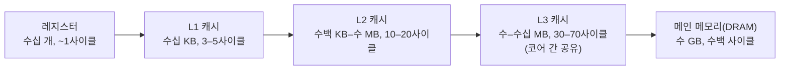

## 이 장을 읽기 전에

[레지스터와 명령어 집합 구조](/post/computerterms/registers-and-isa/)에서 레지스터가 CPU 코어 내부에 있어 가장 빠르지만 극히 작다고 다뤘다. 이 챕터는 그 레지스터와 메인 메모리 사이를 채우는 여러 단계의 캐시가 왜 필요한지, 그리고 [캐싱과 캐시 무효화](/post/computerterms/caching-and-invalidation/)에서 다룬 지역성 개념이 하드웨어 캐시에서 구체적으로 어떻게 쓰이는지를 다룬다.

## 왜 캐시가 여러 단계로 나뉘는가

레지스터는 한 사이클 만에 접근할 수 있지만 개수가 수십 개뿐이고, 메인 메모리(DRAM)는 기가바이트 단위로 크지만 접근에 수백 사이클이 걸린다. 이 둘 사이의 간극이 너무 크기 때문에, CPU 설계자는 그 사이에 크기와 속도가 단계적으로 다른 **캐시(Cache)**를 여러 겹 둔다. **L1 캐시**는 코어마다 하나씩 있고 수십 KB 수준으로 가장 작지만 레지스터 다음으로 빠르며(보통 3–5 사이클), **L2 캐시**는 수백 KB–수 MB 수준으로 더 크지만 느리고(10–20 사이클), **L3 캐시**는 여러 코어가 공유하며 수 MB–수십 MB 수준으로 가장 크지만 그만큼 느리다(30–70 사이클, 정확한 수치는 CPU 세대·제조사마다 다른 구현 정의 사항이다). 이 계층 전체를 **캐시 계층(Cache Hierarchy)**이라 부른다.



각 단계로 내려갈수록 용량은 커지고 속도는 느려지는 트레이드오프가 뚜렷하다 — 이는 회로를 CPU 다이 중심에 가깝게 둘수록 물리적으로 넣을 수 있는 용량이 줄어드는 제약과, 멀리 둘수록 신호가 오가는 물리적 거리와 배선 복잡도가 늘어나는 제약이 함께 작용한 결과다.

## 캐시 라인과 지역성

캐시는 데이터를 1바이트씩이 아니라 **캐시 라인(Cache Line)**이라는 고정 크기 블록 단위(대부분의 x86 CPU에서 64바이트, 구현 정의)로 메모리에서 읽어온다. 배열의 한 원소에 접근하면 그 원소가 속한 캐시 라인 전체가 함께 캐시에 올라오므로, 바로 다음 원소에 접근할 때는 이미 캐시에 있어 빠르게 처리된다. 이것이 [캐싱과 캐시 무효화](/post/computerterms/caching-and-invalidation/)에서 다룬 **공간 지역성(Spatial Locality)**이 하드웨어 캐시에서 실현되는 방식이다. 아래 코드는 같은 2차원 배열을 행 우선(row-major)으로 순회할 때와 열 우선으로 순회할 때의 캐시 라인 활용 차이를 보여준다.

```c
#include <stdio.h>
#include <time.h>

#define N 2000

static int arr[N][N];

/* 행 우선 순회: 메모리 상에서 연속된 위치를 따라가 캐시 라인을 재사용한다 */
long sum_row_major(void) {
    long total = 0;
    for (int i = 0; i < N; i++)
        for (int j = 0; j < N; j++)
            total += arr[i][j];
    return total;
}

/* 열 우선 순회: 매 접근마다 다른 캐시 라인으로 건너뛰어 캐시 미스가 늘어난다 */
long sum_col_major(void) {
    long total = 0;
    for (int j = 0; j < N; j++)
        for (int i = 0; i < N; i++)
            total += arr[i][j];
    return total;
}

int main(void) {
    clock_t t1 = clock();
    long a = sum_row_major();
    clock_t t2 = clock();
    long b = sum_col_major();
    clock_t t3 = clock();

    printf("row-major sum=%ld time=%.4fs\n", a, (double)(t2 - t1) / CLOCKS_PER_SEC);
    printf("col-major sum=%ld time=%.4fs\n", b, (double)(t3 - t2) / CLOCKS_PER_SEC);
    return 0;
}
```

C의 2차원 배열은 행 우선으로 메모리에 저장되므로, `sum_row_major`는 각 캐시 라인을 채운 만큼 연속해서 재사용하지만 `sum_col_major`는 매번 다음 행으로 건너뛰어 N개 원소 간격으로 떨어진 메모리에 접근한다. 실제로 컴파일해 실행하면 열 우선 순회가 행 우선 순회보다 유의미하게 느린 것을 확인할 수 있다(정확한 배율은 CPU·캐시 크기·컴파일러 최적화 수준에 따라 다르다).

**언제 이런 지역성 최적화를 신경 써야 하는가**는 그 코드가 얼마나 자주, 얼마나 큰 데이터에 대해 실행되는가로 판단한다. 행렬 연산·이미지 처리·대규모 배열 순회처럼 반복 접근이 프로그램의 핫패스(hot path)를 이루는 코드라면 순회 순서나 타일링(tiling, 데이터를 캐시 크기에 맞는 작은 블록으로 나눠 처리) 같은 지역성 최적화가 실측 가능한 성능 차이를 만든다. 반대로 한 번만 실행되는 초기화 코드나, 네트워크·디스크 I/O 대기 시간이 계산 시간을 압도하는 코드라면 캐시 지역성을 신경 쓴 최적화의 이득이 거의 없으므로, 그 시간에 가독성이나 유지보수성을 우선하는 것이 합리적이다. 최적화 여부를 감으로 판단하기보다, 먼저 프로파일러로 실제 핫패스를 확인한 뒤에 이런 미시적 최적화를 적용하는 순서가 실무에서 더 안전하다.

## 캐시 미스의 세 종류

캐시에 원하는 데이터가 없어 더 느린 다음 단계까지 내려가야 하는 상황을 **캐시 미스(Cache Miss)**라 부르며, 원인에 따라 세 가지로 나눈다. **Compulsory Miss**(강제 미스)는 데이터를 처음 접근할 때 캐시에 아직 없어서 발생하는, 어떤 캐시 정책으로도 피할 수 없는 미스다. **Capacity Miss**(용량 미스)는 작업 세트(working set)가 캐시 용량보다 커서, 앞서 올려둔 데이터가 밀려나 다시 접근할 때 발생한다. **Conflict Miss**(충돌 미스)는 캐시가 메모리 주소를 특정 위치에만 매핑하는 정책(set-associative 등) 때문에, 용량이 남아 있어도 서로 같은 캐시 위치를 두고 다투는 데이터끼리 밀어내며 발생한다.

## 비교: 캐시 계층 단계별 특성

| 단계 | 대략적 용량 | 대략적 지연시간 | 공유 범위 |
|---|---|---|---|
| L1 | 수십 KB | 3–5 사이클 | 코어 전용 |
| L2 | 수백 KB–수 MB | 10–20 사이클 | 코어 전용(설계에 따라 공유도 있음) |
| L3 | 수–수십 MB | 30–70 사이클 | 여러 코어 공유 |
| 메인 메모리 | 수 GB | 수백 사이클 | 전체 시스템 공유 |

## 흔한 오개념

**"캐시는 크면 클수록 무조건 빠르다"** — 캐시 용량과 접근 속도는 반비례 관계다. L1이 L3보다 훨씬 작은 이유는 기술 부족이 아니라, 작을수록 회로 탐색 범위가 좁아져 빨리 응답할 수 있기 때문이다. L1을 L3만큼 키우면 L1 자체의 접근 속도가 느려져 계층을 두는 의미가 사라진다.

**"캐시 미스는 다 같은 원인이다"** — compulsory·capacity·conflict 미스는 해결 방법이 다르다. compulsory miss는 프리페칭으로 완화하고, capacity miss는 작업 세트를 캐시 크기에 맞게 줄이거나 접근 패턴을 바꿔 완화하며, conflict miss는 associativity가 높은 캐시 설계나 데이터 배치 조정으로 완화한다. 원인을 구분하지 않고 무작정 캐시를 늘리는 것은 답이 아닐 수 있다.

## 다른 개념과의 연결

캐시 라인 단위 접근과 지역성 원리는 [캐싱과 캐시 무효화](/post/computerterms/caching-and-invalidation/)에서 다룬 소프트웨어 캐시의 지역성 원칙과 본질적으로 같은 아이디어를 하드웨어 수준에서 구현한 것이다. 다음 챕터에서는 이 캐시 계층을 배경으로, 하나의 명령어로 여러 데이터를 동시에 처리해 캐시 대역폭을 효율적으로 쓰는 SIMD를 다룬다.

## 평가 기준

이 챕터를 읽은 후에는 다음을 할 수 있어야 한다. 레지스터-L1-L2-L3-메인메모리 계층에서 용량과 속도가 반비례하는 이유를 설명할 수 있다. 캐시 라인과 공간 지역성이 배열 순회 성능에 미치는 영향을 코드 사례로 설명할 수 있다. compulsory·capacity·conflict 세 캐시 미스의 원인과 완화 방법을 구분할 수 있다.

## 참고 자료

> Hennessy, J. L., & Patterson, D. A. (2017). *Computer Architecture: A Quantitative Approach* (6th ed.), Chapter 2: Memory Hierarchy Design. Morgan Kaufmann.

- [Wikipedia: CPU cache](https://en.wikipedia.org/wiki/CPU_cache) — 캐시 계층·캐시 라인·미스 종류에 대한 개요
- [Agner Fog: The microarchitecture of Intel, AMD and VIA CPUs](https://www.agner.org/optimize/microarchitecture.pdf) — 실제 CPU별 캐시 크기·지연시간 실측 자료
