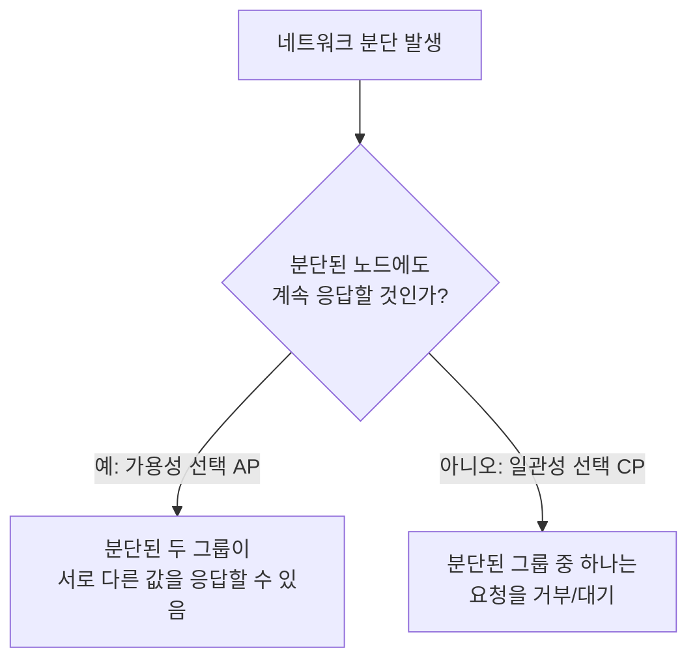

## 이 장을 읽기 전에

[샤딩과 복제](/post/computerterms/sharding-and-replication/)에서 다룬 복제 지연 문제와, [ACID Transactions](/post/computerterms/acid-transactions/)에서 다룬 일관성 개념을 안다고 가정한다. 이 챕터는 "여러 서버로 나뉜 시스템에서 일관성을 완벽히 지키는 것이 왜 근본적으로 어려운가"를 이론적으로 정리한다.

## 네트워크는 언젠가 끊긴다

여러 서버로 이뤄진 분산 시스템에서, 서버 사이의 네트워크는 케이블 단절이나 스위치 장애로 언제든 끊길 수 있다. 이렇게 일부 서버끼리 통신이 끊긴 상태를 **네트워크 분단(Network Partition)**이라 한다. 이 순간 시스템은 선택에 직면한다 — 분단된 두 그룹이 서로 다른 값을 응답하더라도 요청을 계속 처리할 것인가(가용성 유지), 아니면 안전하게 일치된 답을 줄 수 없다면 요청 자체를 거부할 것인가(일관성 유지).

## CAP 정리: 셋 중 둘만 가능하다

**CAP 정리**는 분산 시스템이 다음 세 성질을 **동시에 모두** 만족할 수 없다고 말한다. **일관성(Consistency)**: 모든 노드가 항상 같은 최신 데이터를 본다. **가용성(Availability)**: 모든 요청이 (에러 없이) 응답을 받는다. **분단 허용성(Partition Tolerance)**: 네트워크 일부가 끊겨도 시스템이 계속 동작한다. 실제 분산 시스템에서는 네트워크 분단이 발생할 수밖에 없으므로(P는 사실상 필수 조건), 현실적인 선택은 분단 상황에서 **C**를 포기할지 **A**를 포기할지의 문제로 좁혀진다.



[샤딩과 복제](/post/computerterms/sharding-and-replication/)에서 다룬 주-부 복제 시스템에서, 주 서버와 통신이 끊긴 부 서버가 계속 읽기 요청에 응답하면(가용성 유지, AP) 오래된 데이터를 줄 수 있다. 반대로 그 부 서버가 "주 서버와 통신이 안 되니 응답할 수 없다"고 거부하면(일관성 유지, CP) 데이터는 항상 정확하지만 일부 요청이 실패한다.

## CP와 AP: 실제 시스템의 선택

전통적인 관계형 데이터베이스는 대개 **CP**에 가깝게 설계된다 — 분단 시 일관성이 깨질 바에야 요청을 거부하는 쪽을 택한다. [NoSQL과 쿼리 최적화](/post/computerterms/nosql-and-query-optimization/)에서 다룬 일부 NoSQL(예: 초기 설계의 Cassandra, DynamoDB)은 **AP**에 가깝게 설계돼, 분단 상황에서도 응답을 계속하고 나중에 값을 맞춰 나가는 **최종 일관성(Eventual Consistency)** 모델을 쓴다. 어느 쪽이 "옳다"가 아니라, 서비스 특성에 따른 선택이다 — 은행 잔고 조회는 CP가, 소셜 미디어의 "좋아요" 수 표시는 AP가 더 적합한 대표적인 예다.

## 합의 알고리즘: 여러 노드가 하나의 값에 동의하기

CP를 선택한 시스템이 실제로 "어느 노드의 값이 맞는가"를 정하려면, 여러 노드가 하나의 값에 동의하는 절차가 필요하다. 이 문제를 **합의(Consensus)**라 하며, **Raft**, **Paxos** 같은 합의 알고리즘이 이를 해결한다. Raft를 예로 들면, 노드들은 하나의 **리더(Leader)**를 선출하고, 모든 쓰기는 리더를 거쳐 과반수(quorum) 노드가 그 값을 저장했다고 확인한 뒤에야 확정(commit)된다. 과반수를 요구하는 이유는, 네트워크 분단이 생겨도 분단된 두 그룹 중 최대 하나만 과반수를 가질 수 있어, 서로 다른 값이 동시에 확정되는 상황(스플릿 브레인)을 막을 수 있기 때문이다.

```text
5개 노드 클러스터, 과반수 = 3
분단 발생: 그룹 A(노드 3개) | 그룹 B(노드 2개)
→ 그룹 A만 과반수(3/5)를 가지므로 계속 쓰기를 확정할 수 있음
→ 그룹 B는 과반수 미달(2/5)이므로 쓰기를 거부 (일관성 유지, 가용성 일부 포기)
```

## 흔한 오개념

**"CAP 정리는 C, A, P 중 두 개를 자유롭게 고르는 것이다"** — 앞서 다룬 대로 실제 네트워크에서는 분단(P)이 언제든 일어날 수 있으므로 P를 아예 포기하는 선택지는 사실상 없다. CAP은 "CP냐 AP냐"의 이분법이지 "세 개 중 두 개를 조합"하는 문제가 아니다. 또한 이 트레이드오프는 분단이 **발생했을 때만** 적용된다 — 평상시(분단이 없을 때)는 대부분의 시스템이 일관성과 가용성을 모두 제공한다.

**"최종 일관성은 일관성이 없는 것과 같다"** — 최종 일관성은 "언젠가는(그리고 대개 아주 짧은 시간 안에) 모든 노드가 같은 값에 수렴한다"는 보장이다. 영원히 다른 값을 유지해도 된다는 뜻이 아니다. 다만 그 수렴까지 걸리는 시간 동안은 [샤딩과 복제](/post/computerterms/sharding-and-replication/)에서 다룬 복제 지연과 같은 이유로 노드마다 다른 값을 볼 수 있다는 것을 이해하고 설계해야 한다.

## 다른 개념과의 연결

합의 알고리즘의 리더 선출은 [CPU 스케줄링](/post/computerterms/cpu-scheduling/)의 우선순위 개념과 무관하게, 노드 간 투표로 이뤄진다는 점에서 완전히 다른 메커니즘이다. 합의로 값을 하나로 맞추는 대신, 각 노드가 인과 순서만으로 이벤트의 선후 관계를 판단하는 방법은 [벡터 시계](/post/computerterms/vector-clocks/)에서 다룬다.

## 평가 기준

이 챕터를 읽은 후에는 다음을 할 수 있어야 한다. CAP 정리가 실제로는 "CP냐 AP냐"의 선택으로 좁혀지는 이유를 설명할 수 있다. 은행 잔고와 소셜 미디어 좋아요 수처럼 서로 다른 서비스 특성에 CP·AP 중 무엇이 적합한지 판단할 수 있다. 합의 알고리즘이 과반수를 요구하는 이유와, 이것이 스플릿 브레인을 막는 원리를 설명할 수 있다.

## 참고 자료

> Ongaro, D., & Ousterhout, J. (2014). "In Search of an Understandable Consensus Algorithm (Extended Version)". *USENIX ATC 2014*.

- [Brewer, E. (2012). "CAP Twelve Years Later: How the 'Rules' Have Changed"](https://www.infoq.com/articles/cap-twelve-years-later-how-the-rules-have-changed/). *IEEE Computer* — CAP 정리를 최초 제시한 저자 본인의 재해석
- [The Raft Consensus Algorithm](https://raft.github.io/) — Raft 알고리즘을 시각적으로 설명하는 공식 자료
