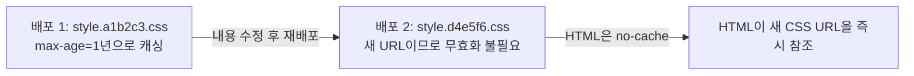

## 이 장을 읽기 전에

[캐싱과 캐시 무효화](/post/computerterms/caching-and-invalidation/)에서 다룬 TTL 기반 만료와 명시적 무효화, 그리고 그 챕터가 남긴 "무효화 누락 시 Stale Data가 무기한 유지될 수 있다"는 문제를 안다고 가정한다. 또한 [CDN(Content Delivery Network)](/post/computerterms/content-delivery-networks/)에서 다룬 오리진·엣지 서버 구조와 캐시 히트/미스 흐름도 이미 안다고 전제한다. 이 챕터는 그 구조를 전제로, 원본 서버가 전 세계 엣지 서버의 캐시 동작을 헤더 하나로 어떻게 제어하는지를 다룬다.

## Cache-Control이 필요한 이유

[CDN(Content Delivery Network)](/post/computerterms/content-delivery-networks/)에서 본 것처럼 엣지 서버는 캐시 히트 시 원본까지 가지 않고 즉시 응답해 지연을 줄인다. 하지만 이 구조가 동작하려면 원본 서버가 각 엣지 서버에 "이 데이터를 언제까지, 어떤 조건으로 캐싱하라"고 개별적으로 지시할 방법이 필요하다 — 그 지시를 전달하는 표준 메커니즘이 이번 챕터의 주제다.

## Cache-Control 헤더로 정책을 지시한다

원본 서버가 각 엣지 서버에 개별적으로 "이 데이터를 언제까지 캐싱하라"고 지시할 방법이 필요하다. HTTP는 이를 위해 응답 헤더 `Cache-Control`을 정의한다. 대표적인 지시자는 세 가지다. `max-age=N`은 응답을 N초 동안 신선(fresh)하다고 간주해 캐시가 원본에 재확인 없이 그대로 재사용하게 한다. `no-cache`는 이름과 달리 캐싱 자체를 금지하지 않는다 — 캐시에 저장은 하되, 매번 원본에 "이 사본이 아직 유효한지" 재검증(revalidation)한 뒤에만 반환하라는 뜻이다. `no-store`는 진짜로 캐싱을 금지한다 — 응답을 어디에도 저장하지 말고 매번 원본까지 다시 요청하라는 지시로, 로그인 세션이나 결제 정보처럼 민감한 응답에 쓰인다.

```http
HTTP/1.1 200 OK
Cache-Control: public, max-age=31536000, immutable
Content-Type: application/javascript
```

이 헤더는 정적 파일(예: 해시가 붙은 JS 번들)에 흔히 쓰이는 조합이다. `public`은 CDN을 포함한 모든 중간 캐시가 캐싱해도 좋다는 뜻이고, `max-age=31536000`(1년)은 그 기간 동안 재검증 없이 그대로 써도 된다는 뜻이며, `immutable`은 이 URL의 내용이 절대 바뀌지 않는다고 캐시에 약속해 브라우저가 새로고침 시에도 재검증 요청조차 보내지 않게 한다. 반대로 자주 바뀌는 API 응답이라면 `Cache-Control: private, no-cache`처럼 개인화된 응답임을 표시하고 매번 재검증하게 지시한다.

## 캐시 버스팅: 헤더 대신 URL 자체를 바꾼다

`max-age=31536000`으로 1년간 캐싱하도록 지시한 CSS 파일을 수정 배포했다고 해도, 전 세계 엣지 서버와 사용자 브라우저에 이미 퍼진 캐시를 원격으로 즉시 지울 방법은 마땅치 않다. 이 문제를 헤더가 아니라 **URL 자체를 바꾸는 방식**으로 우회하는 기법이 **캐시 버스팅(Cache Busting)**이다. 파일 내용이 바뀔 때마다 파일명에 내용 기반 해시를 붙여(`app.js` → `app.a3f9c2.js`) 새 배포마다 URL 자체가 달라지게 만든다. 캐시 입장에서는 "같은 URL의 오래된 사본"이 아니라 "처음 보는 새 URL"이므로 무효화를 신경 쓸 필요 없이 그냥 새로 받아오면 된다.

```html
<!-- 배포 1 -->
<link rel="stylesheet" href="/static/style.a1b2c3.css">
<!-- 배포 2: 내용이 바뀌면 해시도 바뀌어 새 URL이 된다 -->
<link rel="stylesheet" href="/static/style.d4e5f6.css">
```



이 방식의 핵심은 **불변 URL(Immutable URL)** 전략이다 — 해시가 붙은 정적 자원은 `max-age`를 최대한 길게(1년 이상) 잡아 영구 캐싱하고, 그 자원을 가리키는 HTML 파일 자체는 `no-cache`로 항상 재검증하게 한다. 이렇게 하면 HTML은 매번 최신 상태로 받아오면서도, 실제 용량이 큰 CSS·JS·이미지는 거의 무한정 캐싱되어 반복 방문자의 로딩 속도가 크게 개선된다. 웹팩(Webpack)의 `contenthash`, Vite의 빌드 해시 출력이 이 전략을 자동화한 도구다.

## 비교: max-age, no-cache, no-store

| 지시자 | 캐싱 여부 | 재검증 | 대표 사용처 |
|---|---|---|---|
| `max-age=N` | 저장하고 N초간 그대로 재사용 | N초 경과 전에는 안 함 | 해시 붙은 정적 자원(CSS/JS) |
| `no-cache` | 저장은 함 | 매 요청마다 원본에 재확인 | 자주 바뀌는 HTML, API 응답 |
| `no-store` | 저장하지 않음 | 해당 없음(항상 원본에서 받음) | 로그인·결제 등 민감 응답 |

## 흔한 오개념

**"CDN은 정적 파일에만 쓴다"** — 정적 자원이 CDN 캐싱의 가장 쉬운 대상인 것은 맞지만, `Cache-Control`을 짧은 `max-age`나 `stale-while-revalidate`와 함께 쓰면 자주 바뀌는 API 응답도 몇 초에서 몇 분 단위로 CDN에 캐싱해 원본 서버 부하를 크게 줄일 수 있다. "캐싱 가능 여부"는 정적/동적이 아니라 "이 응답을 여러 사용자가 똑같이 받아도 되는가(개인화 여부)"로 판단해야 한다.

**"no-cache는 캐싱을 하지 말라는 뜻이다"** — 이름과 반대로 `no-cache`는 저장은 허용하고 재검증만 강제한다. 실제로 캐싱 자체를 막으려면 `no-store`를 써야 한다. 이 둘을 혼동하면 민감한 데이터가 의도치 않게 캐시에 저장되는 문제가 생길 수 있다.

## 다른 개념과의 연결

[캐싱과 캐시 무효화](/post/computerterms/caching-and-invalidation/)의 TTL·명시적 무효화 개념은 여기서 `max-age`(TTL의 HTTP 헤더 구현체)와 캐시 버스팅(명시적 무효화를 배포 시점에 URL 변경으로 앞당긴 것)으로 각각 이어진다. 다음 챕터인 [멀티레벨 캐싱](/post/computerterms/multilevel-caching/)에서는 이 CDN 계층이 브라우저 캐시와 애플리케이션 캐시 사이 어디에 위치하는지, 계층 간 캐시 미스가 어떻게 전파되는지를 다룬다.

## 평가 기준

이 챕터를 읽은 후에는 다음을 할 수 있어야 한다. CDN이 캐싱 원리를 전 세계 엣지 서버 규모로 확장한 것임을 설명할 수 있다. `max-age`, `no-cache`, `no-store`의 차이를 구분하고 응답 성격에 맞는 지시자를 선택할 수 있다. 캐시 버스팅이 헤더가 아니라 URL 자체를 바꿔 무효화 문제를 우회하는 기법임을 설명하고, 불변 URL 전략을 실제 배포 파이프라인에 적용할 수 있다.

## 참고 자료

> "The no-cache response directive indicates that the response can be stored in caches, but the response must be validated with the origin server before each reuse." — MDN Web Docs, *Cache-Control* (2024)

- [MDN Web Docs: Cache-Control](https://developer.mozilla.org/en-US/docs/Web/HTTP/Reference/Headers/Cache-Control) — 각 지시자의 정확한 의미와 조합 규칙
- [AWS: What is a CDN?](https://aws.amazon.com/what-is/cdn/) — CDN의 엣지 서버 구조와 캐싱 동작에 대한 실무 설명
