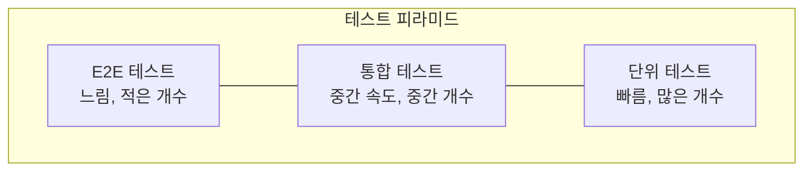

## 이 장을 읽기 전에

[버전 관리의 내부 구조](/post/computerterms/version-control-internals/)에서 다룬 커밋·브랜치 개념과, [리팩토링과 코드 스멜](/post/computerterms/refactoring-and-code-smells/)에서 다룬 "테스트가 있어야 변경의 안전성을 확인할 수 있다"는 원칙을 안다고 가정한다.

## 왜 "통합"을 자동화해야 하는가

여러 개발자가 각자 브랜치에서 작업하다가, 며칠 뒤 한꺼번에 [버전 관리의 내부 구조](/post/computerterms/version-control-internals/)에서 다룬 머지를 시도하면 충돌과 예상치 못한 상호작용이 한꺼번에 터진다. **지속적 통합(Continuous Integration, CI)**은 이 문제를 "자주, 작게 통합해 문제를 일찍 발견한다"는 원칙으로 푼다 — 코드를 커밋·푸시할 때마다 자동으로 빌드하고 테스트를 돌려, 통합 문제를 하루 단위가 아니라 커밋 단위로 발견한다.

```yaml
# .github/workflows/ci.yml 예시
name: CI
on: [push, pull_request]
jobs:
  test:
    runs-on: ubuntu-latest
    steps:
      - uses: actions/checkout@v4
      - run: npm install
      - run: npm test        # 커밋마다 자동으로 테스트 실행
      - run: npm run build   # 빌드가 깨지지 않는지 확인
```

## CD: 통합에서 배포까지 자동화하기

**지속적 배포(Continuous Deployment, CD)**는 CI에서 한 걸음 더 나아가, 테스트를 통과한 코드를 자동으로 운영 환경까지 내보낸다(비슷한 용어인 지속적 전달(Continuous Delivery)은 배포 직전까지는 자동화하되 실제 배포 버튼은 사람이 누르는 방식을 가리킨다). 이 자동화가 안전하려면, 테스트가 실제로 버그를 잡아낼 만큼 충분히 신뢰할 수 있어야 한다 — 테스트가 부실한 상태에서 배포까지 자동화하면, 버그가 있는 코드가 그대로 운영 환경에 배포되는 속도만 빨라진다.

## 테스트 피라미드: 어떤 테스트를 얼마나 만들 것인가

모든 테스트가 같은 비용과 신뢰도를 갖지 않는다. **단위 테스트(Unit Test)**는 함수·클래스 하나를 독립적으로 검증한다 — 빠르고([프로세스와 스레드](/post/computerterms/processes-and-threads/)의 무거운 자원 없이 실행), 실패 시 원인이 명확하다. **통합 테스트(Integration Test)**는 여러 모듈(예: 애플리케이션 코드 + 실제 데이터베이스)이 함께 맞물려 동작하는지 확인한다 — 단위 테스트보다 느리지만, 모듈 경계의 문제(잘못된 SQL 쿼리, API 계약 불일치)를 잡아낸다. **E2E 테스트(End-to-End Test)**는 실제 사용자처럼 브라우저를 조작해 전체 시스템을 검증한다 — 가장 실제 사용 시나리오에 가깝지만, 가장 느리고 불안정(flaky)하기 쉽다.



**테스트 피라미드**는 이 세 층을 아래로 갈수록 많이, 위로 갈수록 적게 작성하라고 권한다. 단위 테스트를 압도적으로 많이 두면 대부분의 버그를 빠르고 저렴하게 잡을 수 있고, 느리고 불안정한 E2E 테스트는 정말 "전체가 맞물려 동작하는가"를 확인해야 하는 핵심 시나리오 몇 개로 좁혀 유지보수 부담을 줄인다.

## 흔한 오개념

**"E2E 테스트를 많이 만들수록 더 안전하다"** — 테스트 피라미드를 거꾸로 뒤집어(E2E가 대다수, 단위 테스트가 소수) 만들면, CI 파이프라인 전체가 느려지고 브라우저 렌더링 타이밍 같은 사소한 요인으로 테스트가 무작위로 실패하는 **불안정한 테스트(Flaky Test)**가 늘어난다. 팀이 반복되는 실패 원인을 조사하는 데 지쳐 테스트 실패를 무시하게 되면, 정작 진짜 버그를 잡아야 할 때도 "또 flaky겠지"라며 넘어가는 더 나쁜 상황이 된다.

**"CI가 통과하면 배포해도 안전하다"** — CI 테스트가 다루지 않는 시나리오(운영 환경만의 설정, 실제 트래픽 규모, 서드파티 서비스 장애)는 여전히 남아있다. CD 파이프라인에 [로드 밸런싱](/post/computerterms/load-balancing/)에서 다루지 않은 카나리 배포(일부 서버에만 먼저 배포해 문제 여부를 확인한 뒤 전체로 확장)나 자동 롤백 같은 안전장치를 함께 두는 이유가 여기 있다 — CI 통과는 "이 코드에 알려진 결함이 없다"는 것이지 "운영 환경에서 반드시 안전하다"는 보장이 아니다.

## 다른 개념과의 연결

CI/CD 파이프라인은 [버전 관리의 내부 구조](/post/computerterms/version-control-internals/)의 커밋·브랜치 이벤트를 트리거로 삼아 동작하고, 테스트 피라미드의 단위 테스트는 [리팩토링과 코드 스멜](/post/computerterms/refactoring-and-code-smells/)에서 다룬 "리팩토링 전후 동작이 같은지 확인하는 안전망" 역할을 한다. 이 챕터로 개발 프로세스 갈래가 마무리되며, Computer Terms 컬렉션 전체가 12개 갈래로 완결된다.

## 평가 기준

이 챕터를 읽은 후에는 다음을 할 수 있어야 한다. CI와 CD가 각각 무엇을 자동화하는지, 그리고 지속적 배포와 지속적 전달의 차이를 설명할 수 있다. 테스트 피라미드의 세 층이 각각 어떤 속도·신뢰도 트레이드오프를 갖는지 설명할 수 있다. 테스트 피라미드가 뒤집혔을 때(E2E 위주) 발생하는 문제(느림, flaky test)를 설명할 수 있다.

## 참고 자료

> Fowler, M. (2006). "Continuous Integration". martinfowler.com.

- [Google Testing Blog: Just Say No to More End-to-End Tests](https://testing.googleblog.com/2015/04/just-say-no-to-more-end-to-end-tests.html) — 테스트 피라미드를 뒷받침하는 구글의 실무 경험 공유
- [GitHub Actions Documentation](https://docs.github.com/en/actions) — 실제 CI/CD 파이프라인을 구성하는 대표적인 도구의 공식 문서
