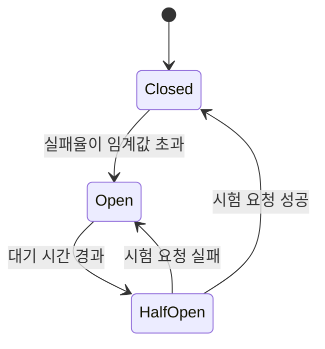

## 이 장을 읽기 전에

[로드 밸런싱](/post/computerterms/load-balancing/)에서 다룬 헬스 체크 개념과, [멱등성](/post/computerterms/idempotency/)에서 다룬 재시도 전략을 안다고 가정한다. 이 챕터는 "재시도를 계속하는 것 자체가 오히려 장애를 키우는 상황"을 어떻게 막는지를 다룬다.

## 연쇄 장애: 하나가 무너지면 전부 무너진다

마이크로서비스 아키텍처에서는 서비스 A가 서비스 B를 호출하고, B는 다시 서비스 C를 호출하는 식으로 여러 서비스가 연쇄적으로 얽혀 있다. 이때 C가 느려지거나 응답을 멈추면 어떤 일이 벌어지는지 따라가 보자. B는 C의 응답을 기다리며 스레드나 커넥션을 점유한 채 대기한다. 이 대기가 쌓이면 B의 자원(스레드 풀, 커넥션 풀)이 고갈되고, B 자신도 응답이 느려지거나 멈춘다. 그러면 이번엔 A가 B의 응답을 기다리다 같은 문제를 겪는다. 이렇게 한 서비스의 장애가 이를 호출하는 서비스들로 순차적으로 퍼져나가는 현상을 **연쇄 장애(Cascading Failure)**라 한다.

문제를 더 키우는 것은 재시도다. [멱등성](/post/computerterms/idempotency/)에서 다룬 것처럼 재시도는 네트워크 불확실성에 대응하는 정당한 전략이지만, C가 이미 과부하로 죽어가는 상황에서 B가 실패한 요청을 계속 재시도하면 죽어가는 C에게 더 많은 요청을 퍼붓는 꼴이 된다. 여러 클라이언트가 동시에 같은 방식으로 재시도하면 요청량이 오히려 폭증하는 **재시도 폭풍(Retry Storm)**이 발생해, 겨우 복구되던 서비스가 다시 주저앉을 수 있다.

## 서킷 브레이커: 실패를 감지하면 호출을 끊는다

**서킷 브레이커(Circuit Breaker)**는 가정용 전기 회로의 차단기에서 이름을 딴 패턴으로, 과전류가 흐르면 회로 전체가 타버리기 전에 차단기가 회로를 끊어버리는 것과 같은 원리를 소프트웨어에 적용한다. 호출하는 쪽(B)이 호출받는 쪽(C)의 최근 실패율을 계속 관찰하다가, 실패율이 미리 정한 임계값을 넘으면 **그 이후의 호출을 아예 C로 보내지 않고 즉시 실패로 처리**한다. 이 패턴은 마틴 파울러(Martin Fowler)가 2014년 글에서 정리하며 마이크로서비스 커뮤니티에 널리 알려졌으며, 원래는 Michael Nygard의 저서 『Release It!』(2007)에서 제시된 개념이다.

즉시 실패로 처리한다는 것이 왜 도움이 되는지는 두 가지 효과로 설명된다. 첫째, B는 어차피 실패할 요청을 기다리느라 자원을 낭비하지 않고 곧바로 다른 처리(예: 캐시된 값 반환, 에러 응답)로 넘어갈 수 있다. 둘째, C는 이미 힘든 상황에서 추가 요청 폭탄을 맞지 않으므로 복구할 여유를 얻는다. 결국 서킷 브레이커는 "C를 고치는" 장치가 아니라 "C가 회복할 시간을 벌어주고, B가 무의미한 대기로 함께 무너지는 것을 막는" 장치다.

## 세 가지 상태와 전이

서킷 브레이커는 세 가지 상태를 오가는 **상태 기계(State Machine)**로 구현된다. **닫힘(Closed)** 상태는 평상시로, 모든 호출이 정상적으로 C에 전달된다. 이 상태에서 실패율이 임계값(예: 최근 10번 중 5번 이상 실패)을 넘으면 **열림(Open)** 상태로 전이한다. 열림 상태에서는 C로의 호출을 아예 시도하지 않고 즉시 에러를 반환한다. 일정 시간(예: 30초)이 지나면 **반열림(Half-Open)** 상태로 전이해, 제한된 수의 시험 요청만 C로 보내본다. 이 시험 요청이 성공하면 C가 회복됐다고 판단해 닫힘 상태로 되돌아가고, 실패하면 아직 회복되지 않았다고 판단해 다시 열림 상태로 돌아간다.



반열림 상태가 왜 필요한지는, 열림과 닫힘 두 상태만 있다고 가정해보면 드러난다. 열림 상태에서 곧바로 닫힘으로 돌아가면, C가 아직 회복되지 않은 상태에서 갑자기 모든 트래픽을 다시 받아 또 무너질 수 있다. 반열림은 "일단 소수의 요청으로 간을 본 뒤, 안전할 때만 전면 재개한다"는 완충 지대 역할을 한다.

## 코드로 보는 상태 전이

아래는 서킷 브레이커의 핵심 상태 전이 로직을 단순화한 예제다. 실무 구현(예: Netflix Hystrix, resilience4j)은 슬라이딩 윈도우 기반 실패율 계산, 동시 시험 요청 수 제한 등을 추가로 갖추지만, 핵심 골격은 아래와 같다.

```python
import time
from enum import Enum


class State(Enum):
    CLOSED = "closed"
    OPEN = "open"
    HALF_OPEN = "half_open"


class CircuitBreaker:
    def __init__(self, failure_threshold: int = 5, reset_timeout: float = 30.0):
        self.state = State.CLOSED
        self.failure_count = 0
        self.failure_threshold = failure_threshold
        self.reset_timeout = reset_timeout
        self.opened_at: float = 0.0

    def call(self, func, *args):
        # OPEN 상태에서는 대기 시간이 지났는지 먼저 확인한다
        if self.state == State.OPEN:
            if time.monotonic() - self.opened_at >= self.reset_timeout:
                self.state = State.HALF_OPEN  # 시험 요청을 허용
            else:
                raise RuntimeError("circuit open: 호출을 즉시 차단")

        try:
            result = func(*args)
        except Exception:
            self._on_failure()
            raise
        else:
            self._on_success()
            return result

    def _on_success(self):
        # 성공하면 실패 카운트를 리셋하고 CLOSED로 복귀한다
        self.failure_count = 0
        self.state = State.CLOSED

    def _on_failure(self):
        self.failure_count += 1
        if self.failure_count >= self.failure_threshold:
            self.state = State.OPEN
            self.opened_at = time.monotonic()
```

이 구현에서 주의할 점은, `HALF_OPEN` 상태에서 시험 요청이 실패하면 `_on_failure`가 다시 `OPEN`으로 되돌리고 `opened_at`을 갱신한다는 것이다. 즉 실패가 반복되는 한 대기 시간이 계속 뒤로 밀리며, C가 실제로 안정될 때까지 재개가 미뤄진다. 실무에서는 임계값과 대기 시간을 서비스 특성에 맞춰 튜닝해야 한다 — 너무 민감하면 일시적 지연에도 서킷이 열려 정상 트래픽까지 막고, 너무 둔감하면 연쇄 장애를 막는 효과가 줄어든다.

## 로드 밸런싱 헬스 체크와의 차이

[로드 밸런싱](/post/computerterms/load-balancing/)의 헬스 체크는 로드 밸런서가 각 서버 인스턴스에 주기적으로 핑을 보내 "이 서버가 살아있는가"를 판단하고, 죽은 서버를 트래픽 분배 대상에서 제외하는 방식이다. 서킷 브레이커는 이와 유사해 보이지만 관측 지점이 다르다. 헬스 체크는 로드 밸런서가 **별도의 검사 요청**으로 서버 상태를 능동적으로 확인하는 반면, 서킷 브레이커는 **실제 호출의 성공/실패 결과**를 관찰해 판단한다. 또한 헬스 체크는 여러 인스턴스 중 죽은 것을 골라내는 것이 목적이지만, 서킷 브레이커는 특정 의존 서비스(또는 그 서비스의 특정 엔드포인트) 전체로의 호출 자체를 끊는 것이 목적이다. 실무에서는 두 기법을 함께 쓴다 — 로드 밸런서가 죽은 인스턴스를 제외하는 동안, 서킷 브레이커는 그 서비스 전체가 불안정할 때 호출 시도 자체를 줄여준다.

## 흔한 오개념

**"서킷 브레이커는 장애를 예방한다"** — 서킷 브레이커는 장애가 발생하는 것 자체를 막지 못한다. C가 느려지거나 죽는 것은 이미 일어난 일이고, 서킷 브레이커가 하는 일은 그 장애가 **B, A로 전파되는 것을 차단**하는 것이다. 장애 예방은 C 자체의 안정성(용량 계획, 오토스케일링 등)의 몫이고, 서킷 브레이커는 장애 발생 이후의 피해를 국소화하는 사후 대응 장치다.

**"실패하면 무조건 에러를 반환하면 된다"** — 열림 상태에서 즉시 에러를 반환하는 대신, 가능하면 **폴백(Fallback)**을 제공하는 것이 더 나은 사용자 경험을 만든다. 예를 들어 추천 서비스가 열림 상태라면 개인화된 추천 대신 인기 상품 목록 같은 기본값을 보여줄 수 있다. 모든 상황에 폴백이 가능한 것은 아니지만(결제처럼 대체할 수 없는 연산도 있다), 가능한 경우라면 단순 에러보다 폴백이 우선 검토 대상이다.

## 다른 개념과의 연결

서킷 브레이커가 막는 재시도 폭풍은 [멱등성](/post/computerterms/idempotency/)에서 다룬 재시도 전략과 동전의 양면이다 — 재시도는 개별 요청의 신뢰성을 높이지만, 통제 없이 이뤄지면 시스템 전체의 신뢰성을 해친다. 다음 챕터에서는 서비스 간 호출을 아예 동기식으로 직접 연결하지 않고, 메시지 큐를 거쳐 비동기로 통신함으로써 이런 연쇄 장애의 여지를 구조적으로 줄이는 방식을 다룬다.

## 평가 기준

이 챕터를 읽은 후에는 다음을 할 수 있어야 한다. 연쇄 장애가 서비스 간 동기 호출 구조에서 왜 발생하는지, 그리고 무분별한 재시도가 이를 왜 악화시키는지 설명할 수 있다. 서킷 브레이커의 Closed, Open, Half-Open 세 상태와 각 전이 조건을 설명할 수 있다. 로드 밸런서의 헬스 체크와 서킷 브레이커의 관측 지점·목적 차이를 구분할 수 있다. 열림 상태에서 폴백을 제공하는 것이 언제 적절한지 판단할 수 있다.

## 참고 자료

> Fowler, M. (2014). "CircuitBreaker". *martinfowler.com*.

- [Fowler, M. (2014). "CircuitBreaker"](https://martinfowler.com/bliki/CircuitBreaker.html) — 서킷 브레이커 패턴을 마이크로서비스 맥락으로 정리한 원문 글
- [Microsoft Azure Architecture Center: Circuit Breaker Pattern](https://learn.microsoft.com/en-us/azure/architecture/patterns/circuit-breaker) — 상태 전이와 구현 시 고려사항을 다루는 참조 문서
