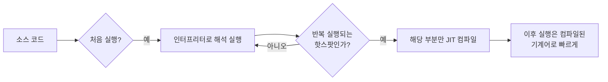

## 이 장을 읽기 전에

[프로세스와 스레드](/post/computerterms/processes-and-threads/)에서 다룬 "프로그램이 실행되면 프로세스가 된다"는 개념을 안다고 가정한다. 이 챕터는 그 이전 단계, 즉 사람이 쓴 소스 코드가 CPU가 실행할 수 있는 형태로 바뀌는 과정을 다룬다.

## CPU는 소스 코드를 모른다

[CPU 구조와 파이프라이닝](/post/computerterms/cpu-and-pipelining/)에서 다룬 CPU는 정해진 기계어 명령어 집합만 이해한다. `print("hello")` 같은 소스 코드를 CPU가 직접 실행할 수는 없다 — 이를 기계어로 바꾸는 과정이 필요하며, 이 과정을 언제·어떻게 하느냐에 따라 크게 컴파일과 인터프리팅으로 나뉜다.

## 컴파일러: 실행 전에 통째로 번역하기

**컴파일러(Compiler)**는 프로그램을 실행하기 **전에** 소스 코드 전체를 한 번에 기계어(또는 중간 형태)로 번역해 실행 파일을 만든다. C, C++, Rust가 이 방식을 쓴다. 번역이 끝난 실행 파일은 이후 몇 번을 실행하든 다시 번역할 필요가 없고, CPU가 직접 기계어를 실행하므로 빠르다. 대신 코드를 한 줄 고칠 때마다 전체를 다시 컴파일해야 하고, 컴파일 시점에 문법·타입 오류를 미리 잡아낼 수 있는 대신 그 검사에 시간이 걸린다.

```c
/* hello.c */
#include <stdio.h>
int main(void) {
    printf("hello\n");
    return 0;
}
```

```text
$ gcc hello.c -o hello    # 컴파일: 실행 전에 소스 전체를 기계어로 번역
$ ./hello                 # 실행: 이미 번역된 기계어를 CPU가 그대로 실행
hello
```

## 인터프리터: 실행하면서 한 줄씩 해석하기

**인터프리터(Interpreter)**는 소스 코드를 미리 통째로 번역하지 않고, 실행하면서 한 줄(또는 한 구문)씩 즉시 해석해 실행한다. Python, Ruby의 표준 실행 방식이 이에 해당한다. 코드를 고치고 바로 실행해볼 수 있어 개발 중 반복 속도가 빠르지만, 매 실행마다 해석 과정을 다시 거쳐야 하므로 같은 코드를 반복 실행할 때 컴파일 방식보다 느린 경우가 많다.

```python
# hello.py - 별도 컴파일 단계 없이 바로 실행
print("hello")
```

```text
$ python hello.py   # 실행하면서 한 줄씩 즉시 해석
hello
```

## JIT: 두 방식을 절충하기

실제로 "컴파일이냐 인터프리팅이냐"는 이분법이 아니라 정도의 문제에 가깝다. 많은 현대 언어(JavaScript의 V8 엔진, Java의 JVM, Python 자체도 부분적으로)는 **JIT(Just-In-Time) 컴파일**을 쓴다. 처음에는 인터프리터처럼 코드를 해석해 실행하다가, 같은 코드가 반복적으로 실행되는 것을 감지하면(**핫스팟, Hot Spot**) 그 부분만 그때 기계어로 컴파일해 이후 실행을 빠르게 만든다. 이는 [캐싱과 캐시 무효화](/post/computerterms/caching-and-invalidation/)에서 다룬 "자주 쓰는 것을 빠른 형태로 미리 준비해 둔다"는 지역성 원리를 컴파일 자체에 적용한 것이다.



## 비교: 컴파일 vs 인터프리팅 vs JIT

| 특성 | 컴파일 | 인터프리팅 | JIT |
|---|---|---|---|
| 번역 시점 | 실행 전 전체 | 실행 중 매번 | 실행 중, 반복되는 부분만 |
| 초기 실행 속도 | 빠름(이미 번역됨) | 느림(그때그때 해석) | 처음엔 느리다가 점차 빨라짐 |
| 오류 발견 시점 | 컴파일 시점(사전) | 실행 시점(그 줄에 도달했을 때) | 실행 시점 |
| 개발 반복 속도 | 느림(매번 재컴파일) | 빠름(바로 실행) | 빠름 |

## 언제 어떤 실행 방식을 택하는가

배포용 실행 파일이 반복적으로 실행되고 시작 속도·런타임 성능이 중요하다면(CLI 도구, 시스템 프로그램, 임베디드 소프트웨어) 컴파일 방식이 유리하다 — 번역 비용을 배포 이전에 한 번만 치르고, 이후에는 실행할 때마다 그 대가를 지불하지 않는다. 반대로 빠른 프로토타이핑이나 플랫폼 독립적인 배포(같은 스크립트를 재컴파일 없이 여러 환경에서 실행)가 중요하다면 인터프리터 방식이 낫다. 장기간 실행되며 반복되는 핫스팟이 뚜렷한 서버 애플리케이션이나 웹 런타임(Node.js, JVM 기반 서비스)이라면, 시작은 인터프리터처럼 빠르게 하고 실행 중 자주 도는 부분만 최적화하는 JIT가 두 요구를 동시에 만족시킨다.

## 흔한 오개념

**"컴파일 언어는 항상 인터프리터 언어보다 빠르다"** — JIT를 쓰는 JavaScript·Java는 반복 실행되는 핫스팟에서 정적 컴파일 언어에 근접하는 성능을 낼 수 있다. 반대로 컴파일 언어라도 최적화 옵션 없이 컴파일하면(`-O0`) 충분히 느릴 수 있다. "컴파일이냐 인터프리팅이냐"보다 "실제로 어떤 최적화가 적용됐는가"가 성능을 더 크게 좌우한다.

**"인터프리터는 타입 오류를 실행 전에 못 잡는다"** — 타입 검사 시점은 컴파일/인터프리팅 여부가 아니라 언어의 **타입 시스템** 설계에 달려 있다. TypeScript는 인터프리터 언어인 JavaScript로 변환되지만, 그 변환(트랜스파일) 단계에서 타입 오류를 정적으로 잡아낸다 — 이는 다음 챕터에서 다룰 정적/동적 타입 시스템의 문제이지, 컴파일/인터프리팅 자체의 문제가 아니다.

## 다른 개념과의 연결

JIT의 핫스팟 컴파일은 [캐싱과 캐시 무효화](/post/computerterms/caching-and-invalidation/)의 지역성 원리를, 컴파일된 기계어가 CPU에서 실행되는 방식은 [CPU 구조와 파이프라이닝](/post/computerterms/cpu-and-pipelining/)과 직결된다. 다음 챕터에서는 이 번역 과정에서 함께 이뤄지는 타입 검사, 즉 타입 시스템을 다룬다.

## 평가 기준

이 챕터를 읽은 후에는 다음을 할 수 있어야 한다. 컴파일과 인터프리팅의 번역 시점 차이와, 이것이 오류 발견 시점·개발 반복 속도에 미치는 영향을 설명할 수 있다. JIT 컴파일이 두 방식을 절충하는 원리(핫스팟 감지)를 설명할 수 있다. "컴파일 언어가 항상 빠르다"는 단순화가 왜 부정확한지 설명할 수 있다.

## 참고 자료

> Aho, A. V., Lam, M. S., Sethi, R., & Ullman, J. D. (2006). *Compilers: Principles, Techniques, and Tools* (2nd ed.), Chapter 1: Introduction. Pearson.

- [V8 JavaScript Engine: TurboFan JIT](https://v8.dev/docs/turbofan) — 실제 JIT 컴파일러가 핫스팟을 감지하고 최적화하는 방식
- [Python Developer's Guide: CPython Compiler](https://devguide.python.org/internals/compiler/) — CPython이 소스를 바이트코드로 컴파일한 뒤 인터프리터로 실행하는 하이브리드 구조
