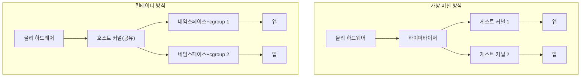

## 이 장을 읽기 전에

[프로세스와 스레드](/post/computerterms/processes-and-threads/)에서 프로세스가 독립된 메모리 공간을 갖고, 여러 프로세스를 만드는 비용이 있다는 점을 다뤘다. 이 챕터는 그 격리를 "운영체제 하나 전체를 통째로 흉내 내는 방식"(가상 머신)과 "커널의 기능으로 프로세스를 서로 안 보이게 나누는 방식"(컨테이너)으로 확장해서 비교한다.

## 하드웨어를 통째로 흉내 내는 방식: 가상 머신

**가상 머신(Virtual Machine, VM)**은 물리 하드웨어 위에 **하이퍼바이저(Hypervisor)**라는 소프트웨어 계층을 두고, 그 위에 완전히 독립된 운영체제 커널을 여러 개 실행하는 방식이다. 각 VM은 자신만의 가상 CPU, 가상 메모리, 가상 디스크를 가진 것처럼 동작하며, 호스트와 다른 종류의 커널(예: 리눅스 호스트 위에 윈도우 게스트)을 실행하는 것도 가능하다. 하이퍼바이저는 크게 두 종류로 나뉜다. 물리 하드웨어 위에서 직접 실행되어 각 게스트 OS를 관리하는 **1형(bare-metal, 예: VMware ESXi, KVM)**과, 일반 운영체제 위에서 하나의 애플리케이션처럼 실행되는 **2형(hosted, 예: VirtualBox)**이다.

이 완전한 격리에는 비용이 따른다. 각 VM은 자신만의 커널 전체를 부팅해야 하므로 부팅 시간이 초 단위가 아니라 분 단위가 될 수 있고, 커널·시스템 라이브러리 전체를 위한 디스크·메모리 공간을 VM마다 따로 소비한다. 하드웨어 접근(디스크 I/O, 네트워크)도 하이퍼바이저를 거쳐 가상화되므로 네이티브 실행보다 오버헤드가 붙는다(다만 Intel VT-x/AMD-V 같은 하드웨어 가상화 확장 덕분에 CPU 명령어 실행 자체의 오버헤드는 크게 줄었다).

## 커널을 공유하며 나누는 방식: 컨테이너

**컨테이너(Container)**는 완전히 다른 접근을 취한다. 새로운 커널을 부팅하는 대신, **호스트 커널 하나를 여러 프로세스 그룹이 공유**하면서 그 커널이 제공하는 격리 기능만으로 "서로 다른 시스템처럼 보이게" 만든다. 리눅스에서 이 격리는 주로 두 가지 커널 기능으로 이뤄진다. **네임스페이스(Namespace)**는 프로세스가 볼 수 있는 자원의 범위를 제한한다 — PID 네임스페이스에 들어간 프로세스는 자신이 PID 1인 것처럼 보고, 네트워크 네임스페이스는 독립된 네트워크 인터페이스·라우팅 테이블을 갖게 하며, 마운트 네임스페이스는 독립된 파일 시스템 뷰를 제공한다. **cgroup(Control Group)**은 이렇게 격리된 프로세스 그룹이 쓸 수 있는 CPU·메모리·디스크 I/O 총량에 상한을 건다.

결국 컨테이너 안에서 실행되는 프로세스는, 커널 입장에서는 호스트의 다른 프로세스와 동일한 스케줄링 대상인 **평범한 프로세스**다. 다만 네임스페이스로 시야가 제한되고 cgroup으로 자원이 제한되어 있을 뿐이다. 그래서 호스트에서 `ps aux`를 실행하면 컨테이너 안의 프로세스도 (PID 네임스페이스로 감싸여 있더라도) 호스트의 프로세스 목록에 그대로 나타난다 — VM 안의 프로세스가 호스트에서 전혀 보이지 않는 것과 대조적이다.



## 코드로 보는 격리: unshare로 네임스페이스 만들기

컨테이너 런타임(Docker, containerd)이 내부적으로 하는 일의 핵심은 결국 `clone()` 시스템 콜에 네임스페이스 플래그를 조합해 넘기는 것이다. 이를 직접 눈으로 확인하려면 리눅스의 `unshare` 시스템 콜을 쓰는 최소 예제로 충분하다.

```c
#include <stdio.h>
#include <sched.h>
#include <unistd.h>
#include <sys/wait.h>

int main(void) {
    /* 새 PID 네임스페이스 생성: 이 안에서 만들어지는 자식은
       자신을 PID 1로 본다. CLONE_NEWPID는 root 권한이 필요하다 */
    if (unshare(CLONE_NEWPID) != 0) {
        perror("unshare (root 권한 필요할 수 있음)");
        return 1;
    }

    pid_t pid = fork();
    if (pid == 0) {
        /* 새 네임스페이스 안의 자식: getpid()가 1을 반환한다 */
        printf("namespace 안에서 본 PID: %d\n", getpid());
        return 0;
    }
    waitpid(pid, NULL, 0);
    return 0;
}
```

`gcc unshare_demo.c -o unshare_demo && sudo ./unshare_demo`로 실행하면, 호스트의 `ps`로는 진짜 PID가 다르게 보이지만 네임스페이스 안의 프로세스 스스로가 호출한 `getpid()`는 1을 반환한다. 이것이 컨테이너 안에서 `ps aux`를 실행했을 때 자기 자신이 PID 1인 것처럼 보이는 이유다 — 새 커널이 뜬 것이 아니라, 같은 커널 위에서 "보이는 범위"만 새로 만들어진 것이다.

## 비교: 가상 머신 vs 컨테이너

| 특성 | 가상 머신 | 컨테이너 |
|---|---|---|
| 격리 단위 | 하이퍼바이저 위의 독립된 커널 전체 | 호스트 커널의 네임스페이스 + cgroup |
| 격리 수준 | 강함(커널 취약점도 대개 VM 밖으로 못 나감) | 상대적으로 약함(커널을 공유하므로 커널 취약점이 전체에 영향) |
| 부팅 시간 | 초–분 단위 | 밀리초–초 단위(이미 떠 있는 커널 위에서 프로세스 생성) |
| 이미지 크기 | 커널+전체 OS 포함, 수 GB | 애플리케이션+필요한 라이브러리만, 수십–수백 MB |
| 이종 OS 실행 | 가능(리눅스 위 윈도우 게스트 등) | 불가능(호스트 커널을 그대로 공유) |

## 흔한 오개념

**"컨테이너는 가벼운 가상 머신이다"** — 이 표현은 오버헤드 차이를 직관적으로 전달하지만 정확하지 않다. VM은 하드웨어를 흉내 내는 **가상화(Virtualization)** 기술이고, 컨테이너는 하나의 커널 위에서 프로세스를 격리하는 **커널 격리(Isolation)** 기술이다. 컨테이너 안의 프로세스는 여전히 호스트 커널 위에서 스케줄링되는 평범한 프로세스이며, 이 차이 때문에 컨테이너 탈출(escape) 취약점은 곧 호스트 커널 취약점과 직결되지만, VM 탈출은 하이퍼바이저 자체의 버그를 필요로 해 공격 표면이 다르다.

**"도커가 컨테이너를 발명했다"** — 리눅스 네임스페이스(2002년경부터 단계적으로 커널에 추가)와 cgroup(2007년, 구글이 프로세스 컨테이너로 처음 기여)은 도커(2013년 공개) 이전부터 존재했다. LXC(Linux Containers)도 도커보다 먼저 이 커널 기능들을 조합해 컨테이너를 구현했다. 도커의 기여는 이미지 빌드·배포·레지스트리 같은 **개발자 경험**을 표준화해 컨테이너를 대중화한 것이지, 격리 메커니즘 자체를 발명한 것이 아니다.

## 다른 개념과의 연결

컨테이너가 격리하는 대상인 프로세스의 생성·종료 관리는 [데몬과 좀비 프로세스](/post/computerterms/daemons-and-zombie-processes/)에서 다룬 부모-자식 관계와 이어진다. 컨테이너를 여러 개 묶어 오케스트레이션하는 문제(쿠버네티스 등)는 이 컬렉션의 범위 밖이며, 인프라 갈래에서 별도로 다룰 수 있는 주제다.

## 평가 기준

이 챕터를 읽은 후에는 다음을 할 수 있어야 한다. 하이퍼바이저 기반 가상화와 컨테이너 격리가 각각 어느 계층에서 격리를 구현하는지 설명할 수 있다. 네임스페이스와 cgroup이 각각 담당하는 역할을 구분할 수 있다. 격리 수준과 오버헤드가 상충 관계에 있다는 점을 근거로 VM과 컨테이너 중 하나를 선택할 수 있다.

## 참고 자료

> Silberschatz, A., Galvin, P. B., & Gagne, G. (2018). *Operating System Concepts* (10th ed.), Chapter 18: Virtual Machines. Wiley.

- [Linux man-pages: namespaces(7)](https://man7.org/linux/man-pages/man7/namespaces.7.html) — 리눅스 네임스페이스 종류와 각각의 격리 범위
- [Linux man-pages: cgroups(7)](https://man7.org/linux/man-pages/man7/cgroups.7.html) — cgroup의 자원 제한 메커니즘 명세
