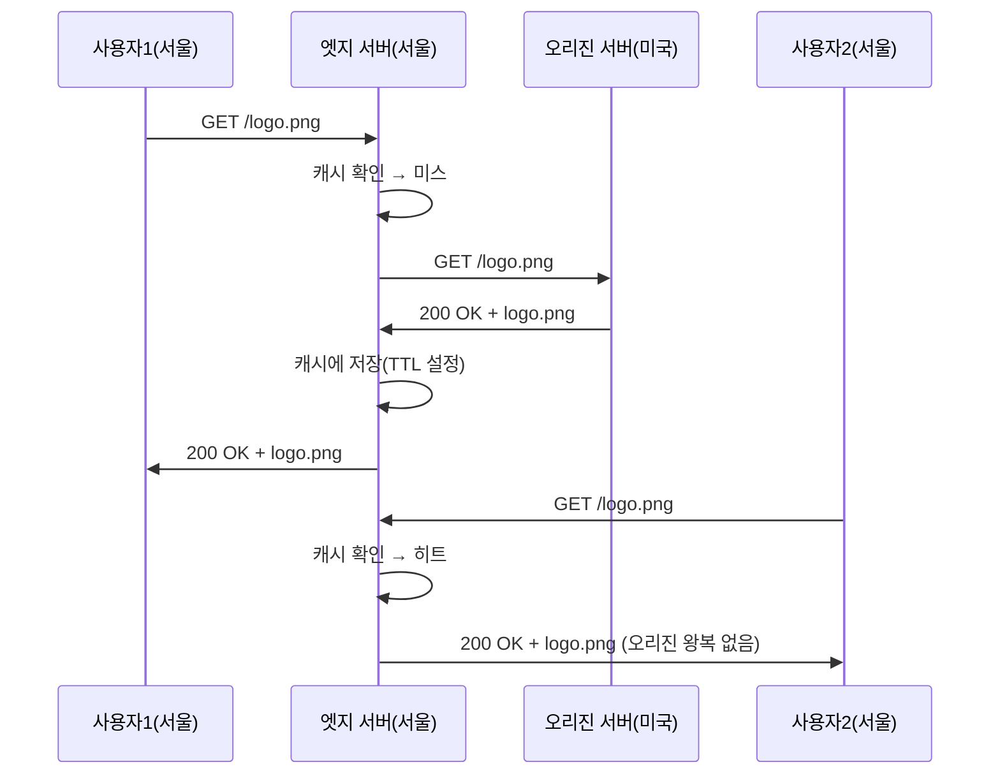

## 이 장을 읽기 전에

[캐싱과 캐시 무효화](/post/computerterms/caching-and-invalidation/)에서 다룬 캐시 히트·미스·TTL 개념과 [로드 밸런싱](/post/computerterms/load-balancing/)에서 다룬 "여러 서버로 트래픽을 나눈다"는 아이디어를 안다고 가정한다. CDN은 이 두 개념을 지리적 거리라는 축으로 확장한 것이다.

## 물리적 거리가 지연시간을 만든다

서울의 사용자가 미국 동부에 있는 서버에 요청을 보내면, 빛의 속도로도 왕복에 100밀리초 안팎이 걸린다. 이 지연은 서버 성능을 아무리 높여도 줄지 않는다 — 광케이블을 통과하는 신호가 물리적 거리를 이동하는 시간 자체가 병목이기 때문이다. **CDN(Content Delivery Network)**은 이 문제를 서버 성능이 아니라 서버 위치로 푼다. 원본 콘텐츠를 갖고 있는 **오리진 서버(Origin Server)** 외에, 세계 각지에 분산된 **엣지 서버(Edge Server)**에 콘텐츠 사본을 캐싱해 두고, 사용자를 지리적으로 가장 가까운 엣지 서버로 연결한다. 서울 사용자는 서울(또는 인접 지역) 엣지 서버에서 응답을 받으므로 왕복 지연이 수 밀리초 수준으로 줄어든다.

## 캐시 미스와 캐시 히트: 엣지 서버의 동작 흐름

엣지 서버는 요청받은 콘텐츠를 처음부터 갖고 있지 않다. 첫 요청이 들어오면 엣지 서버는 자신의 캐시를 확인하고, 콘텐츠가 없으면(**캐시 미스**) 오리진 서버까지 가서 콘텐츠를 가져온 뒤 사용자에게 응답하면서 동시에 자신의 캐시에 저장한다. 이후 같은 콘텐츠를 요청하는 다른 사용자는 엣지 서버가 이미 가진 사본으로 즉시 응답받는다(**캐시 히트**). 이 흐름은 [캐싱과 캐시 무효화](/post/computerterms/caching-and-invalidation/)에서 다룬 일반적인 캐시 미스 처리와 동일한 패턴이지만, CDN에서는 그 "캐시를 채우는 원본"이 오리진 서버, "캐시를 갖는 쪽"이 지리적으로 분산된 엣지 서버라는 점이 다르다.

캐시된 콘텐츠는 [캐싱과 캐시 무효화](/post/computerterms/caching-and-invalidation/)에서 다룬 `Cache-Control` 헤더의 TTL이 만료되면 엣지 서버가 오리진에 재확인 요청을 보낸다. 이 재검증 과정에서 콘텐츠가 바뀌지 않았으면 `304 Not Modified` 응답으로 본문 전송 없이 캐시 유효기간만 갱신한다.

## 정적 콘텐츠와 동적 콘텐츠에서 CDN 효과가 다른 이유

이미지·CSS·JavaScript 번들·동영상 같은 **정적 콘텐츠**는 모든 사용자에게 동일한 응답을 주므로 CDN 캐싱과 궁합이 좋다. 한 번 엣지 서버에 캐싱되면 이후 요청은 오리진 서버를 전혀 거치지 않아 오리진의 부하도 함께 줄어든다. 반면 로그인한 사용자별로 다른 결과를 주는 API 응답이나 실시간 재고 조회 같은 **동적 콘텐츠**는 사용자마다 응답이 다르므로 그대로 캐싱하면 다른 사용자에게 잘못된 데이터를 보여줄 위험이 있다. 이런 콘텐츠는 캐싱하지 않거나, 캐싱하더라도 사용자·세션 단위로 캐시 키를 세분화하거나 TTL을 매우 짧게 설정해야 한다. 최근 CDN은 엣지 서버에서 짧은 코드(엣지 함수)를 실행해 요청별로 응답을 조합하는 방식으로 동적 콘텐츠도 부분적으로 캐싱 이점을 누리게 하지만, 이는 정적 캐싱보다 훨씬 복잡한 별도 설계 영역이다.

## 비교: 오리진 직접 서빙 vs CDN 경유

| 항목 | 오리진 직접 서빙 | CDN 경유 |
|---|---|---|
| 지연시간 | 사용자-오리진 물리적 거리에 비례 | 사용자-엣지 거리로 단축 |
| 오리진 부하 | 모든 요청이 오리진에 도달 | 캐시 히트분만큼 오리진 부하 감소 |
| 정적 콘텐츠 효과 | 낮음 | 큼 |
| 동적/개인화 콘텐츠 효과 | 해당 없음(원래 오리진 필요) | 제한적(엣지 함수 등 추가 설계 필요) |
| 장애 격리 | 오리진 장애 시 전체 중단 | 캐시된 콘텐츠는 오리진 장애 중에도 서빙 가능 |

## 흔한 오개념

**"CDN은 정적 파일을 저장하는 저장소일 뿐이다"** — CDN은 단순 저장소가 아니라 지리 기반 캐시 계층이다. 콘텐츠의 원본은 항상 오리진 서버가 갖고 있고, 엣지 서버는 TTL이 있는 임시 사본만 보관한다. 오리진에서 파일을 지우거나 바꾸면 엣지 서버의 캐시가 만료될 때까지는 이전 버전이 계속 서빙될 수 있다는 점에서, 이는 [캐싱과 캐시 무효화](/post/computerterms/caching-and-invalidation/)에서 다룬 캐시 무효화 문제 그대로다.

**"CDN을 쓰면 오리진 서버 성능은 신경 쓰지 않아도 된다"** — 캐시 히트율이 100%가 아닌 이상 캐시 미스 요청, 동적 콘텐츠 요청, TTL 만료로 인한 재검증 요청은 여전히 오리진까지 도달한다. 트래픽이 몰리는 이벤트 상황에서는 다수의 엣지 서버가 동시에 캐시가 만료되어 한꺼번에 오리진에 재검증 요청을 보내는 현상(캐시 스탬피드)이 발생할 수 있어, 오리진 자체의 확장성도 여전히 설계해야 한다.

## 다른 개념과의 연결

CDN이 요청을 어느 엣지 서버로 보낼지 결정하는 과정은 [DNS와 소켓](/post/computerterms/dns-and-sockets/)에서 다룬 DNS 조회 단계에서 사용자의 위치를 추정해 가장 가까운 엣지의 IP를 반환하는 방식(GeoDNS)으로 이뤄지는 경우가 많다. 다음 챕터에서는 요청이 오리진에 도달하기 전 트래픽 자체를 필터링하는 방화벽과 NAT를 다룬다.

## 평가 기준

이 챕터를 읽은 후에는 다음을 할 수 있어야 한다. CDN이 지연시간을 줄이는 원리를 물리적 거리 관점에서 설명할 수 있다. 엣지 서버의 캐시 미스·캐시 히트 흐름을 오리진 서버와의 관계 속에서 설명할 수 있다. 정적 콘텐츠와 동적 콘텐츠에서 CDN 캐싱 효과가 왜 다른지 구분할 수 있다.

## 참고 자료

> Nygren, E., Sitaraman, R. K., & Sun, J. (2010). *The Akamai Network: A Platform for High-Performance Internet Applications*. ACM SIGOPS Operating Systems Review, 44(3), 2–19.

- [MDN: HTTP Caching](https://developer.mozilla.org/en-US/docs/Web/HTTP/Caching) — 캐시 헤더와 CDN 캐싱 동작의 기반이 되는 HTTP 캐싱 표준 설명
- [AWS: What Is a CDN?](https://aws.amazon.com/what-is/cdn/) — CDN 아키텍처와 엣지 네트워크 구조에 대한 실무 관점 설명
