## 이 장을 읽기 전에

[캐싱과 캐시 무효화](/post/computerterms/caching-and-invalidation/)에서 다룬 시간·공간 지역성과, [CPU 스케줄링](/post/computerterms/cpu-scheduling/)에서 다룬 "CPU 코어는 유한한 자원"이라는 전제를 안다고 가정한다. 이 챕터는 그 CPU 코어 **하나** 내부에서 명령어가 실제로 어떻게 처리되는지를 다룬다 — 지금까지의 챕터가 "여러 프로그램이 CPU를 어떻게 나눠 쓰는가"였다면, 이번에는 "한 명령어가 CPU 안에서 어떤 단계를 거치는가"다.

## 명령어 하나가 거치는 네 단계

CPU가 명령어 하나를 실행하는 과정은 보통 다음 단계로 나뉜다. **인출(Fetch)**: 메모리에서 다음 실행할 명령어를 읽어온다. **해독(Decode)**: 그 명령어가 무슨 연산인지, 어떤 레지스터·값을 쓰는지 해석한다. **실행(Execute)**: 실제 연산(덧셈, 비교 등)을 수행한다. **저장(Write-back)**: 결과를 레지스터나 메모리에 기록한다. 이 네 단계를 순서대로 하나씩 완전히 끝내고 다음 명령어로 넘어가면, 각 단계를 담당하는 회로가 대부분의 시간 동안 놀고 있게 된다 — 인출 회로는 인출 단계에서만 일하고, 해독 단계 동안은 쉰다.

## 파이프라이닝: 단계를 겹쳐서 처리량 높이기

**파이프라이닝(Pipelining)**은 이 유휴 시간을 없애기 위해, 한 명령어가 해독 단계로 넘어가는 순간 다음 명령어를 곧바로 인출하기 시작한다 — 마치 공장 조립 라인처럼, 여러 명령어가 서로 다른 단계에서 동시에 처리된다.

```mermaid
gantt
    dateFormat X
    axisFormat %s
    section 명령어1
    인출 :0, 1
    해독 :1, 2
    실행 :2, 3
    저장 :3, 4
    section 명령어2
    인출 :1, 2
    해독 :2, 3
    실행 :3, 4
    저장 :4, 5
    section 명령어3
    인출 :2, 3
    해독 :3, 4
    실행 :4, 5
    저장 :5, 6
```



파이프라이닝이 없으면 명령어 3개를 처리하는 데 4×3=12 사이클이 걸리지만, 파이프라이닝을 쓰면 6 사이클 만에 끝난다 — 개별 명령어 하나의 처리 시간(지연시간, Latency)은 그대로지만, 단위 시간당 처리하는 명령어 수(처리량, Throughput)가 늘어난다. [CPU 스케줄링](/post/computerterms/cpu-scheduling/)에서 다룬 "지연시간과 처리량은 다른 지표"라는 원리가 여기서도 똑같이 나타난다.

## 파이프라인이 깨지는 순간: 분기 예측 실패

파이프라이닝은 "다음에 어떤 명령어가 올지 미리 안다"는 전제 위에서 이득을 본다. 그런데 `if` 문 같은 **분기(Branch)** 명령어는 조건을 실제로 계산해봐야(실행 단계) 다음에 실행할 명령어를 확정할 수 있다. CPU는 이 지연을 피하려고, 조건이 어느 쪽으로 갈지 통계적으로 추측하는 **분기 예측(Branch Prediction)**을 하고, 그 추측대로 다음 명령어들을 미리 인출·해독해 파이프라인에 채워 넣는다(**투기적 실행, Speculative Execution**).

```c
#include <stdio.h>
#include <stdlib.h>
#include <time.h>

#define N 10000000
#define THRESHOLD 128

int compare_int(const void *a, const void *b) {
    return (*(const int *)a) - (*(const int *)b);
}

int main(void) {
    int *sorted_data = malloc(N * sizeof(int));
    int *random_data = malloc(N * sizeof(int));

    for (int i = 0; i < N; i++) {
        random_data[i] = rand() % 256;
        sorted_data[i] = random_data[i];
    }
    /* sorted_data만 정렬해, 같은 데이터를 정렬 여부만 다르게 비교한다 */
    qsort(sorted_data, N, sizeof(int), compare_int);

    long count = 0;
    clock_t start, end;

    /* 정렬된 배열 순회: 분기 예측이 쉬움 (threshold 이전엔 항상 거짓, 이후 항상 참) */
    start = clock();
    for (int i = 0; i < N; i++) {
        if (sorted_data[i] > THRESHOLD) count++;
    }
    end = clock();
    printf("sorted:  count=%ld time=%.4fs\n", count, (double)(end - start) / CLOCKS_PER_SEC);

    /* 무작위 배열 순회: 분기 예측이 어려움 (매번 참/거짓이 불규칙하게 바뀜) */
    count = 0;
    start = clock();
    for (int i = 0; i < N; i++) {
        if (random_data[i] > THRESHOLD) count++;
    }
    end = clock();
    printf("random:  count=%ld time=%.4fs\n", count, (double)(end - start) / CLOCKS_PER_SEC);

    free(sorted_data);
    free(random_data);
    return 0;
}
```

같은 로직이라도 데이터가 정렬돼 있으면 분기 예측이 거의 항상 맞아 파이프라인이 끊기지 않지만, 데이터가 무작위면 예측이 자주 틀려 그때마다 잘못 미리 처리한 명령어들을 전부 버리고 파이프라인을 다시 채워야 한다(**파이프라인 플러시, Pipeline Flush**) — 실제로 같은 필터링 로직을 정렬된 배열과 무작위 배열에 각각 돌려보면, 정렬된 배열 쪽이 유의미하게 더 빠르게 실행되는 것을 벤치마크로 확인할 수 있다(정확한 배율은 CPU·컴파일러 최적화 수준에 따라 다르다).

## 비교: 파이프라이닝 있음 vs 없음

| 특성 | 파이프라이닝 없음 | 파이프라이닝 있음 |
|---|---|---|
| 명령어 하나의 지연시간 | 4단계 × 1사이클 | 동일(4사이클) |
| 여러 명령어의 처리량 | 명령어당 4사이클 | 이상적으로 명령어당 1사이클에 근접 |
| 분기의 영향 | 없음(순차 실행이라 문제 없음) | 예측 실패 시 파이프라인 플러시 비용 발생 |

## 흔한 오개념

**"분기 예측 실패는 드물게만 일어나므로 신경 쓸 필요 없다"** — 정렬 여부에 따라 같은 로직의 실행 시간이 눈에 띄게 달라질 수 있다는 것은, 데이터 정렬만으로도 실질적인 성능 개선이 가능하다는 뜻이다. 성능이 중요한 반복문에서 데이터를 미리 정렬하거나, 분기를 산술 연산으로 대체하는 것(branchless programming)이 실무 최적화 기법으로 쓰이는 이유다. 다만 이 최적화는 항상 이득이 아니다 — 분기가 이미 예측하기 쉬운 패턴(예: 거의 항상 같은 방향으로 가는 조건)이라면 분기 예측기가 이미 거의 100% 맞히고 있어 branchless로 바꿔도 실측 이득이 거의 없고, 오히려 코드 가독성만 떨어뜨린다. 실무에서는 감으로 판단하지 말고, 먼저 프로파일러나 `perf stat -e branch-misses`로 실제 분기 예측 실패율을 측정해 병목이 확인된 곳에만 이런 최적화를 적용하는 것이 순서다.

**"파이프라인 단계를 더 잘게 쪼갤수록 항상 빠르다"** — 단계를 잘게 쪼개면 사이클 하나가 짧아져 클럭 속도를 높일 여지가 생기지만, 분기 예측이 틀렸을 때 버려야 할 파이프라인 단계 수도 늘어나 예측 실패의 대가가 커진다. 실제 CPU 설계는 이 트레이드오프 안에서 파이프라인 깊이를 결정한다.

## 다른 개념과의 연결

파이프라이닝이 명령어 인출에 의존하는 것은 [캐싱과 캐시 무효화](/post/computerterms/caching-and-invalidation/)에서 다룬 CPU 캐시가 그 명령어를 빠르게 공급해줘야 이득이 유지된다는 점에서 직접 연결된다. 다음 챕터에서는 컴퓨터 구조 갈래를 이어, CPU가 값을 저장하는 가장 빠른 공간인 [레지스터와 명령어 집합 구조](/post/computerterms/registers-and-isa/)를 다룬다.

## 평가 기준

이 챕터를 읽은 후에는 다음을 할 수 있어야 한다. 명령어 처리의 네 단계(인출·해독·실행·저장)와, 파이프라이닝이 이 단계를 겹쳐 처리량을 높이는 원리를 설명할 수 있다. 지연시간과 처리량이 서로 다른 지표임을 파이프라이닝 사례로 설명할 수 있다. 분기 예측 실패가 왜 데이터 정렬 여부에 따라 실행 시간을 다르게 만드는지 설명할 수 있다.

## 참고 자료

> Hennessy, J. L., & Patterson, D. A. (2017). *Computer Architecture: A Quantitative Approach* (6th ed.), Chapter 3: Instruction-Level Parallelism and Its Exploitation. Morgan Kaufmann.

- [Stack Overflow: Why is processing a sorted array faster than an unsorted array?](https://stackoverflow.com/questions/11227809/why-is-processing-a-sorted-array-faster-than-processing-an-unsorted-array) — 분기 예측 실패가 실행 시간에 미치는 영향을 실제로 재현한 대표 사례
- [Agner Fog: The microarchitecture of Intel, AMD and VIA CPUs](https://www.agner.org/optimize/microarchitecture.pdf) — 파이프라인·분기 예측을 포함한 실제 CPU 마이크로아키텍처 상세 문서
