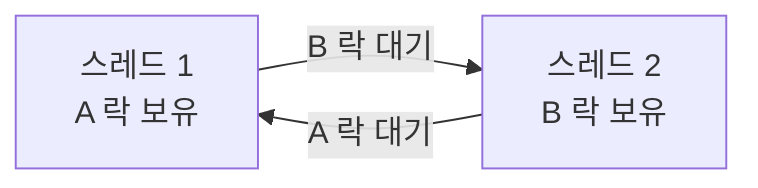

## 이 장을 읽기 전에

[레이스 컨디션과 락](/post/computerterms/race-conditions-and-locks/)에서 다룬 뮤텍스로 임계 구역을 보호하는 방법을 안다고 가정한다. 이 챕터는 그 락을 "두 개 이상" 쓸 때 생기는 새로운 문제를 다룬다 — 락은 레이스 컨디션을 없애는 동시에, 잘못 쓰면 프로그램 전체를 멈춰 세우는 원인이 되기도 한다.

## 서로가 서로를 기다리는 상황

계좌 이체를 생각해보자. A 계좌에서 B 계좌로 이체하려면 두 계좌 모두에 락을 걸어야 한다. 만약 스레드 1이 "A 락 → B 락" 순서로 걸고, 동시에 스레드 2가 "B 락 → A 락" 순서로 건다면 어떤 일이 벌어질까? 스레드 1이 A 락을 쥔 채 B 락을 기다리고, 스레드 2는 B 락을 쥔 채 A 락을 기다리는 상황이 생길 수 있다. 둘 다 상대방이 락을 놓기를 기다리지만, 둘 다 이미 기다리는 중이라 아무도 락을 놓지 않는다. 이 상태를 **데드락(Deadlock)**이라 한다.

```c
#include <stdio.h>
#include <pthread.h>
#include <unistd.h>

pthread_mutex_t lock_a = PTHREAD_MUTEX_INITIALIZER;
pthread_mutex_t lock_b = PTHREAD_MUTEX_INITIALIZER;

void *transfer_a_to_b(void *arg) {
    pthread_mutex_lock(&lock_a);
    printf("thread1: A 락 획득, B 락 대기 중...\n");
    usleep(100000);              /* 데드락이 재현되도록 시간차를 둠 */
    pthread_mutex_lock(&lock_b); /* thread2가 이미 B를 쥐고 있으면 여기서 영원히 대기 */
    printf("thread1: 이체 완료\n");
    pthread_mutex_unlock(&lock_b);
    pthread_mutex_unlock(&lock_a);
    return NULL;
}

void *transfer_b_to_a(void *arg) {
    pthread_mutex_lock(&lock_b);
    printf("thread2: B 락 획득, A 락 대기 중...\n");
    usleep(100000);
    pthread_mutex_lock(&lock_a); /* thread1이 이미 A를 쥐고 있으면 여기서 영원히 대기 */
    printf("thread2: 이체 완료\n");
    pthread_mutex_unlock(&lock_a);
    pthread_mutex_unlock(&lock_b);
    return NULL;
}

int main(void) {
    pthread_t t1, t2;
    pthread_create(&t1, NULL, transfer_a_to_b, NULL);
    pthread_create(&t2, NULL, transfer_b_to_a, NULL);
    pthread_join(t1, NULL);   /* 두 스레드 모두 여기서 영원히 멈춘다 */
    pthread_join(t2, NULL);
    printf("모든 이체 완료\n");   /* 이 줄은 실행되지 않는다 */
    return 0;
}
```

`gcc -pthread deadlock.c -o deadlock`으로 컴파일해 실행하면 "이체 완료" 메시지도, "모든 이체 완료" 메시지도 출력되지 않은 채 프로그램이 영원히 멈춘다.

## 데드락이 성립하는 네 가지 조건

운영체제 이론에서는 데드락이 성립하려면 다음 네 조건이 **동시에** 만족해야 한다고 설명한다. **상호 배제(Mutual Exclusion)**: 자원을 한 번에 한 실행 흐름만 쓸 수 있다. **점유 대기(Hold and Wait)**: 자원을 쥔 채로 다른 자원을 기다린다. **비선점(No Preemption)**: 다른 실행 흐름이 강제로 락을 뺏을 수 없다. **순환 대기(Circular Wait)**: 대기 관계가 원을 이룬다(위 예시의 스레드1→스레드2→스레드1). 이 중 하나만 깨져도 데드락은 발생하지 않는다 — 실무의 데드락 예방 전략은 대부분 이 네 조건 중 가장 깨기 쉬운 것을 표적으로 삼는다.

## 예방: 락 순서 고정으로 순환 대기 끊기

가장 실용적인 예방책은 **순환 대기** 조건을 깨는 것이다. 모든 스레드가 락을 **항상 같은 순서**로 걸도록 강제하면, 애초에 "서로 다른 순서로 기다리는" 상황 자체가 생기지 않는다.

```c
void *transfer_a_to_b_fixed(void *arg) {
    pthread_mutex_lock(&lock_a);   /* 항상 A 먼저 */
    pthread_mutex_lock(&lock_b);   /* 그다음 B */
    /* ... 이체 처리 ... */
    pthread_mutex_unlock(&lock_b);
    pthread_mutex_unlock(&lock_a);
    return NULL;
}

void *transfer_b_to_a_fixed(void *arg) {
    pthread_mutex_lock(&lock_a);   /* B→A 이체여도 락은 항상 A 먼저 */
    pthread_mutex_lock(&lock_b);
    /* ... 이체 처리 ... */
    pthread_mutex_unlock(&lock_b);
    pthread_mutex_unlock(&lock_a);
    return NULL;
}
```

두 함수 모두 "A 먼저, B 다음"이라는 고정된 순서를 따르므로, 한쪽이 A를 쥐고 있으면 다른 쪽은 A조차 얻지 못해 기다릴 뿐, B를 쥔 채로 A를 기다리는 순환은 만들어지지 않는다. 락 순서를 정할 기준이 마땅치 않다면 계좌 번호나 메모리 주소처럼 **전역적으로 비교 가능한 값**을 기준으로 정렬해 항상 작은 값의 락부터 거는 방식이 흔히 쓰인다.

## 흔한 오개념

**"타임아웃을 걸면 데드락이 안전해진다"** — 락 획득에 타임아웃을 두면 프로그램이 영원히 멈추는 것은 막을 수 있지만, 타임아웃 이후 어떻게 복구할지(이미 부분적으로 진행된 이체를 롤백할지)는 별도로 설계해야 한다. 타임아웃은 "멈춤"을 "에러 처리가 필요한 실패"로 바꿀 뿐, 데드락 자체를 예방하는 것은 아니다.

**"데드락은 락을 안 쓰면 안 생긴다"** — 락이 원인의 전형적인 예시일 뿐, 데드락의 네 조건은 락 이외의 자원(파일 핸들, 데이터베이스 트랜잭션 락, 세마포어)에도 똑같이 적용된다. [ACID Transactions](/post/computerterms/acid-transactions/) 챕터에서 다룬 데이터베이스 트랜잭션 간에도 동일한 원리로 데드락이 발생하며, 대부분의 RDBMS는 이를 자동으로 탐지해 한쪽 트랜잭션을 강제로 롤백시킨다.

## 언제 어떤 예방 전략을 쓸 것인가

세 가지 대응 전략은 상황에 따라 선택이 갈린다. **락 순서 고정**은 설계 시점에 프로그램이 다룰 자원의 종류를 미리 알 수 있을 때(예: 두 계좌 사이의 이체처럼 자원이 코드에 명시적으로 드러날 때) 가장 확실한 예방책이다. 반면 어떤 자원을 언제 잠글지 실행 중에야 결정되는 동적인 상황(예: 사용자 요청에 따라 임의의 자원 집합을 잠그는 범용 락 매니저)에서는 락 순서를 미리 정하기 어려우므로 **타임아웃 + 재시도**로 방향을 바꾸는 편이 현실적이다. **RDBMS의 자동 탐지·롤백**은 애플리케이션 코드가 개입할 수 없는 데이터베이스 내부 락에 한정되며, 개발자가 직접 구현하는 뮤텍스에는 적용되지 않는다 — 결국 예방 가능 여부(설계 시점에 자원을 알 수 있는가)가 첫 번째 판단 기준이고, 예방이 어렵다면 실패를 감내할 수 있는 형태(타임아웃 후 재시도)로 바꾸는 것이 그다음 선택이다.

## 다른 개념과의 연결

데드락 탐지는 실행 흐름 간의 대기 관계를 [그래프](/post/computerterms/graphs/)로 그려("대기-그래프", Wait-For Graph) 사이클이 있는지 확인하는 문제로 환원된다 — 그래프 챕터에서 다룬 사이클 개념이 여기서 실무 도구로 다시 쓰인다.



위 그래프처럼 대기 관계가 순환을 이루면 데드락이 확정된다. 다음 챕터에서는 락처럼 상호 배제만 제공하는 도구를 넘어, 자원의 개수 자체를 세며 접근을 조절하는 [세마포어와 모니터](/post/computerterms/semaphores-and-monitors/)를 다룬다.

## 평가 기준

이 챕터를 읽은 후에는 다음을 할 수 있어야 한다. 데드락이 성립하는 네 가지 필요조건을 나열하고, 각 조건이 실제 코드의 어느 부분에 대응하는지 설명할 수 있다. 락 순서 고정이 순환 대기 조건을 깨서 데드락을 예방하는 원리를 설명할 수 있다. 데드락 탐지가 그래프의 사이클 탐지 문제로 환원되는 이유를 설명할 수 있다.

## 참고 자료

> Silberschatz, A., Galvin, P. B., & Gagne, G. (2018). *Operating System Concepts* (10th ed.), Chapter 8: Deadlocks. Wiley.

- Coffman, E. G., Elphick, M., & Shoshani, A. (1971). "System Deadlocks". *ACM Computing Surveys*, 3(2), 67-78 — 데드락 4대 필요조건을 최초로 정식화한 원 논문 (ACM 원문은 접근 제한으로 링크를 생략함)
- [MySQL Documentation: Deadlocks](https://dev.mysql.com/doc/refman/8.0/en/innodb-deadlocks.html) — 실제 RDBMS가 데드락을 탐지하고 롤백하는 방식
