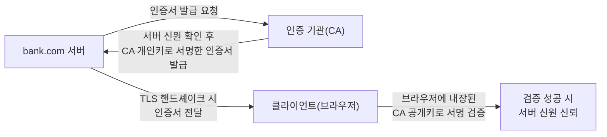

## 이 장을 읽기 전에

[암호화와 해싱](/post/computerterms/encryption-and-hashing/)에서 다룬 비대칭키 암호화(공개키/개인키 쌍)와 암호학적 해시 함수, [HTTP와 HTTPS](/post/computerterms/http-and-https/)에서 언급한 TLS 핸드셰이크의 개요를 안다고 가정한다. 이 챕터는 그 두 지식을 조합해 "이 서버가 정말 내가 접속하려던 그 서버인지"를 증명하는 메커니즘을 다룬다.

## 비대칭키를 거꾸로 써서 작성자를 증명한다

[암호화와 해싱](/post/computerterms/encryption-and-hashing/)에서 비대칭키 암호화는 "공개키로 암호화하면 개인키로만 복호화할 수 있다"고 다뤘다. **디지털 서명(Digital Signature)**은 이 관계를 거꾸로 이용한다 — 개인키로 무언가를 처리하고, 그 짝인 공개키로만 검증할 수 있게 만드는 것이다. 개인키는 서명자 본인만 갖고 있으므로, 공개키로 검증에 성공했다는 것은 "이 서명은 그 개인키를 가진 사람만이 만들 수 있었다"는 사실을 증명한다.

실제로는 원본 데이터 전체를 개인키로 암호화하지 않는다. 비대칭키 연산은 계산 비용이 크기 때문에, 먼저 원본 데이터를 [암호화와 해싱](/post/computerterms/encryption-and-hashing/)에서 다룬 암호학적 해시 함수(SHA-256 등)로 축약한 뒤, 그 해시값만 개인키로 암호화한다. 이렇게 만들어진 결과가 **서명(Signature)**이고, 원본 데이터에 함께 첨부된다.

```text
서명 생성(서명자, 개인키 보유):
  hash = SHA256(원본 데이터)
  signature = encrypt(hash, 개인키)
  전송: (원본 데이터, signature)

서명 검증(수신자, 공개키만 보유):
  hash_recomputed = SHA256(수신한 원본 데이터)
  hash_from_signature = decrypt(signature, 공개키)
  일치 여부 확인: hash_recomputed == hash_from_signature
    → 일치하면: 개인키 소유자가 서명했고, 데이터가 변조되지 않았음이 보증됨
    → 불일치하면: 서명이 위조됐거나 데이터가 도중에 변조됨
```

이 과정은 두 가지를 동시에 보증한다. 해시가 일치한다는 것은 데이터가 서명 이후 변조되지 않았다는 **무결성**을 보증하고, 그 해시를 개인키로만 만들 수 있었다는 것은 서명자가 나중에 "내가 서명한 적 없다"고 발뺌할 수 없는 **부인 방지(Non-Repudiation)**를 보증한다.

## TLS 인증서: 이 서명 체계로 서버 신원을 증명한다

[HTTP와 HTTPS](/post/computerterms/http-and-https/)에서 다룬 TLS 핸드셰이크는 서버가 자신의 공개키를 클라이언트에게 보내는 단계를 포함한다고 설명했다. 그런데 여기서 문제가 하나 남는다 — 클라이언트는 그 공개키가 정말 접속하려던 서버(예: bank.com)의 것인지 어떻게 알 수 있을까? 공격자가 중간에서 자신의 공개키를 bank.com의 것이라고 속여 보낼 수도 있다(중간자 공격). **인증서(Certificate)**는 바로 이 신원 문제를 앞서 다룬 디지털 서명으로 해결한다.

인증서는 "이 공개키는 bank.com의 것이다"라는 정보를 담은 문서이고, 이 문서 전체에 **인증 기관(CA, Certificate Authority)**의 디지털 서명이 첨부되어 있다. CA는 브라우저·운영체제가 사전에 신뢰하도록 미리 등록된 신뢰할 수 있는 제3자 기관이다. 클라이언트는 CA의 (역시 사전에 알고 있는) 공개키로 이 인증서의 서명을 검증함으로써, "이 공개키가 정말 bank.com 소유임을 CA가 보증했다"는 것을 확인한다.



이 신뢰 구조를 **PKI(공개키 기반구조, Public Key Infrastructure)**라 부른다. 브라우저는 수십 개의 신뢰할 수 있는 최상위 CA(루트 CA) 공개키를 미리 내장하고 있고, 실무에서는 루트 CA가 직접 모든 서버에 서명하는 대신 중간 CA에게 서명 권한을 위임하는 **인증서 체인(Chain of Trust)**을 구성해, 서버 인증서 → 중간 CA 인증서 → 루트 CA 순으로 검증이 이어진다.

## 비교: 암호화, 해싱, 디지털 서명

| 특성 | 암호화 | 해싱 | 디지털 서명 |
|---|---|---|---|
| 목적 | 내용을 숨김(기밀성) | 고정 길이 지문 생성 | 작성자 증명 + 무결성 |
| 사용하는 키 | 대칭키 또는 비대칭키 | 없음 | 비대칭키(개인키로 생성, 공개키로 검증) |
| 되돌릴 수 있는가 | 가능(복호화) | 불가능 | 서명 자체는 검증만 가능(원본 복원 아님) |
| TLS에서의 역할 | 데이터 전송 내용 보호 | 서명 대상 축약 | 서버 신원(인증서) 증명 |

## 흔한 오개념

**"인증서가 있으면 그 사이트는 안전(믿을 만한) 사이트다"** — 인증서는 "이 공개키가 도메인 소유자의 것"임만 증명할 뿐, 그 사이트의 콘텐츠나 운영자의 선의를 보증하지 않는다. 도메인 검증(DV) 인증서는 도메인 소유 확인만으로 무료로 쉽게 발급받을 수 있어, 피싱 사이트도 HTTPS 자물쇠 아이콘을 띄우는 경우가 흔하다. 자물쇠 아이콘은 "이 통신 구간이 암호화되어 있다"는 의미이지 "이 사이트를 신뢰해도 된다"는 의미가 아니다.

**"서명 검증에 실패하면 해시 함수가 깨진 것이다"** — 서명 검증 실패는 대부분 데이터가 전송 중 변조됐거나, 서명자의 개인키가 아닌 다른 키로 만들어진 위조 서명이거나, 만료·폐기된 인증서를 썼기 때문이다. [암호화와 해싱](/post/computerterms/encryption-and-hashing/)에서 다룬 대로 SHA-256 같은 표준 해시 함수의 충돌 저항성이 현실적으로 깨지는 경우는 극히 드물며, 실무 검증 실패의 원인은 거의 항상 데이터·키·인증서 쪽에 있다.

## 다른 개념과의 연결

디지털 서명의 해시-후-서명 구조는 [암호화와 해싱](/post/computerterms/encryption-and-hashing/)에서 다룬 비대칭키·해시 함수를 그대로 조합한 것이고, CA가 보증하는 신뢰 체계는 [HTTP와 HTTPS](/post/computerterms/http-and-https/)의 TLS 핸드셰이크를 완성하는 마지막 조각이다. 다음 챕터에서는 이렇게 신원이 확인된 클라이언트라도 과도한 요청을 보내면 서비스를 제한하는 레이트 리미팅을 다룬다.

## 평가 기준

이 챕터를 읽은 후에는 다음을 할 수 있어야 한다. 디지털 서명이 해시와 비대칭키를 어떻게 조합해 작성자를 증명하는지 설명할 수 있다. TLS 인증서가 CA의 서명으로 서버 신원을 증명하는 과정과, 인증서 체인이 필요한 이유를 설명할 수 있다. "HTTPS 자물쇠 아이콘 = 신뢰할 수 있는 사이트"라는 오해가 왜 잘못됐는지 설명할 수 있다.

## 참고 자료

> Rescorla, E. (2018). *RFC 8446: The Transport Layer Security (TLS) Protocol Version 1.3*. IETF.

- [MDN: Public-key cryptography](https://developer.mozilla.org/en-US/docs/Glossary/Public-key_cryptography) — 디지털 서명과 PKI 개념 입문
- [DigiCert: What is a Certificate Authority (CA)?](https://www.digicert.com/faq/trust-and-pki/what-is-a-certificate-authority) — CA와 인증서 체인 실무 설명
