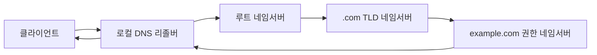

## 이 장을 읽기 전에

[OSI 7계층과 TCP/IP](/post/computerterms/osi-and-tcp-ip/)의 IP 주소·포트 개념과, [HTTP와 HTTPS](/post/computerterms/http-and-https/)에서 "도메인 이름으로 접속한다"고 표현했던 부분을 안다고 가정한다. 이 챕터는 그 도메인 이름이 실제로 어떻게 IP 주소가 되는지(DNS)와, IP 주소를 손에 쥔 다음 실제 연결을 여는 코드(소켓)를 다룬다.

## DNS: 이름을 주소로 바꾸는 분산 시스템

사람은 `example.com` 같은 이름을 기억하지만, 실제 라우팅은 IP 주소로 이뤄진다. **DNS(Domain Name System)**는 이 이름을 IP 주소로 바꿔주는 조회 시스템이다. 핵심은 이 조회가 **단일 서버가 아니라 계층적으로 분산**돼 있다는 점이다. `www.example.com`을 조회하면, 루트 네임서버 → `.com` 도메인을 담당하는 TLD 네임서버 → `example.com`을 담당하는 권한 있는(authoritative) 네임서버 순으로 질의가 이어진다.



이 전체 과정을 매 요청마다 반복하면 느리므로, 각 단계 결과는 **TTL(Time To Live)**이 붙은 채로 캐시된다. 로컬 리졸버가 이미 캐시된 답을 갖고 있으면 루트부터 다시 묻지 않고 즉시 응답한다. DNS 레코드를 변경했는데 반영이 늦게 되는 흔한 현상은 대개 이 TTL이 만료되기 전까지 여러 리졸버가 옛 값을 캐시하고 있기 때문이다.

## 소켓: IP·포트로 실제 연결을 여는 인터페이스

IP 주소를 알아냈다고 바로 통신이 되는 것은 아니다. 한 컴퓨터에는 웹 서버, 메일 서버, DB 서버 등 여러 프로그램이 동시에 네트워크를 쓸 수 있으므로, IP 주소만으로는 "어떤 프로그램에게 전달할지"를 구분할 수 없다. **포트(Port)** 번호가 그 프로그램을 구분하고, **소켓(Socket)**은 이 (IP 주소, 포트) 쌍을 이용해 실제 데이터를 주고받는 프로그래밍 인터페이스다.

```c
#include <stdio.h>
#include <string.h>
#include <sys/socket.h>
#include <netinet/in.h>
#include <unistd.h>

int main(void) {
    /* 1. 소켓 생성: 통신 방식(TCP)만 정하고 아직 주소는 없음 */
    int server_fd = socket(AF_INET, SOCK_STREAM, 0);
    if (server_fd < 0) {
        perror("socket");
        return 1;
    }

    struct sockaddr_in address;
    memset(&address, 0, sizeof(address));
    address.sin_family = AF_INET;
    address.sin_addr.s_addr = INADDR_ANY;   /* 모든 인터페이스에서 수신 */
    address.sin_port = htons(8080);         /* 이 소켓을 8080 포트에 결속 */

    /* 2. bind: 소켓을 특정 (IP, 포트)에 결속 */
    if (bind(server_fd, (struct sockaddr *)&address, sizeof(address)) < 0) {
        perror("bind");   /* 흔한 원인: 그 포트를 이미 다른 프로세스가 쓰고 있음(EADDRINUSE) */
        close(server_fd);
        return 1;
    }

    /* 3. listen: 접속 대기열을 열고 연결 요청을 받을 준비 */
    if (listen(server_fd, 3) < 0) {
        perror("listen");
        close(server_fd);
        return 1;
    }

    /* 4. accept: 클라이언트 연결이 오면 새 소켓을 반환 (server_fd는 계속 대기용) */
    int client_fd = accept(server_fd, NULL, NULL);
    if (client_fd < 0) {
        perror("accept");
        close(server_fd);
        return 1;
    }

    const char *response = "HTTP/1.1 200 OK\r\n\r\nHello";
    send(client_fd, response, strlen(response), 0);

    close(client_fd);
    close(server_fd);
    return 0;
}
```

`bind` → `listen` → `accept`는 서버 쪽 소켓의 표준 절차다. `accept`가 반환하는 `client_fd`는 `server_fd`와 별개의 소켓으로, 이 덕분에 서버는 새 연결을 계속 받으면서도 각 클라이언트와의 통신을 독립적으로 유지할 수 있다. 클라이언트 쪽은 [OSI 7계층과 TCP/IP](/post/computerterms/osi-and-tcp-ip/)에서 다룬 `connect()` 하나로 충분하다 — 클라이언트는 자신이 어느 포트를 쓸지 몰라도 되므로 `bind`를 생략하는 경우가 많다.

## 비교: DNS 조회 vs 소켓 연결

| 단계 | 목적 | 실패 시 증상 |
|---|---|---|
| DNS 조회 | 도메인 이름 → IP 주소 | "이 사이트를 찾을 수 없음" (호스트를 못 찾음) |
| TCP 소켓 연결 | IP·포트로 실제 연결 수립 | "연결이 거부됨/시간 초과" (호스트는 찾았지만 응답 없음) |

이 두 단계를 구분하는 것은 네트워크 문제를 진단할 때 실무적으로 중요하다. "사이트가 안 열린다"는 증상 하나가 DNS 문제인지 소켓/방화벽 문제인지에 따라 원인 추적 방향이 완전히 달라진다.

## 흔한 오개념

**"IP 주소만 알면 어떤 프로그램과도 통신할 수 있다"** — 포트를 지정하지 않으면 어떤 서비스와 통신할지가 정의되지 않는다. 웹 서버(80/443)와 SSH(22)가 같은 IP의 다른 포트에서 동시에 동작할 수 있는 이유가 바로 이 포트 구분 때문이다.

**"DNS 캐시를 지우면 항상 최신 값을 가져온다"** — 로컬 리졸버 캐시를 지워도, 그 위의 ISP 리졸버나 중간 캐시 서버가 TTL 만료 전 값을 여전히 들고 있을 수 있다. DNS 전파 지연은 로컬 캐시 하나만의 문제가 아니라 계층 전체에 걸친 캐시 만료 문제다.

## 다른 개념과의 연결

DNS의 캐시·TTL 개념은 [캐싱과 캐시 무효화](/post/computerterms/caching-and-invalidation/)와 원리가 같다. 소켓의 `accept`가 반환하는 연결들을 어느 서버로 분산할지는 [로드 밸런싱](/post/computerterms/load-balancing/)의 핵심 문제이며, 이는 [프로세스와 스레드](/post/computerterms/processes-and-threads/)(서버가 각 연결을 어떻게 동시에 처리하는가)와 이어진다.

## 평가 기준

이 챕터를 읽은 후에는 다음을 할 수 있어야 한다. DNS 조회가 왜 단일 서버가 아니라 계층적으로 분산돼 있는지, TTL이 이 구조에서 어떤 역할을 하는지 설명할 수 있다. 포트가 IP 주소와 별개로 필요한 이유를 설명할 수 있다. `bind`-`listen`-`accept`의 각 단계가 서버 소켓 생명주기에서 담당하는 역할을 설명할 수 있다.

## 참고 자료

> Mockapetris, P. (1987). *RFC 1035: Domain Names - Implementation and Specification*. IETF.

- [Beej's Guide to Network Programming](https://beej.us/guide/bgnet/) — 소켓 API를 처음부터 다루는 대표적인 C 소켓 프로그래밍 가이드
- [Cloudflare: What is DNS?](https://www.cloudflare.com/learning/dns/what-is-dns/) — DNS 조회 계층 구조를 그림으로 설명한 자료
