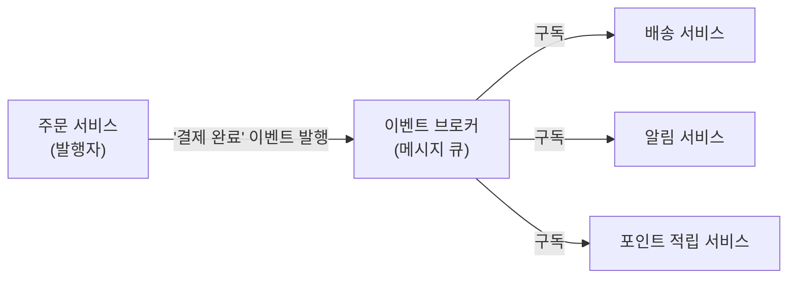

## 이 장을 읽기 전에

[옵저버 패턴](/post/computerterms/observer-pattern/)의 Subject-Observer 구조와 발행-구독 개념을 안다고 가정한다. 이 챕터는 그 구조를 클래스 하나의 범위를 넘어, 서로 다른 서비스(프로세스) 사이의 통신 방식으로 확장한다. 난이도는 중급이며, 특정 메시지 브로커(Kafka, RabbitMQ)의 상세 설정이나 정확히 한 번(exactly-once) 전달 보장의 구현 세부사항은 [메시지 큐](/post/computerterms/message-queues/) 챕터의 범위이므로 다루지 않는다.

## 서비스가 서로 직접 호출하면 생기는 문제

주문 서비스가 결제 완료 후 배송 서비스와 알림 서비스를 순서대로 직접 호출(API 요청)하는 구조를 생각해보자. 이 방식은 배송 서비스가 응답할 때까지 주문 서비스가 대기해야 하고, 배송 서비스가 잠시 장애를 일으키면 주문 처리 전체가 실패한다. 새로운 서비스(예: 포인트 적립 서비스)를 추가할 때마다 주문 서비스 코드를 열어 호출 목록에 한 줄을 추가해야 하는 것도 문제다 — 주문 서비스가 "결제가 끝났다"는 사실을 알리는 것뿐인데, 그 사실에 관심 있는 모든 서비스를 직접 알아야 하는 구조가 되어버린다.

**이벤트 드리븐 아키텍처(Event-Driven Architecture)**는 서비스들이 서로를 직접 호출하는 대신, "무슨 일이 일어났다"는 **이벤트(Event)**를 발행(publish)하고, 그 이벤트에 관심 있는 서비스가 구독(subscribe)해 각자 알아서 반응하는 구조다. 주문 서비스는 "결제 완료" 이벤트를 발행할 뿐, 그 이벤트를 배송 서비스가 구독하는지 알림 서비스가 구독하는지조차 알 필요가 없다.

## 옵저버 패턴이 시스템 수준으로 확장된 모습

이 구조는 [옵저버 패턴](/post/computerterms/observer-pattern/)에서 다룬 Subject(주체)-Observer(옵저버) 관계와 본질적으로 같은 아이디어를 프로세스 경계 너머로 확장한 것이다. 다만 클래스 내부의 옵저버 패턴에서는 Subject가 Observer 목록을 배열로 직접 들고 있어 둘 사이에 참조 관계가 존재했지만, 이벤트 드리븐 아키텍처에서는 발행자(주문 서비스)와 구독자(배송 서비스, 알림 서비스)가 서로의 존재를 전혀 모른 채, 중간의 **이벤트 브로커**를 매개로만 연결된다.



이 구조에서 새 서비스(포인트 적립)를 추가하려면 브로커에 새 구독자를 등록하기만 하면 되고, 주문 서비스 코드는 전혀 수정하지 않는다. 발행자와 구독자가 완전히 독립적으로 배포·확장될 수 있다는 점에서, 클래스 내부 옵저버 패턴보다 훨씬 느슨한 결합을 달성한다.

```python
from collections import defaultdict


# 이벤트 브로커: 발행자와 구독자를 서로 모르는 상태로 연결
class EventBroker:
    def __init__(self):
        self._subscribers: dict[str, list] = defaultdict(list)

    def subscribe(self, event_type: str, handler) -> None:
        self._subscribers[event_type].append(handler)

    def publish(self, event_type: str, payload: dict) -> None:
        for handler in self._subscribers[event_type]:
            handler(payload)  # 브로커가 실제 전달을 중개


def handle_shipping(payload: dict) -> None:
    print(f"[배송] 주문 {payload['order_id']} 배송 준비 시작")


def handle_notification(payload: dict) -> None:
    print(f"[알림] 주문 {payload['order_id']} 결제 완료 안내 발송")


broker = EventBroker()
broker.subscribe("payment_completed", handle_shipping)
broker.subscribe("payment_completed", handle_notification)

# 주문 서비스는 배송·알림 서비스의 존재를 전혀 모른 채 이벤트만 발행
broker.publish("payment_completed", {"order_id": "ORD-001"})
# [배송] 주문 ORD-001 배송 준비 시작
# [알림] 주문 ORD-001 결제 완료 안내 발송
```

위 코드는 개념을 보여주기 위한 인메모리 축약형이다. 실제 운영 환경에서는 `EventBroker` 역할을 프로세스 하나가 아니라 별도의 미들웨어인 [메시지 큐](/post/computerterms/message-queues/)(Kafka, RabbitMQ 등)가 맡는다 — 메시지 큐는 발행자·구독자가 서로 다른 서버, 다른 시각에 동작하더라도 이벤트가 유실되지 않고 전달되도록 영속성과 재시도를 보장하는 실제 구현 수단이다.

## 비교: 직접 호출(오케스트레이션) vs 이벤트 드리븐

| 특성 | 서비스 간 직접 호출 | 이벤트 드리븐 아키텍처 |
|---|---|---|
| 발행자가 아는 것 | 호출해야 할 모든 서비스의 주소와 API | "이벤트가 발생했다"는 사실뿐 |
| 새 구독자 추가 | 발행자 코드 수정 필요 | 브로커에 구독 등록만 하면 됨 |
| 장애 전파 | 한 서비스 장애가 호출 체인 전체를 막을 수 있음 | 한 구독자 장애가 다른 구독자·발행자에 즉시 영향 없음 |
| 처리 시점 | 대부분 동기(호출자가 응답을 기다림) | 대부분 비동기(발행 후 각자 처리) |
| 흐름 추적 | 호출 스택을 따라가면 파악 가능 | 이벤트가 어디로 흘러가는지 추적 인프라 필요 |

## 흔한 오개념

**"이벤트 드리븐 아키텍처는 항상 마이크로서비스에서만 쓴다"** — 이벤트 발행·구독 구조는 모놀리식 애플리케이션 내부에서도 유효하다. 하나의 프로세스 안에서도 여러 모듈이 직접 서로를 호출하는 대신 내부 이벤트 버스를 통해 통신하도록 설계할 수 있다. 다만 마이크로서비스처럼 서비스가 여러 프로세스·서버로 나뉘어 있을 때 이 구조의 이점(느슨한 결합, 독립적 확장)이 더 두드러진다.

**"이벤트만 쓰면 데이터 일관성 문제가 저절로 해결된다"** — 오히려 반대다. 동기 호출은 실패 시 즉시 알 수 있지만, 비동기 이벤트는 발행자가 이벤트를 보낸 뒤 구독자의 처리 성공 여부를 즉시 알 수 없다. 배송 서비스가 이벤트 처리에 실패하면 주문 서비스는 그 사실을 모른 채 "결제 완료" 상태로 남을 수 있다. 이 문제를 다루려면 재시도, 데드 레터 큐, 보상 트랜잭션(Saga 패턴) 같은 별도 메커니즘이 필요하며, 이벤트 드리븐 구조를 도입한다고 자동으로 해결되지 않는다.

## 다른 개념과의 연결

이벤트 드리븐 아키텍처는 [옵저버 패턴](/post/computerterms/observer-pattern/)의 발행-구독 구조를 서비스(시스템) 수준으로 확장한 것이며, 실제 구현은 [메시지 큐](/post/computerterms/message-queues/)가 담당한다. 이 챕터로 소프트웨어 설계 갈래는 클래스 수준의 패턴(옵저버, 팩토리)에서 아키텍처 수준(헥사고날, MVC/MVVM, 이벤트 드리븐)까지 확장되며 마무리된다.

## 평가 기준

이 챕터를 읽은 후에는 다음을 할 수 있어야 한다. 이벤트 드리븐 아키텍처가 옵저버 패턴을 어떻게 시스템 수준으로 확장하는지 설명할 수 있다. 서비스 간 직접 호출과 이벤트 발행·구독 방식의 장단점을 결합도·장애 전파 관점에서 비교할 수 있다. 이벤트 드리븐 구조를 도입해도 데이터 일관성 문제가 저절로 해결되지 않는 이유를 설명할 수 있다.

## 참고 자료

> Fowler, M. (2017). "What do you mean by \"Event-Driven\"?" *martinfowler.com*.

- [Martin Fowler: What do you mean by "Event-Driven"?](https://martinfowler.com/articles/201701-event-driven.html) — 이벤트 알림, 이벤트 소싱 등 이벤트 드리븐이라는 용어가 가리키는 여러 패턴을 구분한 글
- [AWS: What is Event-Driven Architecture?](https://aws.amazon.com/event-driven-architecture/) — 이벤트 드리븐 아키텍처의 실무 구성 요소와 사용 사례
