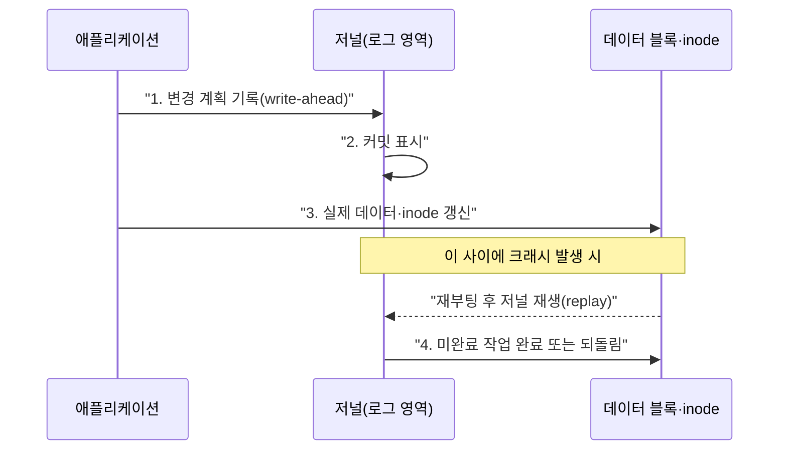

## 이 장을 읽기 전에

[메모리 관리와 가상 메모리](/post/computerterms/memory-management/)에서 다룬 "프로세스가 메모리를 어떻게 추상화해서 쓰는가"와 짝을 이루는 주제로, 이번에는 "프로세스가 영구 저장소(디스크)를 어떻게 추상화해서 쓰는가"를 다룬다.

## 디스크는 파일이라는 개념을 모른다

하드디스크나 SSD는 물리적으로 "파일"이라는 개념을 모른다. 그저 번호가 매겨진 블록의 나열일 뿐이다. **파일 시스템(File System)**은 이 블록들을 사람이 다루기 편한 "파일"과 "디렉터리"라는 계층 구조로 바꿔주는 소프트웨어 계층이다. 즉 파일 시스템은 [트리](/post/computerterms/trees/) 챕터에서 다룬 계층 구조를 실제 저장 장치 위에 구현한 응용 사례이기도 하다 — 디렉터리가 노드, 파일이 리프에 대응한다.

## inode: 파일 이름과 실제 데이터를 분리하기

유닉스 계열 파일 시스템은 파일의 메타데이터(크기, 권한, 소유자, 데이터 블록 위치)를 **inode**라는 구조체에 저장하고, 파일 이름은 디렉터리 안에서 "이름 → inode 번호" 매핑으로만 관리한다. 이 분리 덕분에 같은 파일에 여러 이름(하드 링크)을 붙이는 것이 가능하다 — 이름을 지워도 inode를 가리키는 다른 이름이 남아 있으면 실제 데이터는 지워지지 않는다.

```c
#include <stdio.h>
#include <sys/stat.h>

int main(void) {
    struct stat info;
    if (stat("/etc/hosts", &info) != 0) {
        perror("stat");
        return 1;
    }

    printf("inode 번호: %lu\n", (unsigned long)info.st_ino);
    printf("파일 크기: %ld bytes\n", (long)info.st_size);
    printf("하드 링크 수: %lu\n", (unsigned long)info.st_nlink);
    printf("권한: %o\n", info.st_mode & 0777);
    return 0;
}
```

`stat` 시스템 콜은 경로 이름으로 디렉터리를 뒤져 inode 번호를 찾고, 그 inode에 저장된 메타데이터를 반환한다. 파일을 열 때(`open`)도 동일한 경로 → inode 조회 과정을 거친 뒤, 실제 읽기·쓰기는 inode가 가리키는 데이터 블록에서 이뤄진다.

## 저널링: 정전에도 파일 시스템이 깨지지 않는 이유

파일 하나를 수정하는 것도 실제로는 inode 갱신, 데이터 블록 쓰기, 디렉터리 엔트리 갱신 등 **여러 단계**의 디스크 쓰기로 이뤄진다. 이 중간에 정전이나 시스템 크래시가 나면 일부만 반영된 채 파일 시스템이 불일치 상태에 빠질 수 있다. **저널링(Journaling)** 파일 시스템(ext4, NTFS 등)은 실제 데이터 블록에 쓰기 전에, "이런 변경을 할 것이다"라는 계획을 **저널**이라는 별도 로그 영역에 먼저 기록한다. 크래시 후 재부팅하면 저널을 다시 읽어 미완료된 작업을 완료하거나 되돌려, 파일 시스템을 일관된 상태로 복구한다. 이는 [ACID Transactions](/post/computerterms/acid-transactions/) 챕터에서 다룬 트랜잭션 로그·원자성 보장과 원리가 동일하다 — 파일 시스템 저널링은 사실상 파일 시스템 수준의 트랜잭션이다.



ext4는 이 저널링을 **어디까지 저널에 기록할지**에 따라 세 가지 모드를 제공하며, 이 선택이 곧 성능과 안전성 사이의 실무 판단 기준이 된다. `data=journal` 모드는 메타데이터뿐 아니라 실제 파일 데이터까지 저널에 먼저 쓰므로 크래시 후에도 데이터 손실 위험이 가장 낮지만, 모든 데이터를 두 번(저널 → 실제 위치) 쓰는 셈이라 쓰기 성능이 가장 낮다. `data=ordered`(대부분의 배포판 기본값)는 메타데이터만 저널에 기록하되, 실제 데이터 블록을 메타데이터보다 먼저 디스크에 쓰도록 순서를 강제해 "메타데이터는 있는데 데이터는 없는" 불일치를 막는다 — 성능과 안전성의 절충안이다. `data=writeback`은 순서 보장조차 하지 않아 가장 빠르지만, 크래시 시 메타데이터는 복구돼도 그 메타데이터가 가리키는 데이터 블록 내용이 이전 크래시 시점의 쓰레기 값일 수 있다. 데이터 무결성이 최우선인 데이터베이스 서버라면 `ordered`나 `journal`을, 임시 캐시처럼 손실을 감내할 수 있는 워크로드에서 쓰기 처리량이 중요하다면 `writeback`을 고려하는 식으로 워크로드 특성에 따라 선택한다.

## 비교: 파일 시스템 조회 비용

| 연산 | 과정 | 비용에 영향을 주는 요소 |
|---|---|---|
| 파일 열기(`open`) | 경로의 각 디렉터리를 순회하며 inode 조회 | 경로 깊이, 디렉터리 크기 |
| 파일 읽기(`read`) | inode의 데이터 블록 위치를 따라가 디스크 접근 | 블록이 연속적인가(단편화 여부) |
| 파일 삭제(`unlink`) | 디렉터리 엔트리 제거, 링크 수가 0이면 inode·블록 반환 | 하드 링크가 남아있으면 데이터는 유지 |

## 흔한 오개념

**"파일을 삭제하면 즉시 디스크에서 지워진다"** — `unlink`는 디렉터리에서 이름 → inode 매핑만 제거한다. 다른 프로세스가 이미 그 파일을 열어 파일 디스크립터를 들고 있다면, 그 프로세스가 닫기 전까지 inode와 데이터 블록은 실제로 살아있다. 리눅스에서 "삭제했는데 디스크 용량이 안 줄어든다"는 흔한 증상은 대개 이 열려 있는 파일 디스크립터 때문이다.

**"저널링이 있으면 데이터 손실이 절대 없다"** — 저널링은 파일 시스템 구조의 일관성(메타데이터 무결성)을 보장하는 것이지, 저널에 기록되기 전에 진행 중이던 애플리케이션 수준의 쓰기 데이터 자체의 손실까지 막아주지는 않는다. "구조는 깨지지 않는다"와 "데이터가 항상 안전하다"는 다른 보장이다.

## 다른 개념과의 연결

inode의 이름-데이터 분리는 [해시테이블](/post/computerterms/hash-tables/)에서 다룬 "키로 값을 찾는" 문제와 본질적으로 같은 구조다. 저널링의 원자성 보장은 [ACID Transactions](/post/computerterms/acid-transactions/) 챕터의 원자성·영구성과 직접 대응한다. 운영체제 갈래는 이후 인터럽트·시그널·IPC 같은 프로세스 간 상호작용 주제로 이어지며, 데이터베이스 갈래에서는 이 저널링·트랜잭션 개념을 인덱스·정규화로 확장한다.

## 평가 기준

이 챕터를 읽은 후에는 다음을 할 수 있어야 한다. inode가 파일 이름과 데이터를 분리해서 관리하는 이유와, 하드 링크가 가능한 원리를 설명할 수 있다. 저널링이 크래시 후 파일 시스템 일관성을 복구하는 원리를 설명할 수 있다. 파일 삭제 후에도 디스크 용량이 줄지 않는 상황의 원인을 진단할 수 있다.

## 참고 자료

> Silberschatz, A., Galvin, P. B., & Gagne, G. (2018). *Operating System Concepts* (10th ed.), Chapter 11–12: File-System Interface & Implementation. Wiley.

- [Linux man-pages: inode(7)](https://man7.org/linux/man-pages/man7/inode.7.html) — inode 구조체가 저장하는 메타데이터 전체 목록
- [ext4 Documentation: Journal](https://www.kernel.org/doc/html/latest/filesystems/ext4/journal.html) — ext4 저널링의 실제 구현 방식
