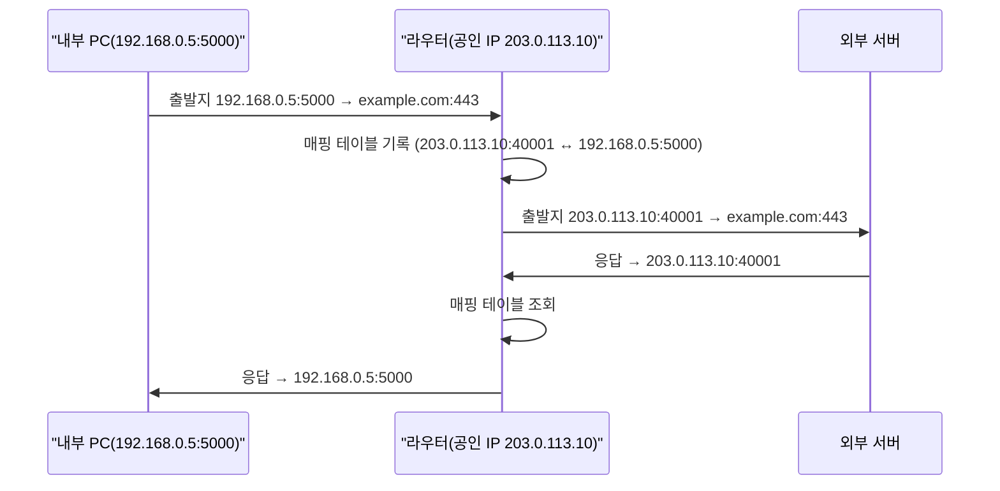

## 이 장을 읽기 전에

[OSI 7계층과 TCP/IP](/post/computerterms/osi-and-tcp-ip/)에서 다룬 IP 주소·포트·전송 계층 개념을 안다고 가정한다. 방화벽과 NAT는 모두 이 계층에서 패킷의 IP·포트 정보를 근거로 동작한다.

## 방화벽: 규칙으로 트래픽을 거르는 관문

**방화벽(Firewall)**은 네트워크 경계에 위치해 들어오고 나가는 패킷을 검사하고, 미리 정의된 규칙에 따라 허용하거나 차단하는 장치(또는 소프트웨어)다. 가장 기본적인 형태인 **패킷 필터링 방화벽**은 각 패킷의 출발지·목적지 IP 주소와 포트 번호, 프로토콜(TCP/UDP)을 규칙 목록과 대조해 통과 여부를 결정한다. 예를 들어 "80번과 443번 포트로 들어오는 TCP 트래픽만 허용하고 나머지는 모두 차단한다"는 규칙을 두면, 웹 서버에는 접근할 수 있지만 다른 포트로 서비스 중인 관리자 도구는 외부에서 접근할 수 없다.

```text
규칙 예시 (위에서부터 순서대로 평가):
1. ALLOW  TCP  목적지포트=443   (HTTPS 허용)
2. ALLOW  TCP  목적지포트=80    (HTTP 허용)
3. ALLOW  TCP  출발지IP=10.0.0.0/8  목적지포트=22  (내부망에서만 SSH 허용)
4. DENY   ALL                   (그 외 전부 차단)
```

패킷 필터링 방화벽은 각 패킷을 독립적으로 검사하지만, **상태 기반 방화벽(Stateful Firewall)**은 한 걸음 더 나아가 TCP 연결의 흐름(연결 요청 → 응답 → 데이터 교환)을 추적해, "내가 먼저 요청을 보낸 응답 패킷"은 별도 규칙 없이도 자동으로 허용한다. 이 방식이 오늘날 대부분의 방화벽이 쓰는 기본 동작이다.

## NAT: 사설 IP를 공인 IP로 바꿔치기

**NAT(Network Address Translation)**는 방화벽과 별개의 문제를 푼다. IPv4 주소는 전 세계에서 사용 가능한 개수가 약 43억 개로 제한되어 있는데, 가정이나 회사의 모든 기기에 공인 IP를 하나씩 할당하면 금방 고갈된다. NAT는 내부 네트워크의 기기들에게 사설 IP(예: `192.168.0.0/16`, `10.0.0.0/8` 대역)를 부여하고, 이 기기들이 외부와 통신할 때는 공유기·라우터가 하나의 공인 IP로 주소를 바꿔치기해 내보낸다. 라우터는 어떤 내부 기기가 어떤 요청을 보냈는지 포트 번호를 이용해 매핑 테이블에 기록해 두었다가, 응답이 돌아오면 그 포트 번호를 보고 원래 요청한 내부 기기로 되돌려 보낸다.



이 방식 덕분에 집안의 노트북·스마트폰·스마트TV가 모두 하나의 공인 IP만으로 동시에 외부와 통신할 수 있다. NAT는 IP 주소 절약이 원래 목적이지만, 외부에서는 내부 기기의 실제 IP·포트가 보이지 않아 부수적으로 보안 효과도 낸다 — 다만 이는 방화벽처럼 규칙에 따라 트래픽을 능동적으로 차단하는 것이 아니라, 애초에 내부 기기가 외부에서 직접 접근할 주소를 갖지 않기 때문에 생기는 결과다.

## 포트 포워딩: 외부에서 내부 서버로 접근하기

NAT는 기본적으로 내부에서 외부로 나가는 연결의 응답만 되돌려 보낸다. 그런데 집에서 운영하는 게임 서버처럼 외부에서 먼저 내부 기기로 접속을 시작해야 하는 경우, 라우터는 그 요청을 어느 내부 기기로 보내야 할지 매핑 테이블에 정보가 없어 알 수 없다. **포트 포워딩(Port Forwarding)**은 이 문제를 "공인 IP의 특정 포트로 들어오는 요청은 항상 지정된 내부 IP·포트로 전달한다"는 고정 규칙을 라우터에 미리 등록해 해결한다. 예를 들어 "공인 IP의 25565번 포트로 오는 요청은 항상 192.168.0.10:25565로 보낸다"고 설정하면, 외부에서 그 포트로 접속한 요청이 항상 특정 내부 서버로 전달된다.

## 비교: 방화벽 vs NAT

| 항목 | 방화벽 | NAT |
|---|---|---|
| 목적 | 규칙 기반 트래픽 허용/차단 | 사설-공인 IP 주소 변환 |
| 주 근거 | IP·포트·프로토콜 규칙 | 매핑 테이블(사설 IP:포트 ↔ 공인 IP:포트) |
| 보안 효과 | 능동적 차단(1차 목적) | 내부 주소 은닉(부수 효과) |
| IP 주소 절약 | 해당 없음 | 있음(1차 목적) |
| 외부 접근 허용 방법 | 허용 규칙 추가 | 포트 포워딩 규칙 등록 |

## 흔한 오개념

**"NAT를 쓰면 방화벽이 따로 필요 없다"** — NAT의 주소 은닉은 방화벽의 규칙 기반 차단과 목적이 다르다. NAT는 매핑 테이블에 없는 요청을 우연히 전달하지 못할 뿐이지, 명시적으로 어떤 트래픽을 허용·거부할지 정책을 정의하지 않는다. 포트 포워딩을 하나라도 열어두면 그 포트는 NAT의 은닉 효과 없이 그대로 노출되므로, 실제 보안 정책은 방화벽 규칙으로 별도로 관리해야 한다.

**"방화벽은 외부 공격만 막는다"** — 방화벽 규칙은 인바운드(들어오는)뿐 아니라 아웃바운드(나가는) 트래픽에도 적용할 수 있다. 내부 기기가 악성코드에 감염되어 외부의 공격자 서버로 데이터를 전송하려 할 때, 아웃바운드 규칙으로 알려지지 않은 목적지로의 연결을 차단하면 피해를 줄일 수 있다. 인바운드 차단만 방화벽의 역할이라고 여기면 이런 아웃바운드 통제를 놓치기 쉽다.

## 다른 개념과의 연결

방화벽의 IP·포트 기반 규칙과 NAT의 주소 변환은 모두 [OSI 7계층과 TCP/IP](/post/computerterms/osi-and-tcp-ip/)에서 다룬 네트워크 계층(IP)과 전송 계층(포트)의 정보를 그대로 활용한다. 다음 챕터에서는 클라이언트와 서버 사이에서 요청을 대신 처리하는 또 다른 중간 지점인 프록시(정방향·역방향)를 다룬다.

## 평가 기준

이 챕터를 읽은 후에는 다음을 할 수 있어야 한다. 패킷 필터링 방화벽이 IP·포트 규칙으로 트래픽을 걸러내는 원리를 설명할 수 있다. NAT가 매핑 테이블을 이용해 사설 IP와 공인 IP를 어떻게 연결하는지 설명할 수 있다. 포트 포워딩이 왜 필요한지, 그리고 NAT와 방화벽의 역할이 어떻게 다른지 구분할 수 있다.

## 참고 자료

> Srisuresh, P., & Egevang, K. (2001). *RFC 3022: Traditional IP Network Address Translator (Traditional NAT)*. IETF.

- [Wikipedia: Firewall (computing)](https://en.wikipedia.org/wiki/Firewall_(computing)) — 패킷 필터·상태 기반·응용 계층 방화벽의 역사와 종류별 동작 방식
- [MDN: What is NAT?](https://developer.mozilla.org/en-US/docs/Glossary/NAT) — NAT의 기본 개념과 IPv4 주소 부족 문제와의 관계
