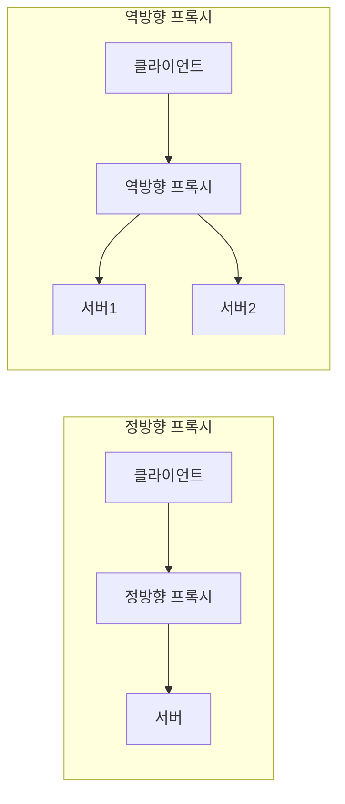

## 이 장을 읽기 전에

[로드 밸런싱](/post/computerterms/load-balancing/)에서 다룬 "클라이언트와 서버 사이에서 요청을 중개하는 장치"라는 개념을 안다고 가정한다. 이 챕터는 그 중개자를 "누구를 대신하는가"라는 기준으로 두 종류로 나눠 본다.

## 프록시는 대신 요청하는 중개자다

**프록시(Proxy)**는 클라이언트와 서버 사이에서 요청을 대신 전달하는 중개자다. 프록시를 구분하는 핵심 질문은 "이 프록시가 누구의 입장을 대신하는가"다. **정방향 프록시(Forward Proxy)**는 클라이언트 쪽에 위치해 클라이언트를 대신해 서버에 요청을 보낸다. 서버 입장에서는 실제 클라이언트가 아니라 정방향 프록시가 요청한 것으로 보인다. **역방향 프록시(Reverse Proxy)**는 반대로 서버 쪽에 위치해 서버를 대신해 클라이언트의 요청을 받는다. 클라이언트 입장에서는 실제 서버가 아니라 역방향 프록시와 통신하는 것으로 보인다.

두 구조 모두 "클라이언트-프록시-서버"라는 형태는 같지만, 프록시가 어느 쪽 정체성을 가리는지가 반대다. 정방향 프록시는 서버에게 "클라이언트가 누구인지"를 가리고, 역방향 프록시는 클라이언트에게 "서버가 몇 대이고 어떻게 구성되어 있는지"를 가린다.

## 정방향 프록시: 클라이언트를 대신하다

회사 네트워크에서 흔히 쓰는 정방향 프록시는 직원의 PC가 외부 웹사이트에 접속할 때 항상 프록시 서버를 거치도록 강제한다. 이 구조는 두 가지 용도로 쓰인다. 첫째는 **접속 제어**다 — 프록시가 특정 사이트로의 요청을 차단하거나 로그를 남겨 사내 정책을 강제할 수 있다. 둘째는 **캐싱**이다 — 여러 직원이 같은 외부 리소스에 반복해서 접근하면 프록시가 그 응답을 캐싱해 두어 외부 대역폭을 절약할 수 있다. 개인 사용자가 지역 제한을 우회하려고 다른 국가의 프록시 서버를 거치는 것도 정방향 프록시의 활용 사례다 — 목적지 서버는 실제 사용자의 IP가 아니라 프록시의 IP만 보게 된다.

## 역방향 프록시: 서버를 대신하다

역방향 프록시는 여러 대의 서버 앞에 위치해, 클라이언트의 요청을 받아 적절한 내부 서버로 전달하고 그 응답을 다시 클라이언트에게 돌려준다. 클라이언트는 내부에 서버가 몇 대 있는지, 어떤 IP를 쓰는지 전혀 알 필요가 없다. 이 구조가 바로 [로드 밸런싱](/post/computerterms/load-balancing/)에서 다룬 로드 밸런서의 정체다 — 로드 밸런서는 라운드 로빈·최소 연결 같은 알고리즘으로 요청을 분산하는 **역방향 프록시의 한 형태**다. 역방향 프록시는 부하 분산 외에도 SSL/TLS 종료(외부와의 암호화 통신을 프록시에서 처리하고 내부 통신은 평문으로 단순화), 정적 콘텐츠 캐싱, 내부 서버 구조·에러 메시지 은닉을 통한 보안 강화 등 다양한 목적으로 쓰인다.

이 이점에는 트레이드오프가 따른다. 모든 클라이언트 요청이 역방향 프록시 하나를 반드시 거치므로, 이 프록시가 다운되면 뒤에 서버가 아무리 멀쩡해도 서비스 전체가 중단된다 — **단일 장애점(Single Point of Failure)**이 되는 것이다. 실무에서는 이 문제를 프록시 자체를 이중화(액티브-스탠바이 또는 여러 대 클러스터)해서 완화한다. SSL 종료도 마찬가지로 편의와 위험을 함께 가져온다 — 프록시와 내부 서버 사이 구간이 평문이라는 가정은, 그 구간이 실제로 신뢰할 수 있는 사설망 안에 있을 때만 안전하다. 프록시와 서버가 서로 다른 데이터센터나 클라우드 리전에 걸쳐 있다면 이 내부 구간도 별도로 암호화해야 한다. 마지막으로, 요청이 프록시를 한 번 더 거치는 것 자체가 추가적인 네트워크 홉이므로, 프록시의 처리 지연이 곧 전체 응답 시간에 더해진다는 점도 감안해야 한다.

## 비교: 정방향 프록시 vs 역방향 프록시

| 항목 | 정방향 프록시 | 역방향 프록시 |
|---|---|---|
| 위치 | 클라이언트 쪽 | 서버 쪽 |
| 누구를 대신하는가 | 클라이언트 | 서버 |
| 누구의 정체를 가리는가 | 서버에게 클라이언트를 숨김 | 클라이언트에게 서버 구성을 숨김 |
| 주 용도 | 접속 제어, 우회 접속, 클라이언트 측 캐싱 | 로드밸런싱, SSL 종료, 서버 측 캐싱, 보안 |
| 클라이언트의 프록시 인지 | 보통 인지하고 명시적으로 설정 | 보통 인지하지 못함(투명하게 동작) |

## 흔한 오개념

**"정방향 프록시와 역방향 프록시는 기술적으로 완전히 다른 소프트웨어다"** — 실제로는 같은 소프트웨어(예: NGINX, Squid)가 설정에 따라 정방향으로도 역방향으로도 동작할 수 있다. 차이는 소프트웨어의 종류가 아니라 **네트워크 상의 위치와 대신하는 대상**에 있다. 같은 프록시 서버라도 클라이언트 쪽에 두고 클라이언트 요청을 대리하면 정방향, 서버 쪽에 두고 서버 요청을 대리하면 역방향이 된다.

**"역방향 프록시는 곧 로드 밸런서다"** — 로드 밸런싱은 역방향 프록시가 할 수 있는 여러 기능 중 하나일 뿐이다. 단일 서버 앞에 역방향 프록시를 두고 SSL 종료나 캐싱, 요청 헤더 조작만 시키는 구성도 흔하다. 로드 밸런서는 "여러 서버로 분산"이라는 기능에 특화된 역방향 프록시의 한 활용 형태로 이해하는 것이 정확하다.

## 다른 개념과의 연결

역방향 프록시가 SSL/TLS 종료를 담당하는 방식은 [HTTP와 HTTPS](/post/computerterms/http-and-https/)에서 다룬 TLS 핸드셰이크를 외부 구간에서만 수행하고 내부 통신은 평문으로 단순화하는 실무 패턴과 직결된다. 다음 챕터에서는 HTTP/1.1과 HTTP/2가 TCP 위에서 겪는 한계를 UDP 기반 QUIC이 어떻게 해결하는지 다룬다.

## 평가 기준

이 챕터를 읽은 후에는 다음을 할 수 있어야 한다. 정방향 프록시와 역방향 프록시를 "누구를 대신하는가" 기준으로 구분해 설명할 수 있다. 로드 밸런서가 왜 역방향 프록시의 한 형태인지 설명할 수 있다. 각 프록시 유형이 실무에서 어떤 목적(접속 제어·캐싱 vs 부하분산·보안)으로 쓰이는지 예를 들어 설명할 수 있다.

## 참고 자료

> Luotonen, A., & Altis, K. (1994). *World-Wide Web Proxies*. Computer Networks and ISDN Systems, 27(2), 147–154.

- [MDN: Proxy servers and tunneling](https://developer.mozilla.org/en-US/docs/Web/HTTP/Proxy_servers_and_tunneling) — 프록시의 HTTP 프로토콜 수준 동작과 터널링 설명
- [NGINX: Reverse Proxy](https://docs.nginx.com/nginx/admin-guide/web-server/reverse-proxy/) — 역방향 프록시의 실제 설정과 SSL 종료·캐싱 구성 예시
