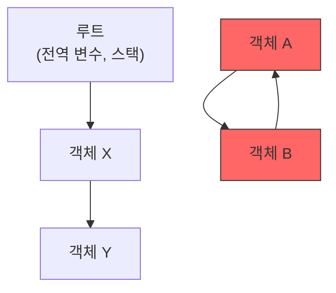

## 이 장을 읽기 전에

[메모리 관리와 가상 메모리](/post/computerterms/memory-management/)에서 다룬 `malloc`/`free`(또는 `new`/`delete`)로 힙 메모리를 수동으로 할당·해제하는 방식을 안다고 가정한다. 이 챕터는 그 해제 과정을 프로그래머 대신 언어 런타임이 자동으로 수행하는 원리를 다룬다.

## 수동 해제는 왜 위험한가

[메모리 관리와 가상 메모리](/post/computerterms/memory-management/)에서 본 것처럼, `malloc`으로 할당한 메모리를 `free`로 해제하는 책임은 전적으로 프로그래머에게 있다. 해제를 잊으면 그 메모리는 프로그램이 끝날 때까지 회수되지 않고 쌓이는데, 이를 **메모리 누수(Memory Leak)**라고 부른다. 반대로 이미 해제한 메모리를 다시 사용하거나 두 번 해제하면 프로그램이 예측 불가능하게 동작하거나 충돌한다. **가비지 컬렉션(Garbage Collection, GC)**은 "더 이상 어디서도 참조하지 않는 메모리"를 런타임이 스스로 찾아 회수하게 함으로써 이 책임을 프로그래머에게서 덜어낸다. Java, Python, JavaScript, Go 같은 언어는 모두 GC를 내장하고 있다.

## 참조 카운팅: 몇 번 가리켜지고 있는지 센다

**참조 카운팅(Reference Counting)**은 객체마다 "지금 몇 개의 변수·자료구조가 나를 가리키고 있는가"를 숫자로 관리하는 가장 단순한 GC 방식이다. 새로운 참조가 생기면 카운트를 1 늘리고, 참조가 사라지면(변수가 다른 값을 가리키거나 스코프를 벗어나면) 카운트를 1 줄인다. 카운트가 0이 되는 순간 그 객체를 더 이상 아무도 쓰지 않는다는 뜻이므로 즉시 회수한다. CPython(표준 Python 구현)의 기본 메모리 관리가 바로 이 방식이다.

```python
import sys

a = [1, 2, 3]
print(sys.getrefcount(a) - 1)  # 1 (a가 참조 중, getrefcount 인자 전달로 인한 +1 제외)

b = a          # 같은 리스트를 b도 가리킴 -> 참조 카운트 2
print(sys.getrefcount(a) - 1)  # 2

del b          # b가 사라짐 -> 참조 카운트 1
print(sys.getrefcount(a) - 1)  # 1

del a          # 참조 카운트 0 -> 리스트 객체는 이 시점에 즉시 회수됨
```

참조 카운팅은 카운트가 0이 되는 즉시 회수하므로 회수 시점이 예측 가능하고, 프로그램 전체를 멈추고 훑어볼 필요가 없어 지연이 작다는 장점이 있다. 하지만 치명적인 약점이 있다 — 두 객체가 서로를 참조하는 **순환 참조(Circular Reference)**가 생기면, 둘 다 외부에서는 더 이상 쓰이지 않는데도 서로의 카운트가 1 이상으로 유지되어 영원히 회수되지 않는다.

```python
class Node:
    def __init__(self, name):
        self.name = name
        self.other = None

a = Node("A")
b = Node("B")
a.other = b   # a가 b를 참조 -> b의 카운트 2 (변수 b + a.other)
b.other = a   # b가 a를 참조 -> a의 카운트 2 (변수 a + b.other)

del a
del b
# 이제 바깥에서는 A, B에 접근할 방법이 없지만
# a.other가 b를, b.other가 a를 여전히 참조하고 있어
# 순수 참조 카운팅만으로는 카운트가 0이 되지 않는다
```

## 추적 방식: 뿌리에서부터 도달 가능한지 확인한다

**추적(Tracing) GC**는 순환 참조 문제를 근본적으로 해결하는 접근이다. 전역 변수·스택의 지역 변수처럼 프로그램이 직접 접근할 수 있는 **루트(Root)** 집합에서 출발해, 참조를 따라가며 "도달 가능한(Reachable)" 객체를 모두 표시하고, 표시되지 않은 객체는 루트에서 아무리 참조를 따라가도 닿을 수 없으므로 회수 대상으로 간주한다. 가장 널리 쓰이는 구현이 **mark-and-sweep**이다 — 먼저 루트에서 도달 가능한 모든 객체에 표시(mark)를 남기고, 힙 전체를 훑으며 표시되지 않은 객체를 쓸어(sweep) 회수한다. 앞의 순환 참조 예시에서 `a`, `b`를 가리키는 변수가 모두 사라지면, 루트에서 출발해 `a.other`나 `b.other`를 아무리 따라가도 그 둘에는 도달할 수 없으므로 mark-and-sweep은 둘 다 정확히 회수한다. CPython은 참조 카운팅을 기본으로 쓰되, 순환 참조만 별도로 잡아내기 위해 주기적으로 추적 방식의 순환 감지기(`gc` 모듈)를 함께 돌리는 하이브리드 구조를 취한다. Java의 HotSpot JVM은 처음부터 추적 방식(세대별 GC)만 쓴다.



위 그림에서 `X`, `Y`는 루트에서 참조를 따라가 도달할 수 있으므로 살아남지만, `A`, `B`는 서로를 참조할 뿐 루트에서 도달할 방법이 없으므로 mark-and-sweep은 이 둘을 회수 대상으로 표시한다.

## 비교: 참조 카운팅 vs 추적(mark-and-sweep)

| 특성 | 참조 카운팅 | 추적(mark-and-sweep) |
|---|---|---|
| 회수 시점 | 카운트가 0이 되는 즉시 | 주기적으로 전체를 훑을 때 |
| 순환 참조 | 회수 못 함(별도 감지기 필요) | 정확히 회수함 |
| 실행 중 지연 | 참조가 바뀔 때마다 소폭 발생 | 훑는 동안 일시 정지(Stop-the-world) 가능 |
| 대표 사례 | CPython(주 메커니즘) | JVM, V8(주 메커니즘) |

## 흔한 오개념

**"가비지 컬렉션이 있으면 메모리 누수가 안 생긴다"** — GC는 "아무도 참조하지 않는" 메모리만 회수한다. 이미 쓸모없어진 객체를 전역 리스트나 캐시에 계속 담아두고 있으면, GC 입장에서는 여전히 "참조되고 있는" 멀쩡한 객체이므로 회수하지 않는다. 이런 논리적 누수는 GC가 있는 언어에서도 흔히 발생하며, 관찰 도구(Java의 힙 덤프, Python의 `gc` 모듈, Chrome DevTools의 메모리 프로파일러)로 직접 찾아야 한다.

**"GC가 있으면 성능을 신경 쓸 필요가 없다"** — mark-and-sweep 계열 GC는 회수 시점에 프로그램 실행을 잠시 멈추는 Stop-the-world가 발생할 수 있다. 짧은 지연에도 민감한 실시간 시스템이나 대규모 힙을 다루는 서비스는 GC 튜닝(세대 크기, GC 알고리즘 선택)이 실제 성능에 큰 영향을 준다 — GC가 "메모리 관리를 안 해도 된다"가 아니라 "해제 시점의 책임을 옮긴다"는 것으로 이해해야 한다.

## 다른 개념과의 연결

가비지 컬렉션은 [메모리 관리와 가상 메모리](/post/computerterms/memory-management/)에서 다룬 힙 할당·해제를 자동화한 것이며, GC 없이 이 문제를 해결하는 제3의 접근은 이후 챕터에서 다룰 Rust의 소유권 모델이다. 다음 챕터에서는 함수가 자신이 정의된 환경의 변수를 참조 형태로 계속 붙들고 있는 클로저를 다루는데, 이때 클로저가 캡처한 변수 역시 GC가 관리하는 참조 대상이 된다.

## 평가 기준

이 챕터를 읽은 후에는 다음을 할 수 있어야 한다. 참조 카운팅과 추적(mark-and-sweep) 방식이 회수를 판단하는 기준의 차이를 설명할 수 있다. 순환 참조가 왜 참조 카운팅만으로는 회수되지 않는지, mark-and-sweep은 왜 회수할 수 있는지 설명할 수 있다. "GC가 있으면 메모리 누수가 없다"는 오해가 왜 틀렸는지 예를 들어 설명할 수 있다.

## 참고 자료

> Jones, R., Hosking, A., & Moss, E. (2011). *The Garbage Collection Handbook: The Art of Automatic Memory Management*, Chapter 1: Introduction. Chapman and Hall/CRC.

- [Python Developer's Guide: Garbage Collector Design](https://devguide.python.org/internals/garbage-collector/) — CPython의 참조 카운팅과 순환 감지기가 함께 동작하는 방식
- [Oracle: Java Garbage Collection Basics](https://www.oracle.com/webfolder/technetwork/tutorials/obe/java/gc01/index.html) — HotSpot JVM의 세대별 추적 GC 구조
