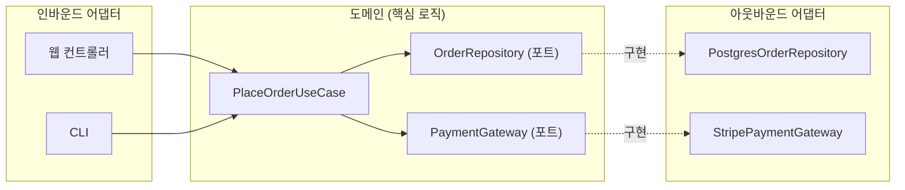

## 이 장을 읽기 전에

[결합도와 응집도](/post/computerterms/coupling-and-cohesion/)에서 다룬 낮은 결합도의 기준과 [SOLID 원칙 개요](/post/computerterms/solid-principles-overview/)의 의존성 역전 원칙(DIP)을 안다고 가정한다. 이 챕터는 그 원칙을 클래스 수준이 아니라 애플리케이션 전체 구조 수준으로 확장한다. 난이도는 중급이며, 마이크로서비스 간 경계를 어떻게 나눌지 같은 분산 시스템 설계는 [CAP 정리와 합의](/post/computerterms/cap-theorem-and-consensus/) 등 별도 챕터의 범위이므로 다루지 않는다.

## 비즈니스 로직에 데이터베이스 코드가 뒤섞이면 생기는 문제

주문 처리 로직을 작성할 때, 흔히 서비스 클래스 안에서 곧바로 특정 ORM의 쿼리 코드나 특정 웹 프레임워크의 요청 객체를 다룬다. 이렇게 작성된 코드는 처음엔 빠르게 동작하지만, 데이터베이스를 교체하거나(MySQL에서 PostgreSQL로), 배치 작업에서 같은 로직을 재사용하려 하면 문제가 드러난다. 핵심 계산 로직(할인 적용, 재고 차감)이 특정 ORM의 API 호출과 뒤섞여 있어, 로직만 따로 떼어 테스트하거나 재사용할 수 없다. [결합도와 응집도](/post/computerterms/coupling-and-cohesion/)의 언어로 말하면, 핵심 로직이 외부 기술(데이터베이스, 웹 프레임워크)에 강하게 결합된 상태다.

**헥사고날 아키텍처(Hexagonal Architecture)**는 앨리스터 코오번(Alistair Cockburn)이 2005년 제안한 아키텍처 패턴으로, **포트와 어댑터(Ports and Adapters)**라고도 불린다. 핵심 아이디어는 애플리케이션의 핵심 비즈니스 로직(도메인)을 중심에 두고, 데이터베이스·웹 프레임워크·외부 API 같은 기술적 세부사항을 도메인이 정의한 인터페이스(포트) 뒤로 완전히 격리하는 것이다. 도메인 코드는 "저장한다"는 포트 인터페이스만 알고, 그 저장이 실제로 PostgreSQL로 되는지 파일로 되는지는 어댑터 구현체가 결정한다.

## 포트와 어댑터의 구조

**포트(Port)**는 도메인이 외부와 주고받아야 하는 것을 정의하는 인터페이스다. 예를 들어 "주문을 저장한다"는 `OrderRepository` 인터페이스가 포트다. **어댑터(Adapter)**는 포트 인터페이스를 실제 기술로 구현한 것이다 — `PostgresOrderRepository`, `InMemoryOrderRepository`가 어댑터에 해당한다. 포트는 방향에 따라 둘로 나뉜다. 외부에서 도메인으로 들어오는 요청을 받는 **인바운드 포트**(예: 웹 컨트롤러가 호출하는 `PlaceOrderUseCase`)와, 도메인이 외부로 나가는 작업을 요청하는 **아웃바운드 포트**(예: `OrderRepository`, `PaymentGateway`)다.



```python
from abc import ABC, abstractmethod


# 아웃바운드 포트: 도메인이 정의한 인터페이스, "무엇을" 하는지만 명시
class OrderRepository(ABC):
    @abstractmethod
    def save(self, order_id: str, total: int) -> None:
        pass


# 도메인 핵심 로직: 어떤 데이터베이스를 쓰는지 전혀 모른다
class PlaceOrderUseCase:
    def __init__(self, repository: OrderRepository):
        self.repository = repository  # 구체 구현이 아니라 포트(인터페이스)에 의존

    def execute(self, order_id: str, price: int, quantity: int) -> int:
        total = price * quantity
        self.repository.save(order_id, total)
        return total


# 아웃바운드 어댑터: 실제 저장 기술(여기서는 딕셔너리로 단순화한 예)
class InMemoryOrderRepository(OrderRepository):
    def __init__(self):
        self._storage: dict[str, int] = {}

    def save(self, order_id: str, total: int) -> None:
        self._storage[order_id] = total
        print(f"[저장] 주문 {order_id}: {total}원")


use_case = PlaceOrderUseCase(InMemoryOrderRepository())
use_case.execute("ORD-001", 5000, 3)  # [저장] 주문 ORD-001: 15000원
```

`PlaceOrderUseCase`는 `InMemoryOrderRepository`라는 구체 클래스를 전혀 모른다 — 테스트할 때는 실제 데이터베이스 대신 메모리 기반 어댑터를 주입하고, 운영 환경에서는 PostgreSQL 어댑터를 주입하면 된다. 도메인 로직은 어느 쪽이든 한 줄도 바뀌지 않는다.

## 아키텍처 수준으로 확장된 낮은 결합도

이 구조는 [결합도와 응집도](/post/computerterms/coupling-and-cohesion/)에서 클래스 수준으로 설명한 낮은 결합도 원칙이 애플리케이션 전체 구조로 확장된 것이다. 클래스 수준에서 "구체 클래스 대신 인터페이스에 의존하라"는 조언이, 아키텍처 수준에서는 "도메인 로직이 데이터베이스·프레임워크·외부 API의 구체적인 기술에 의존하지 않고, 도메인이 정의한 포트에만 의존하라"는 규칙으로 확장된다. 의존성의 방향이 항상 바깥(어댑터)에서 안(도메인)을 향한다는 점에서, 이 패턴은 클린 아키텍처(Clean Architecture)나 계층형 아키텍처(Layered Architecture)와 같은 계열로 묶인다 — 셋 다 "핵심 로직은 기술을 모른다"는 목표를 공유하지만, 헥사고날은 이를 포트/어댑터라는 단순한 대칭 구조로 표현한다.

## 비교: 전통적인 계층 구조 vs 헥사고날 아키텍처

| 특성 | 전통적인 계층 구조(컨트롤러→서비스→DAO) | 헥사고날 아키텍처 |
|---|---|---|
| 의존 방향 | 종종 서비스 계층이 특정 ORM에 직접 의존 | 항상 도메인 → 포트(인터페이스), 어댑터는 포트를 구현 |
| 데이터베이스 교체 | 서비스 계층 코드 다수 수정 필요할 수 있음 | 새 어댑터 추가만으로 가능(도메인 불변) |
| 테스트 | 실제 DB 연결이 필요한 경우가 많음 | 인메모리 어댑터로 도메인만 독립적으로 테스트 |
| 도메인 로직의 위치 | 서비스 계층에 있지만 기술 코드와 섞이기 쉬움 | 중심에 명확히 격리, 포트로만 외부와 통신 |

## 흔한 오개념

**"헥사고날 아키텍처는 마이크로서비스 아키텍처다"** — 둘은 서로 다른 층위의 개념이다. 헥사고날 아키텍처는 하나의 서비스(모놀리식이든 마이크로서비스의 한 조각이든) **내부**를 어떻게 구성할지에 대한 패턴이고, 마이크로서비스는 여러 서비스를 **어떻게 나눌지**에 대한 아키텍처 스타일이다. 모놀리식 애플리케이션도 내부를 헥사고날 구조로 짤 수 있고, 마이크로서비스 각각의 내부 구조가 헥사고날이 아닐 수도 있다.

**"포트와 어댑터를 도입하면 코드가 항상 줄어든다"** — 오히려 초기에는 인터페이스와 구현체가 분리되면서 파일 수와 간접 계층이 늘어난다. 이 비용은 "핵심 로직을 기술 변경 없이 독립적으로 테스트·재사용해야 한다"는 요구가 있을 때만 정당화된다. 프로토타입이나 기술 스택이 바뀔 가능성이 거의 없는 소규모 프로젝트에 처음부터 적용하면, [SOLID 원칙 개요](/post/computerterms/solid-principles-overview/)에서 다룬 과잉 설계와 같은 함정에 빠진다.

## 다른 개념과의 연결

헥사고날 아키텍처는 [결합도와 응집도](/post/computerterms/coupling-and-cohesion/)의 낮은 결합도 원칙과 [SOLID 원칙 개요](/post/computerterms/solid-principles-overview/)의 DIP가 클래스 수준을 넘어 아키텍처 수준으로 확장된 사례다. 다음 챕터에서는 관점을 바꿔, 화면(View)과 데이터(Model)를 어떻게 분리할지를 다루는 MVC와 MVVM 패턴을 다룬다.

## 평가 기준

이 챕터를 읽은 후에는 다음을 할 수 있어야 한다. 포트와 어댑터 각각의 역할과 의존성의 방향을 설명할 수 있다. 이 아키텍처가 [결합도와 응집도](/post/computerterms/coupling-and-cohesion/)의 낮은 결합도 원칙을 어떻게 아키텍처 수준으로 확장하는지 설명할 수 있다. 헥사고날 아키텍처 도입이 정당화되는 상황과 과잉 설계가 되는 상황을 구분할 수 있다.

## 참고 자료

> Cockburn, A. (2005). "Hexagonal Architecture." *alistair.cockburn.us*.

- [Alistair Cockburn: Hexagonal Architecture](https://web.archive.org/web/20221206074347/https://alistair.cockburn.us/hexagonal-architecture/) — 헥사고날 아키텍처를 처음 제안한 원 저자의 글
- [Netflix TechBlog: Ready for changes with Hexagonal Architecture](https://netflixtechblog.com/ready-for-changes-with-hexagonal-architecture-b315ec967749) — Netflix의 실무 적용 사례
