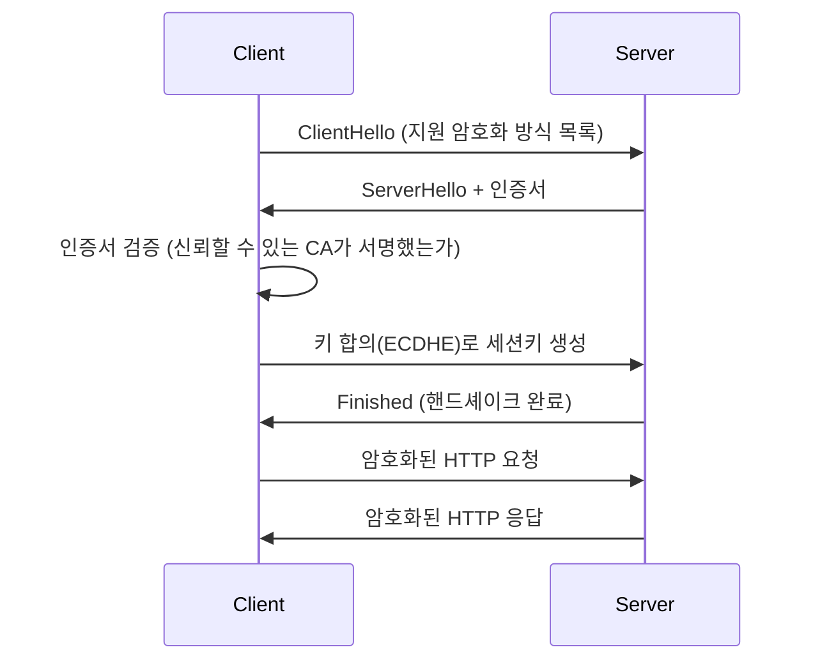

## 이 장을 읽기 전에

[OSI 7계층과 TCP/IP](/post/computerterms/osi-and-tcp-ip/)에서 다룬 응용 계층·전송 계층 구분과 TCP의 신뢰성 보장을 안다고 가정한다. HTTP는 OSI 7계층 중 응용 계층에 위치하며, TCP 연결 위에서 동작한다.

## HTTP는 왜 "상태가 없는" 프로토콜인가

**HTTP(HyperText Transfer Protocol)**는 클라이언트가 요청을 보내면 서버가 응답하고 그걸로 끝나는 **무상태(Stateless)** 프로토콜이다. 서버는 직전 요청이 무엇이었는지 기억하지 않는다. 이 설계는 서버 확장성에 유리하다 — 어떤 요청이든 어느 서버 인스턴스가 처리해도 되기 때문이다. 다만 로그인 상태처럼 "이전 요청과 이어지는 맥락"이 필요한 경우, HTTP 자체가 아니라 **쿠키**나 **토큰**을 요청마다 함께 실어 보내는 방식으로 상태를 흉내 낸다.

HTTP 요청은 메서드(GET, POST, PUT, DELETE 등)·경로·헤더·본문으로 구성되고, 응답은 상태 코드(200, 404, 500 등)·헤더·본문으로 구성된다. 실제 통신은 아래처럼 평문 텍스트로 이뤄진다.

```text
GET /users/42 HTTP/1.1
Host: api.example.com
Accept: application/json

HTTP/1.1 200 OK
Content-Type: application/json
Content-Length: 24

{"id":42,"name":"jerry"}
```

## HTTPS는 새 프로토콜이 아니라 TLS를 더한 HTTP

**HTTPS**는 HTTP와 다른 프로토콜이 아니라, TCP와 HTTP 사이에 **TLS(Transport Layer Security)** 계층을 끼워 넣은 것이다. TLS는 두 가지를 보장한다. 첫째, 통신 내용을 암호화해 중간에서 도청해도 내용을 읽을 수 없게 한다. 둘째, 서버의 인증서를 검증해 "정말 내가 접속하려는 서버가 맞는지" 확인한다(중간자 공격 방지). 이 보장은 **TLS 핸드셰이크**라는 별도의 사전 협상 과정에서 이뤄진다 — 클라이언트와 서버가 암호화에 쓸 키를 안전하게 교환한 뒤에야 실제 HTTP 요청·응답이 오간다.



핸드셰이크에서는 (EC)DHE 같은 키 합의 알고리즘으로 양쪽이 같은 세션키를 안전하게 만들어내고, 실제 데이터는 계산 비용이 훨씬 낮은 그 대칭키로 암호화한다. TLS 1.3(RFC 8446)부터는 옛 RSA 키 전송 방식이 제거되고 이 키 합의 방식만 허용된다 — 서버의 개인키가 유출되더라도 과거에 주고받은 세션키까지 함께 복원되지 않는 순방향 비밀성(Forward Secrecy)을 얻기 위해서다.

## 비교: HTTP vs HTTPS

| 특성 | HTTP | HTTPS |
|---|---|---|
| 암호화 | 없음 (평문) | TLS로 암호화 |
| 서버 신원 검증 | 없음 | 인증서 기반 검증 |
| 기본 포트 | 80 | 443 |
| 초기 연결 비용 | TCP handshake만 | TCP handshake + TLS handshake |
| 중간자 공격 방어 | 불가 | 가능 |

이 표에서 실무 판단의 기준은 **통신 구간이 신뢰할 수 있는 네트워크 안에 있는가**다. 로컬 개발 환경이나 격리된 내부망에서 테스트용으로만 오가는 트래픽이라면 TLS 핸드셰이크 비용 없이 HTTP로 충분하다. 반면 공인 도메인으로 서비스하거나 로그인·결제처럼 민감한 정보가 오가는 경우 HTTPS는 선택이 아니라 사실상 필수다 — 최신 브라우저는 HTTPS 페이지에서 HTTP 리소스를 불러오는 것을 막는 Mixed Content 정책을 적용하고, HTTP/2 이상 스펙은 대부분의 브라우저 구현에서 TLS 위에서만 동작하도록 강제한다. 즉 오늘날 공개 웹 서비스에서 평문 HTTP만으로 운영하는 선택지는 사실상 남아 있지 않다.

## 흔한 오개념

**"HTTPS는 HTTP보다 항상 느리다"** — TLS 핸드셰이크가 추가 비용을 발생시키는 것은 맞지만, TLS 1.3부터는 핸드셰이크가 1-RTT(왕복 1회)로 단축됐고, 세션을 재사용하는 **TLS Resumption**을 쓰면 두 번째 접속부터는 핸드셰이크 비용이 거의 사라진다. 오늘날 대부분의 벤치마크에서 체감 차이는 무시할 만한 수준이다.

**"쿠키가 있으면 HTTP도 상태를 유지하는 프로토콜이다"** — 프로토콜 자체는 여전히 무상태다. 쿠키는 클라이언트가 매 요청마다 이전 상태를 나타내는 값을 헤더에 실어 보내고, 서버가 그 값을 보고 맥락을 재구성하는 것일 뿐이다. 서버가 "기억"하는 것이 아니라 클라이언트가 "제시"하는 방식이라는 차이를 구분해야 세션 하이재킹 같은 보안 문제를 이해할 수 있다.

## 다른 개념과의 연결

TLS의 인증서 검증과 키 교환은 [암호화와 해싱](/post/computerterms/encryption-and-hashing/)에서 다시 다룬다. HTTP의 무상태성 때문에 발생하는 "여러 서버 중 어디로 요청을 보낼지"라는 질문은 [로드 밸런싱](/post/computerterms/load-balancing/)과 직결되며, 다음 챕터인 [DNS와 소켓](/post/computerterms/dns-and-sockets/)에서 "애초에 어떤 서버 주소로 연결하는가"를 다룬다.

## 평가 기준

이 챕터를 읽은 후에는 다음을 할 수 있어야 한다. HTTP가 무상태 프로토콜인 이유와, 쿠키가 상태를 흉내 내는 방식을 구분해 설명할 수 있다. HTTPS가 HTTP와 별개의 프로토콜이 아니라 TLS를 더한 것임을 설명할 수 있다. TLS 핸드셰이크가 암호화와 서버 신원 검증을 어떻게 동시에 해결하는지 설명할 수 있다.

## 참고 자료

> Rescorla, E. (2018). *RFC 8446: The Transport Layer Security (TLS) Protocol Version 1.3*. IETF.

- [MDN: An overview of HTTP](https://developer.mozilla.org/en-US/docs/Web/HTTP/Overview) — HTTP 메서드·상태 코드·헤더 전체 레퍼런스
- [Cloudflare: What happens in a TLS handshake?](https://www.cloudflare.com/learning/ssl/what-happens-in-a-tls-handshake/) — TLS 핸드셰이크 단계별 시각적 설명
