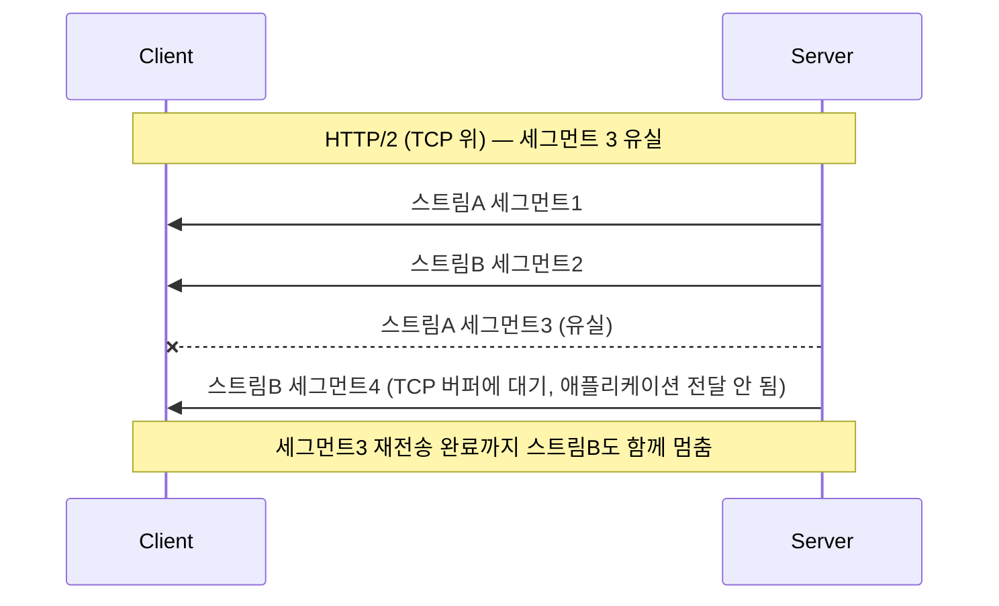
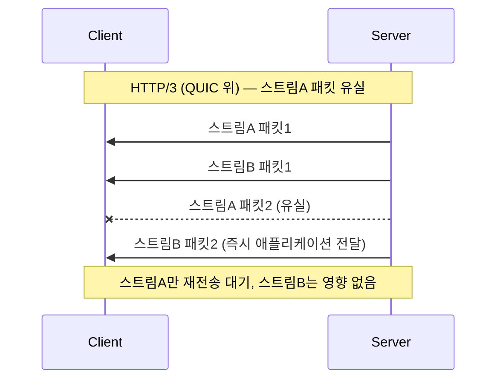

## 이 장을 읽기 전에

[HTTP와 HTTPS](/post/computerterms/http-and-https/)에서 다룬 HTTP 요청-응답 구조와 TLS 핸드셰이크, [OSI 7계층과 TCP/IP](/post/computerterms/osi-and-tcp-ip/)에서 다룬 TCP의 신뢰성 보장 방식(순서 보장, 재전송)을 안다고 가정한다.

## TCP의 신뢰성이 만드는 대기 문제

TCP는 데이터를 여러 세그먼트로 나눠 보내고, 수신 측은 이를 **보낸 순서 그대로** 애플리케이션에 전달한다. 세그먼트 하나가 중간에 유실되면, TCP는 그 세그먼트가 재전송되어 도착할 때까지 이후에 도착한 세그먼트들을 애플리케이션에 넘기지 않고 버퍼에 쌓아 둔다. 이미 도착한 데이터가 있어도 순서를 지키기 위해 기다려야 하는 이 현상을 **HOL 블로킹(Head-of-Line Blocking)**이라 부른다.

HTTP/2는 하나의 TCP 연결 위에서 여러 요청·응답을 스트림 단위로 동시에 주고받는 **멀티플렉싱**을 도입해, HTTP/1.1이 요청마다 별도 연결을 맺거나 순차적으로 응답을 기다려야 했던 문제를 상당 부분 해결했다. 그러나 HTTP/2의 멀티플렉싱은 애플리케이션 계층(HTTP)에서만 이뤄질 뿐, 그 아래 TCP 계층은 여전히 하나의 순서 보장 스트림이다. TCP 세그먼트 하나가 유실되면 그 세그먼트가 어느 HTTP 스트림에 속하는지와 무관하게, 같은 TCP 연결 위의 **모든 HTTP 스트림**이 재전송을 기다리며 멈춘다. HTTP 계층에서 스트림을 나눴다는 착시와 달리, 전송 계층에서는 여전히 하나의 대기열이라는 뜻이다.



## QUIC: UDP 위에 독립적인 스트림을 쌓다

**QUIC**은 이 문제를 TCP 대신 **UDP** 위에서 새로 설계함으로써 해결한다. UDP는 원래 순서 보장이나 재전송을 하지 않는 단순한 전송 프로토콜이지만, QUIC은 그 위에 자체적으로 신뢰성 있는 전송 로직을 구현하면서도 **스트림별로 독립적인 순서 보장**을 둔다. 한 스트림의 패킷이 유실되면 그 스트림만 재전송을 기다리고, 같은 연결 안의 다른 스트림은 영향받지 않고 계속 데이터를 전달한다. TCP는 "연결 하나 = 순서 보장 큐 하나"였다면, QUIC은 "연결 하나 안에 독립적인 순서 보장 큐 여러 개"를 두는 셈이다.



**HTTP/3**는 이 QUIC 위에서 동작하는 HTTP 버전이다. HTTP 자체의 의미론(메서드, 헤더, 상태 코드)은 HTTP/2와 크게 다르지 않지만, 전송 계층을 TCP에서 QUIC(UDP 기반)으로 바꾼 것이 핵심 변화다.

실제로 어떤 프로토콜이 협상됐는지는 클라이언트 도구로 직접 확인할 수 있다. `curl`이 HTTP/3를 지원하는 빌드라면 다음처럼 확인한다.

```text
$ curl --http3 -v https://example.com 2>&1 | grep -E "ALPN|HTTP/"
* ALPN: curl offers h3,h2,http/1.1
* TLSv1.3 (OUT), TLS handshake, Client hello (1):
* ALPN: server accepted h3
* using HTTP/3
> GET / HTTP/3
```

`ALPN(Application-Layer Protocol Negotiation)`은 TLS 핸드셰이크 도중 클라이언트와 서버가 어떤 애플리케이션 프로토콜을 쓸지 합의하는 확장이다. 클라이언트가 `h3, h2, http/1.1` 순으로 선호도를 제시하고(`curl offers`), 서버가 `h3`를 받아들이면(`server accepted h3`) 그 이후 요청·응답이 실제로 QUIC 위의 HTTP/3로 오간다. 서버가 QUIC/UDP를 지원하지 않거나 중간 네트워크가 UDP를 차단하면, 이 협상은 `h2`나 `http/1.1`로 폴백된다.

## TLS가 QUIC에 기본 통합된 이유

[HTTP와 HTTPS](/post/computerterms/http-and-https/)에서 다룬 전통적인 HTTPS는 TCP 핸드셰이크를 먼저 마친 뒤, 그 위에서 별도로 TLS 핸드셰이크를 수행한다 — 두 단계의 왕복이 필요하다. QUIC은 처음부터 TLS 1.3을 프로토콜 설계에 통합해, 연결 수립과 암호화 키 교환을 **한 번의 왕복**으로 동시에 처리한다. 이렇게 설계한 이유는 두 가지다. 첫째, 연결 수립 지연을 줄이는 것이 QUIC의 핵심 목표 중 하나이므로, 별도의 TLS 협상 단계를 두는 것 자체가 그 목표에 어긋난다. 둘째, TCP 헤더는 암호화되지 않은 평문으로 네트워크 중간 장비(방화벽, NAT 등)에 노출되는 반면, QUIC은 헤더 대부분을 암호화해 프로토콜 자체의 진화(중간 장비가 특정 필드에 의존하지 못하게 함)와 보안을 함께 확보하려 했다. 결과적으로 QUIC 위에서는 암호화되지 않은 통신이라는 선택지 자체가 없다 — HTTP/3는 항상 암호화된 통신이다.

## 비교: HTTP/1.1·HTTP/2 vs HTTP/3

| 항목 | HTTP/1.1 | HTTP/2 | HTTP/3 |
|---|---|---|---|
| 전송 계층 | TCP | TCP | QUIC(UDP 기반) |
| 요청 병렬 처리 | 연결당 1개(또는 다중 연결) | 멀티플렉싱(스트림) | 멀티플렉싱(독립 스트림) |
| HOL 블로킹 | 있음(연결 단위) | 있음(TCP 계층에서) | 스트림 단위로 해소 |
| 암호화 | 선택(HTTPS 별도 계층) | 선택(HTTPS 별도 계층) | 기본 통합(TLS 1.3) |
| 연결 수립 왕복 | TCP 1-RTT (+TLS 1-RTT) | TCP 1-RTT (+TLS 1-RTT) | QUIC+TLS 통합 1-RTT |

## 언제 HTTP/3를, 언제 HTTP/2를 쓰는가

이 표에서 실무 판단의 기준은 **클라이언트의 네트워크 환경이 UDP를 신뢰할 수 있는가**다. 모바일 환경처럼 와이파이·셀룰러 사이를 자주 오가며 IP 주소가 바뀌는 상황에서는, TCP라면 연결을 처음부터 다시 맺어야 하지만 QUIC은 연결 ID로 클라이언트를 식별해 IP가 바뀌어도 같은 연결을 유지할 수 있어 유리하다. 반대로 사내망·구형 방화벽·일부 통신사 네트워크처럼 UDP 트래픽을 제한하거나 차단하는 중간 장비가 있는 환경에서는, QUIC 연결 자체가 수립되지 않거나 반복적인 폴백으로 오히려 지연이 늘어날 수 있다. 이런 이유로 실무에서는 HTTP/3를 지원하되 항상 HTTP/2·HTTP/1.1로 자동 폴백되도록 서버를 구성하는 것이 표준적인 접근이다 — HTTP/3 하나만 지원하고 폴백을 두지 않는 구성은 권장되지 않는다.

## 흔한 오개념

**"UDP를 쓰니 QUIC은 신뢰성이 없다"** — UDP 자체는 순서 보장·재전송이 없는 것이 맞지만, QUIC은 UDP를 전송 매체로만 빌려 쓰고 그 위에 자체적인 신뢰성 보장(패킷 확인응답, 재전송, 흐름 제어)을 직접 구현한다. TCP의 신뢰성 기능을 없앤 것이 아니라, TCP가 연결 전체에 대해 강제하던 순서 보장을 스트림 단위로 재설계한 것에 가깝다.

**"HTTP/3는 HTTP/2보다 항상 빠르다"** — QUIC은 HOL 블로킹과 연결 수립 지연을 줄이지만, 일부 네트워크 환경(예: UDP 트래픽을 제한하거나 차단하는 방화벽, 오래된 중간 장비)에서는 QUIC 연결이 아예 실패하거나 TCP로 폴백해 오히려 손해를 볼 수 있다. 프로토콜 개선이 항상 모든 네트워크 조건에서 이득으로 이어지지는 않는다는 점을 실무에서는 감안해야 한다.

## 다른 개념과의 연결

QUIC이 TLS를 처음부터 통합한 설계는 [HTTP와 HTTPS](/post/computerterms/http-and-https/)에서 다룬 TLS 1.3의 1-RTT 핸드셰이크 개선을 전송 계층 자체에 녹여낸 결과다. 다음 챕터에서는 클라이언트가 반복 요청을 보내는 대신 서버가 이벤트 발생 시 능동적으로 알려주는 웹훅을 다룬다.

## 평가 기준

이 챕터를 읽은 후에는 다음을 할 수 있어야 한다. HTTP/1.1·HTTP/2가 TCP 위에서 겪는 HOL 블로킹의 원인을 설명할 수 있다. QUIC이 UDP 위에서 스트림별 독립적인 순서 보장으로 이 문제를 어떻게 해소하는지 설명할 수 있다. TLS가 QUIC에 기본 통합된 이유를 지연시간과 헤더 암호화 관점에서 설명할 수 있다.

## 참고 자료

> Iyengar, J., & Thomson, M. (2021). *RFC 9000: QUIC: A UDP-Based Multiplexed and Secure Transport*. IETF.

- [MDN: HTTP/3](https://developer.mozilla.org/en-US/docs/Glossary/HTTP_3) — HTTP/3와 QUIC의 관계에 대한 개괄 설명
- [The Chromium Projects: QUIC](https://www.chromium.org/quic/) — QUIC 설계 목표와 HOL 블로킹 해소 방식에 대한 개발자 관점 설명
