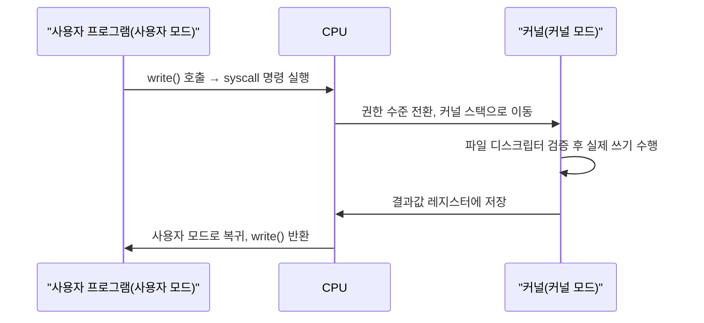

## 이 장을 읽기 전에

[프로세스와 스레드](/post/computerterms/processes-and-threads/)에서 프로세스가 독립된 실행 단위라는 점을 다뤘다. 이 챕터는 그 프로세스가 어떻게 하드웨어 이벤트에 반응하고, 자신이 직접 할 수 없는 일(디스크 읽기 등)을 커널에 어떻게 요청하는지를 다룬다. 선행 챕터를 몰라도 읽을 수 있지만, 프로세스 개념을 알면 "왜 사용자 프로그램은 하드웨어를 직접 건드릴 수 없는가"가 더 잘 와닿는다.

## CPU는 이벤트를 어떻게 알아채는가

CPU는 기본적으로 명령어를 순서대로 실행하는 장치일 뿐, 키보드가 눌렸는지 네트워크 패킷이 도착했는지 스스로 계속 확인하지 않는다. 만약 CPU가 매 순간 "키보드에 입력이 있는가?"를 직접 물어보는 방식(**폴링, Polling**)으로 동작한다면, 입력이 없는 대부분의 시간에도 CPU 사이클을 낭비하게 된다. **인터럽트(Interrupt)**는 이 문제를 뒤집는다 — 하드웨어 장치가 이벤트가 생겼을 때 CPU에 신호선을 통해 "지금 하던 일을 멈추고 나를 봐 달라"고 알리는 방식이다. CPU는 현재 실행 중인 명령어를 마친 뒤 실행 흐름을 잠시 멈추고, 해당 인터럽트 번호에 등록된 **인터럽트 핸들러(Interrupt Handler)**로 점프해 이벤트를 처리한 다음, 원래 하던 작업으로 복귀한다.

이 핸들러의 주소는 CPU가 부팅 시점에 참조하는 **인터럽트 벡터 테이블(Interrupt Vector Table)** 또는 x86의 IDT(Interrupt Descriptor Table)에 미리 등록되어 있다. 인터럽트 번호마다 어느 핸들러로 점프할지가 정해져 있으므로, 키보드 인터럽트가 오면 키보드 핸들러로, 타이머 인터럽트가 오면 타이머 핸들러로 각각 다르게 분기한다. 타이머 인터럽트는 특히 중요한데, 운영체제가 일정 시간마다 강제로 실행 흐름을 가로채 다음에 실행할 프로세스를 고르는 **선점형 스케줄링**의 기반이 되기 때문이다.

## 시스템 콜: 소프트웨어가 스스로 발생시키는 인터럽트

키보드나 타이머처럼 하드웨어가 발생시키는 인터럽트와 달리, 프로그램이 파일을 읽거나 화면에 출력하려면 커널에게 "대신 해달라"고 요청해야 한다. 일반 사용자 프로그램은 디스크 컨트롤러나 화면 출력 장치에 직접 접근할 권한이 없기 때문이다. 이 요청 메커니즘이 **시스템 콜(System Call)**이며, 대부분의 아키텍처에서 소프트웨어 인터럽트(예: x86의 `int 0x80` 또는 더 빠른 `syscall` 명령어)로 구현된다. 프로그램이 시스템 콜 명령어를 실행하면 CPU는 이를 인터럽트와 똑같이 처리한다 — 실행 흐름을 멈추고 커널이 등록해 둔 시스템 콜 핸들러로 점프한다.

이 전환에서 핵심은 **권한 수준(Privilege Level)**의 변화다. CPU는 보통 최소 두 단계의 실행 모드를 구분한다. **사용자 모드(User Mode)**에서는 프로그램이 자신에게 할당된 메모리만 건드릴 수 있고 하드웨어에 직접 접근할 수 없다. **커널 모드(Kernel Mode)**에서는 운영체제 코드가 하드웨어 전체와 모든 메모리에 접근할 수 있다. 시스템 콜을 호출하면 CPU는 사용자 모드에서 커널 모드로 전환되어(x86에서는 이 과정에서 스택도 커널 스택으로 바뀐다) 커널 코드가 실제 디스크 읽기 등을 수행하고, 작업이 끝나면 다시 사용자 모드로 복귀해 원래 프로그램의 다음 명령어부터 이어간다.



## 코드로 보는 write() 호출

C 표준 라이브러리의 `write()` 함수는 겉보기에는 평범한 함수 호출이지만, 내부적으로는 시스템 콜 명령어를 실행하는 얇은 래퍼(wrapper)다.

```c
#include <unistd.h>
#include <string.h>

int main(void) {
    const char *msg = "hello from a system call\n";
    /* write()는 glibc가 syscall 번호(1번, x86-64 기준)를
       레지스터에 채우고 syscall 명령어를 실행하는 것으로 구현된다 */
    ssize_t n = write(STDOUT_FILENO, msg, strlen(msg));
    if (n < 0) {
        return 1;
    }
    return 0;
}
```

`gcc write_demo.c -o write_demo && strace ./write_demo`로 실행하면(리눅스 환경), `strace`가 이 프로그램이 실제로 호출하는 시스템 콜 목록을 출력한다. `write(1, "hello from a system call\n", 26) = 26` 같은 줄을 확인할 수 있는데, 이것이 바로 사용자 모드 코드가 커널 모드로 전환되어 실제 출력 작업을 위임한 흔적이다. 애플리케이션 코드에서는 `write()`가 단순 함수처럼 보이지만, 그 아래에서는 CPU 권한 수준 전환이라는 무거운 작업이 일어난다 — 그래서 시스템 콜을 반복 호출하는 코드(작은 단위로 파일을 여러 번 읽고 쓰는 경우)는 버퍼링 없이 쓰면 성능이 눈에 띄게 떨어진다.

**언제 이 비용을 신경 써야 하는가**는 호출 빈도로 판단한다. 반복문 안에서 한 바이트씩 `write`를 호출하는 코드는 매번 사용자-커널 모드 전환이 일어나므로, 데이터를 애플리케이션 버퍼에 모았다가 한 번에 큰 단위로 `write`하거나(수동 버퍼링) `fwrite`처럼 이미 버퍼링을 구현한 표준 라이브러리 함수를 쓰는 것이 유리하다. 반대로 로그 파일에 몇 초에 한 번 몇 줄만 쓰는 정도로 호출 빈도가 낮다면, 시스템 콜 전환 비용은 전체 실행 시간에서 무시할 만한 비중이라 버퍼링을 신경 쓸 실익이 적다. `read`/`write`를 대량으로 반복 호출하는 코드를 발견했다면, 먼저 `strace -c`로 실제 시스템 콜 횟수와 소요 시간을 측정해 최적화가 필요한 병목인지부터 확인하는 것이 순서다.

## 비교: 하드웨어 인터럽트 vs 시스템 콜

| 특성 | 하드웨어 인터럽트 | 시스템 콜 |
|---|---|---|
| 발생 주체 | 외부 장치(키보드, 타이머, 네트워크 카드) | 실행 중인 프로그램 자신 |
| 발생 시점 | 비동기적, 프로그램 실행과 무관하게 언제든 | 프로그램이 명시적으로 호출한 시점 |
| 목적 | 이벤트 알림(입력 도착, 시간 경과) | 커널 기능 요청(파일 I/O, 프로세스 생성 등) |
| CPU 처리 방식 | 인터럽트 벡터 테이블을 통한 핸들러 분기 | 소프트웨어 인터럽트 또는 전용 명령어(`syscall`) |
| 공통점 | 둘 다 사용자 모드 → 커널 모드 전환을 유발한다 | |

## 흔한 오개념

**"시스템 콜은 그냥 평범한 함수 호출이다"** — 함수처럼 보이는 것은 glibc 같은 표준 라이브러리가 래퍼 함수를 제공하기 때문이다. 실제로는 일반 함수 호출(`call` 명령어, 스택에 인자 push)과 달리 CPU 권한 수준 전환과 커널 스택으로의 전환이라는 하드웨어 수준의 무거운 동작을 동반한다. 이 비용 때문에 시스템 콜 횟수를 줄이는 것(버퍼링, `read`/`write` 크기 키우기)이 실무에서 성능 최적화의 흔한 축이다.

**"인터럽트가 오면 CPU가 다른 프로그램의 실행을 즉시 중단시킨다"** — 정확히는 CPU가 **현재 실행 중인 명령어**를 마친 뒤 인터럽트를 처리한다. 명령어 실행 도중에 강제로 끊는 것이 아니라, 명령어 경계에서 확인하고 분기하는 것이다. 또한 인터럽트 처리 중에는 보통 같은 종류(또는 우선순위가 낮은) 인터럽트가 잠시 마스킹(비활성화)되어, 인터럽트 핸들러 처리 중 같은 인터럽트가 다시 끼어들지 않도록 한다.

## 다른 개념과의 연결

시스템 콜로 커널에 진입한 뒤 프로세스가 생성·종료되는 과정은 다음 챕터인 [데몬과 좀비 프로세스](/post/computerterms/daemons-and-zombie-processes/)에서 `fork()`·`wait()` 시스템 콜과 함께 이어진다. 타이머 인터럽트가 스케줄링의 기반이 되는 부분은 [CPU 스케줄링](/post/computerterms/cpu-scheduling/) 챕터에서 더 다룬다.

## 평가 기준

이 챕터를 읽은 후에는 다음을 할 수 있어야 한다. 폴링과 인터럽트 방식의 차이를 설명할 수 있다. 시스템 콜이 소프트웨어 인터럽트로 구현되는 원리와 사용자 모드·커널 모드 전환이 왜 필요한지 설명할 수 있다. `strace` 같은 도구로 프로그램이 실제로 호출하는 시스템 콜을 관찰하고 해석할 수 있다.

## 참고 자료

> Silberschatz, A., Galvin, P. B., & Gagne, G. (2018). *Operating System Concepts* (10th ed.), Chapter 1–2: Introduction & Operating-System Structures. Wiley.

- [Linux man-pages: syscalls(2)](https://man7.org/linux/man-pages/man2/syscalls.2.html) — 리눅스 시스템 콜 전체 목록과 아키텍처별 호출 규약
- [Linux man-pages: write(2)](https://man7.org/linux/man-pages/man2/write.2.html) — write 시스템 콜의 인자·반환값·오류 처리 명세
