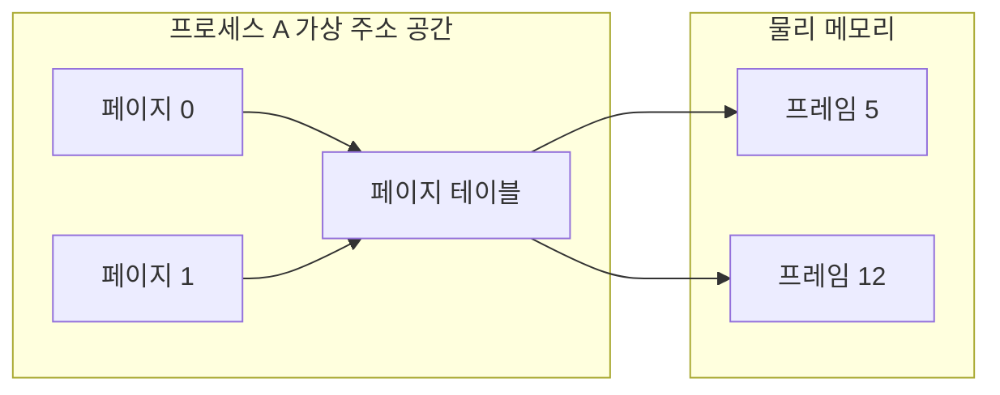

## 이 장을 읽기 전에

[프로세스와 스레드](/post/computerterms/processes-and-threads/)에서 각 프로세스가 독립된 메모리 공간을 갖는다고 다뤘다. 이 챕터는 그 "독립된 메모리 공간"이 실제로는 물리 메모리를 직접 가리키는 것이 아니라, 운영체제가 만들어낸 가상의 주소 공간이라는 점을 다룬다.

## 프로세스가 서로의 메모리를 침범하지 못하는 이유

여러 프로세스가 동시에 실행 중이라면, 각 프로세스가 쓰는 메모리 주소가 실제 물리 메모리의 어느 위치인지 운영체제가 조정해야 한다. 만약 프로세스가 물리 주소를 직접 다룬다면, 한 프로세스의 버그가 다른 프로세스의 메모리를 덮어쓰는 것을 막을 방법이 없다. **가상 메모리(Virtual Memory)**는 각 프로세스에게 "이 프로세스만 쓰는" 독립된 주소 공간(가상 주소)을 주고, 그 가상 주소를 실제 물리 주소로 변환하는 계층을 CPU의 **MMU(Memory Management Unit)**에 맡긴다. 프로세스 A의 가상 주소 `0x1000`과 프로세스 B의 가상 주소 `0x1000`은 완전히 다른 물리 메모리를 가리킬 수 있다.

## 페이징: 가상 주소를 물리 주소로 바꾸는 방법

가상 메모리를 실제로 구현하는 대표적인 방식이 **페이징(Paging)**이다. 가상 주소 공간과 물리 메모리를 모두 고정 크기의 블록(보통 4KB)인 **페이지(Page)**와 **프레임(Frame)**으로 나누고, 어느 가상 페이지가 어느 물리 프레임에 대응하는지 **페이지 테이블(Page Table)**에 기록한다. 프로세스가 메모리에 접근할 때마다 MMU가 이 테이블을 참조해 주소를 변환한다.



여기서 흥미로운 점은, 가상 주소 공간에 있는 모든 페이지가 실제로 물리 메모리에 있을 필요는 없다는 것이다. 자주 안 쓰는 페이지는 디스크로 밀어내고(**스와핑, Swapping**), 프로세스가 그 페이지에 접근하려 할 때 물리 메모리에 없으면 **페이지 폴트(Page Fault)**가 발생해 운영체제가 그제서야 디스크에서 해당 페이지를 불러온다. 이 덕분에 프로세스는 실제 RAM 용량보다 훨씬 큰 가상 주소 공간을 쓸 수 있다.

## malloc이 실제로 하는 일

C의 `malloc`은 이 가상 메모리 위에서 동작한다. 프로그램이 `malloc(size)`를 호출하면, 표준 라이브러리는 이미 확보해 둔 힙 영역 안에서 요청 크기만큼 잘라주거나, 부족하면 운영체제에 `brk`/`mmap` 시스템 콜로 가상 주소 공간을 더 요청한다. 이 시점에는 아직 물리 메모리가 실제로 배정되지 않을 수도 있다 — 처음 그 메모리에 실제로 쓰기 연산을 할 때(**최초 접근 시점**) 페이지 폴트가 나면서 비로소 물리 프레임이 매핑된다.

```c
#include <stdio.h>
#include <stdlib.h>

int main(void) {
    /* 가상 주소 공간만 확보. 이 시점엔 물리 메모리가 아직 안 붙었을 수 있음 */
    size_t size = 100 * 1024 * 1024;   /* 100MB */
    char *buf = malloc(size);
    if (buf == NULL) {
        fprintf(stderr, "malloc failed\n");
        return 1;
    }

    /* 실제로 쓰기 연산을 해야 페이지 폴트가 발생하고 물리 프레임이 붙는다 */
    for (size_t i = 0; i < size; i += 4096) {   /* 페이지 크기 단위로만 접근해도 충분 */
        buf[i] = 1;
    }

    free(buf);
    return 0;
}
```

이 코드에서 `malloc` 호출 직후와, 루프로 실제 쓰기를 마친 후의 프로세스 실제 메모리 사용량(RSS, Resident Set Size)을 `ps`나 `/proc/[pid]/status`로 비교하면, `malloc` 직후에는 가상 메모리 크기(VSZ)만 늘고 RSS는 거의 늘지 않다가, 쓰기 루프를 거치며 RSS가 실제로 증가하는 것을 확인할 수 있다.

## 흔한 오개념

**"malloc(size)가 성공하면 그만큼의 물리 메모리가 이미 확보된 것이다"** — 위에서 다룬 대로 이는 가상 주소 공간 예약일 뿐이다. 실제로는 최초 쓰기 시점에 페이지 단위로 물리 메모리가 붙는다(**Lazy Allocation**). 이 때문에 "malloc은 성공했는데 나중에 쓰다가 프로세스가 죽는" OOM(Out Of Memory) 킬 현상이 발생할 수 있다 — 리눅스의 오버커밋(overcommit) 정책 때문이다.

**"가상 메모리가 크면 실제 성능도 그만큼 좋아진다"** — 가상 주소 공간이 넓어지는 것과 실제 실행 성능은 별개다. 페이지 폴트가 잦으면(특히 디스크로 스와핑된 페이지에 접근할 때) 메모리 접근이 디스크 I/O 속도로 느려지는 **스래싱(Thrashing)**이 발생해 오히려 심각하게 느려진다.

## 다른 개념과의 연결

페이지 테이블 조회를 매번 하지 않도록 최근 변환 결과를 저장하는 **TLB(Translation Lookaside Buffer)**는 [캐싱과 캐시 무효화](/post/computerterms/caching-and-invalidation/)에서 다룰 캐시 지역성 원리와 같은 개념이다. 스와핑·페이지 폴트로 인한 디스크 접근 지연은 [정규화와 인덱스](/post/computerterms/normalization-and-indexes/)가 "왜 메모리에 다 못 올리는 대용량 데이터에서도 빨라야 하는가"와 이어진다.

## 평가 기준

이 챕터를 읽은 후에는 다음을 할 수 있어야 한다. 가상 메모리가 프로세스 간 메모리 격리를 제공하는 원리를 설명할 수 있다. 페이지·프레임·페이지 테이블·페이지 폴트의 관계를 설명할 수 있다. `malloc` 성공이 물리 메모리 확보를 의미하지 않는 이유와, 이것이 실무에서 OOM으로 이어지는 과정을 설명할 수 있다.

## 참고 자료

> Silberschatz, A., Galvin, P. B., & Gagne, G. (2018). *Operating System Concepts* (10th ed.), Chapter 9: Main Memory. Wiley.

- [Linux man-pages: mmap(2)](https://man7.org/linux/man-pages/man2/mmap.2.html) — 가상 주소 공간 매핑을 다루는 실제 시스템 콜 문서
- [Linux kernel docs: Overcommit Accounting](https://docs.kernel.org/mm/overcommit-accounting.html) — malloc 성공과 실제 물리 메모리 확보가 분리되는 리눅스 오버커밋 정책
