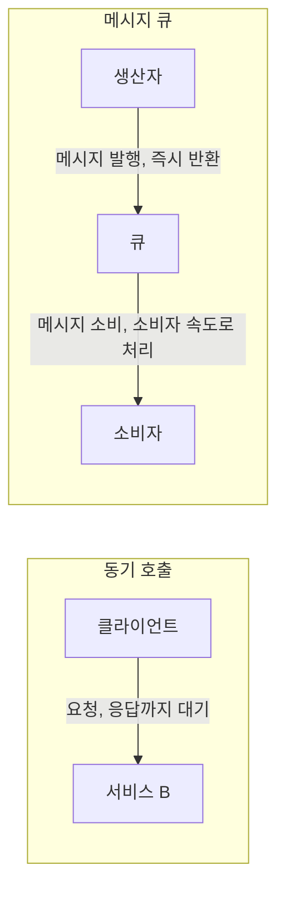
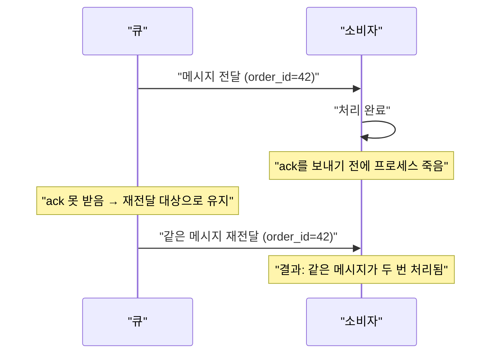

## 이 장을 읽기 전에

[스택과 큐](/post/computerterms/stacks-and-queues/)에서 다룬 FIFO(선입선출) 큐의 기본 개념과, [서킷 브레이커](/post/computerterms/circuit-breaker/)에서 다룬 동기 호출 연쇄 장애 문제를 안다고 가정한다. 이 챕터는 한 프로세스 안의 자료구조였던 큐가, 여러 서비스를 잇는 분산 시스템 규모의 통신 수단으로 확장되면 어떤 역할을 하는지 다룬다.

## 동기 호출의 한계

서비스 A가 서비스 B를 호출하는 가장 단순한 방식은 **동기(synchronous) 호출**이다. A는 B에 요청을 보내고, B가 처리를 끝내 응답을 줄 때까지 기다린다. 이 방식은 이해하기 쉽지만 두 가지 문제를 만든다. 첫째, A와 B가 **시간적으로 결합**된다 — B가 느려지거나 죽으면 A도 그 영향을 즉시 받는다([서킷 브레이커](/post/computerterms/circuit-breaker/)에서 다룬 연쇄 장애가 바로 이 결합에서 비롯된다). 둘째, B가 처리할 수 있는 속도보다 A가 더 빠르게 요청을 보내면, B는 순간적인 부하 폭증을 그대로 감당해야 한다 — 이메일 발송처럼 몇 초 걸리는 작업을 사용자 요청과 동기로 묶으면, 사용자는 그 몇 초를 고스란히 기다려야 한다.

## 메시지 큐: 요청을 큐에 넣고 나중에 꺼내 처리한다

**메시지 큐(Message Queue)**는 [스택과 큐](/post/computerterms/stacks-and-queues/)에서 다룬 FIFO 큐 구조를 서버 하나가 아니라 별도의 중간 서버(브로커)로 옮겨, 서로 다른 서비스가 이 큐를 통해 간접적으로 통신하게 하는 인프라다. 메시지를 보내는 쪽을 **생산자(Producer)**, 큐에서 메시지를 꺼내 처리하는 쪽을 **소비자(Consumer)**라 부른다. 생산자는 메시지를 큐에 넣고 나면 즉시 다음 작업으로 넘어간다 — 소비자가 그 메시지를 언제, 어떻게 처리하는지는 신경 쓰지 않는다. 소비자는 자신의 처리 속도에 맞춰 큐에서 메시지를 꺼내 간다.



이 구조가 스택/큐 챕터에서 다룬 단일 프로세스 큐와 근본적으로 다른 점은, 큐 자체가 **독립된 서버(또는 클러스터)로 존재**해 생산자와 소비자가 서로의 프로세스 안에 있지 않아도 된다는 것이다. 생산자와 소비자는 서로 다른 언어, 다른 배포 주기, 다른 스케일링 정책을 가진 완전히 별개의 서비스일 수 있다. 대표적인 구현으로 RabbitMQ(AMQP 프로토콜 기반), Apache Kafka(로그 기반 스트리밍), Amazon SQS(관리형 큐 서비스) 등이 있다.

## 느슨한 결합

메시지 큐가 주는 첫 번째 이점은 **느슨한 결합(Loose Coupling)**이다. 동기 호출에서는 A가 B의 존재와 응답을 직접 알아야 하지만, 큐를 매개로 하면 A는 "큐에 메시지를 넣는다"는 사실만 알면 되고 그 메시지를 누가, 몇 명이 소비하는지 알 필요가 없다. 이 덕분에 새로운 소비자를 추가하거나(예: 주문 완료 메시지를 처리하는 서비스로 재고 차감 서비스에 더해 알림 발송 서비스를 새로 붙이는 경우), 기존 소비자를 잠시 내려 유지보수하는 동안에도 생산자는 영향을 받지 않는다 — 메시지는 큐에 쌓여 있다가 소비자가 돌아오면 처리된다.

## 부하 완충

두 번째 이점은 **부하 완충(Buffering)**이다. 생산자가 순간적으로 초당 1만 건의 요청을 만들어내도, 큐는 이를 일단 받아 쌓아두고 소비자는 자신이 감당할 수 있는 속도(예: 초당 1000건)로 꾸준히 처리해 나간다. 이렇게 처리 속도 차이를 큐가 흡수하는 것을 **배압(Backpressure)** 조절이라 부르기도 한다 — 소비자가 느려지면 큐에 쌓인 메시지 수가 늘어날 뿐, 소비자가 갑작스러운 폭주로 무너지지는 않는다. 물론 이 완충에는 한계가 있다 — 생산 속도가 소비 속도를 계속 초과하면 큐는 무한정 쌓이지 않고 결국 디스크나 메모리 한계에 부딪히므로, 소비자 처리량을 늘리거나(오토스케일링) 큐 적재량에 상한을 두는 등의 대응이 필요하다.

## 전달 보장: at-least-once와 at-most-once

메시지 큐가 메시지를 몇 번 전달하는지에 대한 보장은 시스템마다 다르며, 크게 두 가지로 나뉜다. **최대 한 번(at-most-once)** 전달은 메시지가 유실될 수는 있지만 절대 중복되지는 않는다 — 소비자가 메시지를 받자마자 큐에서 즉시 제거하는 방식으로, 소비자가 처리 도중 죽으면 그 메시지는 영영 사라진다. **최소 한 번(at-least-once)** 전달은 반대로 메시지가 중복될 수는 있지만 절대 유실되지는 않는다 — 소비자가 "처리를 완료했다"고 확인(ack)하기 전까지는 큐가 메시지를 지우지 않고, 확인이 오지 않으면 다시 전달한다. 실무 시스템 대부분은 유실보다 중복이 덜 위험하다고 판단해 at-least-once를 기본으로 채택한다.



이 시나리오가 왜 [멱등성](/post/computerterms/idempotency/)과 직접 연결되는지 여기서 드러난다. at-least-once를 채택한 큐를 쓰는 이상, 소비자 쪽 처리 로직은 같은 메시지가 두 번 들어와도 문제가 없도록 **멱등하게** 작성해야 한다 — 예를 들어 "포인트 1000점 지급"이 아니라 "이 주문 ID에 대한 포인트 지급을 완료 상태로 설정"처럼, 메시지에 포함된 고유 ID로 이미 처리했는지 먼저 확인하는 방식이다.

```python
processed_order_ids = set()  # 실무에서는 DB나 Redis에 영속 저장

def handle_points_message(order_id: str, points: int) -> None:
    if order_id in processed_order_ids:
        # 재전달된 중복 메시지: 이미 처리했으므로 그대로 무시
        return
    grant_points(order_id, points)
    processed_order_ids.add(order_id)  # 완료 상태로 기록해야 재전달을 걸러낼 수 있다
```

큐 자체는 중복을 완전히 막아주지 않으며, 그 책임은 결국 위 코드처럼 메시지의 고유 ID로 중복 실행을 막는 소비자 애플리케이션에 있다.

## 비교: 동기 호출 vs 메시지 큐

| 특성 | 동기 호출 | 메시지 큐 |
|---|---|---|
| 결합도 | 강함 (서로의 가용성에 직접 의존) | 느슨함 (큐를 통해 간접 통신) |
| 응답 시점 | 즉시 (처리 완료까지 대기) | 비동기 (생산자는 즉시 반환) |
| 부하 처리 | 수신 측이 순간 부하를 그대로 감당 | 큐가 완충, 소비자 속도로 처리 |
| 적합한 작업 | 즉시 결과가 필요한 조회·결제 승인 등 | 이메일 발송, 로그 적재, 알림처럼 지연 허용 가능한 작업 |

## 흔한 오개념

**"메시지 큐를 쓰면 무조건 더 빠르다"** — 메시지 큐는 처리 속도 자체를 높이는 것이 아니라, 생산자가 응답을 기다리지 않아도 되게 해서 **체감 지연**을 줄이는 것이다. 실제로 메시지가 소비자에게 처리되기까지는 큐를 거치는 추가 단계(직렬화, 네트워크 전송, 큐 적재, 역직렬화) 때문에 동기 호출보다 전체 처리 시간(end-to-end latency)이 더 길어질 수 있다. 즉시 결과를 사용자에게 보여줘야 하는 작업(예: 로그인 인증)에는 적합하지 않다.

**"큐에 메시지를 넣으면 순서대로 처리된다"** — [스택과 큐](/post/computerterms/stacks-and-queues/)의 FIFO는 소비자가 하나뿐일 때만 순서를 보장한다. 실무에서는 처리량을 늘리기 위해 여러 소비자가 하나의 큐를 나눠 소비하는 경우가 흔한데, 이때는 메시지 A가 소비자1에게, 메시지 B가 소비자2에게 배정돼 A보다 B가 먼저 처리될 수 있다. 엄격한 순서가 필요하면(Kafka의 파티션 키처럼) 같은 순서를 지켜야 하는 메시지들을 하나의 소비자에게만 가도록 별도로 설계해야 한다.

## 다른 개념과의 연결

메시지 큐가 만드는 느슨한 결합과 비동기 처리 방식은, 서비스의 현재 상태만 저장하는 대신 상태를 변화시킨 이벤트를 순서대로 큐나 로그에 남기고 이를 재생해 상태를 재구성하는 방식으로 확장될 수 있다. 다음 챕터에서는 이 아이디어를 데이터 저장 방식 자체에 적용한 [이벤트 소싱](/post/computerterms/event-sourcing/)을 다룬다.

## 평가 기준

이 챕터를 읽은 후에는 다음을 할 수 있어야 한다. 동기 호출이 만드는 시간적 결합과 순간 부하 문제를 설명하고, 메시지 큐가 이를 어떻게 완화하는지 설명할 수 있다. 느슨한 결합과 부하 완충이 각각 어떤 상황에서 이점을 주는지 예시를 들어 설명할 수 있다. at-least-once와 at-most-once 전달 보장의 차이와, at-least-once를 쓸 때 소비자 로직이 멱등해야 하는 이유를 설명할 수 있다. 여러 소비자가 큐를 나눠 소비할 때 순서 보장이 깨질 수 있는 이유를 설명할 수 있다.

## 참고 자료

> Kleppmann, M. (2017). *Designing Data-Intensive Applications*, Chapter 11: Stream Processing. O'Reilly Media.

- [RabbitMQ Documentation: AMQP 0-9-1 Model Explained](https://www.rabbitmq.com/tutorials/amqp-concepts.html) — 생산자·소비자·큐·교환기 개념을 정리한 공식 문서
- [Apache Kafka Documentation: Design](https://kafka.apache.org/documentation/#design) — 로그 기반 메시지 큐의 설계와 전달 보장을 다루는 공식 문서
