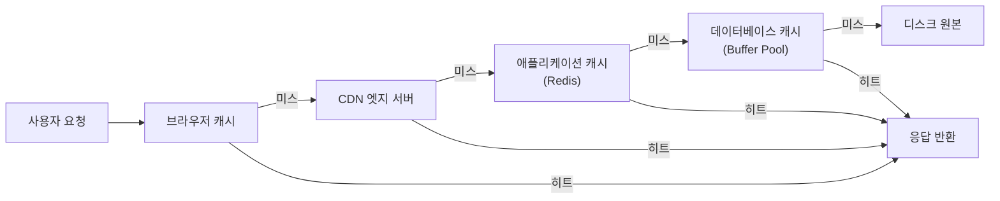

## 이 장을 읽기 전에

[CPU 구조와 파이프라이닝](/post/computerterms/cpu-and-pipelining/)에서 다룬 CPU 캐시 계층(L1/L2/L3)과, [CDN 캐싱 전략](/post/computerterms/cdn-caching/)에서 다룬 `Cache-Control` 기반 무효화를 안다고 가정한다. 이 챕터는 "캐시가 한 단계가 아니라 여러 단계로 겹쳐 쌓이면 무슨 일이 일어나는가"를 다룬다.

## CPU의 계층을 다시 보면

[CPU 구조와 파이프라이닝](/post/computerterms/cpu-and-pipelining/)에서 CPU 코어는 명령어를 인출-해독-실행-저장 단계로 처리한다고 했다. 이 처리 속도를 받쳐주는 것이 캐시 계층이다. **L1 캐시**는 코어에 가장 가깝고 몇 킬로바이트 규모로 가장 빠르지만(1–2 사이클), **L2 캐시**는 더 크고 조금 느리며(10 사이클 안팎), **L3 캐시**는 여러 코어가 공유하며 더 크고 더 느리다(수십 사이클). L1에 없으면 L2를 보고, L2에도 없으면 L3를 보고, L3에도 없으면 그제서야 메인 메모리(RAM)까지 간다. 이 "가까운 계층부터 순서대로 확인하고, 없으면 다음 계층으로 넘어간다"는 구조가 애플리케이션 레벨에도 그대로 나타난다 — 계층마다 담당 기술만 CPU 캐시에서 브라우저 캐시, CDN, 애플리케이션 캐시, 데이터베이스로 바뀔 뿐이다.

## 웹 요청이 거치는 네 계층

사용자가 웹페이지의 특정 데이터를 요청할 때, 그 요청은 보통 네 단계의 캐시를 순서대로 통과한다. 첫 번째는 **브라우저 캐시**로, 사용자의 로컬 디스크에 저장된 사본이다 — 여기서 히트하면 네트워크 요청 자체가 발생하지 않는다. 두 번째는 [CDN 캐싱](/post/computerterms/cdn-caching/)에서 다룬 **CDN 엣지 서버**로, 브라우저 캐시가 미스일 때만 도달한다. 세 번째는 **애플리케이션 캐시**로, 흔히 Redis 같은 인메모리 키-값 저장소를 애플리케이션 서버 앞단에 두어 자주 조회되는 계산 결과나 세션 데이터를 보관한다. 네 번째는 **데이터베이스 캐시**로, 데이터베이스 엔진 자체가 최근 조회한 페이지를 버퍼 풀(Buffer Pool)에 캐싱해 디스크 I/O를 줄인다. 이 네 계층을 모두 지나쳐야 비로소 디스크에 저장된 원본 데이터에 도달한다.



이 흐름에서 핵심은 **캐시 미스가 다음 계층으로 그대로 전파**된다는 점이다. 브라우저 캐시가 미스면 그 요청이 CDN에 도달하고, CDN도 미스면 애플리케이션 서버까지 도달해 Redis를 확인하며, Redis도 미스면 결국 데이터베이스 쿼리가 실행된다. 계층이 하나씩 미스될 때마다 지연 시간은 몇 자릿수씩 늘어난다 — 브라우저 캐시 히트는 즉시, CDN 히트는 수십 밀리초, Redis 조회는 1밀리초 안팎, 디스크 기반 쿼리는 수십에서 수백 밀리초가 걸릴 수 있다.

Redis를 애플리케이션 캐시로 쓰는 전형적인 코드는 "먼저 캐시를 확인하고, 없으면 원본을 조회한 뒤 캐시에 채워 넣는다"는 패턴을 따른다.

```python
import redis
import json

cache = redis.Redis(host="localhost", port=6379, decode_responses=True)

def get_user_profile(user_id: int) -> dict:
    cache_key = f"user:{user_id}"
    cached = cache.get(cache_key)
    if cached is not None:
        return json.loads(cached)  # 캐시 히트: DB를 건드리지 않는다

    profile = query_database(user_id)  # 캐시 미스: 다음 계층(DB)까지 전파
    cache.setex(cache_key, 300, json.dumps(profile))  # 300초 TTL로 채워 넣기
    return profile
```

이 패턴을 **Cache-Aside(또는 Lazy Loading)**라 부른다. 캐시가 먼저 조회를 가로채고, 미스가 나야만 다음 계층에 요청을 전달한 뒤 그 결과로 자신을 채운다는 점에서 위 Mermaid 다이어그램의 미스 전파 구조를 코드로 그대로 옮긴 것이다.

## 비교: 계층별 특성

| 계층 | 저장 위치 | 대표 기술 | 히트 시 지연 | 공유 범위 |
|---|---|---|---|---|
| 브라우저 캐시 | 사용자 로컬 디스크 | HTTP `Cache-Control` | 즉시 | 사용자 1인 |
| CDN | 지리적 분산 엣지 서버 | Cloudflare, CloudFront | 수십 ms | 지역 내 다수 사용자 |
| 애플리케이션 캐시 | 서버 인메모리 | Redis, Memcached | 1 ms 안팎 | 전체 애플리케이션 |
| 데이터베이스 캐시 | DB 엔진 메모리 | Buffer Pool | 수 ms | 해당 DB 인스턴스 |

## 흔한 오개념

**"캐시 계층이 많을수록 무조건 빠르다"** — 계층이 늘어날수록 각 계층에서 무효화해야 할 사본의 수도 함께 늘어난다. [캐싱과 캐시 무효화](/post/computerterms/caching-and-invalidation/)에서 다룬 무효화 문제가 계층마다 독립적으로 발생하므로, 데이터가 바뀌었을 때 네 계층 중 하나라도 무효화를 빠뜨리면 사용자마다 다른 계층에서 서로 다른 버전의 데이터를 볼 수 있다. 계층 수를 정하는 구체적 기준은 다음 절에서 다룬다.

**"캐시 미스는 실패다"** — 캐시 미스는 오류가 아니라 정상적인 설계 요소다. 모든 요청이 L1이나 브라우저 캐시에서 히트한다면 애초에 다음 계층(L2, CDN, DB)이 존재할 이유가 없다. 각 계층은 "이전 계층이 감당하지 못하는 나머지 트래픽을 흡수하는 안전망"으로 설계되며, 계층별 히트율(Hit Rate)을 측정해 어느 계층을 늘릴지 판단하는 것이 정상적인 운영 과정이다.

## 몇 단계까지 캐싱할 것인가

계층을 추가할지는 트래픽 패턴과 일관성 요구 수준을 기준으로 판단한다. 읽기가 압도적으로 많고 데이터 변경 빈도가 낮은 콘텐츠(정적 자산, 공개 API 목록 조회)는 브라우저·CDN·애플리케이션 캐시를 모두 적극적으로 쌓아도 무효화 부담이 적어 계층을 늘릴수록 이득이 크다. 반대로 쓰기가 잦고 강한 일관성이 필요한 데이터(재고 수량, 계좌 잔액)는 애플리케이션 캐시 계층을 아예 생략하고 데이터베이스 캐시(Buffer Pool)까지만 의존하는 편이 안전한 경우가 많다 — 매 쓰기마다 여러 계층을 무효화해야 하는 비용이 캐싱으로 얻는 지연 단축보다 커지기 때문이다. 실무에서는 계층별 히트율을 측정해, 히트율이 낮은 계층(예: 애플리케이션 캐시가 20% 미만)이 있다면 그 계층을 유지하는 비용(메모리, 무효화 로직)이 이득보다 큰지부터 재검토한다.

## 다른 개념과의 연결

L1/L2/L3의 "가까운 곳부터 확인하고 없으면 다음으로 넘어간다"는 구조는 [CPU 구조와 파이프라이닝](/post/computerterms/cpu-and-pipelining/)에서 이미 다룬 개념이 애플리케이션 레벨로 그대로 이어진 것이고, CDN 계층의 무효화 방식은 [CDN 캐싱 전략](/post/computerterms/cdn-caching/)에서 다룬 그대로다. 다음 챕터인 [Write-Through와 Write-Back](/post/computerterms/write-through-and-write-back/)에서는 이 계층 구조에 "쓰기"가 들어올 때, 즉 캐시에 쓴 데이터를 원본에 언제 반영할지의 문제를 다룬다.

## 평가 기준

이 챕터를 읽은 후에는 다음을 할 수 있어야 한다. CPU의 L1/L2/L3 캐시 계층 개념이 브라우저-CDN-애플리케이션-DB 캐시로 어떻게 확장되는지 설명할 수 있다. 캐시 미스가 다음 계층으로 전파되는 흐름을 그림으로 그릴 수 있다. Cache-Aside 패턴을 코드로 구현하고, 계층 수를 늘릴 때 발생하는 무효화 비용과의 트레이드오프를 판단할 수 있다.

## 참고 자료

> "The memory hierarchy separates computer storage into a hierarchy based on response time," where each level is typically "smaller and faster than the next highest member." — Wikipedia, *Memory hierarchy* (accessed 2026)

- [Redis: Caching Solutions](https://redis.io/solutions/caching/) — Cache-Aside 패턴을 포함한 애플리케이션 캐싱 활용 가이드
- [AWS: Caching Overview](https://aws.amazon.com/caching/) — 계층별 캐싱 기술(CDN, 애플리케이션, 데이터베이스)에 대한 개괄
