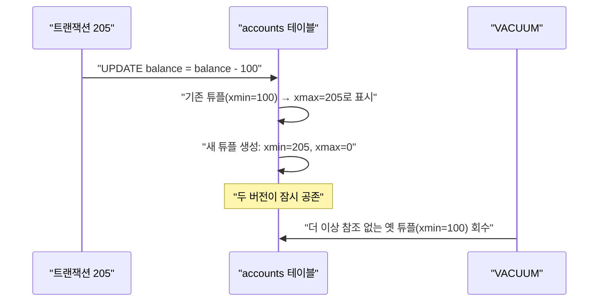

## 이 장을 읽기 전에

[트랜잭션 격리 수준](/post/computerterms/transaction-isolation-levels/)에서 다룬 네 단계 격리 수준과, [ACID Transactions](/post/computerterms/acid-transactions/)에서 언급된 MVCC 개념을 안다고 가정한다. 이 챕터는 그 MVCC가 실제로 어떻게 동작하는지를 락 기반 방식과 대비해 구체화한다.

## 락 기반 제어의 한계: 읽기가 쓰기를 막는다

가장 단순한 동시성 제어 방식은 트랜잭션이 데이터를 읽거나 쓸 때마다 잠금(**Lock**)을 거는 것이다. 한 트랜잭션이 어떤 행을 읽는 동안 다른 트랜잭션이 그 행을 수정하지 못하게 막고, 반대로 한 트랜잭션이 수정하는 동안에는 다른 트랜잭션이 그 행을 읽지도 못하게 막는다. 이 방식은 이해하기 쉽고 구현도 간단하지만, 읽기 작업과 쓰기 작업이 같은 잠금을 두고 경쟁하기 때문에 읽기 위주 워크로드에서도 쓰기가 잦으면 대기 시간이 급격히 늘어난다.

## MVCC의 핵심 아이디어: 값을 덮어쓰지 않고 새 버전을 남긴다

<strong>MVCC(Multi-Version Concurrency Control)</strong>는 데이터를 수정할 때 기존 값을 그 자리에서 덮어쓰는 대신, 새로운 버전을 별도로 만들어 둔다. 각 트랜잭션은 자신이 시작된 시점에 유효했던 버전을 계속 읽으므로, 다른 트랜잭션이 그 사이 값을 바꾸더라도 영향을 받지 않는다. 쓰기 작업도 새 버전을 추가할 뿐 기존 버전을 잠그지 않으므로, 읽기와 쓰기가 서로를 기다릴 필요가 없다. "읽기는 쓰기를 막지 않고, 쓰기는 읽기를 막지 않는다"는 것이 MVCC의 핵심 성질이다.

이 방식의 대가는 저장 공간이다. 값을 즉시 덮어쓰지 않으므로 더 이상 어떤 트랜잭션도 참조하지 않는 옛 버전이 계속 쌓이고, 이를 주기적으로 청소하는 별도의 작업이 필요하다.

## PostgreSQL의 구현: 튜플 버전과 xmin/xmax

PostgreSQL은 MVCC를 테이블의 각 행(**튜플**)마다 두 개의 숨은 컬럼을 붙여 구현한다. `xmin`은 이 튜플 버전을 만든 트랜잭션의 ID, `xmax`는 이 튜플 버전을 삭제(또는 갱신으로 무효화)한 트랜잭션의 ID다. `UPDATE`는 실제로는 기존 튜플을 지우지 않고 그 `xmax`에 현재 트랜잭션 ID를 채운 뒤, 새 값을 담은 튜플을 `xmin`이 현재 트랜잭션 ID인 상태로 추가한다.

```sql
CREATE TABLE accounts (account_id INT PRIMARY KEY, balance NUMERIC);
INSERT INTO accounts (account_id, balance) VALUES (42, 500);

-- 튜플의 숨은 컬럼 xmin/xmax를 직접 조회 (PostgreSQL 전용)
SELECT xmin, xmax, balance FROM accounts WHERE account_id = 42;
-- 예: xmin=100 (트랜잭션 100이 이 행을 생성), xmax=0(아직 무효화 안 됨)

-- 트랜잭션 205에서 UPDATE 실행
UPDATE accounts SET balance = balance - 100 WHERE account_id = 42;

-- 다시 조회하면 새 튜플이 보인다
SELECT xmin, xmax, balance FROM accounts WHERE account_id = 42;
-- 예: xmin=205 (새 튜플을 만든 트랜잭션), xmax=0
-- 이전 튜플(xmin=100)은 사라진 게 아니라 xmax=205로 표시된 채 남아 있다가 VACUUM이 회수한다
```

트랜잭션이 어떤 튜플 버전을 읽을지는, 자신이 시작된 시점 기준으로 이미 커밋된 `xmin`을 가지면서 아직 `xmax`가 (자신 기준으로) 유효하지 않은 버전을 고르는 방식으로 결정된다. 더 이상 어떤 트랜잭션도 볼 필요가 없는 옛 튜플은 `VACUUM`이라는 별도 프로세스가 회수한다.



## 비교: 락 기반 제어 vs MVCC

| 항목 | 락 기반 제어 | MVCC |
|---|---|---|
| 읽기·쓰기 관계 | 서로 차단 가능 | 서로 차단하지 않음 |
| 데이터 표현 | 한 값을 제자리에서 갱신 | 여러 버전을 동시에 보관 |
| 추가 비용 | 잠금 대기·교착 상태 위험 | 저장 공간 증가, 청소(VACUUM) 필요 |
| 대표 구현 | 전통적 2단계 잠금(2PL) | PostgreSQL, MySQL InnoDB, Oracle |

애플리케이션 개발자 입장에서 MVCC 자체는 대부분 선택 대상이 아니다 — PostgreSQL이나 MySQL InnoDB를 쓰는 순간 이미 MVCC 위에서 동작하고 있기 때문이다. 다만 실무에서 신경 써야 할 판단 지점은 남아 있다. 배치 작업이나 리포트 생성처럼 수 분 이상 열려 있는 **장기 트랜잭션**은 그 시작 시점 이전의 옛 튜플 버전을 VACUUM이 회수하지 못하게 붙잡아 둔다. 이런 트랜잭션이 잦으면 옛 버전이 계속 쌓여 테이블이 실제 데이터보다 훨씬 커지는 <strong>테이블 팽창(Table Bloat)</strong>으로 이어지므로, 장기 트랜잭션은 가능한 한 짧게 유지하거나 별도의 읽기 전용 복제본에서 실행하는 것이 실무 대응이다. 또한 Serializable처럼 엄격한 격리 수준을 요구하는 애플리케이션은 MVCC가 제공하는 스냅샷만으로는 충돌을 완전히 막지 못해 재시도 로직이 필요할 수 있는데, 이는 [트랜잭션 격리 수준](/post/computerterms/transaction-isolation-levels/)에서 다룬다.

## 흔한 오개념

**"MVCC는 락을 아예 쓰지 않는다"** — MVCC는 읽기-쓰기 간 잠금을 없애지만, 같은 행을 동시에 수정하려는 쓰기-쓰기 충돌까지 없애지는 못한다. 두 트랜잭션이 같은 행을 동시에 갱신하려 하면 여전히 한쪽이 대기하거나 충돌로 실패한다. MVCC가 없애는 것은 "읽기가 쓰기를 막는" 경쟁이지, 모든 경쟁이 아니다.

**"버전을 여러 개 유지하니 항상 최신 값을 즉시 볼 수 있다"** — 오히려 반대에 가깝다. Repeatable Read나 Serializable처럼 스냅샷을 유지하는 격리 수준에서는, 트랜잭션이 시작된 이후 다른 트랜잭션이 커밋한 최신 변경 사항이 의도적으로 보이지 않는다. MVCC의 목적은 최신성이 아니라 "트랜잭션 시작 시점 기준의 일관된 스냅샷"을 보장하는 것이다.

## 다른 개념과의 연결

`VACUUM`이 회수하는 옛 튜플 버전은 [파일 시스템](/post/computerterms/file-systems/) 챕터에서 다룬 디스크 공간 관리 문제와 맞닿아 있고, 트랜잭션 ID 비교로 버전의 가시성을 판단하는 방식은 [레이스 컨디션과 락](/post/computerterms/race-conditions-and-locks/)에서 다룬 동시성 제어의 대안적 접근이다. 다음 챕터에서는 트랜잭션이 실행될 때 데이터베이스가 어떤 실행 전략을 고를지 결정하는 쿼리 플래너의 내부 동작을 다룬다.

## 평가 기준

이 챕터를 읽은 후에는 다음을 할 수 있어야 한다. 락 기반 동시성 제어와 MVCC가 읽기-쓰기 충돌을 다루는 방식의 차이를 설명할 수 있다. PostgreSQL이 `xmin`/`xmax`로 튜플 버전의 가시성을 판단하는 원리를 설명할 수 있다. MVCC가 저장 공간·청소 비용이라는 대가를 치른다는 점과, 그것이 왜 합리적인 트레이드오프인지 판단할 수 있다.

## 참고 자료

> "PostgreSQL provides a rich set of tools for developers to manage concurrent access to data. Internally, data consistency is maintained by using a multiversion model (Multiversion Concurrency Control, MVCC). ... MVCC, by eschewing the locking methodologies of traditional database systems, minimizes lock contention in order to allow for reasonable performance in multiuser environments." — PostgreSQL Documentation, *13.1. Introduction*

- [PostgreSQL Documentation: MVCC Introduction](https://www.postgresql.org/docs/current/mvcc-intro.html) — MVCC의 설계 목표와 격리 수준별 동작을 다루는 공식 문서
- [PostgreSQL Documentation: System Columns](https://www.postgresql.org/docs/current/ddl-system-columns.html) — `xmin`/`xmax` 등 튜플 버전 관리에 쓰이는 숨은 컬럼 설명
