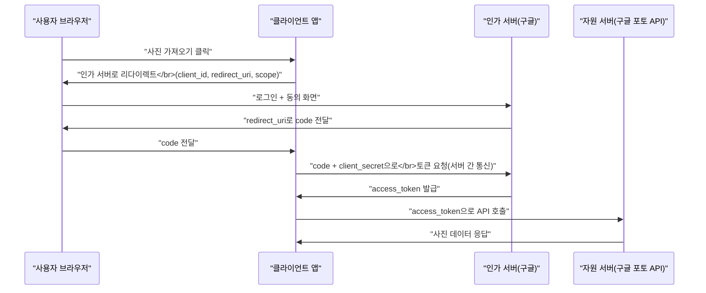

## 이 장을 읽기 전에

[인증과 인가](/post/computerterms/authentication-and-authorization/)에서 다룬 세션·토큰 기반 인증, 그리고 JWT가 서버 자신의 사용자를 확인하는 방식임을 안다고 가정한다. 이 챕터는 그 지식을 "내가 아닌 제3자 앱이 나 대신 접근해야 할 때"로 확장한다.

## 비밀번호를 넘기지 않고 권한만 위임하기

어떤 사진 인화 서비스가 사용자의 구글 포토 사진을 가져와 인화해주려 한다고 하자. 가장 단순한 방법은 사용자가 구글 아이디·비밀번호를 그 서비스에 직접 입력하는 것이지만, 이 방식은 두 가지 문제를 낳는다. 인화 서비스가 사용자의 구글 계정 전체(메일, 캘린더 등)에 접근할 수 있는 비밀번호를 갖게 되고, 사용자는 나중에 이 접근을 취소하려면 비밀번호 자체를 바꿔야 한다. **OAuth 2.0**은 이 문제를 "비밀번호 대신, 정해진 범위(scope)와 기간만 유효한 접근 권한을 발급"하는 방식으로 해결하는 **위임 인가(Delegated Authorization)** 프로토콜이다. 사용자는 구글 로그인 화면에서 직접 인증하고, "사진 읽기 권한만 인화 서비스에 허용"할지 동의하며, 인화 서비스는 비밀번호를 한 번도 보지 못한 채 제한된 접근 토큰만 받는다.

이 흐름에는 네 역할이 등장한다. **자원 소유자(Resource Owner)**는 사용자 본인이고, **클라이언트(Client)**는 권한을 위임받으려는 제3자 앱(인화 서비스)이며, **인가 서버(Authorization Server)**는 사용자를 인증하고 동의를 받아 토큰을 발급하는 주체(구글)이고, **자원 서버(Resource Server)**는 실제 데이터(사진)를 갖고 있는 API 서버다. 인가 서버와 자원 서버가 같은 회사의 다른 컴포넌트인 경우가 많지만, 역할은 개념적으로 분리되어 있다.

## Authorization Code Flow: 가장 널리 쓰이는 흐름

OAuth 2.0은 여러 흐름(grant type)을 정의하지만, 서버가 있는 웹 앱에서 가장 널리 쓰이는 것은 **Authorization Code Flow**다. 이 흐름은 토큰을 브라우저에 직접 노출하지 않고, 짧게 유효한 "코드"를 한 번 거쳐 서버 간 통신으로 실제 토큰을 교환한다는 점이 핵심이다.



이 흐름에서 `code`가 사용자 브라우저를 거쳐 클라이언트로 전달되지만, 그 `code`를 실제 `access_token`으로 바꾸는 마지막 단계는 클라이언트 서버와 인가 서버 사이의 **서버 간 통신**으로 이뤄지고, 이때 클라이언트만 아는 `client_secret`을 함께 제시해야 한다. 즉 브라우저를 가로챈 공격자가 `code`를 훔치더라도 `client_secret` 없이는 실제 토큰으로 교환할 수 없다. 이렇게 얻은 `access_token`은 [인증과 인가](/post/computerterms/authentication-and-authorization/)에서 다룬 JWT와 마찬가지로 짧은 만료 시간을 가지며, 사용자가 다시 로그인하지 않고도 갱신할 수 있도록 별도의 `refresh_token`을 함께 발급하는 경우가 많다.

## 이 흐름의 한계: client_secret을 안전히 보관할 수 없다면

위 흐름은 `client_secret`을 안전하게 보관할 수 있는 서버가 있다는 것을 전제한다. 하지만 브라우저에서 직접 실행되는 SPA나 모바일 앱 같은 **공개 클라이언트(Public Client)**는 앱 코드 자체가 사용자 손에 들어가므로 `client_secret`을 숨길 방법이 없다 — 앱을 디컴파일하면 누구나 그 값을 알아낼 수 있다. 이런 클라이언트가 `client_secret` 없이 그대로 Authorization Code Flow를 쓰면, `code`를 가로챈 공격자가 `client_secret` 검증 없이 바로 토큰을 발급받을 수 있어 이 흐름이 전제하는 안전성이 깨진다. 이 문제는 **PKCE(Proof Key for Code Exchange, RFC 7636)** 확장으로 보완한다 — 클라이언트가 매 인가 요청마다 무작위 값(`code_verifier`)과 그 해시(`code_challenge`)를 생성해, 인가 서버에는 해시만 먼저 보내고 토큰 교환 시점에 원래 값을 제시해 "이 code를 요청한 클라이언트와 지금 토큰을 요청하는 클라이언트가 동일하다"는 것을 증명한다. 오늘날 대부분의 OAuth 가이드라인은 공개 클라이언트뿐 아니라 서버가 있는 앱에도 PKCE를 함께 쓸 것을 권장한다.

## OIDC: OAuth 위에 "누구인가"를 얹다

OAuth 2.0의 `access_token`은 "이 클라이언트가 이 범위의 자원에 접근해도 된다"는 **인가** 증명일 뿐, 자원 소유자가 정확히 누구인지에 대해서는 표준화된 방법을 제공하지 않는다. 초기 서비스들은 이 한계를 우회하려고 `access_token`으로 사용자 정보 API를 호출해 "로그인한 사용자가 누구인지" 역으로 알아내는 방식을 각자 다르게 구현했고, 이는 상호 호환성과 보안 측면에서 문제가 많았다. **OpenID Connect(OIDC)**는 OAuth 2.0 위에 **인증(Authentication)** 계층을 표준으로 추가해 이 문제를 해결한다. OIDC를 쓰는 인가 서버는 `access_token`과 함께 사용자의 신원 정보(이름, 이메일 등)를 담은 **`id_token`**을 JWT 형식으로 발급하며, 클라이언트는 이 `id_token`의 서명을 검증하는 것만으로 "이 요청은 실제로 이 사용자가 로그인해서 온 것"임을 표준화된 방식으로 확인할 수 있다.

```text
OAuth 2.0만 사용: access_token 발급 → "이 클라이언트가 이 자원에 접근 가능"(인가)
                  → 사용자가 누구인지는 표준 방법 없음

OIDC 사용: access_token + id_token(JWT) 발급
           → id_token.payload = {sub: "user_id", email: "...", name: "..."}
           → 클라이언트가 id_token 서명 검증만으로 사용자 신원 확인(인증)
```

"구글로 로그인", "깃허브로 로그인" 같은 **소셜 로그인(SSO)** 버튼은 대부분 OIDC를 사용한다 — 사용자 신원 확인이 목적이므로 자원 접근용 `access_token`보다 `id_token`이 핵심 역할을 한다.

## 비교: OAuth 2.0 vs OIDC

| 특성 | OAuth 2.0 | OpenID Connect(OIDC) |
|---|---|---|
| 목적 | 인가(제한된 권한 위임) | 인증(신원 확인) + 인가 |
| 핵심 토큰 | `access_token` | `access_token` + `id_token`(JWT) |
| "누가 로그인했는가" | 표준화되지 않음 | `id_token`의 `sub`, `email` 등으로 표준화 |
| 대표 사용처 | 제3자 앱의 API 접근(사진 가져오기 등) | 소셜 로그인(SSO) |

## 흔한 오개념

**"OAuth 토큰만 있으면 로그인 기능을 만들 수 있다"** — `access_token`은 자원 접근 권한 증명일 뿐, 사용자 신원을 표준적으로 담지 않는다. `access_token`을 사용자 식별자처럼 취급해 로그인을 구현하면, 인가 서버 구현에 따라 다르게 동작하는 비표준 API에 의존하게 되고 보안 결함으로 이어지기 쉽다. 로그인이 목적이면 OIDC의 `id_token`을 검증해야 한다.

**"OAuth는 곧 SSO다"** — OAuth 2.0 자체는 인가 프로토콜이고 SSO(단일 로그인)를 직접 정의하지 않는다. SSO는 보통 OIDC(또는 SAML 같은 별도 프로토콜)로 구현되며, OAuth는 그 위에서 자원 접근 권한을 위임하는 부분만 담당한다.

## 다른 개념과의 연결

Authorization Code Flow의 마지막 단계에서 클라이언트가 받는 `access_token`은 [인증과 인가](/post/computerterms/authentication-and-authorization/)에서 다룬 토큰 기반 인증과 같은 원리(서명 검증, 짧은 만료)로 동작하고, `id_token`의 서명은 [암호화와 해싱](/post/computerterms/encryption-and-hashing/)에서 다룬 비대칭키 서명을 그대로 쓴다. 다음 챕터에서는 이렇게 애플리케이션 계층에서 주고받는 요청 자체를, 네트워크 계층에서 검사하고 걸러내는 웹 방화벽을 다룬다.

## 평가 기준

이 챕터를 읽은 후에는 다음을 할 수 있어야 한다. 제3자 앱에 비밀번호를 직접 주지 않고 OAuth 2.0으로 권한을 위임하는 이유를 설명할 수 있다. Authorization Code Flow에서 `code`와 `access_token`의 역할이 왜 분리되어 있는지 설명할 수 있다. OAuth 2.0과 OIDC의 차이(인가 vs 인증)를 `id_token`의 역할과 함께 설명할 수 있다.

## 참고 자료

> Hardt, D. (Ed.). (2012). *RFC 6749: The OAuth 2.0 Authorization Framework*. IETF.

- [OpenID Connect Core 1.0](https://openid.net/specs/openid-connect-core-1_0.html) — id_token 구조와 OIDC 인증 흐름 표준 명세
- [OAuth 2.0 Authorization Code Flow (Auth0)](https://auth0.com/docs/get-started/authentication-and-authorization-flow/authorization-code-flow) — 실무 구현 관점의 흐름 설명
