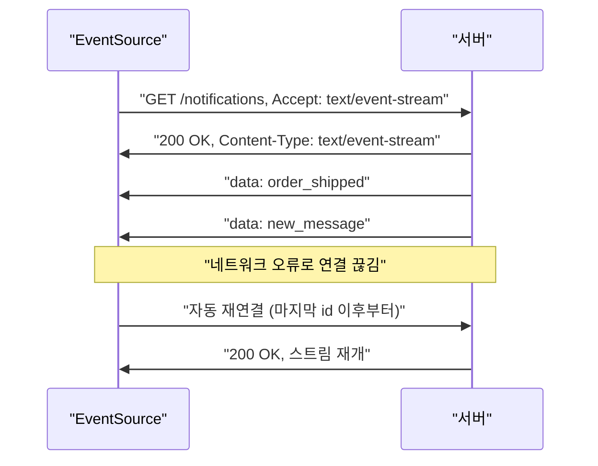

## 이 장을 읽기 전에

[웹소켓과 CORS](/post/computerterms/websockets-and-cors/)에서 다룬 웹소켓의 업그레이드 핸드셰이크와 양방향 통신, [HTTP와 HTTPS](/post/computerterms/http-and-https/)에서 다룬 HTTP 요청-응답 구조를 안다고 가정한다. SSE는 웹소켓과 경쟁하는 기술이 아니라, 웹소켓이 제공하는 양방향성이 필요 없는 상황을 위한 더 단순한 대안이다.

## 양방향이 필요 없는 실시간 통신

[웹소켓과 CORS](/post/computerterms/websockets-and-cors/)에서 다룬 대로 웹소켓은 서버와 클라이언트가 각자 원하는 시점에 메시지를 보낼 수 있는 양방향 통로다. 하지만 실시간 알림, 주가·환율 시세, 로그 스트리밍처럼 **서버 → 클라이언트 방향으로만** 데이터가 흐르면 충분한 상황이 실무에서 많다. 이런 경우 클라이언트가 서버에 보낼 메시지가 애초에 없으므로, 양방향 통로를 여는 웹소켓의 업그레이드 핸드셰이크와 별도 프로토콜(웹소켓 프레임)은 필요 이상의 장치가 된다.

## SSE: 평범한 HTTP 연결 하나로 스트림 열기

**서버센트이벤트(Server-Sent Events, SSE)**는 클라이언트가 평범한 HTTP `GET` 요청을 보내고, 서버가 연결을 끊지 않은 채 계속 데이터를 흘려보내는 방식으로 단방향 실시간 스트림을 구현하는 표준 기술이다. 웹소켓처럼 프로토콜을 다른 것으로 전환하지 않고, HTTP 응답 본문을 끝없이 이어지는 텍스트 스트림으로 취급한다는 점이 핵심이다.

```text
클라이언트 → 서버:
  GET /notifications HTTP/1.1
  Accept: text/event-stream

서버 → 클라이언트 (연결을 끊지 않고 계속 전송):
  HTTP/1.1 200 OK
  Content-Type: text/event-stream
  Cache-Control: no-cache
  Connection: keep-alive

  data: {"type": "order_shipped", "orderId": 42}

  data: {"type": "new_message", "text": "안녕하세요"}

  event: heartbeat
  data: ping
```

서버는 응답 헤더로 `Content-Type: text/event-stream`을 지정해 "이 응답은 끝나지 않는 이벤트 스트림"임을 알리고, 이후 `data:` 로 시작하는 줄마다 새 이벤트를 실어 보낸다. 각 이벤트는 빈 줄로 구분되며, `event:` 필드로 이벤트 종류를 구분하거나 `id:` 필드로 마지막으로 받은 이벤트 번호를 표시할 수도 있다.

## 브라우저 쪽: EventSource API와 자동 재연결

브라우저는 `EventSource`라는 표준 API로 SSE 연결을 다룬다. `new EventSource(url)`을 호출하면 브라우저가 자동으로 연결을 열고, 서버가 보낸 `data:` 이벤트마다 `message` 이벤트 핸들러를 호출한다.

```javascript
const source = new EventSource("/notifications");

source.onmessage = (event) => {
  const payload = JSON.parse(event.data);
  console.log("새 알림:", payload);
};

source.onerror = () => {
  // 연결이 끊기면 브라우저가 자동으로 재연결을 시도한다
  console.log("연결 끊김, 재연결 시도 중");
};
```



이 자동 재연결이 SSE의 실무적 강점이다 — 네트워크가 끊기거나 서버가 재시작돼 연결이 끊어져도, 클라이언트가 별도 코드를 작성하지 않아도 `EventSource`가 알아서 재연결을 시도한다. 웹소켓은 이런 재연결 로직을 애플리케이션 코드에서 직접 구현해야 한다.

## 왜 인프라가 더 가벼운가

SSE가 웹소켓보다 가볍다고 말하는 이유는 두 가지다. 첫째, SSE는 평범한 HTTP 연결이므로 웹소켓 프로토콜을 이해하지 못하는 기존 로드밸런서·프록시·방화벽을 그대로 통과한다 — 별도의 프로토콜 업그레이드 처리를 인프라에 추가할 필요가 없다. 둘째, 클라이언트가 서버로 보낼 메시지가 필요하면 그냥 별도의 일반 HTTP 요청(`POST` 등)을 보내면 되므로, 양방향 프레임 구조를 유지·관리하는 복잡성 자체가 없다. 다만 이 단순함은 브라우저의 [HTTP와 HTTPS](/post/computerterms/http-and-https/) 연결 동시 개수 제한(도메인당 보통 6개 안팎, HTTP/1.1 기준)과 맞물려, 한 페이지에서 SSE 연결을 여러 개 열면 다른 요청이 밀리는 제약으로 이어질 수 있다. HTTP/2를 쓰면 이 연결 수 제한이 크게 완화된다.

## 비교: 웹소켓 vs SSE

| 특성 | 웹소켓 | SSE |
|---|---|---|
| 통신 방향 | 양방향 | 단방향(서버 → 클라이언트) |
| 프로토콜 전환 | 필요(업그레이드 핸드셰이크) | 불필요(평범한 HTTP 응답) |
| 데이터 형식 | 텍스트·바이너리 모두 | 텍스트만 |
| 자동 재연결 | 직접 구현 필요 | 브라우저가 기본 제공 |
| 기존 인프라 호환 | 프록시·로드밸런서 별도 지원 필요할 수 있음 | 일반 HTTP처럼 통과 |
| 적합한 사례 | 채팅, 협업 편집(양방향 필요) | 알림, 시세, 로그 스트리밍(단방향으로 충분) |

## 흔한 오개념

**"SSE는 폴링보다 항상 복잡하다"** — 반대로 SSE는 폴링보다 단순한 경우가 많다. 폴링은 클라이언트가 몇 초마다 새 요청을 반복해서 보내고, 새 데이터가 없을 때도 매번 HTTP 헤더·TCP 핸드셰이크 비용을 치른다. SSE는 연결을 한 번만 열고 서버가 필요할 때만 이벤트를 흘려보내므로, 오히려 요청 횟수와 지연 모두 줄어든다. "SSE가 복잡하다"는 인상은 웹소켓과 혼동하는 경우가 많다.

**"SSE로는 바이너리 데이터를 못 보내니 웹소켓보다 열등하다"** — SSE의 `data:` 필드는 텍스트(대부분 JSON)만 실을 수 있는 것이 맞지만, 알림·시세·로그처럼 SSE가 실제로 쓰이는 상황은 애초에 텍스트 기반 데이터가 대부분이다. 이미지·오디오 같은 바이너리 스트림이 필요하다면 SSE가 아니라 다른 기술(웹소켓, 또는 미디어 스트리밍 프로토콜)을 선택하는 것이 맞다 — SSE의 제약이 아니라 SSE의 적용 범위를 벗어난 요구사항이다.

## 다른 개념과의 연결

SSE와 웹소켓의 선택 기준은 결국 "클라이언트가 서버로도 자주 메시지를 보내야 하는가"라는 질문으로 좁혀지며, 이는 [웹소켓과 CORS](/post/computerterms/websockets-and-cors/)에서 다룬 양방향 통신의 필요성과 직결된다. 다음 챕터에서는 실시간 통신을 벗어나, 브라우저가 서버로부터 받은 데이터를 클라이언트 쪽에 어떻게 저장하는지 — 쿠키와 로컬 스토리지의 차이를 다룬다.

## 평가 기준

이 챕터를 읽은 후에는 다음을 할 수 있어야 한다. SSE가 평범한 HTTP 연결로 단방향 스트림을 구현하는 원리를 설명할 수 있다. SSE와 웹소켓의 차이(방향성, 프로토콜 전환, 재연결)를 근거로 상황에 맞는 기술을 선택할 수 있다. SSE가 폴링 대비 갖는 이점을 설명할 수 있다.

## 참고 자료

> "To enable servers to push data to web pages over HTTP or using dedicated server-push protocols, this specification introduces the `EventSource` interface." — WHATWG, *HTML Living Standard*, Section 9.2 "Server-sent events"

- [MDN: Server-sent events](https://developer.mozilla.org/en-US/docs/Web/API/Server-sent_events) — SSE 개념과 `EventSource` API 레퍼런스
- [WHATWG HTML: Server-sent events](https://html.spec.whatwg.org/multipage/server-sent-events.html) — SSE 표준 명세 원문
