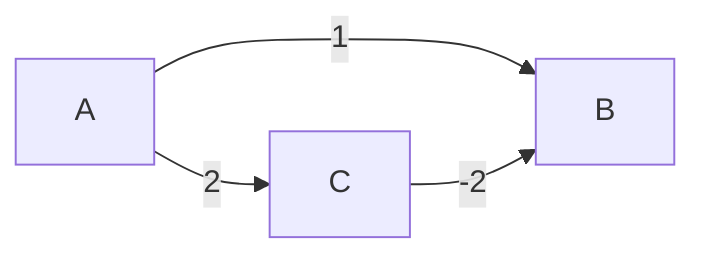

## 이 장을 읽기 전에

이 챕터는 [그래프](/post/computerterms/graphs/)의 인접 리스트 표현과 BFS, [탐색 알고리즘](/post/computerterms/searching-algorithms/)을 먼저 읽었다고 가정한다. 큐와 우선순위 큐의 개념을 안다면 진행에 무리가 없다. 두 지점 사이 최단 경로에 집중하며, 모든 정점 쌍 사이 최단 경로를 구하는 플로이드-워셜(Floyd-Warshall) 알고리즘은 범위 밖이므로 다루지 않는다.

## 왜 가중치가 있으면 BFS로 충분하지 않은가

[그래프](/post/computerterms/graphs/) 챕터에서 BFS가 "간선 수 기준" 최단 경로를 구한다고 다뤘다. 이는 모든 간선의 비용이 동일하다는 전제가 있을 때만 성립한다. 그런데 현실의 그래프는 대부분 간선마다 다른 비용을 가진다 — 도로망의 거리, 네트워크 라우팅의 지연 시간, 항공편의 요금이 그렇다. 이런 **가중치 있는 그래프(Weighted Graph)**에서는 간선 수가 적은 경로가 아니라 가중치 합이 작은 경로를 찾아야 하며, 이때 BFS는 더 이상 정답을 보장하지 못한다. 이 문제를 푸는 대표 알고리즘이 다익스트라다.

## 다익스트라 알고리즘: 그리디로 가중치 최단 경로 구하기

**다익스트라(Dijkstra) 알고리즘**은 시작 정점에서 각 정점까지의 최단 거리를 담는 배열을 무한대로 초기화하고(시작 정점만 0), 아직 확정되지 않은 정점 중 현재까지 알려진 거리가 가장 짧은 정점을 매번 골라 그 정점을 거쳐 갈 수 있는 이웃들의 거리를 갱신(Relaxation)하는 과정을 모든 정점이 확정될 때까지 반복한다. "가장 짧은 정점을 매번 그리디하게 고른다"는 점에서, 이후 [동적 계획법](/post/computerterms/dynamic-programming/)을 거쳐 다룰 그리디 알고리즘의 대표 사례이기도 하다. 매번 최솟값을 찾는 과정을 **우선순위 큐(Priority Queue)**로 구현하면, 간선 수를 E, 정점 수를 V라 할 때 전체 시간 복잡도는 O((V + E) log V)가 된다.

다음은 다익스트라의 핵심 로직을 담은 의사코드다. 실제 언어별 구현은 그래프 표현(인접 리스트/행렬)과 우선순위 큐 라이브러리에 따라 세부가 달라지므로, 여기서는 알고리즘의 골격만 보인다.

```text
dijkstra(graph, start):
    dist[v] = INF for all v in graph
    dist[start] = 0
    visited[v] = false for all v in graph   // 한 번 확정된 정점을 기억
    pq = priority_queue()   // (거리, 정점) 쌍을 거리 기준 최소 힙으로 관리
    pq.push((0, start))

    while pq is not empty:
        (d, u) = pq.pop_min()
        if visited[u]:
            continue          // 이미 확정된 정점은 다시 검토하지 않음
        visited[u] = true     // u를 최종 확정
        for (v, weight) in graph.neighbors(u):
            if not visited[v] and dist[u] + weight < dist[v]:
                dist[v] = dist[u] + weight   // relaxation
                pq.push((dist[v], v))

    return dist
```

`visited[u] = true`가 핵심이다. 이 줄이 정점 u를 "최종 확정"으로 표시하고, 이후 u가 다시 큐에서 나와도(더 짧은 거리 후보로 재등장하더라도) `if visited[u]: continue`에 걸려 무시된다 — 즉 한 번 확정된 정점의 `dist` 값은 그 뒤 어떤 간선을 거쳐도 다시 갱신되지 않는다.

다음은 이 골격을 그대로 옮긴 실행 가능한 C++ 구현이다. `std::priority_queue`는 기본적으로 최대 힙이므로, `greater<>`를 비교자로 지정해 최소 힙으로 뒤집었다.

```cpp
#include <cstdio>
#include <vector>
#include <queue>
#include <climits>
using namespace std;

vector<int> dijkstra(int n, vector<vector<pair<int,int>>>& adj, int start) {
    vector<int> dist(n, INT_MAX);
    vector<bool> visited(n, false);
    priority_queue<pair<int,int>, vector<pair<int,int>>, greater<>> pq;

    dist[start] = 0;
    pq.push({0, start});

    while (!pq.empty()) {
        auto [d, u] = pq.top(); pq.pop();
        if (visited[u]) continue;
        visited[u] = true;
        for (auto [v, weight] : adj[u]) {
            if (!visited[v] && dist[u] + weight < dist[v]) {
                dist[v] = dist[u] + weight;
                pq.push({dist[v], v});
            }
        }
    }
    return dist;
}

int main() {
    int n = 4;   /* 0=A, 1=B, 2=C, 3=D */
    vector<vector<pair<int,int>>> adj(n);
    adj[0] = {{1, 4}, {2, 1}};
    adj[2] = {{1, 1}};
    adj[1] = {{3, 1}};
    adj[2].push_back({3, 5});

    vector<int> dist = dijkstra(n, adj, 0);
    for (int i = 0; i < n; i++) printf("dist[%d] = %d\n", i, dist[i]);
    return 0;
}
```

`g++ -std=c++17 -Wall dijkstra.cc -o dijkstra`로 컴파일·실행하면 A(0)에서 D(3)까지 A→C→B→D 경로(가중치 1+1+1=3)가 A→D 직접 경로 없이도 최단 경로로 선택되는 것을 `dist` 배열로 확인할 수 있다. 이 예제는 모든 가중치가 음수가 아니므로 정상 동작하며, 다음 절에서는 음수 가중치가 섞였을 때 같은 확정 로직이 왜 무너지는지를 다룬다.

## 음수 가중치와 벨만-포드

다익스트라는 **한 번 정점을 확정하면(`visited[u] = true`) 그 거리가 최종값**이라는 가정 위에서 동작한다. 이 가정은 모든 간선의 가중치가 0 이상일 때만 성립한다. 만약 그래프에 **음수 가중치** 간선이 있다면, 이미 확정한 정점을 나중에 음수 가중치 간선을 거쳐 더 짧게 도달할 수 있는 경우가 생기는데, 위 의사코드는 `visited[u]`가 true인 정점을 `if visited[u]: continue`로 걸러내 다시는 relax하지 않으므로 이 경우를 놓치고 틀린 최단 거리를 반환한다. 예를 들어 A→B가 가중치 1, A→C가 가중치 2, C→B가 가중치 -2인 그래프를 생각해보자. 다익스트라는 거리가 더 짧은 B(1)를 C(2)보다 먼저 pop해 `visited[B] = true`로 **먼저 확정**한다. 이후 C(2)를 pop해 `visited[C] = true`로 확정하고 C→B 간선을 검토하면 `dist[C] + (-2) = 0`으로 B까지의 진짜 최단 거리가 1이 아니라 0임을 알 수 있지만, 이웃 갱신 조건 `if not visited[v] and ...`에서 `visited[B]`가 이미 true이므로 이 조건 자체가 거짓이 되어 갱신 시도조차 일어나지 않는다. 따라서 알고리즘은 이 정보를 전혀 반영하지 못하고 틀린 값 1을 그대로 반환한다.

다음 그래프와 확정 순서로 이 실패 과정을 정리할 수 있다.



pop 순서는 A(0) → B(1, **여기서 확정**) → C(2, 확정). C가 확정되는 시점에 C→B 간선(가중치 -2)을 검토하지만 B는 이미 확정되어 있어 `not visited[B]` 조건이 거짓이 되므로 갱신이 시도조차 되지 않는다. 실제 최단 거리 A→C→B = 2 + (-2) = 0이 반영되지 못하고, `dist[B]`는 처음 확정된 값 1로 남는다.

음수 가중치가 있는 그래프의 최단 경로는 **벨만-포드(Bellman-Ford) 알고리즘**으로 구한다. 벨만-포드는 그리디하게 확정하는 대신, 모든 간선에 대해 완화(Relaxation) 연산을 정점 수-1번 반복해 점진적으로 거리를 줄여나간다. 시간 복잡도는 O(VE)로 다익스트라보다 느리지만, 음수 가중치를 허용하고 추가로 **음수 사이클(Negative Cycle)**의 존재 여부까지 검출할 수 있다는 장점이 있다 — 정점 수-1번 반복 이후에도 거리가 더 줄어드는 간선이 남아 있으면 음수 사이클이 존재한다는 뜻이다.

## 비교: 무엇이 다르고, 언제 무엇을 쓰는가

| 알고리즘 | 전제 조건 | 시간 복잡도 | 음수 가중치 | 음수 사이클 검출 |
|---|---|---|---|---|
| BFS | 가중치 없음(또는 균일) | O(V + E) | 해당 없음 | 불가 |
| 다익스트라 | 가중치 ≥ 0 | O((V+E) log V) | 불가 | 불가 |
| 벨만-포드 | 제약 없음 | O(VE) | 가능 | 가능 |

이 표에서 실무 판단의 기준은 **그래프의 가중치 특성**이다. 소셜 네트워크의 팔로우 관계처럼 간선에 비용 개념이 없다면 BFS로 충분하고, 도로망처럼 모든 비용이 양수라면 다익스트라가 벨만-포드보다 빠르므로 우선 선택한다. 환율 차익 거래 탐지처럼 음수 가중치(손실/이익)가 구조적으로 존재하는 문제라면 벨만-포드가 유일한 선택지다.

## 흔한 오개념

**"다익스트라는 모든 최단 경로 문제에 쓸 수 있는 만능 알고리즘이다"** — 다익스트라는 음수 가중치가 없는 그래프에서만 정답을 보장한다. 음수 가중치가 있는 그래프에 다익스트라를 그대로 적용하면 예외나 에러 없이 조용히 틀린 값을 반환하므로, 이 전제를 모르고 쓰면 버그를 찾기 어렵다.

**"가중치 그래프에서도 그냥 BFS를 쓰면 얼추 맞는 답이 나온다"** — BFS는 간선 수만 세므로, 가중치 합이 작지만 간선 수가 많은 경로와 가중치 합이 크지만 간선 수가 적은 경로를 구분하지 못한다. "얼추 맞는" 근사치가 아니라 아예 다른 기준으로 계산한 값이라, 가중치가 조금이라도 불균일하면 완전히 틀린 경로를 최단 경로로 오판할 수 있다.

## 다른 개념과의 연결

다익스트라는 시작 정점의 거리를 0으로, 나머지를 무한대로 두고 시작하는 방식이 BFS의 `visited` 초기화와 유사하지만, 큐 대신 [해시테이블](/post/computerterms/hash-tables/) 또는 트리 기반의 우선순위 큐(힙)를 쓴다는 점이 다르다. "매 단계 지역적으로 최선인 선택을 한다"는 다익스트라의 그리디 방식은, [동적 계획법](/post/computerterms/dynamic-programming/)을 거쳐 다룰 **그리디 알고리즘**이 언제 전역 최적을 보장하고 언제 실패하는지를 이해하는 데 직접 이어진다.

## 평가 기준

이 챕터를 읽은 후에는 다음을 할 수 있어야 한다. 가중치 없는 그래프와 가중치 있는 그래프에서 각각 BFS와 다익스트라 중 어느 것을 써야 하는지 설명할 수 있다. 다익스트라가 음수 가중치 그래프에서 실패하는 구체적 시나리오를 예시로 설명할 수 있다. 벨만-포드가 다익스트라보다 느린데도 필요한 상황을 설명할 수 있다.

## 참고 자료

> Dijkstra, E. W. (1959). "A note on two problems in connexion with graphs." *Numerische Mathematik*, 1(1), 269–271.

- [Visualgo: Single-Source Shortest Path](https://visualgo.net/en/sssp) — 다익스트라·벨만-포드 동작을 단계별로 시각화한 자료
- [MIT OCW 6.006: Shortest Paths](https://ocw.mit.edu/courses/6-006-introduction-to-algorithms-fall-2011/) — 다익스트라·벨만-포드의 증명과 복잡도 분석 강의 자료
