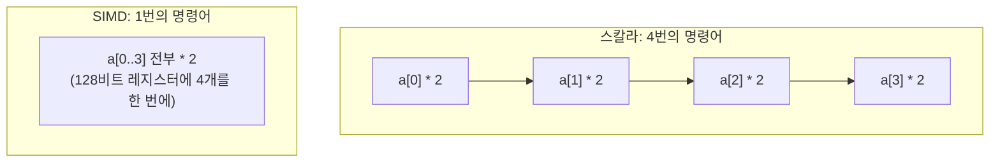

## 이 장을 읽기 전에

[캐시 계층](/post/computerterms/cache-hierarchy/)에서 캐시 라인이 64바이트 단위로 데이터를 통째로 가져온다고 다뤘다. 이 챕터는 그렇게 캐시 라인에 이미 올라와 있는 여러 데이터를, CPU가 명령어 하나로 한꺼번에 연산하는 방식을 다룬다. 즉 "데이터를 빨리 가져오는 문제"(캐시)에서 "가져온 데이터를 빨리 처리하는 문제"(SIMD)로 넘어간다.

## 스칼라 연산과 벡터 연산

일반적인 연산 명령어는 **스칼라(Scalar)** 연산이다 — 명령어 하나가 값 하나를 처리한다. 배열 원소 1000개를 각각 2배로 만들려면, 스칼라 방식은 곱셈 명령어를 1000번 실행해야 한다. **SIMD(Single Instruction, Multiple Data)**는 이름 그대로 명령어 하나로 여러 데이터를 동시에 처리하는 **벡터(Vector)** 연산이다. CPU 안에 128비트, 256비트, 512비트 폭의 넓은 레지스터(각각 SSE, AVX, AVX-512에 대응, 정확한 지원 폭은 CPU 모델마다 다른 구현 정의 사항이다)를 두고, 그 레지스터 하나에 32비트 정수 4–16개를 나란히 채운 뒤 곱셈 명령어 한 번으로 전부를 동시에 처리한다.



## 이미지·수치 연산에서 SIMD가 강한 이유

이미지 처리(픽셀마다 밝기 조정), 오디오 신호 처리, 행렬 곱셈 같은 작업은 **같은 연산을 서로 다른 데이터에 독립적으로 반복**하는 패턴이 지배적이다. 이런 패턴을 **데이터 병렬성(Data Parallelism)**이라 부르는데, SIMD는 정확히 이 패턴에 맞춰 설계된 하드웨어다. 아래 코드는 배열의 모든 원소를 2배로 만드는 스칼라 루프다. GCC나 Clang 같은 최신 컴파일러는 `-O3` 최적화 수준에서 이런 단순 반복 루프를 감지해 개발자가 SIMD 명령어를 직접 쓰지 않아도 자동으로 벡터 명령어로 바꿔주는데, 이를 **자동 벡터화(Auto-Vectorization)**라 부른다.

```c
#include <stdio.h>
#include <stdlib.h>

#define N 1000000

void double_values(int *arr, int n) {
    /* 이 단순 루프는 GCC/Clang -O3에서 자동 벡터화 대상이 되는 전형적인 패턴이다.
       각 반복이 이전 반복 결과에 의존하지 않아(독립적) SIMD로 묶어 처리할 수 있다. */
    for (int i = 0; i < n; i++) {
        arr[i] = arr[i] * 2;
    }
}

int main(void) {
    int *arr = malloc(sizeof(int) * N);
    if (arr == NULL) {
        fprintf(stderr, "malloc failed\n");
        return 1;
    }
    for (int i = 0; i < N; i++) arr[i] = i;

    double_values(arr, N);

    printf("arr[0]=%d arr[%d]=%d\n", arr[0], N - 1, arr[N - 1]);
    free(arr);
    return 0;
}
```

`gcc -O3 -march=native -fopt-info-vec simd_demo.c -o simd_demo`처럼 벡터화 진단 플래그를 켜서 컴파일하면, 컴파일러가 이 루프를 벡터화했는지 여부를 출력으로 확인할 수 있다(벡터화 성공 여부는 컴파일러 버전·타겟 아키텍처·루프 안의 조건 분기 유무에 따라 달라지는 구현 정의 사항이다). 반대로 반복마다 이전 결과에 의존하는 루프(예: 누적 합의 순서가 결과에 영향을 주는 부동소수점 연산)는 자동 벡터화가 막히거나 결과가 달라질 수 있어 컴파일러가 보수적으로 벡터화를 포기하기도 한다.

## 비교: 스칼라 vs SIMD

| 특성 | 스칼라 연산 | SIMD 연산 |
|---|---|---|
| 명령어당 처리 데이터 | 1개 | 4–16개(레지스터 폭에 따라) |
| 적합한 패턴 | 순차 의존성이 있는 로직 | 독립적으로 반복되는 데이터 병렬 작업 |
| 대표 활용 | 분기가 많은 일반 로직 | 이미지 처리, 오디오, 행렬 연산, 문자열 검색 |
| 활용 방법 | 기본 명령어로 자연스럽게 처리 | 컴파일러 자동 벡터화 또는 intrinsic 함수 직접 호출 |

## 흔한 오개념

**"SIMD는 특수한 하드웨어를 산 사람만 쓸 수 있다"** — SSE2 수준의 SIMD 명령어는 사실상 모든 현대 x86-64 CPU에 기본 내장돼 있다. 개발자가 별도 하드웨어를 구매할 필요 없이, 컴파일러 최적화 플래그만으로도 상당수의 단순 반복 루프가 자동으로 SIMD 명령어를 쓰게 된다.

**"루프를 벡터화 가능한 형태로만 짜면 컴파일러가 항상 최적으로 벡터화해준다"** — 자동 벡터화는 루프 안에 조건 분기, 함수 호출, 반복 간 의존성이 있으면 실패하거나 부분적으로만 적용될 수 있다. 성능이 중요한 핫패스에서는 컴파일러의 벡터화 리포트를 직접 확인하거나, 필요하면 intrinsic 함수로 SIMD 코드를 명시적으로 작성하는 것이 안전하다.

## 다른 개념과의 연결

SIMD가 처리하는 데이터는 결국 [캐시 계층](/post/computerterms/cache-hierarchy/)에서 다룬 캐시 라인 단위로 메모리에서 올라오므로, 캐시 라인 크기와 SIMD 레지스터 폭이 맞물려야 최대 효율이 난다. 다음 챕터에서는 이런 수치 연산에서 결과가 항상 정확하지는 않은 이유를 부동소수점 표현에서 다룬다.

## 평가 기준

이 챕터를 읽은 후에는 다음을 할 수 있어야 한다. 스칼라 연산과 SIMD 연산의 차이를 명령어당 처리 데이터 개수로 설명할 수 있다. 이미지·수치 연산에서 SIMD가 효과적인 이유를 데이터 병렬성 개념으로 설명할 수 있다. 컴파일러 자동 벡터화가 실패할 수 있는 조건(반복 간 의존성, 조건 분기)을 예로 들 수 있다.

## 참고 자료

> Hennessy, J. L., & Patterson, D. A. (2019). *Computer Architecture: A Quantitative Approach* (6th ed.), Chapter 4: Data-Level Parallelism in Vector, SIMD, and GPU Architectures. Morgan Kaufmann.

- [Wikipedia: Single instruction, multiple data](https://en.wikipedia.org/wiki/Single_instruction,_multiple_data) — SIMD의 정의와 대표 명령어 집합(SSE, AVX 등) 개요
- [GCC: Auto-vectorization in GCC](https://gcc.gnu.org/projects/tree-ssa/vectorization.html) — GCC의 자동 벡터화 지원 범위와 조건에 대한 공식 문서
