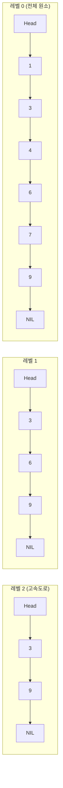

## 이 장을 읽기 전에

[배열과 연결리스트](/post/computerterms/arrays-and-linked-lists/)의 단일 연결리스트 구조와 O(n) 탐색의 원인, [트리](/post/computerterms/trees/)의 균형 이진 탐색 트리가 O(log n)을 보장하는 원리, [유니온-파인드](/post/computerterms/union-find/)에서 다룬 "확률적/상각 분석" 개념을 안다고 가정한다. 스킵 리스트는 트리가 아니라 연결리스트를 확장해서 O(log n) 탐색을 얻는 대안적 접근이다.

## 연결리스트는 왜 탐색이 느린가, 그리고 고속도로를 놓으면 어떨까

[연결리스트](/post/computerterms/arrays-and-linked-lists/)는 삽입이 O(1)로 빠르지만, 특정 값을 찾으려면 처음부터 노드를 하나씩 따라가야 해 탐색이 O(n)이다. 정렬을 유지하면서도 이 문제를 해결하려면 균형 [이진 탐색 트리](/post/computerterms/trees/)를 쓸 수 있지만, AVL 트리나 레드-블랙 트리는 회전(rotation) 로직이 복잡하고 구현·디버깅 난도가 높다. **스킵 리스트(Skip List)**는 정렬된 연결리스트 위에 몇 개 노드씩 건너뛰는 "고속도로" 층을 여러 겹 얹어, 트리의 회전 없이도 평균 O(log n) 탐색을 얻는 절충안이다.

## 여러 층의 연결리스트로 지름길 놓기

스킵 리스트는 가장 아래층(레벨 0)에 모든 원소를 정렬된 순서로 담은 일반 연결리스트를 둔다. 그 위층(레벨 1)에는 아래층 원소 중 일부만 골라 연결하고, 다시 그 위층(레벨 2)에는 레벨 1의 원소 중 더 적은 일부만 골라 연결하는 식으로 층을 쌓는다. 위층으로 갈수록 원소 수가 줄어들어 "몇 칸씩 건너뛰는 지름길"처럼 동작한다. 각 노드가 몇 층까지 포함될지는 삽입 시점에 동전 던지기(예: 1/2 확률로 다음 층에도 포함)로 확률적으로 결정한다 — 이 무작위성 덕분에 특정 삽입 순서에서도 특정 노드에만 층이 몰리는 구조적 편향이 생기지 않는다.



이 구조에서 값 `9`를 찾는다고 하면, 레벨 2에서 `Head → 3 → 9`로 두 칸 만에 목표에 도달한다. 레벨 0만 있었다면 `1 → 3 → 4 → 6 → 7 → 9`로 여섯 칸을 지나야 했을 것이다. 값이 레벨 2에 없는 경우(예: `7` 탐색)라면 레벨 2에서 더 갈 수 없는 지점(`3` 다음이 `9`라 `7`을 지나침)까지 내려가 레벨 1로, 다시 레벨 0으로 내려가며 탐색 범위를 좁힌다.

## 삽입과 탐색: 위에서 아래로 내려가며 좁히기

탐색은 최상위 레벨의 Head에서 시작해, 다음 노드 값이 찾는 값보다 작거나 같으면 같은 레벨에서 오른쪽으로 이동하고, 다음 노드 값이 찾는 값보다 크면 한 레벨 아래로 내려간다. 레벨 0까지 내려와 정확히 일치하는 노드를 찾으면 성공이다. 삽입은 이 탐색 경로를 기록해두었다가, 새 노드의 무작위로 결정된 레벨까지 각 레벨의 포인터를 새 노드를 가리키도록 이어 붙이는 방식이다.

```c
#include <stdio.h>
#include <stdlib.h>

#define MAX_LEVEL 4

typedef struct SkipNode {
    int value;
    struct SkipNode *forward[MAX_LEVEL];  /* forward[i] : 레벨 i에서의 다음 노드 */
} SkipNode;

typedef struct {
    SkipNode *head;
    int level;   /* 현재 사용 중인 최고 레벨 */
} SkipList;

SkipNode *create_node(int value, int level) {
    SkipNode *node = malloc(sizeof(SkipNode));
    node->value = value;
    for (int i = 0; i < level; i++) node->forward[i] = NULL;
    return node;
}

void skiplist_init(SkipList *list) {
    list->head = create_node(-1, MAX_LEVEL);   /* 센티널 헤드 노드 */
    list->level = 1;
}

/* 1/2 확률로 층을 하나씩 늘려간다 (동전 던지기) */
int random_level(void) {
    int level = 1;
    while ((rand() % 2) == 0 && level < MAX_LEVEL) level++;
    return level;
}

/* 최상위 레벨에서 시작해 아래로 내려가며 탐색 : 평균 O(log n) */
SkipNode *skiplist_search(SkipList *list, int value) {
    SkipNode *cur = list->head;
    for (int i = list->level - 1; i >= 0; i--) {
        while (cur->forward[i] != NULL && cur->forward[i]->value < value) {
            cur = cur->forward[i];
        }
    }
    cur = cur->forward[0];
    return (cur != NULL && cur->value == value) ? cur : NULL;
}

void skiplist_insert(SkipList *list, int value) {
    SkipNode *update[MAX_LEVEL];
    SkipNode *cur = list->head;

    for (int i = list->level - 1; i >= 0; i--) {
        while (cur->forward[i] != NULL && cur->forward[i]->value < value) {
            cur = cur->forward[i];
        }
        update[i] = cur;
    }

    int new_level = random_level();
    if (new_level > list->level) {
        for (int i = list->level; i < new_level; i++) update[i] = list->head;
        list->level = new_level;
    }

    SkipNode *new_node = create_node(value, new_level);
    for (int i = 0; i < new_level; i++) {
        new_node->forward[i] = update[i]->forward[i];
        update[i]->forward[i] = new_node;
    }
}

int main(void) {
    SkipList list;
    skiplist_init(&list);
    int values[] = {3, 6, 7, 9, 1, 4};
    for (size_t i = 0; i < sizeof(values) / sizeof(values[0]); i++) {
        skiplist_insert(&list, values[i]);
    }

    printf("search 7: %s\n", skiplist_search(&list, 7) != NULL ? "found" : "not found");
    printf("search 5: %s\n", skiplist_search(&list, 5) != NULL ? "found" : "not found");
    return 0;
}
```

`update` 배열이 탐색 도중 각 레벨에서 "새 노드 바로 앞에 위치할 노드"를 기록해두는 부분이 삽입 로직의 핵심이다. 탐색을 한 번만 수행하고 그 경로를 재사용해 각 레벨의 포인터를 이어 붙이므로, 삽입 역시 탐색과 마찬가지로 평균 O(log n)에 끝난다.

## 균형 트리 대비 구현 단순성 트레이드오프

스킵 리스트가 균형 이진 탐색 트리보다 선호되는 핵심 이유는 **회전이 없다**는 점이다. AVL 트리나 레드-블랙 트리는 삽입·삭제 후 균형이 깨지면 좌회전·우회전·색 재조정 같은 여러 경우의 수를 정확히 처리해야 하고, 이 로직은 구현 실수가 나기 쉬운 부분으로 꼽힌다. 스킵 리스트는 삽입 시 무작위 레벨을 정하고 포인터만 이어 붙이면 끝나므로 구현이 훨씬 짧고 이해하기 쉽다. 다만 이 단순성은 **확률적 보장**이라는 대가를 치른다 — 균형 트리는 최악의 경우에도 O(log n)을 수학적으로 보장하지만, 스킵 리스트는 동전 던지기가 극단적으로 불운하게 나오면(예: 모든 노드가 레벨 1에만 머무름) 이론상 O(n)까지 나빠질 수 있다. 실무에서는 이 확률이 무시할 수 있을 만큼 작지만, "항상 보장"이 필요한 실시간 시스템에서는 이 차이가 설계 결정에 영향을 준다.

## 실제 사례: Redis의 정렬 집합

**Redis**의 정렬 집합(Sorted Set, `ZSET`)은 스킵 리스트를 핵심 자료구조로 사용한다. Redis 공식 문서는 정렬 집합이 스킵 리스트와 해시테이블을 함께 사용한다고 명시하는데, 해시테이블은 멤버 → 점수(score) 조회를 O(1)로 처리하고, 스킵 리스트는 점수 순으로 정렬된 순회와 범위 질의(`ZRANGE`, `ZRANGEBYSCORE` 등)를 평균 O(log n)에 처리한다. Redis 개발자는 균형 트리 대신 스킵 리스트를 택한 이유로 구현 단순성과, 범위 질의 시 트리보다 코드가 간결하다는 점을 문서에서 언급한다.

## 비교: 정렬된 배열/균형 BST/스킵 리스트

| 특성 | 정렬된 배열 | 균형 BST | 스킵 리스트 |
|---|---|---|---|
| 탐색 | O(log n) | O(log n) | 평균 O(log n) |
| 삽입 | O(n) (이동) | O(log n) | 평균 O(log n) |
| 범위 질의(구간 순회) | O(k) — k는 결과 수 | O(log n + k) | O(log n + k) |
| 최악의 경우 보장 | 항상 O(log n) | 항상 O(log n) | 이론상 O(n) (확률적) |
| 구현 복잡도 | 낮음 | 높음 (회전 로직) | 중간 (회전 없이 포인터 연결만) |

## 흔한 오개념

**"스킵 리스트는 균형 트리와 동일한 성능을 보장한다"** — 스킵 리스트의 O(log n)은 평균(기댓값) 성능이지 최악의 경우 보장이 아니다. 무작위 레벨 결정이 극단적으로 불운하게 나오면 이론적으로 O(n)까지 나빠질 수 있다. 다만 노드 수가 커질수록 이런 극단적 불운의 확률은 지수적으로 감소하므로, 실무 데이터 규모에서는 무시할 수 있는 수준으로 취급한다.

**"위층 포인터가 많을수록 항상 더 빠르다"** — 층 수를 늘리면 탐색 시 건너뛰는 폭이 커지지만, 그만큼 각 노드가 유지해야 할 포인터 수(메모리)도 늘어난다. Redis 등 실제 구현은 층이 늘어날 확률을 1/4로 낮춰(1/2 대신) 메모리 사용과 탐색 속도 사이의 균형을 조정하기도 한다 — "층 수는 많을수록 좋다"가 아니라 확률 값 자체가 메모리-속도 트레이드오프의 조정 지점이다.

## 다른 개념과의 연결

스킵 리스트는 [연결리스트](/post/computerterms/arrays-and-linked-lists/)에 [트리](/post/computerterms/trees/)가 제공하던 O(log n) 탐색을 회전 없이 근사시킨 결과이며, [세그먼트 트리](/post/computerterms/segment-trees/)와는 정반대로 "완전 이진 트리의 정밀한 구조" 대신 "확률적 지름길"을 택했다는 점에서 대비된다. 이 챕터를 끝으로 컴퓨터 용어 컬렉션의 자료구조 갈래는 배열·연결리스트에서 시작해 트리·그래프·힙·트라이·유니온-파인드·세그먼트 트리·스킵 리스트까지 이어졌으며, 이후 챕터들은 이 자료구조들이 실제 시스템(캐시, 인덱스, 분산 데이터베이스)에서 어떻게 조합되어 쓰이는지를 다룬다.

## 평가 기준

이 챕터를 읽은 후에는 다음을 할 수 있어야 한다. 스킵 리스트의 여러 층 구조가 어떻게 탐색 범위를 O(log n) 수준으로 좁히는지 설명할 수 있다. 스킵 리스트가 균형 이진 탐색 트리 대비 구현이 단순한 이유와, 그 대가로 감수하는 확률적 보장의 한계를 설명할 수 있다. 정렬 순회·범위 질의가 빈번한 상황에서 균형 트리 대신 스킵 리스트를 선택할 근거(구현 단순성, Redis 등 실제 사례)를 제시할 수 있다.

## 참고 자료

> Pugh, W. (1990). Skip Lists: A Probabilistic Alternative to Balanced Trees. *Communications of the ACM*, 33(6), 668–676.

- [Redis 공식 문서: Sorted sets](https://redis.io/docs/latest/develop/data-types/sorted-sets/) — 정렬 집합이 스킵 리스트와 해시테이블을 함께 사용한다고 설명하는 공식 자료
- [Wikipedia: Skip list](https://en.wikipedia.org/wiki/Skip_list) — 스킵 리스트의 확률적 레벨 결정과 시간 복잡도 분석 정리
