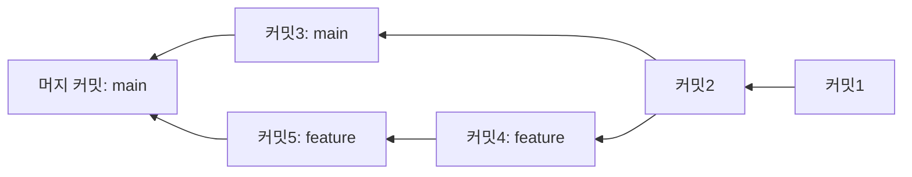

## 이 장을 읽기 전에

[그래프](/post/computerterms/graphs/)에서 다룬 사이클 없는 그래프(트리)의 성질과, [암호화와 해싱](/post/computerterms/encryption-and-hashing/)에서 다룬 암호학적 해시 함수를 안다고 가정한다. Git의 내부 구조는 이 두 개념을 조합한 것에 가깝다.

## Git은 "변경 내역"이 아니라 "스냅샷"을 저장한다

Git을 처음 배울 때 흔히 "각 커밋이 이전 커밋과의 차이(diff)를 저장한다"고 오해하기 쉽다. 실제로 Git은 커밋마다 **그 시점의 전체 파일 트리 스냅샷**을 저장한다(파일 내용이 이전 커밋과 같으면 실제로는 저장 공간을 공유해 중복 저장하지 않지만, 논리적으로는 매 커밋이 완전한 스냅샷을 가리킨다). 각 커밋은 다음을 가리키는 객체다. 부모 커밋(들), 그 시점의 파일 트리, 작성자·메시지 같은 메타데이터.

## 커밋은 그래프의 노드다

[그래프](/post/computerterms/graphs/)에서 다룬 개념을 그대로 적용하면, Git의 커밋 히스토리는 각 커밋이 하나 이상의 부모를 가리키는 **방향 비순환 그래프(DAG, Directed Acyclic Graph)**다. 일반적인 커밋은 부모가 하나지만, 두 브랜치를 합치는 **머지 커밋**은 부모가 둘이다.



**브랜치**는 이 그래프 위의 특정 커밋을 가리키는 이름표(포인터)일 뿐, 별도의 자료구조가 아니다. 새 커밋을 만들면 현재 브랜치가 가리키는 위치가 그 새 커밋으로 옮겨간다 — 브랜치를 만드는 것이 "가벼운" 연산인 이유가 여기 있다. 새 그래프 구조를 통째로 복사하는 것이 아니라 포인터 하나를 새로 만드는 것뿐이다.

## 커밋 해시: 내용이 곧 주소다

각 커밋은 자신의 내용(트리, 부모, 메타데이터)을 [암호화와 해싱](/post/computerterms/encryption-and-hashing/)에서 다룬 암호학적 해시 함수(기본값은 여전히 SHA-1이며, SHA-256은 [공식 전환 문서](https://git-scm.com/docs/hash-function-transition)에 따라 실험적으로만 지원됨)로 해싱해 만든 40자리(또는 64자리) 문자열을 자신의 ID로 쓴다. 이 방식의 핵심 성질은, 내용이 조금이라도 바뀌면 해시값이 완전히 달라진다는 [암호화와 해싱](/post/computerterms/encryption-and-hashing/)의 **눈사태 효과**다.

```text
$ git log --oneline
a3f5e21 (HEAD -> main) 세 번째 커밋
8c1b902 두 번째 커밋
f0e4a17 첫 번째 커밋

# a3f5e21은 이 커밋의 트리 내용 + 부모(8c1b902) + 메타데이터를 SHA-1으로 해싱한 값이다
# 만약 과거 커밋 f0e4a17의 내용을 몰래 바꾸면, 그 이후 모든 커밋의 해시값이 연쇄적으로 달라진다
```

커밋이 실제로 무엇을 가리키는 객체인지는 `git cat-file`로 직접 확인할 수 있다.

```text
$ git cat-file -p a3f5e21
tree 4b825dc642cb6eb9a060e54bf8d69288fbee4904
parent 8c1b902d3e1f4a6b8c0d2e5f7a9b1c3d5e7f9a1b
author Jane Doe <jane@example.com> 1700000000 +0900
committer Jane Doe <jane@example.com> 1700000000 +0900

세 번째 커밋
```

`tree`가 그 시점의 파일 트리 스냅샷을, `parent`가 이전 커밋을 가리킨다 — 앞서 설명한 "커밋은 트리·부모·메타데이터를 가리키는 객체"라는 정의가 바로 이 필드들로 구현되어 있다.

이 성질 덕분에, 커밋 해시가 같다는 것은 그 커밋의 내용(그리고 그 이전 모든 히스토리)이 변조되지 않았다는 것을 사실상 보장한다 — 같은 해시를 내는 다른 내용을 찾는 것이 계산적으로 극히 어렵기 때문이다(다만 기본 해시인 SHA-1은 2017년 구글이 실제 충돌 사례(SHAttered)를 시연한 적이 있어, 이론적으로는 "절대"라고 단정할 수 없다). [ACID Transactions](/post/computerterms/acid-transactions/)에서 다룬 데이터 무결성 보장을 해시 체인으로 구현한 것이다.

## 머지: 두 그래프 갈래를 하나로 합치기

두 브랜치를 머지할 때, Git은 두 브랜치가 갈라지기 전 공통 조상 커밋을 그래프에서 찾아(**최소 공통 조상, LCA**), 그 조상 이후 각 브랜치에서 무엇이 바뀌었는지를 비교해 병합한다. 같은 파일의 같은 줄을 양쪽에서 다르게 고쳤다면 **충돌(Conflict)**이 발생해 사람이 직접 어느 쪽을 남길지 정해야 한다.

## 흔한 오개념

**"브랜치를 여러 개 만들면 저장 공간을 그만큼 더 쓴다"** — 브랜치는 커밋을 가리키는 이름표일 뿐이므로, 브랜치를 새로 만드는 것 자체는 저장 공간을 거의 쓰지 않는다. 실제 저장 공간은 커밋(스냅샷) 자체가 차지하며, 여러 브랜치가 같은 커밋들을 공유하는 것은 전혀 문제가 없다.

**"git rebase는 커밋 내용을 수정하는 것이다"** — 커밋 객체는 한 번 만들어지면 절대 바뀌지 않는 불변(Immutable) 객체다. rebase는 기존 커밋을 "수정"하는 것이 아니라, 같은 변경 내용을 담은 **새 커밋을 만들어** 다른 부모 위에 다시 쌓는 것이다. 새 커밋은 부모가 다르므로 해시값도 달라진다 — 원본 커밋은 그대로 남아있고(가비지 컬렉션 전까지), 브랜치 포인터만 새 커밋 체인을 가리키도록 바뀐다. 이미 원격에 공유된 커밋을 rebase하면 안 되는 이유가 여기 있다 — Git은 중앙 서버 하나가 아니라 각자의 로컬 저장소가 전체 히스토리 사본을 갖는 분산(Distributed) 구조이므로, 다른 사람은 여전히 원본 해시를 참조하고 있는데 내 쪽만 새로운 해시로 히스토리가 바뀌면 두 저장소의 그래프가 어긋난다.

## 다른 개념과의 연결

Git의 DAG 구조는 [그래프](/post/computerterms/graphs/)의 직접적인 실무 응용이고, 커밋 해시 체인은 [암호화와 해싱](/post/computerterms/encryption-and-hashing/)의 무결성 보장을 그대로 이용한 것이다. 다음 챕터에서는 이렇게 관리되는 코드가 실제로 어떻게 자동으로 검증되고 배포되는지(CI/CD)를 다룬다.

## 평가 기준

이 챕터를 읽은 후에는 다음을 할 수 있어야 한다. Git이 diff가 아니라 스냅샷을 저장한다는 것과, 커밋 히스토리가 DAG 구조임을 설명할 수 있다. 커밋 해시가 내용 기반으로 결정되는 원리와, 이것이 히스토리 무결성을 보장하는 방식을 설명할 수 있다. rebase가 기존 커밋을 수정하는 것이 아니라 새 커밋을 만드는 것임을 설명하고, 공유된 히스토리에서 이것이 왜 문제가 되는지 설명할 수 있다.

## 참고 자료

> Chacon, S., & Straub, B. (2014). *Pro Git* (2nd ed.), Chapter 10: Git Internals. Apress.

- [Git Internals - Git Objects](https://git-scm.com/book/en/v2/Git-Internals-Git-Objects) — 커밋·트리·블롭 객체의 실제 저장 구조
- [Git Internals - Git References](https://git-scm.com/book/en/v2/Git-Internals-Git-References) — 브랜치가 포인터일 뿐이라는 것을 실습으로 확인하는 공식 가이드
