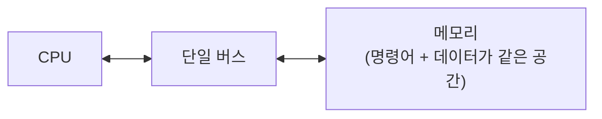

## 이 장을 읽기 전에

[부동소수점 표현](/post/computerterms/floating-point-representation/)까지 컴퓨터가 데이터를 어떻게 저장·연산하는지 다뤘다. 이 챕터는 시선을 한 단계 넓혀, 그 데이터와 그 데이터를 처리하는 명령어 자체가 컴퓨터 안에서 **어디에** 저장되는지를 다룬다. 이 질문의 답이 CPU와 메모리 사이의 근본적인 병목 하나를 만들어내며, [캐시 계층](/post/computerterms/cache-hierarchy/)이 왜 필요한지에 대한 더 큰 그림을 완성한다.

## 명령어와 데이터를 같은 메모리에 저장한다는 발상

**폰 노이만 구조(Von Neumann Architecture)**는 수학자 존 폰 노이만이 1945년 "EDVAC에 관한 최초 초안(First Draft of a Report on the EDVAC)"에서 제시한 컴퓨터 설계 원리로, 프로그램(명령어)과 그 프로그램이 다루는 데이터를 **같은 메모리 공간**에 함께 저장한다. 이전 계산기들이 배선이나 별도 장치로 프로그램을 고정한 것과 달리, 폰 노이만 구조에서는 프로그램도 메모리에 저장된 값(**저장 프로그램 방식, Stored-Program Concept**)일 뿐이므로 CPU가 다른 프로그램을 실행하려면 메모리 내용만 바꾸면 된다. 오늘날 거의 모든 범용 컴퓨터(PC, 서버, 스마트폰)가 이 구조를 기반으로 한다.



## 폰 노이만 병목: CPU와 메모리 사이의 대역폭 제한

명령어와 데이터가 같은 메모리 공간에 있고, 그 메모리를 CPU와 잇는 통로(버스)도 하나이기 때문에, CPU는 다음 명령어를 가져오는 것과 그 명령어가 다룰 데이터를 가져오는 것을 **동시에** 할 수 없다 — 둘 다 같은 버스를 통해 순서대로 오가야 한다. 이 제약을 **폰 노이만 병목(Von Neumann Bottleneck)**이라 부른다. CPU의 연산 속도는 세대를 거듭하며 크게 빨라졌지만, 메모리와 CPU 사이의 데이터 이동 속도(대역폭)는 그만큼 빨라지지 못했고, 그 격차가 벌어질수록 CPU가 계산할 준비가 됐는데도 메모리에서 명령어·데이터가 오기를 기다리며 노는 시간이 늘어난다.

[캐시 계층](/post/computerterms/cache-hierarchy/)에서 다룬 L1/L2/L3 캐시는 바로 이 병목을 완화하기 위해 존재한다. CPU와 메인 메모리 사이에 작지만 훨씬 빠른 저장 공간을 여러 겹 두면, 자주 쓰는 명령어와 데이터를 캐시에서 바로 가져올 수 있어 매번 느린 메인 메모리 버스까지 왕복할 필요가 줄어든다. 캐시는 폰 노이만 병목 자체를 없애지는 못하지만, 병목이 실제로 발동하는 빈도를 크게 줄여준다 — 캐시 히트율이 높을수록 CPU가 메인 메모리 버스를 기다리는 시간이 줄어드는 이유가 여기에 있다.

```c
#include <stdio.h>
#include <time.h>

#define N 20000000

static int arr[N];

/* 배열 크기를 캐시에 다 못 담을 만큼 크게 잡으면, 순회할수록 메인 메모리
   버스 접근 빈도가 늘어나 폰 노이만 병목의 영향을 더 크게 받는다 */
long sum_array(void) {
    long total = 0;
    for (int i = 0; i < N; i++) {
        total += arr[i];
    }
    return total;
}

int main(void) {
    for (int i = 0; i < N; i++) arr[i] = 1;

    clock_t start = clock();
    long total = sum_array();
    clock_t end = clock();

    printf("total=%ld time=%.4fs\n", total, (double)(end - start) / CLOCKS_PER_SEC);
    return 0;
}
```

이 배열(약 80MB, `int` 4바이트 기준)은 대부분의 L2/L3 캐시 용량을 넘어서므로, 순회하는 동안 캐시 미스가 자주 발생해 메인 메모리 버스에 직접 접근하는 빈도가 높아진다. 같은 루프를 캐시에 온전히 들어갈 만큼 작은 배열(예: 수십 KB)로 바꿔 실행하면 원소당 처리 시간이 눈에 띄게 줄어드는 것을 확인할 수 있는데, 이 차이가 캐시가 완화해주는 폰 노이만 병목의 크기를 체감하게 해준다.

## 하버드 구조와의 대비

폰 노이만 구조와 대비되는 설계로 **하버드 구조(Harvard Architecture)**가 있다. 하버드 구조는 명령어와 데이터를 **물리적으로 분리된 메모리 공간과 버스**에 저장해, CPU가 명령어를 가져오는 것과 데이터를 가져오는 것을 동시에 할 수 있다. 이 덕분에 폰 노이만 병목이 원천적으로 줄어들지만, 프로그램과 데이터 영역의 크기를 유연하게 나눠 쓰기 어렵고 구조가 더 복잡하다는 대가가 따른다. 실제로는 이 둘이 순수한 형태로 갈리기보다, 많은 현대 CPU가 메인 메모리는 폰 노이만 방식(단일 공간)으로 두면서도 **L1 캐시만 명령어 캐시와 데이터 캐시로 분리**하는 **수정된 하버드 구조(Modified Harvard Architecture)**를 채택해 두 접근 방식의 장점을 함께 취한다(구체적인 캐시 분리 여부와 구성은 CPU 세대·제조사에 따른 구현 정의 사항이다).

## 비교: 폰 노이만 구조 vs 하버드 구조

| 특성 | 폰 노이만 구조 | 하버드 구조 |
|---|---|---|
| 명령어·데이터 메모리 | 같은 공간, 같은 버스 | 분리된 공간, 분리된 버스 |
| 명령어·데이터 동시 접근 | 불가능(순서대로 접근) | 가능 |
| 폰 노이만 병목 | 존재 | 원천적으로 완화됨 |
| 구조 복잡도 | 단순 | 상대적으로 복잡 |
| 대표 사례 | 대부분의 범용 CPU(메인 메모리 수준) | 일부 마이크로컨트롤러(DSP 등), 현대 CPU의 L1 캐시(수정된 형태) |

## 흔한 오개념

**"폰 노이만 병목은 이제 캐시 덕분에 해결된 옛날 문제다"** — 캐시는 병목이 발생하는 빈도를 줄일 뿐, 명령어와 데이터가 같은 메모리 공간을 공유한다는 구조적 제약 자체를 없애지는 못한다. 캐시 미스가 잦은 대용량 데이터 처리(빅데이터, 머신러닝 추론 등)에서는 여전히 폰 노이만 병목이 실제 성능 한계로 나타난다.

**"모든 CPU가 순수한 폰 노이만 구조다"** — 앞서 다뤘듯 대부분의 현대 CPU는 메인 메모리 수준에서는 폰 노이만 방식을 쓰지만, L1 캐시는 명령어 캐시와 데이터 캐시를 분리한 수정된 하버드 구조를 함께 쓴다. "폰 노이만 구조냐 하버드 구조냐"는 이분법이 아니라, 메모리 계층의 어느 단계를 보느냐에 따라 답이 달라지는 문제다.

## 다른 개념과의 연결

이 챕터에서 다룬 폰 노이만 병목은 [캐시 계층](/post/computerterms/cache-hierarchy/)이 왜 여러 단계로 나뉘어 존재하는지에 대한 근본적인 동기를 제공한다 — 캐시는 결국 이 병목과의 싸움에서 CPU 편을 들어주는 장치다. 컴퓨터 구조 심화 갈래는 이 챕터로 마무리되며, 이후 챕터에서는 다시 상위 계층의 개념(웹 프로토콜, 데이터베이스 등)으로 이어간다.

## 평가 기준

이 챕터를 읽은 후에는 다음을 할 수 있어야 한다. 폰 노이만 구조에서 명령어와 데이터가 같은 메모리 공간을 공유한다는 저장 프로그램 방식의 핵심 개념을 설명할 수 있다. 폰 노이만 병목이 발생하는 구조적 이유와, 캐시 계층이 이를 완전히 없애지 않고 완화만 한다는 점을 설명할 수 있다. 폰 노이만 구조와 하버드 구조의 차이, 그리고 현대 CPU가 왜 두 방식을 혼합해 쓰는지 설명할 수 있다.

## 참고 자료

> von Neumann, J. (1945). *First Draft of a Report on the EDVAC*. Moore School of Electrical Engineering, University of Pennsylvania.

- [Wikipedia: Von Neumann architecture](https://en.wikipedia.org/wiki/Von_Neumann_architecture) — 폰 노이만 구조의 정의와 역사적 배경
- [Wikipedia: Harvard architecture](https://en.wikipedia.org/wiki/Harvard_architecture) — 하버드 구조 및 수정된 하버드 구조와의 비교
