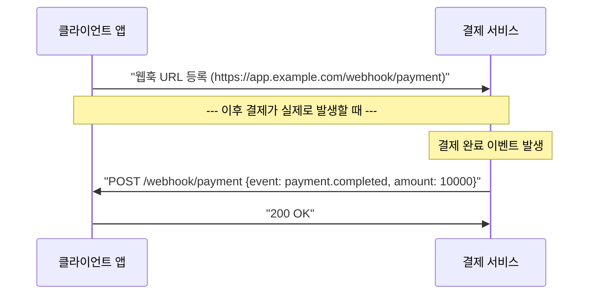

## 이 장을 읽기 전에

[HTTP와 HTTPS](/post/computerterms/http-and-https/)에서 다룬 클라이언트-서버 요청-응답 구조와, [웹 취약점](/post/computerterms/web-vulnerabilities/)에서 다룬 위조 요청의 위험성을 안다고 가정한다. 웹훅은 이 요청-응답 방향을 뒤집는 대신, 뒤집힌 방향이기 때문에 생기는 새로운 위조 위험을 함께 다룬다.

## 폴링의 비효율: 계속 물어보는 방식

클라이언트가 서버의 상태 변화(결제 완료, 배송 상태 갱신 등)를 알고 싶을 때 가장 단순한 방법은 **폴링(Polling)**이다 — 클라이언트가 주기적으로("10초마다") 서버에 "아직 안 끝났어?"라고 요청을 반복해서 보내고, 서버는 매번 현재 상태를 응답한다. 이 방식은 구현이 간단하지만 두 가지 비효율이 있다. 대부분의 요청은 "아직 변화 없음"이라는 답만 받고 버려지므로 네트워크 자원과 서버 처리 시간이 낭비된다. 그리고 폴링 주기보다 짧은 시간 안에 변화가 일어나도, 클라이언트는 다음 폴링 시점이 되어서야 그 사실을 알게 되어 응답이 그만큼 지연된다.

## 웹훅: 서버가 먼저 알려준다

**웹훅(Webhook)**은 이 관계를 뒤집는다. 클라이언트(정확히는 웹훅을 등록하는 쪽)가 미리 "이 이벤트가 발생하면 이 URL로 알려줘"라고 콜백 URL을 서버에 등록해 두면, 실제로 그 이벤트가 발생했을 때 서버가 능동적으로 등록된 URL로 HTTP 요청(대개 POST)을 보내 알려준다. 클라이언트는 더 이상 반복해서 물어볼 필요 없이, 이벤트가 발생한 그 순간에 알림을 받는다.



여기서 방향이 바뀐 것에 주목할 필요가 있다. 폴링에서는 클라이언트가 "요청자"이고 서버가 "응답자"였지만, 웹훅에서 실제 이벤트가 발생했을 때는 **결제 서비스가 요청자, 클라이언트 앱이 응답자**가 된다. 즉 웹훅을 받는 쪽은 외부에서 들어오는 HTTP 요청을 받을 수 있는 엔드포인트(공인 IP로 접근 가능한 서버)를 미리 준비해 두어야 한다.

## REST API 호출과의 방향 차이

일반적인 **REST API** 호출은 클라이언트가 필요할 때마다 서버에 요청을 보내는 **클라이언트 주도(Client-initiated)** 방식이다. 반면 웹훅은 이벤트가 발생한 쪽(주로 외부 서비스)이 미리 등록된 대상에게 요청을 보내는 **서버 주도(Server-initiated)** 방식이다. 두 방식은 상호 배타적이지 않고 함께 쓰인다 — 웹훅으로 "결제가 완료됐다"는 알림만 받고, 그 결제의 상세 내역은 별도의 REST API를 호출해 조회하는 조합이 실무에서 흔하다. 웹훅은 "언제 일이 일어났는지"를 실시간으로 알리는 데 특화되어 있고, REST API는 "지금 상태가 무엇인지"를 필요할 때 조회하는 데 특화되어 있다.

## 페이로드 서명 검증이 필요한 이유

웹훅 엔드포인트는 인터넷에 공개된 URL이므로, 그 URL을 알아낸 누구나 가짜 요청을 보낼 수 있다. 만약 애플리케이션이 "이 URL로 결제 완료 이벤트가 오면 무조건 주문을 완료 처리한다"고 구현했다면, 공격자가 그 URL로 위조된 결제 완료 요청을 보내 실제로 결제하지 않고도 주문을 완료시킬 수 있다. 이 위험을 막기 위해 웹훅을 보내는 쪽은 페이로드(요청 본문)에 **서명(Signature)**을 함께 실어 보낸다. 서명은 사전에 공유한 비밀 키로 페이로드 내용을 해시한 값이며, 수신 측은 같은 비밀 키로 직접 페이로드를 해시해 서명 값과 비교함으로써 "이 요청이 정말 신뢰하는 서비스가 보낸 것이고, 전송 중 내용이 변조되지 않았는지"를 검증한다.

```text
1. 발신 서버: signature = HMAC-SHA256(비밀키, 페이로드 원문)
             요청 헤더에 signature 값을 실어 전송
2. 수신 서버: 받은 페이로드 원문으로 signature' = HMAC-SHA256(비밀키, 페이로드 원문) 재계산
             signature == signature' 이면 신뢰, 다르면 요청 거부
```

이 절차를 그대로 옮긴 실행 가능한 Python 코드는 다음과 같다. 발신 측 `sign_payload`와 수신 측 `verify_signature`가 같은 비밀 키를 공유한다고 가정한다.

```python
import hmac
import hashlib

def sign_payload(secret_key: bytes, payload: bytes) -> str:
    return hmac.new(secret_key, payload, hashlib.sha256).hexdigest()

def verify_signature(secret_key: bytes, payload: bytes, received_signature: str) -> bool:
    expected_signature = sign_payload(secret_key, payload)
    # 타이밍 공격을 막기 위해 문자열을 == 대신 compare_digest로 비교한다.
    return hmac.compare_digest(expected_signature, received_signature)

if __name__ == "__main__":
    secret = b"shared-secret-key"
    payload = b'{"event":"payment.completed","amount":10000}'

    signature = sign_payload(secret, payload)
    print("발신 측 서명:", signature)

    print("정상 페이로드 검증:", verify_signature(secret, payload, signature))
    tampered = b'{"event":"payment.completed","amount":99999999}'
    print("변조된 페이로드 검증:", verify_signature(secret, tampered, signature))  # False
```

`hmac.compare_digest`를 쓰는 이유가 중요하다. 일반적인 문자열 비교(`==`)는 앞쪽 문자부터 하나씩 비교하다 다른 문자를 만나면 즉시 멈추므로, 비교에 걸리는 시간을 정밀하게 측정하면 공격자가 서명 값을 한 글자씩 추측해나갈 수 있다(**타이밍 공격**). `compare_digest`는 항상 전체 길이를 비교해 이 시간 차이를 없앤다.

이 서명 검증은 [웹 취약점](/post/computerterms/web-vulnerabilities/)에서 다룬 위조 요청 방어의 웹훅 버전이다. 서명 값이 일치하지 않는 요청은 아무리 정상적인 형식을 갖춰도 처리하지 않고 거부해야 한다.

## 비교: 폴링 vs 웹훅

| 항목 | 폴링 | 웹훅 |
|---|---|---|
| 요청 주도권 | 클라이언트 | 이벤트 발생 서비스(서버) |
| 실시간성 | 폴링 주기에 의존(지연 발생) | 이벤트 발생 즉시 |
| 자원 낭비 | 변화 없어도 반복 요청 | 이벤트 발생 시에만 요청 |
| 수신 측 요구사항 | 없음(요청만 보내면 됨) | 외부에서 접근 가능한 엔드포인트 필요 |
| 위조 위험 | 낮음(클라이언트가 요청 주체) | 있음(서명 검증 필수) |

## 흔한 오개념

**"웹훅은 REST API와 경쟁하는 대체 기술이다"** — 앞서 다뤘듯 웹훅은 이벤트 알림에, REST API는 상태 조회에 각각 특화되어 함께 쓰이는 보완 관계다. 웹훅만으로 시스템을 구성하면 알림을 놓쳤을 때(네트워크 장애 등) 최신 상태를 다시 확인할 방법이 없어, 실무에서는 웹훅 수신 실패에 대비해 주기적으로 상태를 재동기화하는 REST API 폴링을 함께 두는 경우가 많다.

**"200 OK만 반환하면 웹훅 처리가 끝난 것이다"** — 웹훅을 보내는 서비스는 응답이 오래 걸리면 타임아웃으로 처리하고 재전송을 시도하는 경우가 많다. 수신 측이 페이로드를 받아 무거운 처리(DB 갱신, 이메일 발송 등)를 동기적으로 다 마친 뒤에 응답하면 타임아웃으로 오인되어 같은 이벤트가 중복 전송될 수 있다. 실무에서는 요청을 받으면 즉시 큐에 적재하고 빠르게 200 OK를 반환한 뒤, 실제 처리는 비동기로 수행하는 패턴을 권장한다.

## 다른 개념과의 연결

웹훅 요청도 결국 [웹소켓과 CORS](/post/computerterms/websockets-and-cors/)에서 다룬 실시간 통신 수요의 한 해법이지만, 웹소켓이 연결을 유지한 채 양방향으로 지속 통신하는 것과 달리 웹훅은 이벤트마다 독립적인 HTTP 요청 하나로 끝난다는 점에서 더 가볍고 방화벽 친화적이다. 페이로드 서명 검증이 막는 위조 요청의 범주는 [웹 취약점](/post/computerterms/web-vulnerabilities/)에서 다룬 인증되지 않은 요청 처리 문제의 연장선에 있다.

## 평가 기준

이 챕터를 읽은 후에는 다음을 할 수 있어야 한다. 폴링과 웹훅의 요청 주도권이 어떻게 다른지, 그로 인해 각각 어떤 비효율·지연이 발생하는지 설명할 수 있다. 웹훅과 REST API가 경쟁 관계가 아니라 보완 관계로 함께 쓰이는 이유를 설명할 수 있다. 웹훅 페이로드에 서명 검증이 필요한 이유와, 검증이 없을 때 발생할 수 있는 위조 공격 시나리오를 설명할 수 있다.

## 참고 자료

> Fielding, R., & Reschke, J. (2014). *RFC 7231: Hypertext Transfer Protocol (HTTP/1.1): Semantics and Content*. IETF.

- [Stripe: Webhooks](https://docs.stripe.com/webhooks) — 실제 결제 서비스의 웹훅 등록·서명 검증 구현 예시
- [GitHub: About webhooks](https://docs.github.com/en/webhooks/about-webhooks) — 이벤트 등록·페이로드 구조·서명 검증에 대한 실무 문서
