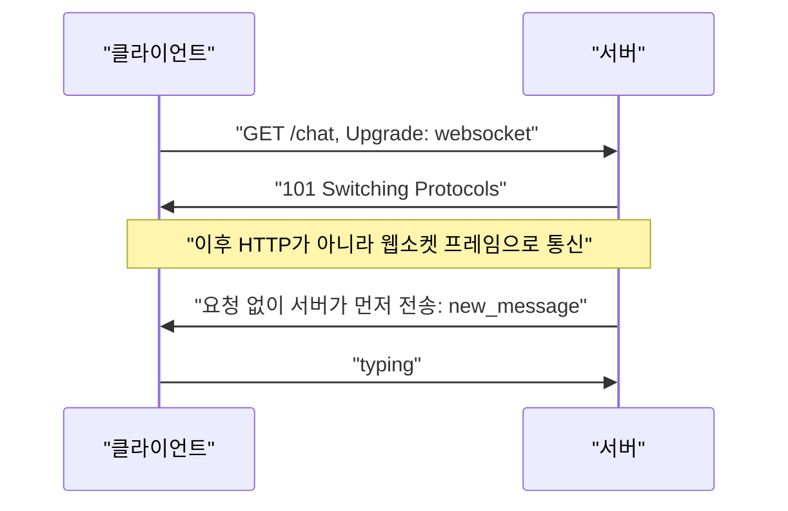

## 이 장을 읽기 전에

[HTTP와 HTTPS](/post/computerterms/http-and-https/)에서 다룬 HTTP의 무상태성과 요청-응답 구조, [DNS와 소켓](/post/computerterms/dns-and-sockets/)에서 다룬 TCP 소켓 연결을 안다고 가정한다.

## HTTP로는 부족한 상황: 서버가 먼저 말을 걸어야 할 때

[HTTP와 HTTPS](/post/computerterms/http-and-https/)에서 다룬 대로 HTTP는 클라이언트가 요청해야만 서버가 응답하는 구조다. 실시간 채팅이나 주가 시세처럼 **서버가 먼저** 클라이언트에게 새 데이터를 알려야 하는 경우, 클라이언트가 "새 메시지 있어요?"를 몇 초마다 반복해서 물어보는(폴링, Polling) 방식은 낭비가 크고 지연도 크다.

## 웹소켓: HTTP 연결을 양방향 통로로 업그레이드하기

**웹소켓(WebSocket)**은 처음에는 HTTP 요청으로 시작하지만, 서버가 이를 수락하면 그 [DNS와 소켓](/post/computerterms/dns-and-sockets/)에서 다룬 TCP 연결을 계속 유지한 채 양방향으로 자유롭게 메시지를 주고받는 프로토콜로 전환된다. 이 전환 과정을 **업그레이드 핸드셰이크**라 한다.

```text
클라이언트 → 서버:
  GET /chat HTTP/1.1
  Upgrade: websocket
  Connection: Upgrade

서버 → 클라이언트:
  HTTP/1.1 101 Switching Protocols
  Upgrade: websocket
  Connection: Upgrade

--- 이후 이 연결은 HTTP가 아니라 웹소켓 프레임으로 통신 ---
서버 → 클라이언트: {"event": "new_message", "text": "안녕하세요"}   (요청 없이 서버가 먼저 전송)
클라이언트 → 서버: {"event": "typing"}
```

핸드셰이크 이후로는 [HTTP와 HTTPS](/post/computerterms/http-and-https/)에서 다룬 "요청 하나에 응답 하나"라는 제약이 사라진다 — 같은 연결 위에서 서버와 클라이언트가 각자 원하는 시점에 메시지를 보낼 수 있다. 매번 새 TCP 연결과 HTTP 헤더를 주고받지 않아도 되므로, 짧은 메시지를 자주 주고받는 상황에서 폴링보다 오버헤드가 훨씬 적다.



브라우저에서는 `WebSocket` 객체로 이 핸드셰이크와 이후 메시지 송수신을 직접 다룬다.

```javascript
const socket = new WebSocket("wss://chat.example.com/chat");

socket.onopen = () => {
  socket.send(JSON.stringify({ event: "typing" }));
};

socket.onmessage = (event) => {
  const data = JSON.parse(event.data);
  console.log(`서버로부터 수신: ${data.event}`, data);
};

socket.onclose = () => {
  console.log("연결 종료됨");
};
```

## CORS: 브라우저가 다른 출처로의 요청을 막는 이유

웹소켓·REST API를 프런트엔드에서 호출하다 보면 "CORS 오류"를 흔히 마주친다. 브라우저는 보안을 위해 기본적으로 **같은 출처 정책(Same-Origin Policy)**을 적용한다 — `a.com`에서 로드된 페이지의 JavaScript는 기본적으로 `b.com`으로 요청을 보낼 수 없다. 이 정책이 없다면, 사용자가 악성 사이트를 여는 것만으로 [인증과 인가](/post/computerterms/authentication-and-authorization/)에서 다룬 은행 사이트 세션 쿠키를 실어 은행 API를 호출해 데이터를 몰래 읽어갈 수 있다.

**CORS(Cross-Origin Resource Sharing)**는 이 정책을 유지하면서도, 서버가 명시적으로 허가하면 다른 출처의 요청을 받아들일 수 있게 하는 메커니즘이다. 서버가 응답 헤더에 `Access-Control-Allow-Origin: https://a.com`을 포함하면, 브라우저는 `a.com`에서 온 요청만 통과시킨다.

```text
브라우저(a.com의 스크립트) → api.b.com: GET /data
                                          Origin: https://a.com

api.b.com → 브라우저: HTTP/1.1 200 OK
                       Access-Control-Allow-Origin: https://a.com
                       (이 헤더가 없거나 origin이 다르면 브라우저가 응답을 스크립트에 전달하지 않고 차단)
```

민감한 메서드(PUT, DELETE)나 커스텀 헤더가 포함된 요청은 브라우저가 실제 요청 전에 **preflight**라는 `OPTIONS` 요청을 먼저 보내 서버에 허용 여부를 확인한다 — 이 예비 확인 절차 덕분에, 실제로 부작용이 있는 요청이 서버에 도달하기 전에 허가되지 않은 출처를 걸러낼 수 있다.

## 흔한 오개념

**"CORS는 서버를 보호하는 기능이다"** — CORS는 서버가 아니라 **브라우저**가 강제하는 정책이다. 서버 자체는 CORS 헤더 없이도 어떤 출처의 요청이든 정상적으로 처리하고 응답할 수 있다 — CORS는 그 응답을 브라우저가 스크립트에 넘겨줄지 말지를 결정할 뿐이다. curl이나 Postman처럼 브라우저가 아닌 클라이언트는 CORS 정책의 영향을 받지 않는다. 따라서 CORS는 서버 자체의 인증·인가([인증과 인가](/post/computerterms/authentication-and-authorization/))를 대체하지 못한다.

**"웹소켓은 항상 폴링보다 낫다"** — 웹소켓은 연결을 계속 유지해야 하므로, 서버가 관리해야 할 동시 연결 수가 늘어난다([프로세스와 스레드](/post/computerterms/processes-and-threads/)에서 다룬 자원 한계와 직결된다). 업데이트 빈도가 낮은 데이터(하루 한 번 갱신되는 통계 등)라면, 매번 연결을 유지하는 비용보다 가끔 폴링하는 것이 서버 자원 측면에서 더 효율적일 수 있다.

## 다른 개념과의 연결

웹소켓의 업그레이드 핸드셰이크는 [HTTP와 HTTPS](/post/computerterms/http-and-https/)의 HTTP 요청-응답 구조 위에서 시작된다는 점에서, HTTP와 완전히 다른 프로토콜이 아니라 그 확장이다. CORS의 preflight는 [웹 취약점](/post/computerterms/web-vulnerabilities/)에서 다룬 CSRF와 공격 표면이 겹치는 영역이다. 이어지는 웹/프로토콜 갈래 챕터에서는 HTTP/2 위에서 이진 직렬화로 통신하는 [gRPC](/post/computerterms/grpc/)를 다룬다.

## 평가 기준

이 챕터를 읽은 후에는 다음을 할 수 있어야 한다. 웹소켓이 HTTP 연결을 어떻게 양방향 통로로 전환하는지, 폴링 대비 어떤 이득이 있는지 설명할 수 있다. CORS가 서버가 아니라 브라우저의 정책이라는 것과, 이것이 인증·인가를 대체하지 못하는 이유를 설명할 수 있다. 업데이트 빈도에 따라 웹소켓과 폴링 중 적합한 방식을 선택할 수 있다.

## 참고 자료

> Fette, I., & Melnikov, A. (2011). *RFC 6455: The WebSocket Protocol*. IETF.

- [MDN: Cross-Origin Resource Sharing (CORS)](https://developer.mozilla.org/en-US/docs/Web/HTTP/CORS) — CORS 헤더와 preflight 요청 전체 레퍼런스
- [MDN: WebSockets API](https://developer.mozilla.org/en-US/docs/Web/API/WebSockets_API) — 브라우저 웹소켓 API 사용법과 프레임 구조
