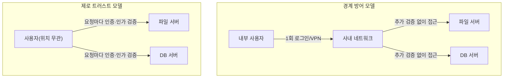

## 이 장을 읽기 전에

[인증과 인가](/post/computerterms/authentication-and-authorization/)에서 다룬 인증(누구인가)·인가(무엇을 할 수 있는가)의 구분, [방화벽과 NAT](/post/computerterms/firewalls-and-nat/)에서 다룬 방화벽이 내부·외부 네트워크 경계를 나누는 방식을 안다고 가정한다. 이 챕터는 그 "경계" 개념 자체가 왜 충분하지 않은지에서 출발한다.

## 경계 방어: 내부는 신뢰, 외부는 차단

전통적인 보안 모델은 성(城)에 비유된다. 성벽([방화벽과 NAT](/post/computerterms/firewalls-and-nat/)에서 다룬 방화벽) 바깥에서 들어오려는 트래픽은 엄격히 검사하지만, 일단 성벽 안(사내 네트워크, VPN 접속)에 들어온 트래픽은 상대적으로 신뢰한다. 이런 **경계 방어(Perimeter Security)** 모델에서는 "내부 IP 대역에서 온 요청"이라는 사실 자체가 암묵적인 신뢰 근거로 작동한다 — 사내 네트워크에 연결된 컴퓨터는 로그인 없이 내부 파일 서버에 접근할 수 있고, VPN에 연결하고 나면 그 뒤로는 여러 내부 시스템에 재인증 없이 접근할 수 있는 경우가 흔했다.

이 모델의 근본적인 문제는 "성벽만 뚫리면 그 다음은 무방비"라는 데 있다. 피싱 메일 하나로 직원 한 명의 사내 컴퓨터가 감염되거나, 유출된 VPN 계정 하나로 공격자가 내부 네트워크에 진입하면, 그 이후로는 내부에 있다는 이유만으로 다른 시스템들이 추가 검증 없이 접근을 허용해버린다. 공격자가 일단 내부에 발판을 마련하면 내부망을 옆으로 이동(lateral movement)하며 점점 더 민감한 시스템에 도달하는 침해 사례가 반복적으로 보고되면서, "경계 안쪽은 안전하다"는 전제 자체가 깨졌다.

## 제로 트러스트: 위치가 아니라 매 요청을 검증한다

**제로 트러스트(Zero Trust)**는 이 전제를 뒤집는다. 보안 연구자 존 킨더바그(John Kindervag)가 2010년 포레스터 리서치 재직 중 제안한 이 모델의 핵심 원칙은 **"Never trust, always verify(결코 신뢰하지 말고, 항상 검증하라)"**다. 요청이 사내 네트워크에서 왔는지 인터넷에서 왔는지는 신뢰의 근거가 되지 않는다 — 네트워크 위치와 무관하게, 모든 요청은 [인증과 인가](/post/computerterms/authentication-and-authorization/)에서 다룬 인증·인가 검사를 매번 새로 거쳐야 한다.

이를 실현하는 대표적인 기법이 **마이크로세그멘테이션(Microsegmentation)**이다. 전통적인 방화벽이 내부·외부 경계 하나에만 검사를 집중했다면, 마이크로세그멘테이션은 내부 네트워크 자체를 잘게 나눠 각 구간(심지어 서버 개별 단위) 사이의 통신에도 매번 접근 제어를 적용한다. 이렇게 하면 공격자가 한 시스템에 침투하더라도, 그 옆에 있는 다른 시스템으로 이동하려면 다시 별도의 인증·인가 검사를 통과해야 한다 — 성벽 하나가 아니라 방마다 문을 잠그는 셈이다. 여기에 **최소 권한 원칙(Least Privilege)**이 함께 적용된다. 각 사용자·서비스는 자신의 역할 수행에 필요한 최소한의 권한만 부여받고, 접근이 필요할 때마다 그 권한 범위 내에서만 검증을 통과한다.

## 경계 방어와 제로 트러스트의 공존

제로 트러스트는 방화벽이나 VPN을 완전히 없애자는 주장이 아니다. 경계 방어는 여전히 첫 번째 필터로 유효하며, 제로 트러스트는 그 위에 "경계를 통과한 뒤에도 신뢰를 자동으로 부여하지 않는다"는 추가 계층을 얹는 것에 가깝다. 실무에서는 [OAuth와 OIDC](/post/computerterms/oauth-and-oidc/)에서 다룬 토큰 기반 인증으로 모든 서비스 간 호출에 신원을 명시하고, 각 요청마다 그 신원과 권한을 재확인하는 방식으로 구현하는 경우가 많다. 이는 [웹 방화벽](/post/computerterms/web-application-firewalls/)이 코드 수준 방어를 대체하지 않고 보완하는 것과 비슷한 관계로, 제로 트러스트도 기존 방어 계층을 없애는 것이 아니라 "내부는 안전하다"는 암묵적 가정을 없애는 방향으로 보완한다.

## 비교: 경계 방어 vs 제로 트러스트

| 특성 | 경계 방어(Perimeter Security) | 제로 트러스트(Zero Trust) |
|---|---|---|
| 신뢰 근거 | 네트워크 위치(내부/외부) | 요청마다의 인증·인가 결과 |
| 내부 침투 시 피해 범위 | 넓음(내부 전체로 확산 가능) | 좁음(구간마다 재검증으로 제한) |
| 검증 시점 | 경계 진입 시 1회 | 모든 요청마다 |
| 구현 기법 | 방화벽, VPN | 마이크로세그멘테이션, 최소 권한, 토큰 기반 인증 |

## 흔한 오개념

**"제로 트러스트는 특정 제품을 도입하면 끝나는 것이다"** — 제로 트러스트는 단일 제품이 아니라 "위치를 신뢰하지 않는다"는 **설계 원칙**이다. 마이크로세그멘테이션 솔루션이나 신원 관리 제품을 도입해도, 여전히 특정 내부 구간에 검증 없는 예외를 남겨두면 그 지점이 다시 암묵적 신뢰 지점이 되어 원칙이 깨진다.

**"제로 트러스트는 VPN·방화벽을 완전히 대체한다"** — 방화벽은 여전히 알려진 악성 트래픽을 초기에 걸러내는 역할을 하고, 제로 트러스트는 그 뒤에 오는 모든 요청에 "통과했다고 자동으로 신뢰하지 않는다"는 계층을 추가하는 것이다. 두 모델은 경쟁 관계가 아니라 계층적으로 함께 적용된다.

## 다른 개념과의 연결

제로 트러스트의 "매 요청마다 검증"은 [인증과 인가](/post/computerterms/authentication-and-authorization/)에서 다룬 토큰 기반 인증, [OAuth와 OIDC](/post/computerterms/oauth-and-oidc/)에서 다룬 위임 인가 모델과 함께 구현되는 경우가 많고, 마이크로세그멘테이션은 [방화벽과 NAT](/post/computerterms/firewalls-and-nat/)에서 다룬 네트워크 계층 필터링을 내부망 곳곳으로 세분화한 것이다. 보안 갈래는 이 챕터로 마무리되며, 다음은 코드 구조 자체를 판단하는 소프트웨어 설계 갈래로 이어진다.

## 평가 기준

이 챕터를 읽은 후에는 다음을 할 수 있어야 한다. 경계 방어 모델이 내부 침투 상황에서 왜 취약한지 설명할 수 있다. "Never trust, always verify" 원칙이 실제로 어떤 검증 절차로 구현되는지(마이크로세그멘테이션, 최소 권한) 설명할 수 있다. 제로 트러스트가 기존 방화벽·VPN을 완전히 대체하는 것이 아니라 보완하는 관계임을 설명할 수 있다.

## 참고 자료

> Rose, S., Borchert, O., Mitchell, S., & Connelly, S. (2020). *NIST Special Publication 800-207: Zero Trust Architecture*. National Institute of Standards and Technology.

- [NIST SP 800-207: Zero Trust Architecture](https://csrc.nist.gov/pubs/sp/800/207/final) — 제로 트러스트의 정부 표준 정의와 아키텍처 구성 요소
- [CISA: Zero Trust Maturity Model](https://www.cisa.gov/zero-trust-maturity-model) — 조직이 제로 트러스트를 도입하는 단계별 성숙도 모델
